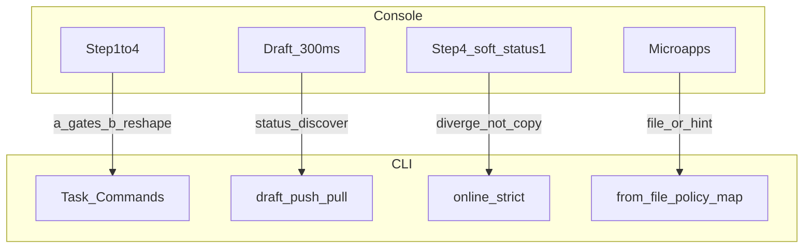

# 产品设计：Console 与 CLI 对照

> 列含义：**a** 对齐 API+门禁 · **b** CLI 重塑 UX · **c** 非目标（不做）  
> 开发细节 → [开发设计/05-Console页面覆盖](../开发设计/05-Console页面覆盖.md) · 命令面 → [02-命令面](./02-命令面.md)

## 1. 口径定稿（防分叉）

| 主题 | Console 浏览器 | CLI 定稿 |
|------|----------------|----------|
| 上架 | Step4 可 `update(status:1)` **软上架**（策略门禁弱） | **`online` = 严格 resourceOnline**：latestVersion + ≥1 启用策略；禁止用软 `status:1` 冒充上架 |
| 草稿 | Step2 / versionCreator **300ms 防抖** `saveVersionsDraft` | **永不防抖**；仅 `draft push/pull/discard`；用 `status` 发现远端防抖草稿 |
| 向导 | Step1–4 强制顺序 | **无 `wizard` 命令**；用 [03-用户流程](./03-用户流程.md) 脚本序列 |
| 策略 | fPolicyBuilder3 可视化 | **不做 Builder**；`policy add --from-file`（schema 见开发命令规格） |
| 依赖签约 | 微应用内选策略/签约 | Phase1：`publish` exit 5 + Console hint；Phase5：`dep auth --policy-map` |
| RSS 验证码 | 邮箱收码 | **人机混合**：可 `send-code`；码来自邮箱；CI 只能人工 `bind --code` |



---

## 2. 单品创建向导 Step1–4 → CLI

| Console | API / 门禁 | CLI | 类 |
|---------|------------|-----|----|
| Step1 创建授权条目（名查重防抖 300ms） | `Resource.create`；名唯一 | `create --type --title --name` | a/b |
| Step2 上传+属性+依赖授权；防抖存草稿 | upload；`createVersion`(首版 1.0.0)；`saveVersionsDraft` | `updateVersion` → `publish`；跨端 WIP 用 `draft push`（非自动） | a/b；防抖 c |
| Step2 授权微应用 / Markdown·漫画抽屉 | 签约进 dependencies | publish 前检测 → exit 5；不做微应用 | a/c |
| Step3 加策略（可跳过） | `update(addPolicies)` | `policy add --from-file`（可稍后） | a/b |
| Step4 完善并 `status:1`（软） | `update(tags/cover/intro/status:1)` | `update` + **`online`（严格）**；不跟软上架 | a 字段 / **上架分歧** |
| hotspot / 埋点 / 成功页延迟 | — | c | c |

---

## 3. versionCreator / versionEditor → CLI

| Console | API / 门禁 | CLI | 类 |
|---------|------------|-----|----|
| 进入：owner / 冻结 / 非合集 | info 校验 | 写命令 ensureOwner；冻结/subjectType4 → exit 4 | a |
| lookDraft；无草稿可继承上一版 | lookDraft；resourceVersionInfo1 | `pull` + `updateVersion`；或 `draft pull` | a/b |
| 编辑中 300ms 存草稿 | saveVersionsDraft | **禁止**；显式 `draft push` | b/c 防抖 |
| 提交 createVersion（文件+授权+semver） | createVersion | `publish`（`--bump` 基于平台 latest） | a |
| versionInfo：续编/丢弃草稿/改正式版属性 | deleteDraft；updateResourceVersionInfo | `draft pull/discard`；`version edit` | a |

---

## 4. 侧栏 Tab → CLI

| Tab | Console 行为 | CLI | 类 |
|-----|--------------|-----|----|
| 框架 | owner→403；status===2 冻结；type4→合集侧栏 | status/pull；写前同检 | a |
| info | 即时 update listing | `update` | a |
| policy | Builder / 启停；上架需启用策略（侧栏硬） | `policy * --from-file`；`online` 严格 | a/b |
| versionInfo | 草稿徽标；新开 creator | draft *；publish；version edit | a/b |
| dependency | 树 + 微应用补签 | `dep list`；exit 5 / Phase5 policy-map | a/c 微应用 |
| contract | 授权方合约只读 | P2 `contract list` | a 后期 |
| 上下架开关 | resourceOnline 级联 / status:4 + 确认 | `online`/`offline --yes` | a（CLI 始终严格） |

---

## 5. 合集 → CLI

| Console | API | CLI | 类 |
|---------|-----|-----|----|
| Step1 create subjectType=4 | create | `collection create` | a |
| Step2 library 加条目 / 排序 / 展示 | catalogues drafts；catalogueProperty | `item *`；`collection update --display-*` | a/b |
| Step2 RSS 绑源+同步 | bindRssFeed；sync；progress | `rss send-code/bind/sync`（人机混合） | a/b |
| Step2 防抖存发版表单草稿 | saveVersionsDraft | 二期；目录草稿已是 item* | b |
| Step2 提交合并目录 | updateCollection isMergeCatalogueDraft | `collection publish` | a |
| Step3 策略 | addPolicies | `collection policy add --from-file` | a |
| Step4 meta + setCollectRules + 软上架 | update；setCollectRules；status:1 | `collection update`；`collect-rules`；**严格 online** | a / 上架分歧 |
| 微应用选资源 / RSS 弹层 | — | 文件或 resourceId；c UI | b/c |

---

## 6. CLI 独有优势（相对浏览器）

| 能力 | 说明 |
|------|------|
| `--cwd` 多资源 | 合集章节循环脚本，无需多 Tab |
| CI `--yes` + flags | 无 TTY 跑通主路径（RSS 签约除外） |
| `create --from-dir` | 对标 creatorBatch，无卡片迷宫 |
| 显式 `draft push/pull` | 跨端可控，非防抖会话 |
| 统一退出码 2/3/4/5 | 脚本可分支 |
| 声明式文件 | policy.json / 后期 policy-map / order-file |

**不提供** `wizard` 命令；「向导体验」= 文档中的命令序列 / npm scripts。

---

## 7. 人机混合（CLI 永远不纯自动）

| 能力 | Phase1 | 说明 |
|------|--------|------|
| 依赖签约 | exit 5 + 打印 resourceId + 建议打开 Console 依赖/发版页 | Phase5：`dep auth --policy-map` |
| 策略可视化编写 | Console Builder 导出文本 → 落盘 | CLI 只提交最终 policyText |
| RSS 验证码 | `send-code` 后用户查邮箱 → `bind --code` | CI：人工注入 code，无收件箱 |
| 解冻 / 运营 | — | 非目标 |

---

## 8. 防抖草稿 × 交替使用（决策树）

```text
status 显示「平台发版草稿: 有」且 localDraftSync 空/不匹配
  ├─ 要以 Console 草稿为准 → draft pull
  ├─ 要以本地意图覆盖远端 → draft push --force
  └─ 不要草稿 → draft discard
仅本地 updateVersion、从未 push、远端无草稿 → 可直接 publish（跳过 draft）
TTY 默认：不弹「是否 draft push」；需要跨端时用户显式 push
```

人读示例见 [开发设计/04-草稿转换层](../开发设计/04-草稿转换层.md)。

---

## 9. 列表批量（Console list）

| Console | CLI |
|---------|-----|
| 批量上/下架、加策略 batchUpdate | 循环 `--cwd` + `online`/`offline`/`policy`（严格门禁） |
| 加至节点 / 财务列表 | **非目标** |
