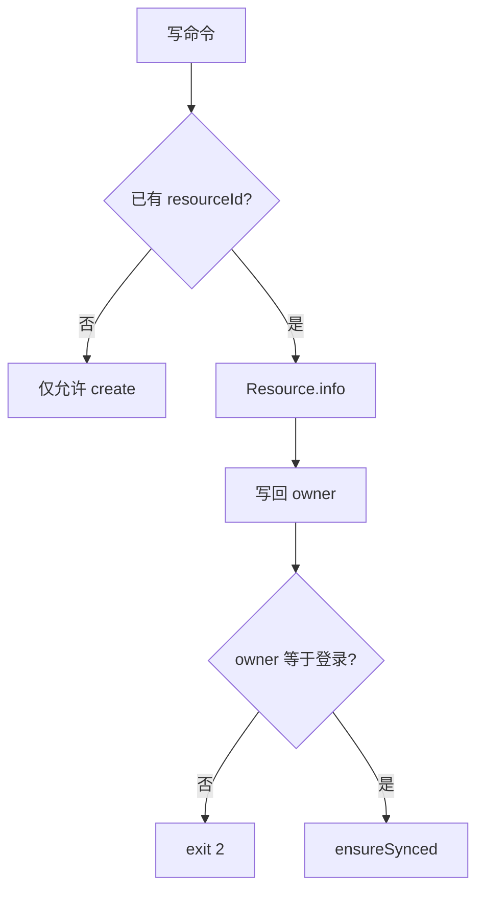

# 开发设计：Owner 与同步

> 写管线总览 → [00-总览与模块.md](./00-总览与模块.md) · 草稿冲突另见 [04-草稿转换层.md](./04-草稿转换层.md)

## 1. Owner 字段

```typescript
userId: number;   // Resource.info.userId
username: string;  // Resource.info.username
```

| 文件 | 要求 |
|------|------|
| `freelog.resource.config` | 必填 userId + username |
| `freelog.collection.config` | 必填 userId + username |
| `freelog.version.config` | 必填 userId（与 resource 一致，禁止为 0）；username 可选 |

比较：`Number(auth.userId) === Number(平台.userId)`（禁止 string/number 直接 `===`）。  
登录：`getCurrentAuth()`（workspace 优先于 global）。

可选：`_ownerBoundAt?: string`（排查用）。

## 2. 何时写入 Owner

| 时机 | 行为 |
|------|------|
| create / collection create 成功 | 以接口返回写入；缺字段用当前登录补齐并核对 |
| pull | 以 info 的 userId/username **覆盖**本地 |
| 写命令成功后写回 | 刷新 owner |
| init 空壳 | **不写** owner |
| 缺 owner 或 userId===0 | 首次 status / pull / 写命令时拉 info 补齐 |

## 3. ensureOwner（写操作必经，在 ensureSynced 前）

已有 resourceId 时**必须**打平台，禁止只信本地（防伪造）：

```text
1. getCurrentAuth()（workspace > global）
2. 无 resourceId → 仅允许 create；其它写命令拒绝
3. 有 resourceId → Resource.info（可与 sync 共用一次请求）
4. 以平台 userId/username 写回本地
5. 平台.userId !== auth.userId → 阻断 exit 2
6. userId 同但 username 不同 → warn，以平台为准写回
```



授权标识 `username/name`：前缀须等于所属用户；create 用当前登录生成；pull 后前缀与 config.username 不一致 → 异常。

## 4. status 展示（含 Owner）

```text
当前登录: alice (1001)
所属用户: alice (1001)  ✅
资源信息: ✅ 已同步 | ⚠️ 落后 | ❌ 冲突
版本:     本地 x | 线上 y
平台发版草稿: 有/无 (updateDate)
```

`--json` 含 owner、sync、`platformVersionDraft`、`localDraftSync`。

## 5. pull

| 命令 | 行为 |
|------|------|
| `pull` | info + 版本 → 覆盖 resource/version（含 owner） |
| `pull --collection` | 合集 info + catalogue draft items + collectRules |
| `pull --all` | 合集 + 约定子目录各 pull 一次 |

## 6. ensureSynced

```text
ensureOwner → ensureSynced → 校验 → API → 写回
```

| 情况 | 默认 | `--no-auto-pull` |
|------|------|------------------|
| 仅落后（本地旧、无未推送冲突） | **自动 pull** 后继续 | 阻断 exit 3 |
| 冲突（本地未推送与线上同变） | 阻断 exit 3 | 同左 |
| 已同步 | 继续 | 继续 |

| 命令 | 同步要点 |
|------|----------|
| update / policy / online / offline | 落后可 auto-pull |
| updateVersion / publish / dep * | 同上；publish 另校版本与授权；updateVersion **不**写平台草稿 |
| draft * | push 冲突算法见草稿文档（非 listing 同步） |
| collection * 写 | 合集维度；item add resourceId 允许他人；路径则校路径资源 owner |
| `--cwd` | 对该目录 ensureOwner/Synced |

## 7. status 用语 → 写操作

| 状态 | 写操作 |
|------|--------|
| 所属一致 | 继续 |
| 所属不一致 | exit 2 |
| 已同步 | 允许 |
| 仅落后 | 默认 auto-pull 后继续 |
| 冲突 | exit 3 |
| 冻结 `(status&2)===2` | exit 4 |
