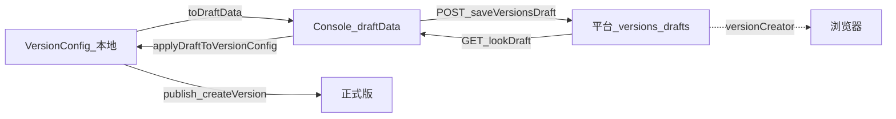

# 开发设计：草稿转换层（VersionConfig ↔ draftData）

> **定稿**：改算法须先改本文。模块：`versionDraftAdapter.ts` · `commands/draft.ts` · `api/version.ts`。  
> adapter 只做形状转换+缺省+指纹；命令层做 Owner/冲突/upload/写盘。字段严校见 [03-字段约束](./03-字段约束.md)。  
> 类型：Console `IResourceCreateVersionDraftType`；CLI `VersionConfig`。对照：`resourceVersionCreatorPage.ts`。

## 0. 三态与数据流



| 态 | 存哪 | CLI | Console 续编 |
|----|------|-----|--------------|
| 本地意图 | `freelog.version.config` | `updateVersion` / `dep *` | 否（未 push） |
| 平台草稿 | `GET/POST/DELETE …/versions/drafts` | `draft push\|pull\|discard` | 是 |
| 正式版本 | `…/versions/{ver}` | `publish` / `version edit` | 已发行 |

**与 `publish --draft` 消歧（定稿）**

| 现状 / 目标 | 说明 |
|-------------|------|
| 现状 | `publish --draft` 仅打印「草稿模式」，仍走 `createResourceVersion`，**不能**当平台草稿用 |
| 定稿 | 平台 WIP = **`draft push`**；正式发行 = **`publish`（无 `--draft`）** |
| 删除 | `publish --draft`：**删除入口**；WIP 只用 `draft push` |

流程：`updateVersion` →（可选）`draft push` →（浏览器可改）→ `draft pull` → `publish`。

---

## 1. API 前置（阻塞实现）

在合入 `draft *` 命令前必须完成：

| # | 项 | 现状 | 定稿 |
|---|-----|------|------|
| 1 | `saveResourceVersionDraft` | CLI 用 **PUT** | 改为 **POST**；body = `{ resourceId, draftData }`（与 tools-lib `saveVersionsDraft` 一致） |
| 2 | `getResourceVersionDraft` | GET 已有 | 对齐 `lookDraft`；无草稿时按平台约定处理（见 §6：空/404 →「无远端」） |
| 3 | `deleteResourceDraft` | CLI **缺失** | 新增 DELETE `/v2/resources/{id}/versions/drafts` |
| 4 | 响应类型 | `ResourceVersionDraftResponse` | 至少含 `resourceId`、`draftData`、`updateDate` |
| 5 | Owner | ensureOwner 可能未齐 | `draft *` 最低要求：已登录 + `info.userId === 当前用户`；未齐则本命令内联同一检查 |

---

## 2. 本地元数据 `draftSync`（写在 version.config）

用户不可手改；仅 CLI 在 push/pull/discard 成功后维护。

```ts
// 挂在 VersionConfig 上（实现时扩展类型）
draftSync?: {
  /** 最近一次成功 push/pull 后，对「规范化 draftData」的指纹 */
  lastFingerprint: string;
  /** 最近一次成功与平台对齐时的远端 updateDate（ISO 或平台原样字符串） */
  lastRemoteUpdateDate?: string;
  /** 最近一次成功 push 的本地时间（日志用） */
  lastPushedAt?: string;
};
```

**覆盖规则**：`draft pull` / `draft push` 成功 → 用当前规范化 `draftData` 重算指纹并写入；`draft discard` 成功 → **删除** `draftSync`（或置空）。  
`updateVersion` / `dep *` **不**改 `draftSync`（因此本地改完后 `localFp !== lastFingerprint` = 有未 push 变更）。

---

## 3. 规范化与指纹

```ts
/** 参与指纹的字段（顺序固定）；忽略 videoCover 若双方皆空 */
type CanonicalDraft = {
  versionInput: string;
  selectedFileInfo: { name: string; sha1: string } | null; // 忽略 from
  descriptionEditorInput: string;
  directDependencies: { id: string; name: string; type: string; versionRange: string }[]; // 按 id 排序
  baseUpcastResources: { resourceID: string; resourceName: string }[]; // 按 resourceID 排序
  additionalProperties: { key: string; value: string }[]; // 按 key 排序
  customProperties: { key: string; name: string; value: string; description: string }[]; // 按 key
  customConfigurations: {
    key: string; name: string; description: string;
    type: 'input' | 'select'; input: string; select: string[];
  }[]; // 按 key；select 数组排序
};

function normalizeDraft(d: IResourceCreateVersionDraftType): CanonicalDraft { /* 缺省→''/[]/null；trim 字符串；排序数组 */ }
function fingerprint(d: IResourceCreateVersionDraftType): string {
  return sha256Hex(stableStringify(normalizeDraft(d))); // stableStringify：键排序 JSON
}
```

实现要求：同一逻辑内容指纹必须稳定（CI 可单测：字段打乱顺序指纹不变）。

---

## 4. CLI → draftData：toDraftData

| `draftData` 字段 | 来源 | 规则 |
|------------------|------|------|
| `versionInput` | `config.version` | 缺省 `''` |
| `selectedFileInfo` | `fileSha1` + `filename` | 二者皆非空 → `{ name: filename, sha1: fileSha1, from: 'freelog-cli' }`；否则 `null`（**不**读 `filePath`） |
| `descriptionEditorInput` | `config.description` | 纯文本；缺省 `''` |
| `directDependencies` | `config.dependencies` | `{ id: resourceId, name: resourceName\|\|'', type: 'resource', versionRange }`；缺省 `[]` |
| `baseUpcastResources` | `config.baseUpcastResources` | `{ resourceID: resourceId, resourceName: resourceName\|\|'' }` |
| `additionalProperties` | `config.inputAttrs` | **全部**映射为 `{ key, value: String(value) }`；无则 `[]`（CLI 无 insertMode 时与 Console「additional」近似；publish 门禁另算） |
| `customProperties` | descriptors 中 `type === 'readonlyText'` | 见 §5 |
| `customConfigurations` | descriptors 中 `type !== 'readonlyText'` | 见 §5 |
| `videoCover` | 无字段则 **省略**（不写 `''` 亦可；push 时若省略，合并远端时见 §7） | |

**不做**：emoji 净化、Braft、属性弹层；无文件也可 push。

---

## 5. 属性描述器映射

Console 规则（`resourceVersionCreatorPage`）：`readonlyText` → `customProperties`；其余 → `customConfigurations`（`editableText`→`input`，其它→`select`）。

### 5.1 Push：descriptors → draft

先扩展 CLI 类型（定稿）：`CustomPropertyDescriptor` 增加可选 `name?: string`（Console/平台有；缺则用 `key`）。

| descriptor.type | 目标数组 | 字段映射 |
|-----------------|----------|----------|
| `readonlyText` | `customProperties` | `key`；`name = name\|\|key`；`value = defaultValue`；`description = remark\|\|''` |
| `editableText` | `customConfigurations` | `type:'input'`；`input = defaultValue`；`select: []`；`name/description` 同上 |
| `select` / `radio` / `checkbox` | `customConfigurations` | `type:'select'`；`select = candidateItems\|\|[]`；`input = defaultValue\|\|select[0]\|\|''` |
| 未知 type | **跳过 + warn** | 不中断 push |

上限：与 Console 一致建议 ≤30 条；超过 **warn 不阻断**（草稿允许不完整；`publish` 再按字段约束严拦）。

### 5.2 Pull：draft → descriptors

| 来源 | 写回 |
|------|------|
| 每个 `customProperties[i]` | descriptor：`type:'readonlyText'`，`key`，`name`，`defaultValue=value`，`remark=description` |
| 每个 `customConfigurations[i]` | `type === 'input'` → `editableText`，`defaultValue=input`；`type === 'select'` → `select`，`defaultValue=input\|\|select[0]`，`candidateItems=select` |
| `additionalProperties` | 覆盖写入 `inputAttrs`（整表替换为 draft 内容） |

**有损约定（产品须知）**：`radio`/`checkbox` push 后变成 `select`；pull 回来是 `select`，**不**恢复 radio/checkbox。文档与 warn 各提示一次即可。

若 pull 时某条缺 `key`：跳过 + warn。  
若本地已有 descriptors、远端对应数组为空：按「发版意图字段被远端覆盖」→ 写空数组（用户用 `--force` 推本地前须知会丢 Console 侧属性）。

---

## 6. applyDraftToVersionConfig

| VersionConfig 字段 | 行为 |
|--------------------|------|
| `version` | ← `versionInput` |
| `description` | ← `descriptionEditorInput` |
| `fileSha1` / `filename` | ← `selectedFileInfo`；若 draft 为 `null` → **清空**二者（表示草稿无文件） |
| `dependencies` | ← `directDependencies`（`id`→`resourceId`，`name`→`resourceName`）；`type==='object'` 的项 **跳过 + warn**（CLI 依赖模型仅 resource） |
| `baseUpcastResources` | ← 反向（`resourceID`→`resourceId`） |
| `customPropertyDescriptors` / `inputAttrs` | 按 §5.2 |
| `filePath` | **永不修改** |
| `resourceId` / `userId` / `resourceName` / `resourceType` | **永不修改** |
| `draftSync` | 成功 pull 后更新为当前指纹 + `updateDate` |

无远端草稿：`draft pull` → exit 4，文案「无平台发版草稿」。

---

## 7. 冲突判定伪代码

```text
function draftPush(config, { force, upload }):
  ensureOwner(config.resourceId)                         // fail → exit 2
  if upload or (needFile(config) and flag --upload):
      upload filePath → 写回 fileSha1/filename 到内存 config
  localDraft = toDraftData(config)
  localFp = fingerprint(localDraft)

  remote = lookDraft(resourceId)                         // 见下「无草稿」
  if remote is None:
      save(localDraft); update draftSync; return 0

  if force:
      save(localDraft); update draftSync; return 0

  remoteDraft = remote.draftData
  remoteFp = fingerprint(remoteDraft)
  remoteDate = remote.updateDate
  sync = config.draftSync

  if localFp == remoteFp:
      // 已对齐；可刷新 draftSync 后成功返回（不必再 POST，或幂等 POST）
      update draftSync; return 0

  if sync is None:
      // 本机从未成功对齐过，但远端已有草稿且内容不同 → 阻断
      print "远端已有发版草稿，且与本地不一致。请 draft pull 或 draft push --force"
      return 3

  lastFp = sync.lastFingerprint
  lastDate = sync.lastRemoteUpdateDate

  localDirty = (localFp != lastFp)
  remoteDirty = (remoteFp != lastFp) or (lastDate != null and remoteDate != lastDate)

  if localDirty and remoteDirty:
      print "本地与平台发版草稿均有变更。请 draft pull 合并后重试，或 --force 覆盖远端"
      return 3
  if not localDirty and remoteDirty:
      print "平台发版草稿已更新。请 draft pull 或 --force"
      return 3
  if localDirty and not remoteDirty:
      save(localDraft); update draftSync; return 0   // 快进：远端仍是我们上次推的

  save(localDraft); update draftSync; return 0
```

**「无草稿」判定**：`lookDraft` 返回 `data == null` / 空对象无 `draftData` / 业务码表示不存在 → `remote = None`。若 HTTP 404，按无草稿，**不要**当硬错误（与 Console 打开页行为一致）。网络错误 → exit 1。

**`--force`**：跳过上述阻断，仍 `ensureOwner`。TTY 无 `--yes` 时可二次确认；CI 必须 `--force --yes`。

---

## 8. 命令规格

| 命令 | 步骤 | 选项 | 退出码 |
|------|------|------|--------|
| `draft push` | §7 | `--force` `--upload` `--yes` `--cwd` | 0/2/3/1；字段问题少用 4（草稿宽容） |
| `draft pull` | ensureOwner → lookDraft → apply → 写盘 | `--yes` `--cwd` | 无草稿 → 4；Owner → 2 |
| `draft discard` | ensureOwner → DELETE → 清 `draftSync` | `--yes` | 无草稿可当作成功（幂等）或 warn+0 |
| `status` | 现有 + `lookDraft` | `--json` | 增加 `platformVersionDraft: { exists, updateDate, fingerprint? }` |

**`--upload`**：仅当本地有 `filePath` 且（无 sha1 或用户要求重传）时上传；默认 push **不**强制上传（允许无文件草稿）。  
**`updateVersion`**：只写本地意图字段，**不**调草稿 API，**不**改 `draftSync`。

文件落点建议：

```text
src/adapters/versionDraftAdapter.ts        # toDraftData / apply / fingerprint / normalize
src/commands/draft.ts                      # push|pull|discard
src/platform/service-api/resource.ts       # saveVersionsDraft / lookDraft / deleteResourceDraft（≅ FServiceAPI）
```

---

## 9. status 展示

```text
平台发版草稿: 有  (updateDate: 2026-07-28T…)
# 或
平台发版草稿: 无
本地相对上次草稿同步: 有未 push 变更 | 已对齐 | 从未同步
```

`--json` 示例字段：

```json
{
  "platformVersionDraft": {
    "exists": true,
    "updateDate": "...",
    "fingerprint": "abc…"
  },
  "localDraftSync": {
    "lastFingerprint": "…",
    "lastRemoteUpdateDate": "…",
    "dirty": true
  }
}
```

### 9.1 与 Console 防抖共存（场景矩阵）

Console Step2 / versionCreator：**300ms 防抖** `saveVersionsDraft`。CLI：**永不**自动写草稿。

| 场景 | 远端草稿 | localDraftSync | CLI 行为 |
|------|----------|----------------|----------|
| 仅本地 `updateVersion`，从未 push，未开 Console | 无 | 空 | 可直接 `publish`；不必 draft |
| 仅打开过 Console 发版页（防抖已写） | 有 | 空或不匹配 | `status` **必须**暴露；推荐 `draft pull` 或 `draft push --force` 或 `discard` |
| CLI `draft push` 后 Console 续编 | 有 | 有；可能 remoteDirty | 再 push 无 force → exit 3；`pull` 或 `--force` |
| CLI 本地又改、远端未变 | 有 | dirty 本地 | 可快进 push |
| TTY | — | — | **不**默认劝「是否 draft push」 |

决策树（产品）→ [05-Console与CLI对照 §8](../产品设计/05-Console与CLI对照.md)。

### 9.2 人读 / JSON：远端有草稿且无 draftSync

人读（须醒目）：

```text
平台发版草稿: 有  (updateDate: 2026-07-28T12:00:00.000Z)
本地草稿同步: 从未同步（可能来自 Console 防抖自动保存）
建议: freelog-cli draft pull
      或 freelog-cli draft push --force
      或 freelog-cli draft discard
```

`--json`：

```json
{
  "platformVersionDraft": {
    "exists": true,
    "updateDate": "2026-07-28T12:00:00.000Z",
    "fingerprint": "abc…"
  },
  "localDraftSync": null,
  "draftAdvice": "pull_or_force_push_or_discard",
  "draftAdviceHint": "远端存在发版草稿且本地无 draftSync；可能来自 Console 防抖"
}
```

`localDraftSync` 为空时用 `null`（勿省略字段导致客户端无法区分「未实现」与「从未同步」）。

---

## 10. 实现分期

| 阶段 | 必做 | 验收锚点 |
|------|------|----------|
| **A0** | API：POST save、GET look、DELETE；修 PUT | 用 curl/单测打通三方法 |
| **A1** | adapter + 指纹单测 + `draft push/pull/discard` + §7 冲突 | 分期验收 #20–#23；属性 radio→select 有损有 warn |
| **A2** | `status` 草稿行；`--upload`；删除 `publish --draft` | JSON 字段齐；无 `--draft` 入口 |
| **C**（可选） | 合集 `ICollectionCreateVersionDraftType` adapter | 目录草稿仍走 `collection item *` |

**本期范围**：仅**单品**发版草稿。合集目录草稿（`catalogues/drafts`）不经本 adapter。

---

## 11. 开发自测清单

| # | 用例 | 期望 |
|---|------|------|
| 1 | 无远端，本地仅 version+description，`draft push` | 平台有草稿；Console versionCreator 可见 |
| 2 | push 后改 Console 说明，`draft pull` | 本地 description 变；`filePath` 不变 |
| 3 | push → 本地再改 version → 无 force 再 push | exit 3 |
| 4 | 同上 + `--force` | 远端被覆盖 |
| 5 | push → 仅 Console 改 → 本地未改再 push | exit 3（remoteDirty） |
| 6 | push → 本地改 → 远端未变再 push | 成功（快进） |
| 7 | 有 filePath 无 sha1，无 `--upload` push | `selectedFileInfo: null`，仍成功 |
| 8 | `--upload` 后 push | Console 能看到文件名/sha1 |
| 9 | `readonlyText` + `editableText` 往返 | pull 后 descriptors 类型正确 |
| 10 | `radio` push 再 pull | 变为 `select` + warn |
| 11 | `draft discard` | lookDraft 无；`draftSync` 清除 |
| 12 | 换号 push | exit 2 |
| 13 | `publish --draft` | 警告/exit 4，不 createVersion |
| 14 | 指纹单测：依赖乱序 | 指纹相同 |
| 15 | 模拟 Console 防抖写入远端后 `status` | `platformVersionDraft.exists` + `localDraftSync: null` + advice |
| 16 | 同上首次 `draft push` 无 force | exit 3（remoteDirty）或文档约定的冲突码 |

---

## 12. 合集（二期）

- **目录草稿**：`collection item *` → `catalogues/drafts`（已是平台态）。  
- **合集发版表单草稿**：同 URL `/versions/drafts`，body 为 `ICollectionCreateVersionDraftType`（含 `collectionItemsSetting`、`collectionItemsChanged` 等）；另写 `collectionVersionDraftAdapter`，冲突模型可复用 `draftSync` + 指纹，**不**与单品命令混用同一子命令，除非加 `draft push --collection`。

---

*Console：`packages/console/src/pages/resource` · `models/resourceVersionCreatorPage.ts`*  
*API：`packages/@freelog/tools-lib/src/service-API/resources.ts`（POST/GET/DELETE drafts）*  
*CLI：`freelog-cli-ts`*