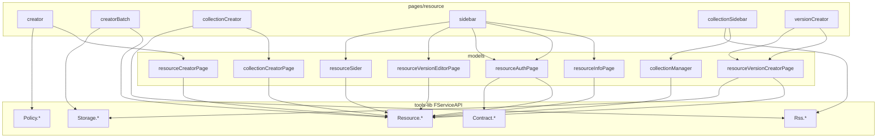

# Console 资源页 API 对照表（权威来源）

> 分析方法：从 `console/src/pages/resource` 出发，追踪页面组件 + 其 dispatch 的 models + 共用组件，  
> 提取实际调用的 `FServiceAPI.*` 方法及**真实传参**，再对照 `tools-lib/src/service-API` 定义。  
> 本文档是 CLI API 迁移的**第一步依据**。

---

## 目录

1. [分析范围](#1-分析范围)
2. [调用关系图](#2-调用关系图)
3. [按业务流程的 API 清单](#3-按业务流程的-api-清单)
4. [接口明细（方法 + 路径 + Console 实际参数）](#4-接口明细)
5. [CLI 对齐状态总表](#5-cli-对齐状态总表)
6. [CLI 迁移优先级](#6-cli-迁移优先级)

---

## 1. 分析范围

### 1.1 页面入口（`pages/resource`）

| 目录 | 说明 | 关联 Model |
|------|------|-----------|
| `creator/` | 单品创建 4 步 | `models/resourceCreatorPage/` |
| `creatorBatch/` | 批量创建 3 页 | 页面内 state（model 为空） |
| `collectionCreator/` | 合集创建 4 步 | `models/collectionCreatorPage/` |
| `sidebar/` | 单品侧栏编辑 | `resourceInfoPage`, `resourceAuthPage`, `resourceVersionEditorPage`, `resourceSider` 等 |
| `collectionSidebar/` | 合集侧栏编辑 | `collectionManager/` |
| `versionCreator/` | 发新版本 | `resourceVersionCreatorPage` |
| `details/`, `collectionDetails/` | 详情展示 | `resourceDetailPage`, `collectionDetailPage` |

### 1.2 共用组件（resource 流程会调用）

| 组件 | API |
|------|-----|
| `components/FAddResourcesHandleAuth` | `addResourceItems_Draft` |
| `components/fPolicyBuilder3` | `Policy.policyTemplates`, `policyReCompile`, `policyTranslation` |
| `utils/service.ts` | `Storage.filesListInfo`, `filesInfo`, `Resource.getAttrsInfoByKey` |

### 1.3 权威 API 定义位置

```
D:\appinside\freelogfe-web-repos\packages\@freelog\tools-lib\src\service-API\
├── resources.ts    ← FServiceAPI.Resource.*
├── storages.ts     ← FServiceAPI.Storage.*
├── rss.ts          ← FServiceAPI.Rss.*
├── policies.ts     ← FServiceAPI.Policy.*
└── contracts.ts    ← FServiceAPI.Contract.*
```

---

## 2. 调用关系图



---

## 3. 按业务流程的 API 清单

### 3.1 单品创建 `creator`

| 步骤 | Console 文件 | API 调用 |
|------|-------------|---------|
| Step1 创建 | `resourceCreatorPage/step1Effects.ts` | `info`（查重）→ `create` → `getResourceTypeInfoByCode` |
| Step2 上传 | `step2Effects.ts` + `utils/service.ts` | `lookDraft` → `saveVersionsDraft`；`Storage.filesListInfo`；`getAttrsInfoByKey`；提交时 `createVersion` |
| Step3 策略 | `step3Effects.ts` + `fPolicyBuilder3` | `update`(addPolicies) → `info`；`Policy.policyTemplates/policyReCompile/policyTranslation` |
| Step4 上架 | `step4Effects.ts` | `update`(tags, coverImages, intro, **status:1**) ← **Console 软路径**；CLI **不跟**，改走严格 `resourceOnline`（见产品 [05 对照](../../产品设计/05-Console与CLI对照.md) · 开发 [05 覆盖 §2.1](../05-Console页面覆盖.md) · [命令规格 online](../02-命令规格.md)） |

### 3.2 批量创建 `creatorBatch`

| 阶段 | Console 文件 | API 调用 |
|------|-------------|---------|
| 准备 | `creatorBatch/Handle/index.tsx` | `getResourceTypeInfoByCode`；`User.currentUserInfo` |
| 上传 | `Handle/Task/index.tsx` | `Storage.fileIsExist` → `Storage.uploadFile`；`getResourceBySha1` |
| 名称去重 | `Handle/index.tsx` | `generateResourceNames` |
| 存储导入 | `Handle/index.tsx` | `Storage.batchObjectList` |
| 校验 | `Handle/Card/index.tsx` | `info`（查重） |
| 提交 | `Handle/index.tsx` | **`createBatch`** |
| 完成 | `Finish/index.tsx` | `batchInfo` |

### 3.3 合集创建 `collectionCreator`

| 步骤 | Console 文件 | API 调用 |
|------|-------------|---------|
| Step1 | `collectionCreatorPage/step1Effects.ts` | `info` → `create`(**subjectType:4**) → `getResourceTypeInfoByCode` |
| Step2 | `step2Effects.ts` + `Step2/index.tsx` | `getCollectionItems_Draft` → `batchInfo` → `getCollectionItemsAuth_Draft`；`addResourceItems_Draft`；`updateCollectionItemsInfo_Draft`；`deleteCollectionItems_Draft`；`reorderCollectionItems_Draft`；`setCollectionItemsSortID_Draft`；`setItemsTitle`；`lookDraft`/`saveVersionsDraft`；提交 `updateCollection`；RSS：`Rss.sendVerificationCode` + `bindRssFeed` |
| Step3 | `step3Effects.ts` | `update`(addPolicies) → `info` |
| Step4 | `step4Effects.ts` | `update` → **`setCollectRules`** → `update`(**status:1**) ← **Console 软路径**；CLI 合集上架 = 严格 `online`/`resourceOnline`，非本行 |

### 3.4 单品侧栏 `sidebar`

| Tab | Model | Load API | Save API |
|-----|-------|----------|----------|
| 侧栏框架 | `resourceSider.ts` | `info`, `batchAuth`, `resourceVersionInfo1`, `lookDraft` | — |
| 资源信息 | `resourceInfoPage.ts` | `info`(isLoadPolicyInfo:1, isTranslate:1) | `update`(resourceTitle/intro/coverImages/tags) |
| 授权策略 | `resourceAuthPage.ts` | `info`, `resolveResources`, `batchInfo`, `Contract.batchContracts` | `update`(addPolicies/updatePolicies)；`batchSetContracts` |
| 版本管理 | `resourceVersionEditorPage.ts` | `info`, `lookDraft`, `getResourceTypeInfoByCode`, `resourceVersionInfo1`, `getAttrsInfoByKey` | **`updateResourceVersionInfo`** |
| 依赖授权 | `resourceDependencyPage.ts` | `info`, `getVersionListByResourceID` | 只读 |
| 上下架 | `sidebar/Sider/index.tsx` | `info` | 侧栏硬路径常 **resourceOnline** 级联后再改 status；亦见 `update`(status:1 或 4)。**CLI `online`/`offline` 对齐硬路径（严格）**，不对齐 Step4 软 status:1 |
| 丢弃草稿 | `sidebar/versionInfo` | — | `deleteResourceDraft` |

### 3.5 发新版 `versionCreator`

| 操作 | Model | API |
|------|-------|-----|
| 进入页面 | `resourceVersionCreatorPage` | `info`(isLoadLatestVersionInfo:1) → `getResourceTypeInfoByCode` → `lookDraft` → `resourceVersionInfo1`（继承上一版） |
| 上传文件 | 同上 + `utils/service.ts` | `getResourceBySha1`；`Storage.filesListInfo`；`getAttrsInfoByKey` |
| 存草稿 | 同上 | `lookDraft` → `saveVersionsDraft` |
| 发行 | 同上 | **`createVersion`**（version 取自用户输入，semver.inc patch） |

### 3.6 合集侧栏 `collectionSidebar`

| Tab | Model | Load API | Save API |
|-----|-------|----------|----------|
| 侧栏 | `collectionManager/siderEffects.ts` | `info`, `batchAuth` | `update`(status) |
| 合集信息 | `collectionManager/infoEffects.ts` | `info`, `getCollectionCollectRules` | `update`；`setCollectRules`；RSS：`sendVerificationCode` + `bindRssFeed` |
| 单品管理 | `collectionManager/versionEffects.ts` | `lookDraft`, `info`, `getResourceTypeInfoByCode`, `resourceVersionInfo1`, `getCollectionItems_Draft`, `getCollectionCollectRules`, `batchInfo`, `getCollectionItemsAuth_Draft` | `updateCollection`(**isMergeCatalogueDraft**)；`saveVersionsDraft` |
| 单品操作 | `collectionSidebar/versionInfo` | `getCollectionItems_Draft` | `updateCollectionItemsInfo_Draft`, `deleteCollectionItems_Draft`, `reorderCollectionItems_Draft`, `setCollectionItemsSortID_Draft` |
| RSS 同步 | `collectionSidebar/versionInfo` | `getSyncProgress` | `Rss.syncBinding` |
| 变更日志 | `ChangeLogDrawer` | `getCollectionUpdateLogs`, `batchInfo` | — |

---

## 4. 接口明细

以下每条：**tools-lib 定义** + **Console 实际传参**（从源码提取）。

### 4.1 Resource — 创建与查询

#### `create` — POST `/v2/resources`

**tools-lib 类型** `CreateParamsType`：

```typescript
{ name, subjectType?: 1|4, resourceTitle?, resourceTypeCode, resourceTypeName?, policies?, coverImages?, intro?, tags? }
```

**Console 单品**（`resourceCreatorPage/step1Effects.ts`）：

```typescript
{ name: resourceName_optimized, resourceTypeCode, resourceTypeName?, resourceTitle }
```

**Console 合集**（`collectionCreatorPage/step1Effects.ts`）：

```typescript
{ name, resourceTitle, resourceTypeCode, resourceTypeName?, subjectType: 4 }
```

---

#### `info` — GET `/v2/resources/{resourceIdOrName}`

**tools-lib 查询参数**：

```typescript
{ resourceIdOrName, isLoadPolicyInfo?: 0|1, isTranslate?: 0|1, isLoadLatestVersionInfo?: 0|1, projection?, isLoadFreezeReason?: 0|1 }
```

**Console 常见组合**：

| 场景 | 参数 |
|------|------|
| 侧栏 mount | `{ resourceIdOrName, isLoadPolicyInfo: 1, isTranslate: 1 }` |
| 发新版 mount | `{ resourceIdOrName, isLoadLatestVersionInfo: 1 }` |
| 查重 | `{ resourceIdOrName: optimizedName }` |
| syncr 等价 | `{ resourceIdOrName, isLoadLatestVersionInfo: 0 }` |

---

#### `update` — PUT `/v2/resources/{resourceId}`

**tools-lib body**（类型未含 resourceTitle，但 Console 实际会传）：

```typescript
{ resourceId, status?: 0|1, intro?, tags?, coverImages?, addPolicies?, updatePolicies? }
```

**Console 实际传的字段**（按场景）：

| 场景 | 字段 | 文件 |
|------|------|------|
| 改标题 | `resourceId`, `resourceTitle` | `resourceInfoPage.ts` |
| 改简介 | `resourceId`, `intro` | `resourceInfoPage.ts` |
| 改封面 | `resourceId`, `coverImages` | `resourceInfoPage.ts` |
| 改标签 | `resourceId`, `tags` | `resourceInfoPage.ts` |
| 添加策略 | `resourceId`, `addPolicies: [{policyName, policyText, status?}]` | `step3Effects.ts` |
| 策略上下线 | `resourceId`, `updatePolicies: [{policyId, status: 0\|1}]` | `resourceAuthPage.ts` |
| 上架（**Console 软路径**） | `resourceId`, `status: 1` | `step4Effects.ts`（软）；侧栏可能另走 resourceOnline。**CLI 上架 ≠ 本行**，见严格 online |
| 下架 | `resourceId`, `status: 4` | `Sider/index.tsx` |
| 完善信息 | `resourceId`, `tags`, `coverImages`, `intro` | `step4Effects.ts` |

> CLI 的 `UpdateResourceBody` 缺少 `resourceTitle`，需补充。

---

#### `createVersion` — POST `/v2/resources/{resourceId}/versions`

**tools-lib body** `CreateVersionParamsType`：

```typescript
{
  resourceId, version, fileSha1, filename, description?,
  customPropertyDescriptors?, inputAttrs?, dependencies?,
  baseUpcastResources?, batchSignContracts?,
  authExcludedItems  // tools-lib 标为必填
}
```

**Console 首版**（creator Step2，固定 `version: '1.0.0'`）：

```typescript
{
  resourceId, version: '1.0.0', fileSha1, filename, description: '',
  baseUpcastResources: [{ resourceId }],
  dependencies: [{ resourceId, versionRange }],
  authExcludedItems: [{ resourceId, excludedType: 'contractId', excludedValue }],
  inputAttrs: [{ key, value }],  // type==='additional' 的系统属性
  customPropertyDescriptors: [{ type, key, name, remark, defaultValue, candidateItems? }]
}
```

**Console 发新版**（versionCreator，version 为用户输入）：

```typescript
// 同上，但 version: versionInput, description: descriptionText
// baseUpcastResources / dependencies 来自页面 state
```

---

#### `createBatch` — POST `/v2/resources/createBatch`

**tools-lib body**：

```typescript
{
  resourceTypeCode: string,
  createResourceObjects: [{
    name, resourceTitle?, policies?, coverImages?, intro?, tags?,
    version: '1.0.0', fileSha1, filename, description?,
    dependencies?, customPropertyDescriptors?, baseUpcastResources?,
    batchSignContracts?, inputAttrs?
  }]
}
```

**Console 实际**（`creatorBatch/Handle/index.tsx`）：

```typescript
{
  resourceTypeCode: selectedResourceType.value,
  createResourceObjects: [/* 每个文件一项，字段同上 */]
}
```

> CLI 当前 `POST /v2/resources/batch` + `{ resources: [] }` **完全错误**。

---

#### `batchInfo` — GET `/v2/resources/list`

**Console 参数**：

```typescript
{ resourceIds: 'id1,id2,id3', isLoadPolicyInfo?: 1, isLoadLatestVersionInfo?: 1 }
```

用于：批量创建完成页、合集 Step2 拉单品详情、侧栏策略页。

---

#### `batchUpdate` — PUT `/v2/resources/updateBatch`

**Console 参数**（`resourceListPage.ts`）：

```typescript
{ resourceIds: string[], status: 1 | 4 }
```

---

### 4.2 Resource — 版本与草稿

#### `resourceVersionInfo1` — GET `/v2/resources/{resourceId}/versions/{version}`

**Console 参数**：`{ resourceId, version, projection? }`

用于：syncv、版本编辑页、侧栏版本信息。

---

#### `updateResourceVersionInfo` — PUT `/v2/resources/{resourceId}/versions/{version}`

**tools-lib body**：

```typescript
{ resourceId, version, description?, customPropertyDescriptors?, inputAttrs, resolveResources? }
```

**Console 实际**（`resourceVersionEditorPage.ts`）：

```typescript
{ resourceId, version, description?, customPropertyDescriptors?, inputAttrs: [...] }
```

> CLI **完全缺失**此接口。

---

#### `getVersionListByResourceID` — GET `/v2/resources/{resourceId}/versions`

**Console 参数**：`{ resourceId, sort: 'createDate:-1' }`（dependency 页）

---

#### `lookDraft` — GET `/v2/resources/{resourceId}/versions/drafts`

**Console 参数**：`{ resourceId }`

---

#### `saveVersionsDraft` — POST `/v2/resources/{resourceId}/versions/drafts`

**tools-lib body**：`{ resourceId, draftData: any }`

**Console 合集草稿额外字段**（`collectionCreatorPage/step2Effects.ts`）：

```typescript
draftData: {
  collectionItemsSetting, additionalProperties, customProperties,
  customConfigurations, directDependencies, baseUpcastResources,
  collectionItemsChanged, otherChanged, ...
}
```

> CLI 当前用 **PUT**，应为 **POST**。

---

#### `deleteResourceDraft` — DELETE `/v2/resources/{resourceId}/versions/drafts`

**Console 参数**：`{ resourceId }`

---

### 4.3 Resource — 类型与文件

#### `getResourceTypeInfoByCode` — GET `/v2/resources/types/getInfoByCode`

**Console 参数**：`{ code: resourceTypeCode }`

返回 `resourceConfig.fileCommitMode`（决定上传方式）、`fileMaxSize` 等。

---

#### `getAttrsInfoByKey` — GET `/v2/resources/attrs/getInfoByKey`

**Console 参数**：`{ key: attrKey }`（`utils/service.ts` 属性解析）

---

#### `getResourceBySha1` — GET `/v2/resources/files/{fileSha1}`

**Console 参数**：`{ fileSha1, projection? }`（文件占用检测）

---

#### `generateResourceNames` — POST `/v2/resources/generateResourceNames`

**Console 参数**：`{ resourceNames: string[] }`

---

### 4.4 Resource — 合集

#### `updateCollection` — PUT `/v2/resources/catalogue/{resourceId}`

**tools-lib body** `UpdateCollectionParamsType`（节选）：

```typescript
{
  resourceId, description?, customPropertyDescriptors?, catalogueProperty?,
  isMergeCatalogueDraft?: 0|1, inputAttrs?, dependencies?,
  baseUpcastResources?, batchSignContracts?, authExcludedItems
}
```

**Console Step2 提交**（`collectionCreatorPage/step2Effects.ts`）：

```typescript
{
  resourceId,
  inputAttrs: [{ key, value }],
  customPropertyDescriptors: [...],
  description: '',
  catalogueProperty: collectionItemsSetting,  // 展示样式/排序
  dependencies: [{ resourceId, versionRange }],
  authExcludedItems: [...],
  isMergeCatalogueDraft: collectionItemsChanged ? 1 : 0
}
```

**Console 合集发布**（`collectionManager/versionEffects.ts`）：

```typescript
// 同上 + description, isMergeCatalogueDraft: 1
```

---

#### `getCollectionItems_Draft` — GET `/v2/resources/catalogues/drafts/{resourceId}/items`

**Console 参数**：

```typescript
{
  resourceId,
  skip: (page-1)*pageSize,
  limit: pageSize,
  keywords?: string,
  sortField?: 'createDate' | 'itemTitle' | 'sortId',
  sortType?: 1 | -1
}
```

**响应**：`{ skip, limit, totalItem, dataList: [{ itemId, itemTitle, sortId, number, mountResourceInfo: { resourceId } }] }`

> CLI **完全缺失**。合集 pull 的核心接口。

---

#### `addResourceItems_Draft` — POST `/v2/resources/catalogues/drafts/{resourceId}/items`

**Console 实际**（`FAddResourcesHandleAuth/index.tsx`）：

```typescript
{
  resourceId: collectionID,
  addCollectionItems: [{
    resourceId, itemTitle,
    authExcludedItems?: [{ resourceId, excludedType: 'contractId', excludedValue }]
  }],
  isPublish?: 0 | 1
}
```

---

#### `updateCollectionItemsInfo_Draft` — PUT `/v2/resources/catalogues/drafts/{resourceId}/items`

**Console 参数**：

```typescript
{ resourceId, data: [{ itemId, itemTitle }] }
```

---

#### `deleteCollectionItems_Draft` — DELETE `.../drafts/{resourceId}/items?removeCollectionItemIds=id1,id2`

---

#### `reorderCollectionItems_Draft` — PUT `.../drafts/{resourceId}/reorder`

**Console 参数**：`{ resourceId, sortField, sortType: 1|-1 }`

---

#### `setCollectionItemsSortID_Draft` — PUT `.../drafts/{resourceId}/manualSort`

**Console 参数**：`{ resourceId, data: { itemIds: string[], targetSortId: number } }`

---

#### `getCollectionItemsAuth_Draft` — GET `.../drafts/{resourceId}/items/batchAuth`

**Console 参数**：`{ resourceId, itemIds: 'id1,id2' }`

---

#### `setCollectRules` — POST `/v2/resources/catalogue/{resourceId}/items/collectRules`

**Console 实际**（`collectionCreatorPage/step4Effects.ts`）：

```typescript
{
  resourceId,
  serializeStatus?: 0|1,
  status: 0|1,           // 自动收录开关
  conditionType: 1|2,    // 1=every, 2=other
  filterConditions: [{
    key: 'resourceTitle' | 'resourceTypeCode' | 'authIdentity',
    limitOperatorType: 'INCLUDES' | 'NOT_INCLUDES' | 'STARTS_WITH' | 'ENDS_WITH' | 'EQUAL' | 'NOT_EQUAL',
    value: string
  }]
}
```

> CLI 当前路径 `.../auto-include-rules` + 完全不同 body **完全错误**。

---

#### `getCollectionCollectRules` — GET `/v2/resources/catalogue/{resourceId}/items/collectRules`

**Console 参数**：`{ resourceId }`

---

#### `bindRssFeed` — POST `/v2/resources/rss/{resourceId}/bindFeed`

**Console 参数**：

```typescript
{ resourceId, feedUrl, verificationCode, pubStartDate?, pubEndDate? }
```

前置：`Rss.sendVerificationCode({ feedUrl, resourceId })`

---

### 4.5 Storage

#### `uploadFile` — POST `/v2/storages/files/upload`

**Console 参数**：`{ file: File, resourceType?: string }`（FormData）

---

#### `fileIsExist` — GET `/v2/storages/files/fileIsExist`

**Console 参数**：`{ sha1 }`

---

#### `filesListInfo` — GET `/v2/storages/files/list/info`

**Console 参数**（`utils/service.ts`）：`{ sha1, resourceTypeCode }`

---

#### `filesInfo` — GET `/v2/storages/files/info`

**Console 参数**：`{ resourceTypeCode }`（无文件时取默认属性）

---

#### `batchObjectList` — GET `/v2/storages/objects/list`

**Console 参数**：`{ objectIds?: string, fullObjectNames?: string }`

---

### 4.6 RSS

| 方法 | HTTP | 路径 | Console 参数 |
|------|------|------|-------------|
| `sendVerificationCode` | POST | `/v2/rss/bindings/sendVerificationCode` | `{ feedUrl, resourceId }` |
| `getSyncProgress` | GET | `/v2/rss/bindings/{resourceId}/progress` | `{ resourceId }` |
| `syncBinding` | PUT | `/v2/rss/bindings/{resourceId}/sync` | `{ resourceId }` |

---

### 4.7 Policy（策略模板，creator Step3 + 侧栏 policy 共用）

| 方法 | HTTP | 路径 | Console 参数 |
|------|------|------|-------------|
| `policyTemplates` | POST | `/v2/translate/translate-config/list4Client` | `{ resourceTypeCodes4Resource: [code] }` |
| `policyReCompile` | POST | `/v2/translate/reCompile` | `{ _id?, contract?, fillArgs: [{name, value}] }` |
| `policyTranslation` | POST | `/v2/translate/translate` | `{ contract: base64String }` |

> CLI `policy.ts` 这三个接口**已对齐**。

---

### 4.8 Contract（签约，侧栏 policy 页）

| 方法 | Console 参数 |
|------|-------------|
| `Contract.batchContracts` | `{ subjectIds, subjectType: 'resource' }` |
| `Contract.contracts` | 签约列表查询 |
| `Resource.batchSetContracts` | `{ resourceId, subjects: [{ subjectId, versions: [{ version, policyId, operation: 0\|1 }] }] }` |
| `Resource.resolveResources` | `{ resourceId }` |
| `Resource.batchAuth` | `{ resourceIds, versions? }` |

---

## 5. CLI 对齐状态总表

Console `pages/resource` 流程共涉及 **52 个 API 方法**（去重后）：

| 状态 | 数量 | 说明 |
|------|------|------|
| ✅ 已对齐 | 18 | create, update, info, batchInfo, createVersion, resourceVersionInfo1, lookDraft, getVersionList*, uploadFile, fileIsExist, getResourceBySha1, updateCollection, Policy 三个, cycleDependencyCheck, listResourceTypesByGroup 等 |
| ❌ 路径/方法/body 错误 | 8 | createBatch, batchUpdate, saveVersionsDraft, collectRules×2, items auth, items draft 增改 |
| ⬜ 完全缺失 | 26 | 见下表 |

### 完全缺失但 Console 必用（按优先级）

| P | API | Console 使用场景 |
|---|-----|-----------------|
| P0 | `getCollectionItems_Draft` | 合集创建/编辑/ pull |
| P0 | `addResourceItems_Draft` | 添加单品到合集 |
| P0 | `createBatch`（修正后） | 批量创建 |
| P0 | `updateResourceVersionInfo` | 编辑已有版本 |
| P0 | `getResourceTypeInfoByCode` | 创建/上传配置 |
| P1 | `saveVersionsDraft`（修正 POST） | 草稿 |
| P1 | `deleteResourceDraft` | 丢弃草稿 |
| P1 | `setCollectRules` / `getCollectionCollectRules`（修正路径） | 自动收录 |
| P1 | `updateCollectionItemsInfo_Draft` | 改单品标题 |
| P1 | `deleteCollectionItems_Draft` | 删单品 |
| P1 | `getCollectionItemsAuth_Draft` | 单品授权状态 |
| P1 | `filesListInfo` / `filesInfo` | 属性解析 |
| P1 | `generateResourceNames` | 批量名称去重 |
| P2 | `bindRssFeed` + `Rss.*` | RSS 合集 |
| P2 | `resolveResources` / `batchSetContracts` / `batchAuth` | 签约流程 |
| P2 | `reorderCollectionItems_Draft` / `setCollectionItemsSortID_Draft` | 排序 |
| P2 | `setItemsTitle` | 单品授权排除 |
| P2 | `getCollectionUpdateLogs` | 变更日志 |
| P2 | `batchObjectList` / `objectDetails` | 存储空间导入 |

---

## 6. CLI 落地优先级（统一接口库）

> 目标路径：`src/platform/service-api`（≅ `FServiceAPI`）。细则 → [API迁移清单](./API迁移清单.md) · [10-技术选型](../10-技术选型.md)。  
> **不要**在旧 `src/api` 上长期打补丁。

### Step 1：镜像 tools-lib 到 `platform/service-api`（本文档 §4 为参数依据）

按 `resources.ts` 等逐函数落地，**以 Console 传参为验收**；并实现 `PlatformTool.getSHA1Hash`。

### Step 2：在新库上写对错误接口（§ 错误列表）

含 `createBatch`、drafts POST、合集 draft 路径等。

### Step 3：补 P0 缺失方法

### Step 4：services/commands 只调 `ServiceAPI.*`

| CLI 命令 | Console / FServiceAPI |
|---------|---------------------|
| `create` | `Resource.create` + `getResourceTypeInfoByCode` |
| `publish` | sha1 链 + `Storage.*` + `Resource.createVersion` |
| `pull` | `info` / `resourceVersionInfo1` / 合集 draft items（**无** syncr/syncv） |
| `update` | `Resource.update`（含 resourceTitle） |
| `create --from-dir` | 内部 `Resource.createBatch`（无用户 `batch *`） |
| `collection publish` | `updateCollection`（isMergeCatalogueDraft） |
| `collection item add` | `addResourceItems_Draft` |
| `pull --collection` | `getCollectionItems_Draft` + `getCollectionCollectRules` |

### Step 5：删旧 `src/api` 脏封装 + 契约/对照测试

---

## 附录：Console 源码索引

| 流程 | 关键文件 |
|------|---------|
| 单品创建 | `models/resourceCreatorPage/step{1-4}Effects.ts` |
| 批量创建 | `pages/resource/creatorBatch/Handle/{index,Task,Card}.tsx` |
| 合集创建 | `models/collectionCreatorPage/step{1-4}Effects.ts` |
| 单品编辑 | `models/resourceInfoPage.ts`, `resourceAuthPage.ts`, `resourceVersionEditorPage.ts` |
| 发新版 | `models/resourceVersionCreatorPage.ts` |
| 合集编辑 | `models/collectionManager/{infoEffects,versionEffects,siderEffects}.ts` |
| 属性解析 | `utils/service.ts` |
| 添加合集单品 | `components/FAddResourcesHandleAuth/index.tsx` |
| 策略模板 | `components/fPolicyBuilder3/FPolicyBuilderDrawer3/` |

---

*关联：[新方案 README](../../README.md) · [API迁移清单](./API迁移清单.md) · [命令规格](../02-命令规格.md)*
