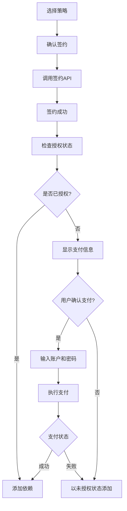

# 支付功能集成文档

## 📅 更新时间
2025-10-30

## 🎯 功能概述

在依赖添加流程中集成了完整的支付功能，实现签约后自动检查授权状态，如果需要支付则引导用户完成支付流程。

---

## 一、完整流程

### 1. 签约流程



### 2. 详细步骤

#### 步骤 1: 签约
```javascript
const contractResult = await signContract(selectedPolicyId, {
  resourceId: resourceInfo.resourceId,
  version: targetVersion
});

const contractId = contractResult.contractId;
```

#### 步骤 2: 检查授权状态
```javascript
const authCheckResult = await getResource(resourceInfo.resourceId);
const authInfo = authCheckResult.data;

const isAuthorized = authInfo.authStatus === 'authorized' || 
                     authInfo.status === 2;
```

#### 步骤 3: 显示支付信息（如果未授权）
```
支付信息:
  合约ID: abc123456
  资源: my-resource
  费用: 99.99 元
  策略: 标准授权
```

#### 步骤 4: 获取支付信息
```javascript
const paymentInfo = await inquirer.prompt([
  {
    type: 'input',
    name: 'accountId',
    message: '请输入付款账户ID:'
  },
  {
    type: 'password',
    name: 'password',
    message: '请输入支付密码（6位数字）:',
    mask: '*'
  }
]);
```

#### 步骤 5: 执行支付
```javascript
const paymentResult = await processPaymentEvent(contractId, {
  eventId: `pay_${Date.now()}`,
  accountId: paymentInfo.accountId,
  transactionAmount: selectedPolicy.price,
  password: paymentInfo.password
});
```

---

## 二、用户界面

### 1. 签约成功提示
```
✓ 签约成功
正在检查授权状态...
⠋ 正在验证授权...
✓ 授权状态检查完成
```

### 2. 已授权场景
```
✓ 已获得授权
```

### 3. 需要支付场景
```
⚠ 未获得授权，需要支付费用

支付信息:
  合约ID: 5f8a7b3c2d1e4f9a8b7c6d5e
  资源: vue3-theme
  费用: 99.99 元
  策略: 标准授权

? 是否立即支付? (Y/n)
```

### 4. 支付信息输入
```
? 请输入付款账户ID: acc_123456789
? 请输入支付密码（6位数字）: ******
```

### 5. 支付处理中
```
⠋ 正在处理支付...
```

### 6. 支付成功
```
✓ 支付成功
✓ 已获得授权
```

### 7. 支付失败
```
✗ 支付失败
✗ 支付错误: 余额不足
✗ 余额不足，请充值后重试
⚠ 将以未授权状态添加依赖
```

---

## 三、支付状态处理

### 1. 支付状态码

| 状态码 | 说明 | 处理方式 |
|--------|------|----------|
| 1 | 交易确认中 | 提示用户等待，以未授权状态添加 |
| 2 | 交易成功 | 标记为已授权，继续添加依赖 |
| 3 | 交易取消 | 以未授权状态添加依赖 |
| 4 | 交易失败 | 显示失败原因，以未授权状态添加 |

### 2. 代码实现

```javascript
if (paymentResult.data.status === 2) {
  // 支付成功
  succeedSpinner('支付成功');
  authStatus = true;
  success('✓ 已获得授权');
} else if (paymentResult.data.status === 1) {
  // 支付确认中
  succeedSpinner('支付确认中');
  info('支付正在处理，请稍后查看授权状态');
  authStatus = false;
} else if (paymentResult.data.status === 4) {
  // 支付失败
  failSpinner('支付失败');
  warning(`支付失败: ${paymentResult.data.msg || '未知错误'}`);
  authStatus = false;
}
```

---

## 四、错误处理

### 1. 支付错误码

| 错误码 | 说明 | 用户提示 |
|--------|------|----------|
| E1002 | 认证错误 | 请重新登录 |
| E1003 | 授权错误 | 无权限执行此操作 |
| E1004 | 交易账户未找到 | 账户未找到，请检查账户ID |
| E1005 | 交易账户被冻结 | 账户被冻结，请联系客服 |
| E1009 | 余额不足 | 余额不足，请充值后重试 |
| E1010 | 交易密码错误 | 支付密码错误，请重新输入 |
| E1013 | 发起方与收款方账户一致 | 不能向自己支付 |
| E1014 | 交易被重复确认 | 此交易已处理 |
| E1015 | 交易金额校验失败 | 金额不正确 |

### 2. 错误处理代码

```javascript
catch (payErr) {
  if (paySpinner) {
    failSpinner('支付失败');
    paySpinner = null;
  }
  error(`支付错误: ${payErr.message}`);
  
  // 显示具体错误信息
  if (payErr.response && payErr.response.data) {
    const errorData = payErr.response.data;
    switch (errorData.code) {
      case 'E1009':
        error('余额不足，请充值后重试');
        break;
      case 'E1010':
        error('支付密码错误，请重新输入');
        break;
      case 'E1005':
        error('账户被冻结，请联系客服');
        break;
      case 'E1004':
        error('账户未找到，请检查账户ID');
        break;
      default:
        error(`错误: ${errorData.msg || '未知错误'}`);
    }
  }
  
  authStatus = false;
  warning('将以未授权状态添加依赖');
}
```

---

## 五、密码输入安全

### 1. 密码掩码显示

使用 inquirer 的 `password` 类型和 `mask` 选项：

```javascript
{
  type: 'password',
  name: 'password',
  message: '请输入支付密码（6位数字）:',
  mask: '*',  // 使用星号掩码
  validate: input => {
    if (!input) {
      return '支付密码不能为空';
    }
    if (!/^\d{6}$/.test(input)) {
      return '支付密码必须是6位数字';
    }
    return true;
  }
}
```

### 2. 显示效果

```
? 请输入支付密码（6位数字）: ******
```

### 3. 密码验证规则

- **非空**: 密码不能为空
- **格式**: 必须是6位数字
- **实时验证**: 输入时即时验证

---

## 六、完整使用示例

### 示例 1: 免费策略（自动授权）

```bash
$ freelog-cli dep add my-resource

正在添加依赖: my-resource
✓ 资源信息获取成功
资源名称: My Resource
资源类型: 主题

可用策略
✓ 找到 1 个可用策略

? 请选择策略: (Use arrow keys)
❯ 免费授权 - 永久免费使用

策略详情:
  名称: 免费授权
  费用: 免费
  说明: 公开免费策略

? 确认签约此策略? Yes
⠋ 正在签约...
✓ 签约成功
正在检查授权状态...
⠋ 正在验证授权...
✓ 授权状态检查完成
✓ 已获得授权

✓ 配置保存成功
✓ 依赖添加成功: my-resource@latest
```

### 示例 2: 付费策略（需要支付）

```bash
$ freelog-cli dep add premium-resource

正在添加依赖: premium-resource
✓ 资源信息获取成功
资源名称: Premium Resource
资源类型: 插件

可用策略
✓ 找到 2 个可用策略

? 请选择策略:
  免费试用 - 7天试用
❯ 标准授权 - 永久使用授权

策略详情:
  名称: 标准授权
  费用: 99.99
  说明: 获得永久使用权

? 确认签约此策略? Yes
⠋ 正在签约...
✓ 签约成功
正在检查授权状态...
⠋ 正在验证授权...
✓ 授权状态检查完成
⚠ 未获得授权，需要支付费用

支付信息:
  合约ID: 5f8a7b3c2d1e4f9a8b7c6d5e
  资源: Premium Resource
  费用: 99.99 元
  策略: 标准授权

? 是否立即支付? Yes
? 请输入付款账户ID: acc_123456789
? 请输入支付密码（6位数字）: ******
⠋ 正在处理支付...
✓ 支付成功
✓ 已获得授权

✓ 配置保存成功
✓ 依赖添加成功: premium-resource@latest
```

### 示例 3: 支付失败（余额不足）

```bash
? 请输入支付密码（6位数字）: ******
⠋ 正在处理支付...
✗ 支付失败
✗ 支付错误: 交易失败
✗ 余额不足，请充值后重试
⚠ 将以未授权状态添加依赖

✓ 配置保存成功
✓ 依赖添加成功: premium-resource@latest
ℹ 注意: 此依赖未获得授权，可能无法正常使用
```

### 示例 4: 用户取消支付

```bash
支付信息:
  合约ID: 5f8a7b3c2d1e4f9a8b7c6d5e
  资源: Premium Resource
  费用: 99.99 元
  策略: 标准授权

? 是否立即支付? No
ℹ 跳过支付，将以未授权状态添加依赖

✓ 配置保存成功
✓ 依赖添加成功: premium-resource@latest
```

---

## 七、API 集成

### 1. 签约 API

```javascript
POST /v2/contracts/sign

Request:
{
  policyId: "policy_123",
  resourceId: "resource_456",
  version: "1.0.0"
}

Response:
{
  ret: 0,
  msg: "success",
  data: {
    contractId: "5f8a7b3c2d1e4f9a8b7c6d5e",
    status: "signed"
  }
}
```

### 2. 授权检查 API

```javascript
GET /v2/resources/{resourceId}

Response:
{
  ret: 0,
  msg: "success",
  data: {
    resourceId: "resource_456",
    resourceName: "My Resource",
    authStatus: "authorized",  // 或 "unauthorized"
    status: 2  // 2 = 已授权
  }
}
```

### 3. 支付 API

```javascript
POST /v2/contracts/{contractId}/events/payment

Request:
{
  eventId: "pay_1635789012345",
  accountId: "acc_123456789",
  transactionAmount: 99.99,
  password: "123456"
}

Response:
{
  ret: 0,
  msg: "success",
  data: {
    transactionRecordId: "87463a24a6da437aa98eb438167783e5",
    status: 2  // 1=确认中, 2=成功, 3=取消, 4=失败
  }
}
```

---

## 八、注意事项

### 1. 安全性
- ✅ 密码使用掩码显示
- ✅ 密码不记录到日志
- ✅ 密码验证格式（6位数字）
- ⚠️ 建议使用 HTTPS 传输

### 2. 用户体验
- ✅ 清晰的支付信息展示
- ✅ 友好的错误提示
- ✅ 支付状态实时反馈
- ✅ 允许用户取消支付

### 3. 异常处理
- ✅ 网络错误处理
- ✅ 支付失败降级（以未授权状态添加）
- ✅ 详细的错误码映射
- ✅ 用户友好的错误消息

### 4. 后续优化
- 💡 支持重试支付
- 💡 保存支付历史
- 💡 支持多种支付方式
- 💡 支付记录查询

---

## 九、相关文件

- `cli-project/src/commands/dependency/add.js` - 依赖添加命令（包含支付逻辑）
- `cli-project/src/core/api.js` - API接口（包含 processPaymentEvent）
- `cli-project/docs/updates/API集成更新文档.md` - API文档

---

**文档版本**: v1.0.0  
**更新日期**: 2025-10-30  
**维护者**: AI Assistant

