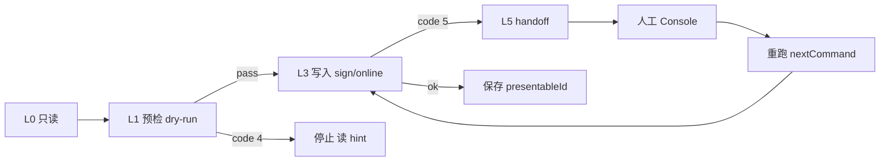

# 完整用户旅程与场景

> 文档角色：端到端 **业务场景** 说明（一期已实现 + 二期规划）。与 [02-平台业务分析](./02-平台业务分析.md) 流程、[03-CLI命令与架构设计](./03-CLI命令与架构设计.md) 命令、[04-能力矩阵与验收](./04-能力矩阵与验收.md) 能力 ID 交叉引用。

最后更新：2026-08-20

---

## 0. 一句话选型

| 你想… | 读 |
|---|---|
| 搞清「签约/上架/online」指什么 | [13-术语与对象速查](./13-术语与对象速查.md) |
| 走完整业务流程 | 下表 J-01~J-07 |
| 选手动还是 CLI | [§12 决策树](#12-cli-vs-console-决策树用户视角) |

---

## 1. 场景索引

| ID | 角色 | 场景 | 阶段 | 能力 |
|---|---|---|:---:|---|
| J-01 | 内容作者 | 从零发行单资源并上架 | 一期 | R/V/D/P |
| J-02 | 前端开发者 | 模板工程 + CI 发版 | 一期 | N-01/N-05 |
| J-03 | 批量运营 | 目录批量 import-dir | 一期 | N-04 |
| J-04 | 策展人 | 合集创建与发布 | 一期 | C-* |
| J-05 | 资源作者 | 发资源并挂到自己节点 | 一期+二期 | R/P + NM-08 |
| J-06 | 节点主 | 市场选品 → 签约 → 展品上线 | 二期 | NM-01~12 |
| J-07 | Agent | headless 全链路（含 handoff） | 一期+二期 | 01 P1–P11 |

---

## 2. J-01 · 内容作者：首次发行单资源

**前置：** 已 `login --env <env>`；本地有文件。

```text
init → create → 编辑 manifest → validate
  → publish → dep auth? → policy apply → online
  → status / pull（可选维护）
```

| 步骤 | 命令 | 说明 |
|:---:|---|---|
| 1 | `init` | 选模板、类型 |
| 2 | `create` | 平台创建资源壳 |
| 3 | `validate` | 本地预检 |
| 4 | `publish --yes` | 上传 + createVersion |
| 5 | `dep auth --yes` | 若有依赖且未授权 |
| 6 | `policy apply --yes` | 至少一条策略 |
| 7 | `online --yes` | 严格门禁上架 |

**成功标志：** `Resource.status=1`；资源出现在市场（`Resource.list` status=1）。

---

## 3. J-02 · 前端开发者：Git + CI

```text
login（CI secret）→ validate → release/build → publish --yes → online --yes
```

- 使用 `--json` 解析 envelope（N-05）。
- 非 TTY 必须 `--env` + `--yes`。
- 失败时 `error.hint` 含下一条命令。

---

## 4. J-03 · 批量运营：import-dir

```text
resource import-dir ./photos --yes
  → 每子目录独立 manifest/state
  → 失败项继续；report 可 resume（N-04）
```

与合集 **不同**：产出 N 个独立资源，不是一个大合集条目。

---

## 5. J-04 · 合集策展

```text
init collection → collection create → item add / import-dir
  → collection publish → policy → online
```

目录变更与 `collection publish` 分离（C-05）；collect-rules / RSS 为 ADVANCED（C-09/C-10）。

---

## 6. J-05 · 资源作者：发资源 + 挂到自己节点

**角色重叠：** 同账号既是作者又是节点主；节点已在 Console 创建。

```text
# 一期：资源进市场
publish --yes → policy apply → online --yes

# 二期：挂到自有节点
node show $NODE_ID --json
node exhibit sign --node $NODE_ID --resource $RID --dry-run --json
node exhibit sign ... --yes --json
node exhibit online $PRESENTABLE_ID --yes --json
```

**注意：** `dep auth` ≠ `exhibit sign`（见 [01 §2.1](./01-面向AI的CLI设计原则.md)）。

### J-05 · 失败分支

| 现象 | code | 恢复 |
|---|---|:---|
| `node show` 非 owner / 冻结 | 2 | 换节点主账号；Console 检查节点 |
| `market show` 未上架 | 4 | 补 `online --yes` |
| `sign --dry-run` auth warning | 0 + warn | 可继续；CI 用 `--strict` 则 code 4 |
| `sign` 付费 policy | 5 | Console 完成 → `nextCommand` |
| `online` 无 policy | 4 | `policy apply` 后再 online |

---

## 7. J-06 · 节点主：运营他人资源

**前置：** Console 已配节点壳；`NODE_ID` 已知；目标资源 **已上架**（第三方或自有）。

```text
market search → market show <rid>
node show <nodeId>
node exhibit sign --dry-run → sign --yes
node exhibit online <pid> --yes
node exhibit list --node <nodeId>
# 维护：node exhibit offline / version（2.1）
```

**OUT：** 不在 CLI 创建节点、换主题、处理收入。

### J-06 · 失败分支

| 现象 | code | 恢复 |
|---|---|:---|
| 资源未上架 / 已封禁 | 4 | 换 `market show` 通过的 resourceId |
| 重复 sign | 4 | `exhibit list` 查 presentableId，直接 online |
| 第三方资源 auth warning | warn | 默认可 sign；严格 CI 加 `--strict` |
| 展品 online 失败 | 4 | 配置 presentable policy（见 [09 FAQ](./09-节点与资源市场（使用草案）.md#常见问题faq)） |

---

## 8. J-07 · Agent 编排（L0→L5）

```text
L0  node show / market show / status
L1  validate / exhibit sign --dry-run / publish preflight
L3  publish / online / exhibit sign / exhibit online
L5  code 5 → 人完成 Console → 重跑 nextCommand
```



**禁止：** 依赖 `session`/`studio` 完成 headless 写路径（P7/P11）。

**完整示例（03 §6）：** [03-CLI命令与架构设计](./03-CLI命令与架构设计.md#6-agent-编排示例)

---

## 9. 会话模式 vs 工程模式（选型）

| 需求 | 推荐 |
|---|---|
| Git/CI 可复现 | 00 工程模式 |
| 单次临时发版、无 manifest | 01 `--session` |
| 多账号各自子目录发资源 | 10 `studio` |
| 菜单式探索 | 11 `session`（TTY） |
| Agent 自动化 | 00 或 01 + `--json` |

---

## 10. 验收映射

| 旅程 | 一期验证 | 二期验证 |
|---|---|---|
| J-01~J-04 | `pnpm verify`、`verify-scenarios` | — |
| J-05~J-06 | 资源段同上 | `verify:exhibit-smoke`（规划，[10-L4验收模板](./10-L4验收模板.md)） |
| J-07 | `verify-json-envelope` | 同上 + NM JSON（[06](./06-JSON协议与Schema草案.md)） |

---

## 11. 公开文档对应

| 旅程 | 用户文档（仓库内，本目录不修改） |
|---|---|
| J-01~J-04 | `docs/新方案/一期/使用/` 各分册 |
| J-05~J-06 | [09-节点与资源市场（使用草案）](./09-节点与资源市场（使用草案）.md) |

---

## 12. CLI vs Console 决策树（用户视角）

完整说明见 [12 §3.2](./12-多视角设计说明.md#32-cli-vs-console-决策树)。

```text
改本地文件 / Git / CI？          → CLI（一期 publish…）
创建/改节点域名、Logo、主题？    → Console
市场选品 + 展品 sign/上下线？    → CLI market + node exhibit（二期）
支付、合约收银、改 policy 正文？  → Console（CLI 给链接 + nextCommand）
```

---

## 13. 痛点与恢复（用户语言）

| 用户说 | 含义 | 建议 |
|---|---|---|
| 「online 了还 sign 不了」 | 资源 status≠1 或 blockers | `market show`；先资源 `online` |
| 「sign 了访客看不到」 | 未 exhibit online | `exhibit online`；查 policy |
| 「CLI 不能建节点」 | 设计如此（P11） | Console 创建后 `node list` |
| 「dep auth 和 sign 搞混」 | 两条签约链 | [01 §2.1](./01-面向AI的CLI设计原则.md) |
| 「脚本卡住了」 | 可能 code 5 | 打开 JSON 里 URL；跑 `nextCommand` |

exit code 动作表：[12 §3.5](./12-多视角设计说明.md#35-失败时用户该做什么)。
