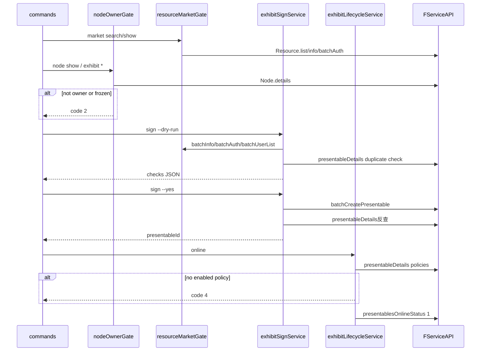

# 二期实现规格（研发 / Agent）

> 文档角色：二期命令 **实现就绪** 规格（无代码承诺）。命令面 [03](./03-CLI命令与架构设计.md)；Console 证据 [05](./05-Console源码证据与调用链.md)；ADR [07](./07-开放问题与设计裁决.md)；JSON [06](./06-JSON协议与Schema草案.md)。

最后更新：2026-08-20

---

## 1. 命令注册表

### 1.1 `market`

| 子命令 | 写 | 必填 flag | 可选 flag | 服务 |
|---|---|:---:|---|---|
| `search` | | `--env`（非 TTY） | `--category`, `--filter`, `--type`, `--keywords`, `--skip`, `--limit`, `--json` | `searchMarket` |
| `show <resourceId>` | | `--env` | `--node`（算 signBlockers）, `--json` | `describeMarketResource` |

### 1.2 `node`

| 子命令 | 写 | 必填 | 服务 |
|---|---|:---:|---|
| `list` | | `--env` | `nodeService.list` |
| `show <nodeId\|name\|domain>` | | `--env` | `nodeService.show` + `nodeOwnerGate` |

**禁止注册：** `create` | `update` | `delete` | `set-info`（P11）

### 1.3 `node exhibit`

| 子命令 | 写 | 必填 | 特殊 flag | 服务 |
|---|---|:---:|---|---|
| `sign` | ✓ | `--node`, `--resource`（可重复）, `--yes`, `--env` | `--dry-run`, `--strict`, `--policy` | `exhibitSignService` |
| `list` | | `--node`, `--env` | `--status`, `--type`, `--keywords`, `--skip`, `--limit` | `exhibitLifecycleService.list` |
| `show <presentableId>` | | `--env` | `--json` | 2.1 |
| `online <presentableId>` | ✓ | `--yes`, `--env` | `--json` | `exhibitLifecycleService.online` |
| `offline <presentableId>` | ✓ | `--yes`, `--env` | `--json` | `exhibitLifecycleService.offline` |
| `version` | ✓ | 2.1 | — | 2.1 |

---

## 2. Service 分层与调用序列



**边界：**

- 唯一写 `batchCreatePresentable`：`exhibitSignService.sign`
- 无 `NodeStore`；节点事实以 `Node.details` 为准
- handoff：复用 `buildConsoleHandoff`（同 `depAuthService`）

### 2.1 L0 推荐工具链（Agent / J-06）

```text
node show → market show [--node] → sign --dry-run → sign --yes → online → exhibit list
```

| 步骤 | 命令 | 分工 |
|:---:|---|---|
| 1 | `node show <nodeId>` | 节点 owner / 冻结 |
| 2 | `market show <rid> [--node <id>]` | **选品**；`--node` 查 `already_signed` |
| 3 | `sign --dry-run` | **写前全量 checks**（含 owner、auth、ownerFreeze） |
| 4 | `sign --yes` | 平台写入 + presentableId 反查 |
| 5 | `exhibit online` | policy + 当前资源 status（Q10） |
| 6 | `exhibit list` | 对账 / 保存 ID |

**禁止：** 跳过 `sign --dry-run`；用 `market show`  alone 代替 dry-run（见 [03 §6.2](./03-CLI命令与架构设计.md#62-节点主市场选品后挂展品j-06)、[03 §12](./03-CLI命令与架构设计.md#12-agent-标准配方)）。

运行时语义与重试：[17](./17-展品状态机与恢复模型.md)。

---

## 3. Preflight 检查表（`exhibit sign`）

| 检查 | API / 条件 | checks 字段 | 默认 sign | `--strict` | Console |
|---|---|---|:---:|:---:|---|
| 已登录 | auth | — | fail 4 | fail 4 | — |
| node owner | `Node.details.ownerUserId` | `nodeOwner` pass/fail | fail **2** | fail 2 | pageEffects L48 |
| 节点未删/未冻 | `status -1` / `&4` | 含于 nodeOwner | fail **2** | fail 2 | L53–60 |
| 资源已上架 | `batchInfo.status === 1` | `resourceOnline` | fail **4** | fail 4 | badResources |
| 授权链 | `batchAuth.isAuth` | `authChain` warn/fail | **warn** | fail **4** | L197 authException |
| 作者冻结 | `batchUserList.status === 1` | `ownerFreeze` warn/fail | **warn** | fail **4** | L197 ownerFreeze |
| 重复签约 | `presentableDetails` 已有 | `notDuplicate` | fail **4** | fail 4 | L223+ |
| 合集展品 | `subjectType=4` | — | fail **4** | fail 4 | Q9；NM-19 OUT |
| 付费 policy | policyText 含 TransactionEvent | `paymentRequired` | handoff **5** | 5 | 合约页 |

`--dry-run`：跑上表除 `batchCreatePresentable` 外全部；不写入。

---

## 4. 伪代码（核心路径）

> 幂等 / 重试 / 停损：[17-展品状态机与恢复模型](./17-展品状态机与恢复模型.md)。

### 4.1 `exhibitSignService.sign`

```typescript
async function sign(ctx: { nodeId, resources[], policyId?, dryRun, strict, yes }) {
  await nodeOwnerGate.assert(ctx.nodeId);           // code 2
  const checks = await preflight(ctx);              // 表 §3
  if (dryRun) return envelope({ dryRun: true, checks });

  if (strict && hasWarn(checks)) throw code(4);
  if (checks.paymentRequired) return handoff(5);    // Q4

  const batch = await API.batchCreatePresentable({ nodeId, resources });
  if (batch.ret !== 0) mapPlatformError(batch);

  const results = [];
  for (const r of resources) {
    if (batchPerResourceFailed(r)) { results.push(failed); continue; }
    const pid = await API.presentableDetails({ resourceId: r.id, nodeId }); // Q1 反查
    results.push({ presentableId: pid, ... });
  }
  return envelope({ results });
}
```

### 4.2 `exhibitLifecycleService.online`

```typescript
async function online(presentableId) {
  const detail = await API.presentableDetails({ presentableId, isLoadPolicyInfo: 1 });
  await nodeOwnerGate.assert(detail.nodeId);
  const resource = await API.Resource.info({ resourceId: detail.resourceId }); // Q10 当前状态
  if (resource.status !== 1) throw code(4, { reason: 'resource_not_online', hint: '...' });
  if (resource.status === 2) throw code(4, { reason: 'resource_frozen', hint: '...' });
  if (!detail.policies.some(p => p.status === 1))
    throw code(4, { reason: 'no_enabled_policy', hint: '...' });
  await API.presentablesOnlineStatus({ presentableId, onlineStatus: 1 });
  return envelope({ presentableId, onlineStatus: 1 });
}
```

### 4.3 `offline`

```typescript
async function offline(presentableId) {
  const detail = await API.presentableDetails({ presentableId });
  await nodeOwnerGate.assert(detail.nodeId);
  await API.presentablesOnlineStatus({ presentableId, onlineStatus: 0 });
}
```

---

## 5. Handoff（code 5）

对齐一期 `depAuthService` + `buildConsoleHandoff`：

| 字段 | 说明 |
|---|---|
| `error.code` | `5` |
| `error.reason` | `payment_required` \| `auth_incomplete` |
| `error.contractsUrl` / `actionUrl` | Console 合约/依赖页 |
| `error.nextCommand` | 完整可重跑 CLI 字符串 |

非 TTY / `--json`：**不**打开浏览器。

---

## 6. 非目标守卫（注册表级）

以下命令 **不得** 出现在 `commands/node/`：

- `node create` | `update` | `delete`
- `node theme activate`
- `InformalNode` 任意命令
- `exhibit bulk-online`（2.0）

CI 可选：静态测试扫描 command tree 不含上述字符串。

---

## 7. 实现里程碑 ↔ 本文

| 03 §9 周 | 交付 | 本文 |
|:---:|---|---|
| W1 | nodeOwnerGate, resourceMarketGate, exhibitSignService 骨架 | §2–§4 |
| W2 | market + node list/show + sign/list | §1 |
| W3 | exhibit online/offline | §4.2–4.3 |
| W4 | contract list（可选） | §1.2 |
| W5 | verify:exhibit-smoke + schema | [16](./16-verify-exhibit-smoke设计.md)、[06](./06-JSON协议与Schema草案.md) |

---

## 8. 相关文档

- [05 §B.4–B.5](./05-Console源码证据与调用链.md) — Console 行号证据  
- [06 §12](./06-JSON协议与Schema草案.md#12-errorreason-与-signblockers-索引) — reason 枚举  
- [17-展品状态机与恢复模型](./17-展品状态机与恢复模型.md) — 重试剧本  
- [14 §6](./14-文档修订与评审清单.md#6-实现启动评审研发) — 实现启动评审清单
