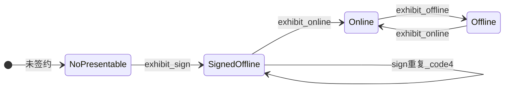

# 展品状态机与恢复模型

> 文档角色：二期 **运行时语义** 设计（幂等、重试、停损）。实现 [15](./15-二期实现规格.md)；原则 [01 P8](./01-面向AI的CLI设计原则.md)；ADR [07 Q1/Q7/Q10](./07-开放问题与设计裁决.md)。

最后更新：2026-08-20

---

## 1. 两层状态（勿混淆）

| 层 | 对象 | 字段 | CLI 命令 |
|---|---|---|---|
| 资源层 | Resource | `status` 0/1/2/4 | 一期 `online` / `offline` |
| 展品层 | Presentable | `onlineStatus` 0/1 | `node exhibit sign` / `online` / `offline` |

**市场可见** = 资源 `status=1`。**访客可见** = 展品 `onlineStatus=1` + 节点/主题等 Console 侧配置。

---

## 2. 展品状态机



| 状态 | 平台含义 | 典型 API 特征 |
|---|---|---|
| **NoPresentable** | node+resource 无挂载 | `presentableDetails` 空 |
| **SignedOffline** | presentable 存在 | `onlineStatus=0` |
| **Online** | 展品位在线 | `onlineStatus=1` |
| **Offline** | 曾 online 后下架 | `onlineStatus=0` |

---

## 3. 命令转移表

| 转移 | 命令 | 前置 | 平台写 API | 成功输出 ID |
|---|---|---|---|---|
| → SignedOffline | `exhibit sign` | node owner；resource status=1；非重复 | `batchCreatePresentable` | `presentableId`（反查 Q1） |
| SignedOffline → Online | `exhibit online` | ≥1 启用 policy；资源未 freeze（Q10） | `presentablesOnlineStatus(1)` | `onlineStatus=1` |
| Online → Offline | `exhibit offline` | owner | `presentablesOnlineStatus(0)` | `onlineStatus=0` |
| Offline → Online | `exhibit online` | 同上架 | 同上 | 幂等 |

---

## 4. P8 恢复模型映射

| P8 模型 | 二期场景 | Agent 行为 |
|---|---|---|
| **幂等读后再写** | `offline` 后再 `online`；已对同一 pid `online` | 安全重试 |
| **remote_succeeded_local_pending** | batch 成功但 CLI 未写出 JSON；反查前崩溃 | `presentableDetails` / `exhibit list` → 续跑 **online**，不 re-sign |
| **remote_outcome_unknown** | `batchCreatePresentable` / `online` 请求已发、无响应 | **停止**；对账后再动 |
| **冲突 code 3** | 本地缓存 pid 与平台不一致 | `exhibit list` 对账 |
| **重复写 code 4** | 重复 sign 同 node+resource | 读 `presentableId` → 跳 sign |

---

## 5. 重试剧本

### R1 · sign 重跑（怀疑未成功）

```text
1. exhibit list --node <id> --json  或  presentableDetails({ resourceId, nodeId })
2. 若已有 presentableId → 跳过 sign，进入 online（R4）
3. 若无 → sign --dry-run → sign --yes
```

**禁止：** 未对账直接 sign（易 code 4 duplicate）。

### R2 · batch 部分成功

```text
1. 解析 data.results[]：success 项已有 presentableId
2. failed 项：读 error.reason，修正后 **仅重跑失败 resource**
3. 整体 ok:false 但部分 success → Agent 不得当作全部失败
```

见 [07-Q1](./07-开放问题与设计裁决.md#21-q1--sign-成功后如何得到-presentableid)、[07-Q7](./07-开放问题与设计裁决.md#27-q7--batchcreatepresentable-分项-status)。

### R3 · 反查 presentableId 失败

```text
1. batch ret=0 但 presentableDetails 失败 → remote_outcome_unknown
2. 停止自动 sign；exhibit list 按 resourceId 过滤
3. 人工或延迟重试 presentableDetails
```

### R4 · online 超时 / 无 JSON

```text
1. presentableDetails(pid) 看 onlineStatus
2. 若已是 1 → 成功（remote_succeeded_local_pending）
3. 若 0 → 重跑 exhibit online --yes
```

### R5 · offline 后再 online

幂等：重复 `offline` 在已离线状态应成功或 no-op（实现时以 API 为准）；`online` 同 R4。

### R6 · 重复 sign

```text
code 4, reason: duplicate
→ exhibit list / presentableDetails 取 presentableId → online
```

---

## 6. Agent 停损规则

| 条件 | 动作 |
|---|---|
| code 5 | 暂停；Console + `nextCommand` |
| code 2 | 停止；换账号或 Console 查节点 |
| sign 后无 presentableId 且 list 无项 | 停损；对账，不连 sign |
| Q10：资源已 offline 仍 online 展品 | code 4 + hint；不 silent 成功 |
| 连续 2 次 remote_outcome_unknown | 升级人工 |

---

## 7. 与 smoke / fixture

| 步骤 | 恢复注意 | 链接 |
|---|---|---|
| S5 sign | 保存 presentableId；失败用 R1/R3 | [16 §4](./16-verify-exhibit-smoke设计.md) |
| S6 online | R4 | |
| S8 offline | 可重复跑 S6 测幂等 | |
| N3 重复 sign | 预期 R6 | |

清理：smoke 结束 `offline` 即可；不必删 presentable（重复 sign 测 N3 需新 resourceId）。

---

## 8. 相关文档

- [15 §4](./15-二期实现规格.md#4-伪代码核心路径) — 伪代码  
- [06 §12](./06-JSON协议与Schema草案.md#12-errorreason-与-signblockers-索引) — reason  
- [13 §4.3](./13-术语与对象速查.md#43-presentableonlinestatus) — onlineStatus
