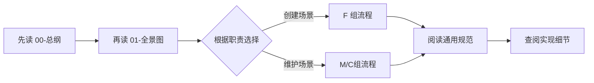

# 01 · 核心业务流程图与总览

> **文档角色**: 为所有角色提供业务流程的全景图，快速了解每个流程的位置和关键步骤  
> **核心价值**: 一屏掌握全部 9 个核心流程，支持按图索骥查阅详细设计  
> 最后更新：2026-09-02

---

## 🎯 **一、流程图全景**

```
Freelog Runtime CLI 核心业务流程

┌─────────────────────────────────────────────────────────────┐
│                        创 建 类 流 程                          │
├─────────────────────────────────────────────────────────────┤
│                                                              │
│  F1: 创建单个资源                    F2: 批量创建资源        │
│  ───────────────                   ────────────────         │
│  Step1: 创建资源壳                    Phase1: 目录扫描       │
│  Step2: 上传文件                      Phase2: 批次划分      │
│  Step3: 配置策略                      Phase3: 并发发布      │
│  Step4: listing 完善                   Phase4: 汇总报告      │
│                                                              │
│  F3: 创建合集                                                     │
│  ─────────────                                                    │
│  目录扫描 → 条目识别 → 创建合集壳 →                           │
│  关联资源 → 排序 → 收录规则 → (可选)RSS 绑定                    │
│                                                              │
└─────────────────────────────────────────────────────────────┘

┌─────────────────────────────────────────────────────────────┐
│                        资 源 管 理 流 程                        │
├─────────────────────────────────────────────────────────────┤
│                                                              │
│  M1: 版本更新                                                 │
│  ───────────                                                  │
│  读取远端状态 → 继承字段 → 上传新版本文件 →                  │
│  应用策略 → 填写 listing → 提交审核                          │
│                                                              │
│  M2: 属性与描述更新                                           │
│  ───────────────────                                          │
│  读取远端 → 修改标题/描述/封面/标签 → 提交更新               │
│                                                              │
│  M3: 授权策略管理                                             │
│  ───────────────────                                          │
│  查看当前策略 → 选择模板/自定义编辑 →                        │
│  编译验证 → 提交更新                                         │
│                                                              │
└─────────────────────────────────────────────────────────────┘

┌─────────────────────────────────────────────────────────────┐
│                       合 集 管 理 流 程                         │
├─────────────────────────────────────────────────────────────┤
│                                                              │
│  C1: 单品管理                                    C2: 合集信息 │
│  ──────────                                      ────────   │
│  查看条目列表                                   查看合集    │
│  调整排序                                       标题/描述/  │
│  移除条目                                       封面/策略   │
│  添加新条目                                     更新        │
│                                                    C3: 策略管理│
│                                                    ─────────  │
│                                                    查看当前   │
│                                                    策略       │
│                                                    修改/重配  │
│                                                    提交更新   │
│                                                              │
└─────────────────────────────────────────────────────────────┘
```

---

## 📖 **二、流程索引**

### **F 组：创建类流程**

| 编号 | 流程名称 | 核心功能 | 详细设计文档 |
|------|---------|----------|-------------|
| F1 | 创建单个资源 | 主题/插件/前端库/软件库的 4 步向导创建 | [01-创建单个资源](./流程设计/01-创建单个资源.md) |
| F2 | 批量创建资源 | 从目录扫描多个条目并批次发布 | [02-批量创建资源](./流程设计/02-批量创建资源.md) |
| F3 | 创建合集 | 从本地目录创建合集并关联资源 | [03-创建合集](./流程设计/03-创建合集.md) |

### **M 组：资源管理流程**

| 编号 | 流程名称 | 核心功能 | 详细设计文档 |
|------|---------|----------|-------------|
| M1 | 版本更新 | 读取远端状态 → 继承字段 → 发布新版本 | [04-版本更新](./资源管理/01-版本更新.md) |
| M2 | 属性与描述更新 | 更新标题、描述、封面、标签等元数据 | [05-属性与描述更新](./资源管理/02-属性与描述更新.md) |
| M3 | 授权策略管理 | 查看/修改/重新配置资源的授权策略 | [06-授权策略管理](./资源管理/03-授权策略管理.md) |

### **C 组：合集管理流程**

| 编号 | 流程名称 | 核心功能 | 详细设计文档 |
|------|---------|----------|-------------|
| C1 | 单品管理 | 管理合集条目的增删改排序 | [07-单品管理](./合集管理/01-单品管理.md) |
| C2 | 合集信息 | 更新合集本身的元数据 | [08-合集信息](./合集管理/02-合集信息.md) |
| C3 | 授权策略管理 | 配置合集的整体授权策略 | [09-策略管理](./合集管理/03-策略管理.md) |

---

## 🔗 **三、流程关系说明**

### **依赖关系**
- **F2 (批量创建)** 内部调用了 F1 的单资源发布流程
- **F3 (创建合集)** 完成后自动进入 C 组管理流程
- **F1/F2 创建的初始资源** 可以后续通过 M 组流程维护

### **执行顺序建议**
1. **首次发布**: F1 或 F2 → 完成资源上架
2. **更新内容**: M1(版本) / M2(属性) / M3(策略)
3. **组合发布**: F3(合集) → C 组管理
4. **批量操作**: F2 (适用于多主题/多插件场景)

---

## 📚 **四、文档结构**

```
产品方案设计/
├── 00-README.md                  # 整体架构与导航
├── 01-核心业务流程图.md          # 本文件（全景图）
├── 流程设计/                     # 创建类流程
│   ├── 01-创建单个资源.md       # F1 详细设计
│   ├── 02-批量创建资源.md       # F2 详细设计
│   └── 03-创建合集.md           # F3 详细设计
├── 资源管理/                     # M 组管理流程
│   ├── 01-版本更新.md           # M1 详细设计
│   ├── 02-属性与描述更新.md     # M2 详细设计
│   └── 03-授权策略管理.md       # M3 详细设计
├── 合集管理/                     # C 组管理流程
│   ├── 01-单品管理.md           # C1 详细设计
│   ├── 02-合集信息.md           # C2 详细设计
│   └── 03-策略管理.md           # C3 详细设计
├── 通用规范/                     # 跨流程规范
│   ├── 01-TTY 交互规范.md        # 用户体验标准
│   ├── 02-构建与压缩规范.md      # artifact 打包标准
│   └── 03-错误码体系.md          # 统一错误处理
└── 实现细节/                     # 技术实现参考
    ├── 01-工程结构.md           # CLI 代码组织
    ├── 02-Manifest 设计规范.md   # 声明式配置格式
    └── 03-Checkpoints 断点续传.md # 恢复机制实现
```

---

## ✨ **五、如何阅读本方案**

### **按角色查找**

| 你的身份 | 推荐阅读路径 |
|---------|------------|
| **产品经理** | 先看 00-总纲 → 01-全景图 → 各流程的用户界面设计 |
| **开发工程师** | 先看 01-全景图 → 对涉及的流程看详细设计 → 查看实现细节 |
| **测试工程师** | 先看 01-全景图 → 按测试用例设计查场景演练 → 验收标准 |
| **AI-CI 集成** | 重点关注：命令行参数、机器协议、JSON Schema、异常处理 |

### **按学习曲线**



---

## 🎯 **六、核心业务概念速查**

| 概念 | 说明 | 关联流程 |
|-----|------|---------|
| **资源壳** | 平台上的资源占位符，包含 metadata 但不含文件内容 | F1-M1 |
| **FileID** | 平台生成的文件标识，上传后返回 | F1-M1 |
| **授权策略** | 控制资源使用权限的规则集合（Free/Commercial/Custom） | F1-M3 |
| **Listing** | 资源的市场展示信息（标题/描述/封面/标签） | F1-M2 |
| **manifest.json** | 本地工程的声明式配置文件，表达发版意图 | F2-F3 |
| **Checkpoint** | 发布过程的中间状态保存，支持断点续传 | F1-F2 |
| **合集** | 聚合多个相关资源的特殊类型资源 | F3-C 组 |
| **RSS 绑定** | 将合集与播客 RSS feed 关联实现自动收录 | F3 |

---

## 📝 **七、文档维护说明**

- **更新日期**: 2026-09-02 (重构为流程驱动架构)
- **对齐 Source**: Console 的 `/packages/console/src/pages/resource` 源码实现
- **版本记录**: 参见 `docs/一期/产品方案 - 原始备份-*`
- **修订原则**: 任何改动需同步更新此总览文档的索引部分

---

**下一步**: 根据您的具体任务需求，选择对应的流程组深入阅读 → 

- 🏗️ **需要发布新资源**: 阅读 `流程设计/01-创建单个资源.md`
- 📦 **需要批量发布**: 阅读 `流程设计/02-批量创建资源.md`
- 🔄 **需要更新已有资源**: 阅读 `资源管理/01-版本更新.md`
- 📚 **需要管理合集**: 阅读 `合集管理/01-单品管理.md`
