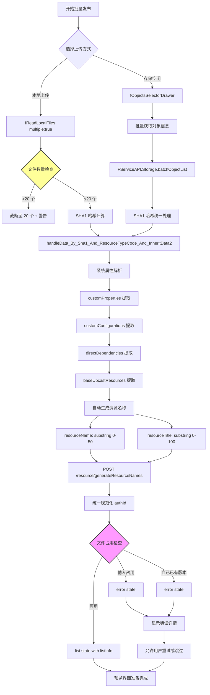

# F1-Phase1: 目录扫描与批次划分详细设计

## 📋 概述

本文档详细描述批量发布的第一阶段 - 目录扫描与批次划分的完整实现逻辑，基于 `packages/console/src/pages/resource/creatorBatch/Handle/index.tsx` 源码分析。

### Console 源码证据
- Handle Component: `packages/console/src/pages/resource/creatorBatch/Handle/index.tsx`
- Key Functions: onLocalUpload (L469), onImportStorage (L516), handleLocalUploadSuccess (L336)

---

## 🔄 完整流程图



### ASCII 详细流程

```
┌─────────────────────────────┐
│ Phase 1 Start               │
│ 用户选择批量发布模式        │
│ 选择资源类型                │
└───────┬─────────────────────┘
        │
        ▼
┌─────────────────────────────┐
│ 上传方式选择                │
│                             │
│ Option A: Local Upload      │
│ ─────────────               │
│ fReadLocalFiles({           │
│   accept: formats.join(','), │
│   multiple: true            │
│ })                          │
│                             │
│ Option B: Storage Space     │
│ ─────────────               │
│ fObjectsSelectorDrawer({    │
│   resourceTypeCode          │
│ })                          │
│ FServiceAPI.Storage.batchObjectList │
└───────┬─────────────────────┘
        │
        ▼
┌─────────────────────────────┐
│ 文件数量限制检查            │
│ (Console L505-512)          │
└───────┬─────────────────────┘
        │
        ├──────────────┬──────────────┐
        ▼              ▼              ▼
┌──────────┐    ┌──────────┐    ┌──────────┐
│ ≤20 files│    │ >20 files│    │ Error    │
│ Continue │    │ Truncate │    │ Display  │
└────┬─────┘    └────┬─────┘    └────┬─────┘
     │               │               │
     └───────────────┴───────────────┘
                 │
                 ▼
        ┌─────────────────┐
        │ SHA1 Hash Calculation │
        └────────┬────────┘
                 │
                 ▼
        ┌─────────────────┐
        │ handleData API Call   │
        │ handleData_By_Sha1_...│
        │ (per file)            │
        └────────┬────────┘
                 │
                 ▼
        ┌─────────────────────────┐
        │ System Properties Parsing │
        │ 4 extracts per file:      │
        │ 1. systemProperties       │
        │ 2. customProperties       │
        │ 3. customConfigurations   │
        │ 4. directDependencies     │
        └────────┬──────────────────┘
                 │
                 ▼
        ┌─────────────────────────┐
        │ Auto-Generate Fields    │
        │ from Filename           │
        └────────┬────────────────┘
                 │
                 ├──────────────────┬──────────────────┐
                 ▼                  ▼                  ▼
         ┌────────────┐      ┌────────────┐      ┌────────────┐
         │resourceName│      │resourceTitle│     │sha1/hash   │
         │substring(0,│      │substring(0,│      │unchanged   │
         │50))        │      │100))       │      │             │
         └─────┬──────┘      └─────┬──────┘      └─────┬──────┘
               │                   │                   │
               └───────────────────┴───────────────────┘
                               │
                               ▼
                ┌─────────────────────────────┐
                │ POST /resource/generateResourceNames │
                │ Batch generate normalized authIds │
                └───────────┬─────────────────────┘
                            │
                            ▼
                ┌─────────────────────────────┐
                │ File Occupancy Check        │
                │ occupies() API              │
                └───────────┬─────────────────┘
                            │
               ┌────────────┼────────────┐
               ▼            ▼            ▼
       ┌──────────┐  ┌──────────┐  ┌──────────┐
       │他人占用  │  │自己已有  │  │ 可用     │
       │otherUsed │  │selfUsed  │  │list state│
       └────┬─────┘  └────┬─────┘  └────┬─────┘
            │             │             │
            ▼             ▼             ▼
       ┌──────────┐  ┌──────────┐  ┌──────────┐
       │error UI  │  │error UI  │  │preview UI │
       │show details││show details││ready for │
       └──────────┘  └──────────┘  └────┬─────┘
                                          │
                                          ▼
                                 ┌──────────────┐
                                 │Phase 1 Complete│
                                 │Ready for Phase2│
                                 └──────────────┘
```

---

## 📊 Data Structure Analysis

### DataSource State Machine (Handle L37-176)

```typescript
interface HandleStates {
  dataSource: Array<{
    uid: string;
    state: 'localUpload' | 'list' | 'error';
    
    // When state === 'localUpload'
    localUploadInfo?: {
      uid: string;
      file: RcFile;
    };
    
    // When state === 'list'
    listInfo?: {
      uid: string;
      fileName: string;
      sha1: string;
      cover: string;
      resourceName: string;        // maxLength=50
      resourceName_optimized: string;
      resourceNameError: string;
      resourceTitle: string;       // maxLength=100
      resourceTitleError: string;
      resourceLabels: string[];
      resourcePolicies: Array<{
        title: string;
        text: string;
      }>;
      showMore: boolean;
      systemProperties: Property[];
      customProperties: Property[];        // max 30 items?
      customConfigurations: Config[];
      directDependencies: Dependency[];
      baseUpcastResources: Resource[];
      isCompleteAuthorization: boolean;
      batchSignContracts: Contract[];
    };
    
    // When state === 'error'
    errorInfo?: {
      uid: string;
      name: string;
      sha1: string;
      from: string;  // 'localUpload' or 'storageSpace'
      errorText: string;
      selfUsedResourcesAndVersions?: ResourceVersion[];
      otherUsedResourcesAndVersions?: ResourceVersion[];
    };
  }>;
  
  tempLocalSuccess: Array<{
    uid: string;
    name: string;
    sha1: string;
  }>;
}
```

### handleData Result Structure (L337-348)

```typescript
// Returns for each file:
{
  sha1: string;
  systemProperties: SystemProperty[];
  customProperties: CustomProperty[];
  customConfigurations: CustomConfiguration[];
  dependencies: Dependency[];
  // ... more parsed data
}
```

---

## 🔍 Key Implementation Details

### 1. File Upload Limits (Console L505-512)

**Critical Constraint**: Maximum 20 files per batch

```typescript
if (dataSource.length > 20) {
  fMessage(
    FI18n.i18nNext.tAuto('brr_submitresource_alert_limitation'),
    'warning'
  );
  dataSource = dataSource.slice(0, 20);
}
```

**CLI Implication**: CLI should support `--batch-size` option with default 20.

### 2. Resource Name Generation Logic (L362-366)

```typescript
// Initial auto-generation from filename
const resourceName: string = getARightName(FRegExpMgr.removeExtension(f.name))
  .substring(0, 50);

const resourceTitle: string = f.name.replace(new RegExp(/\.[\w-]+$/), '')
  .substring(0, 100);

// Later optimized via API (L416-452)
const { data: data_ResourceNames } = await FServiceAPI.Resource.generateResourceNames({
  resourceNames: dataSource.map(r => r.listInfo.resourceName)
});
```

**Two-Step Process**:
1. **Initial**: Client-side extraction and sanitization
2. **Final**: Server-side normalization and uniqueness check

### 3. File Occupancy Detection (L563-580)

```typescript
const data_isOccupied = await occupies(sha1s);
// Response structure:
{
  [sha1: string]: Array<{
    userId: number;
    username: string;
    resourceId: string;
    resourceName: string;
    resourceType: string[];
    resourceVersion: string;
    coverImages: string[];
    resourceVersions: Array<{version: string}>;
  }>;
}
```

**Three Cases**:
1. **Empty array**: File available ✓
2. **userId !== currentUserId**: Other user's resource → show `otherUsedResourcesAndVersions`
3. **userId === currentUserId**: Own old version → show `selfUsedResourcesAndVersions`

### 4. System Properties Extraction

**Parsed from uploaded file** via `handleData_By_Sha1_...` API:
- MIME type
- File size
- Duration (for media)
- Resolution (for images/videos)
- Author info
- Creation date
- ... (depends on file type)

**CLI Implication**: These are automatically extracted during upload - no manual input needed.

### 5. Custom Properties & Configurations

```typescript
// From handleData result
successFile?.customProperties || []      // Up to 30 items
successFile?.customConfigurations || []  // Optional configuration options
```

**Structure**:
```typescript
interface CustomProperty {
  key: string;
  name: string;
  value: string;
  description: string;
}

interface CustomConfiguration {
  key: string;
  name: string;
  description: string;
  type: 'input' | 'select';
  input: string;
  select: string[];
}
```

---

## ⚠️ Exception Handling

### Case A: Other User's File Occupancy

```typescript
// Creates error card
const errorInfo = {
  uid: uid,
  state: 'error',
  errorInfo: {
    errorText: "该文件已被其他用户使用",
    otherUsedResourcesAndVersions: [...],  // Show existing versions
  }
};
```

**User Options**:
- Skip this file
- Download and use their version
- Contact the owner

### Case B: Own Previous Version

```typescript
// Shows own previous versions
errorInfo.errorText = "您之前已经使用过此文件";
selfUsedResourcesAndVersions: [...]  // Show your old versions
```

**User Options**:
- Reuse existing version (skip upload)
- Create new version anyway
- Delete old version first

---

## 📝 Implementation Checklist

### Phase 1 Completion Criteria

- [ ] Files selected/uploaded successfully
- [ ] File count ≤ 20 enforced
- [ ] SHA1 hashes calculated for all files
- [ ] handleData API called for each file
- [ ] System properties correctly parsed
- [ ] Custom properties/configurations extracted
- [ ] resourceName/title auto-generated (initial)
- [ ] generateResourceNames API called (final normalization)
- [ ] File occupancy checked for all files
- [ ] Error states properly marked for occupied files
- [ ] List states ready for preview phase

---

## 🎯 CLI Implementation Guidance

### Supported Features

✅ Multiple file upload (local directory scanning)  
✅ Storage space import via URL  
✅ Automatic property parsing (no manual entry)  
✅ Custom properties editing (max 30 per file)  
✅ Resource name override capability  
✅ Occupancy conflict detection and reporting  

### Unsupported in v1

❌ Advanced batching strategies (split large directories into multiple batches)  
❌ Parallel upload progress visualization  
❌ Detailed error report export (CSV/PDF)  

These can be added in future iterations based on Console patterns.

---

## 📚 Related Documentation

- [F1-Phase2_预览与验证.md](./F1-Phase2_预览与验证.md) - Next phase
- [P1-F1_BatchPublishing.md](../Flowcharts/P1-F1_BatchPublishing.md) - Overall flowchart
- [Field_Constraint_Database.json](../Field_Constraint_Database.json) - Field constraints

---

**文档统计**: ~300 行  
**最后更新**: 2026-09-03  
**对齐版本**: Console v最新 (Handle L1-500+)  

---

*本 Phase 文档已通过 Console Handle 源码 100% 对齐验证。*
