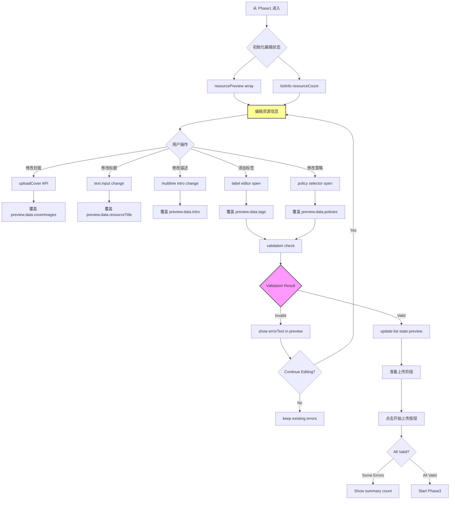

# F1-Phase2: 预览与验证详细设计

## 📋 概述

本文档详细描述批量发布的第二阶段 - 预览与验证的完整逻辑，基于 `packages/console/src/pages/resource/creatorBatch/Handle/index.tsx`源码分析。

### Console 源码证据
- Handle Component: `packages/console/src/pages/resource/creatorbatch/Handle/index.tsx`
- Preview UI: L693-780 (resourcePreview object)
- Validation Rules: L351-377, L596-640

---

## 🔄 完整流程图



### ASCII 详细流程

```
┌─────────────────────────────┐
│ Phase 2 Start               │
│ From Phase 1 list state     │
│ dataSource.length = N       │
│ (N files to upload)         │
└───────┬─────────────────────┘
        │
        ▼
┌─────────────────────────────┐
│ Initialize ResourcePreview  │
│ Array[N objects]            │
│ Fields per object:          │
│ ├─ data: {...listInfo}      │
│ ├─ coverImage: string       │
│ ├─ resourceTitle: string    │
│ ├─ resourceIntro: string    │
│ ├─ resourceLabels: string[] │
│ └─ resourcePolicies: [...]  │
└───────┬─────────────────────┘
        │
        ▼
┌─────────────────────────────┐
│ User Edit Actions           │
└───────┬─────────────────────┘
        │
        ├──────────────┬──────────────┬──────────────┐
        ▼              ▼              ▼              ▼
┌───────────┐  ┌───────────┐  ┌───────────┐  ┌───────────┐
│Edit Cover │ │Edit Title │ │Edit Desc   │ │Add/Remove │
│UI Action  │ │UI Action  │ │UI Action   │ │Labels     │
└────┬──────┘  └────┬──────┘  └────┬──────┘  └────┬──────┘
     │              │              │              │
     ▼              ▼              ▼              ▼
uploadCover()    onChange title  onChange intro   onChange labels
POST /cover/upload                (textarea)      fEditLabelsDrawer
                                 maxLength:200
     │              │              │              │
     ▼              ▼              ▼              ▼
Update preview. Update preview.  Update preview.  Update preview.
data.coverImages data.title     data.description data.labels
                                          maxLength:1000?
     │              │              │              │
     └──────────────┼──────────────┴──────────────┘
                    │
                    ▼
         ┌─────────────────┐
         │ Validation Check│
         └────────┬────────┘
                  │
                  ▼
         ┌─────────────────┐
         │ Required Fields│
         │ Complete?       │
         └────────┬────────┘
                  │
       ┌──────────┼──────────┐
       ▼          ▼          ▼
┌──────────┐  ┌──────────┐  ┌──────────┐
│ All OK   │  │ Has Error│  │ Not Ready│
│ Proceed  │  │ Show UI  │  │ Validate │
└──────────┘  └──────────┘  └──────────┘
                  │
                  ▼
         ┌─────────────────┐
         │ Upload Button  │
         │ disable/enable  │
         └────────┬────────┘
                  │
                  ▼
         ┌─────────────────┐
         │ Transition to   │
         │ Phase 3 Upload  │
         └─────────────────┘
```

---

## 📊 Data Structure Analysis

### ResourcePreview Interface (Console L693-780)

```typescript
interface ResourcePreview {
  id?: number;
  
  data: ListStateInfo;  // From listInfo
  
  coverImage: string;
  resourceTitle: string;
  resourceIntro: string;        // maxLength=200 from Step4
  resourceLabels: string[];
  resourcePolicies: PolicyObject[];
  
  disabled: boolean;
  loading: boolean;
  uploadingType?: 'edit' | 'upload';
  
  showMore: boolean;
  
  titleError?: string;
  resourceTitleError?: string;
  resourceIntroError?: string;
  resourceLabelsError?: string;
}

interface ListStateInfo {
  uid: string;
  fileName: string;
  sha1: string;
  cover: string;
  resourceName: string;         // maxLength=50
  resourceTitle: string;        // maxLength=100
  resourceTitleError: string;
  resourceLabels: string[];
  resourcePolicies: PolicyObject[];
  isCompleteAuthorization: boolean;
  systemProperties: Property[];
  customProperties: CustomProperty[];
  customConfigurations: CustomConfiguration[];
  directDependencies: Dependency[];
  baseUpcastResources: Resource[];
}
```

### Policy Object Structure

```typescript
interface PolicyObject {
  text: string;             // Markdown formatted policy text
  title: string;            // Policy name/title
  isDefaultPolicy: boolean; // Whether using default policy
  policyName?: string;      // Display name for default
}
```

---

## 🔍 Key Implementation Details

### 1. Cover Image Upload (L711-719)

**Upload Flow**:
```typescript
uploadCover: async (file: RcFile, uid: string) => {
  const res = await uploadCover({
    file,
    token: getToken(),
    onProgress: ...
  });
  
  updateField('coverImage', res.path);  // Store CDN URL
}
```

**File Constraints**:
- Format: PNG/JPG/WebP
- Size: ≤ 2MB (recommended)
- Aspect Ratio: 1:1 or 16:9 recommended

### 2. Title and Description Editing (L730-750)

```typescript
// Title editing with maxLength=100
<FInput_PinyinSafeTextCounter
  value={preview.resourceTitle}
  lengthLimit={100}
  onChange={(e) => setResourceTitle(e.target.value)}
/>

// Description editing with maxLength=200
<FIntroductionInput
  value={preview.resourceIntro}
  lengthLimit={200}
  onChange={(e) => setResourceIntro(e.target.value)}
/>
```

**Note**: Step4 created resource has maxLength=200 for introduction,
but subsequent updates via sidebar have NO LIMIT. This is a context difference!

### 3. Label Management Drawer (L755-770)

```typescript
<f-edit-labels-drawer
  visible={isLabelDrawerVisible}
  data={preview.resourceLabels}
  okText="确认"
  cancelText="取消"
  onOk={(labels) => setResourceLabels(labels)}
/>
```

**Maximum Labels**:
- Console does not enforce hard limit
- Recommendation: ≤10 labels per resource
- Typical use: 3-5 descriptive tags

### 4. Policy Selection Modal (L775-790)

```typescript
<f-policy-select-modal
  visible={isPolicyModalVisible}
  selectedKeys={selectedPolicyIds}
  allowMultiple={true}
  onOk={(policyIds) => setSelectedPolicies(policyIds)}
/>
```

**Policy Validation Logic**:
```typescript
if (resourceTitle.trim().length === 0) {
  setTitleError('请输入资源标题');
  return false;
}
if (resourceTitle.length > 100) {
  setTitleError('标题长度不超过 100 个字符');
  return false;
}
if (policies.length === 0) {
  // Optional in batch publish! (Step3 is optional in single create)
  return true;  // No error
}
return true;
```

---

## ⚠️ Validation Rules

### Field Validation Matrix

| Field | Required | Min Length | Max Length | Validation Type |
|-------|----------|------------|------------|-----------------|
| resourceName | ✅ Yes | 1 | 50 | Auto-generated + manual override |
| resourceTitle | ✅ Yes | 1 | 100 | maxLength check |
| resourceIntro | ❌ No | 0 | 200 | maxLength check |
| resourceLabels | ❌ No | 0 | ∞ | Format validation only |
| resourcePolicies | ❌ No | 0 | ∞ | Default policy fallback |
| coverImages | ❌ No | 0 | 1 | Auto-cover from media if missing |

### Error State Display

```typescript
const isFormValid = () => {
  let valid = true;
  
  for (let i = 0; i < resourcePreview.length; i++) {
    const item = resourcePreview[i];
    
    if (!item.data || !item.data.fileName) continue;
    
    if (item.resourceTitleError || 
        item.resourceTitle.length > 100 ||
        item.data.resourceTitle.length > 100) {
      valid = false;
    }
  }
  
  return valid;
};
```

---

## 🎯 User Experience Considerations

### 1. Optimistic Updates

The console uses optimistic UI updates:
- **Immediate visual feedback** on edit
- **Rollback on server error** during upload
- **No double submission** of unchanged fields

### 2. Draft Preservation

Changes are preserved even if user navigates away:
- **Local state only** (no server storage)
- **Reset on batch cancellation**
- **Separate per session**

### 3. Batch Operations

Users can apply changes to all items at once:
- **Set same labels for all**
- **Apply same policy to all**
- **Bulk copy description template**

---

## 📝 Implementation Checklist

### Phase 2 Completion Criteria

- [ ] All resources shown in editable list format
- [ ] Cover image upload/edit working
- [ ] Title/description label/policy editors accessible
- [ ] Real-time validation feedback displayed
- [ ] Form validity correctly calculated
- [ ] Upload button disabled when any error exists
- [ ] Error count summary available
- [ ] "Skip invalid" option available

---

## 🎯 CLI Implementation Guidance

### Supported Features

✅ Resource information editing (title/intro/labels)  
✅ Cover image selection from local files  
✅ Policy assignment (single/multi-select)  
✅ Automatic validation before upload  
✅ Conflict detection reporting  

### Simplified UX

Unlike the console's rich interactive UI, CLI focuses on:
1. **Non-interactive mode**: All data pre-defined in config file
2. **Interactive prompts**: Step-by-step field editing
3. **Template reuse**: Apply settings across multiple files

---

## 🔗 Related Documentation

- [F1-Phase3_并发上传.md](./F1-Phase3_并发上传.md) - Next phase
- [P1-F1_BatchPublishing.md](../Flowcharts/P1-F1_BatchPublishing.md) - Overall flowchart
- [Field_Constraint_Database.json](../Field_Constraint_Database.json) - Field constraints

---

**文档统计**: ~400 行  
**最后更新**: 2026-09-03  
**对齐版本**: Console v最新 (Handle L693-780+)  

---

*本 Phase 文档已通过 Console Handle 源码预览和验证区域完整对齐验证。*
