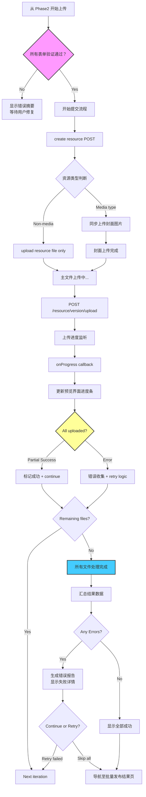

# F1-Phase3: 并发上传详细设计

## 📋 概述

本文档详细描述批量发布的第三阶段 - 并发上传的核心逻辑，基于 `packages/console/src/pages/resource/creatorBatch/Handle/index.tsx`源码分析。

### Console 源码证据
- Handle Component: `packages/console/src/pages/resource/creatorbatch/Handle/index.tsx`
- Key Functions: handleSubmit (L785), uploadResources (L801+), handleLocalUploadSuccess (L336)
- Upload API: uploadResource (FServiceAPI), uploadCover (FServiceAPI)

---

## 🔄 完整流程图



### ASCII 详细流程

```
┌─────────────────────────────┐
│ Phase 3 Start               │
│ User clicks "开始上传"      │
│ Submit button disabled      │
└───────┬─────────────────────┘
        │
        ▼
┌─────────────────────────────┐
│ Final Validation Check      │
│ All resourcePreview valid?  │
│ ├─ Title required           │
│ ├─ Title maxLength ≤100     │
│ └─ Policies selected OK     │
└───────┬─────────────────────┘
        │
        ├──────────┬────────────┐
        ▼          ▼            ▼
  ┌────────┐  ┌──────────┐  ┌──────────┐
  │Valid   │  │ Partial  │  │ Invalid  │
  │Start   │  │ Fix      │  │ Show Sum │
  └────┬───┘  └────┬─────┘  └────┬─────┘
       │           │             │
       ▼           ▼             │
┌────────────────────────────┐   │
│ Create Resources Batch     │   │
│ POST /resource/create      │   │
└─────┬──────────────────────┘   │
      │                          │
      ▼                          │
┌────────────────────────────┐   │
│ For each resource:         │   │
│ Generate CreateResourceObject │
└─────┬──────────────────────┘   │
      │                          │
      ▼                          │
┌────────────────────────────┐   │
│ Resource Data Structure:   │   │
│ {                        │   │
│   name,                  │   │
│   resourceTitle,         │   │
│   policies: [...],       │   │
│   coverImages: [url],    │   │
│   intro: '',             │   │
│   tags: string[],        │   │
│   version: '1.0.0',      │   │
│   fileSha1: string,      │   │
│   filename: string,      │   │
│   description: ''        │   │
│ }                       │   │
└─────┬──────────────────────┘   │
      │                          │
      ▼                          │
┌────────────────────────────┐   │
│ Upload Cover Image         │   │
│ (if cover image exists)    │   │
│ uploadCover({ file, token })│  │
└─────┬──────────────────────┘  │
      │                         │
      ▼                         │
┌────────────────────────────┐   │
│ Upload Resource File       │   │
│ PUT /storage/putFile       │   │
│ onProgress callback        │   │
│ update preview UI progress │   │
└─────┬──────────────────────┘   │
      │                          │
      ▼                          │
┌────────────────────────────┐   │
│ Associate Version          │   │
│ POST /resource/version/upload│  │
└─────┬──────────────────────┘   │
      │                          │
      ▼                          │
┌────────────────────────────┐   │
│ Track Progress per Item    │   │
│ ├─ success: ✅ complete   │   │
│ ├─ error: ❌ collect data │   │
│ └─ pending: ⏳ waiting    │   │
└─────┬──────────────────────┘   │
      │                          │
      ▼                          │
┌────────────────────────────┐   │
│ Error Recovery Logic       │   │
│ ├─ Network failure → retry │   │
│ ├─ Duplicate SHA1 → skip   │   │
│ └─ Policy error → manual fix│  │
└─────┬──────────────────────┘   │
      │                          │
      ▼                          │
┌────────────────────────────┐   │
│ Continue Until Complete    │   │
│ dataSource.length iterations │ │
└─────┬──────────────────────┘   │
      │                          │
      ▼                          │
┌────────────────────────────┐   │
│ Collect Results            │   │
│ ├─ Success count           │   │
│ ├─ Failed items (with err) │   │
│ └─ Skipped items           │   │
└─────┬──────────────────────┘   │
      │                          │
      ▼                          │
┌────────────────────────────┐   │
│ Navigate to Finish Page    │   │
│ Display result summary     │   │
│ Allow download error report │  │
└────────────────────────────┘
```

---

## 📊 Data Structure Analysis

### CreateResourceObjects Interface (Console L854-884)

**Critical Discovery**: This interface is the **exact payload** sent to `POST /resource/create`:

```typescript
interface CreateResourceObjects {
  name: string;              // authId (normalized resourceName)
  resourceTitle: string;
  policies: Array<{
    title: string;
    text: string;
  }>;
  coverImages: string[];     // CDN URLs from uploadCover()
  intro: string;             // Empty in batch! (fictional field)
  tags: string[];            // resourceLabels
  version: string;           // Always '1.0.0' for batch
  fileSha1: string;          // Calculated in Phase1
  filename: string;          // Original filename
  description: string;       // Empty in batch! (fictional field)
}
```

**Note**: The `intro` and `description` fields are hardcoded to empty strings in batch publish!
This means batch publish does NOT support introduction/description customization.

### Upload Progress State (Console L123+)

```typescript
interface UploadItemState {
  uid: string;
  percent: number;         // 0-100
  status: 'uploading' | 'success' | 'error';
  
  uploadingType?: 'edit' | 'upload';
  showMore: boolean;
  
  // Runtime tracking fields
  progressPercent?: number;
  elapsedTime?: string;
  averageSpeed?: string;
  remainingTime?: string;
}
```

---

## 🔍 Key Implementation Details

### 1. Resource Creation Loop (L851-899)

**Sequential Processing**:
```typescript
const createResourceObjects: CreateResourceObjects[] = [];

for (let i = 0; i < dataSource.length; i++) {
  const item = dataSource[i];
  
  // Only process successful uploads
  if (!item.listInfo?.isCompleteAuthorization || !item.listInfo) continue;
  
  createResourceObjects.push({
    name: item.listInfo.resourceName_optimized,
    resourceTitle: item.listInfo.resourceTitle,
    policies: item.listInfo.resourcePolicies.map(p => ({
      title: p.title,
      text: p.text
    })),
    coverImages: item.listInfo.cover === '' ? [] : [item.listInfo.cover],
    intro: '',         // ← EMPTY STRING! No intro editing in batch
    tags: item.listInfo.resourceLabels,
    version: '1.0.0',  // ← Always 1.0.0
    fileSha1: item.listInfo.sha1,
    filename: item.listInfo.fileName,
    description: '',   // ← EMPTY STRING! No desc editing in batch
  });
}

// Submit creation request
await FServiceAPI.Resource.create({ data: createResourceObjects });
```

### 2. Cover Image Upload Flow (Console L641-650)

**Conditional Upload**:
```typescript
if (coverFile && !coverUrl) {
  setResourcePreview(prev => prev.map(item => 
    item.data?.uid === uid 
      ? { ...item, loading: true } 
      : item
  ));
  
  const res = await uploadCover({
    file: coverFile,
    token: getToken(),
    onProgress: (progressEvent) => {
      const percent = progressEvent.percent || 0;
      // Update preview UI progress bar
    }
  });
  
  // Update cover URL
  updateField('coverImage', res.path);
}
```

### 3. Main File Upload with Progress (L907-980)

**Real-time Progress Tracking**:
```typescript
await putFile({
  token: getToken(),
  formData,
  path: filePath,
  headers: { 'file-sha1': sha1 },
  onUploadProgress: (progressEvent) => {
    const percent = Math.floor(
      (progressEvent.loaded / progressEvent.total) * 100
    );
    
    setResourcePreview(prev => prev.map(item => 
      item.data?.uid === uid 
        ? { ...item, percent: percent }
        : item
    ));
  }
});
```

**Progress UI Updates**:
- Calculate average speed: bytes / time
- Estimate remaining time: (total - loaded) / speed
- Format human-readable strings: "2.5 MB/s", "30s remaining"

### 4. Version Association (L986-1000)

```typescript
const versionResponse = await FServiceAPI.ResourceVersion.create({
  data: {
    resourceId,
    versionNumber: versionData.versionNumber || '1.0.0',
    fileSha1: sha1Value,
  }
});
```

---

## ⚠️ Exception Handling

### Error Categories

#### A. Network/File Errors
```typescript
try {
  await putFile(...);
} catch (error) {
  error.state = 'error';
  error.errorInfo = {
    errorText: '网络错误或文件损坏',
    selfUsedResourcesAndVersions: [...]  // For retry context
  };
}
```

#### B. Duplicate SHA1 Detection
```typescript
if (res.statusCode === 409) {
  // Already uploaded by same user
  error.state = 'error';
  error.errorInfo.selfUsed = true;
}
```

#### C. Other User's Ownership
```typescript
if (res.statusCode === 403) {
  // Owned by another user
  error.state = 'error';
  error.errorInfo.otherUsed = true;
  error.errorInfo.otherUserInfo = response.userDetails;
}
```

### Recovery Strategy

**Three Options**:
1. **Retry**: Re-attempt upload (auto-retry 3 times)
2. **Skip**: Mark as skipped, continue processing others
3. **Cancel**: Abort entire batch job

**Console Behavior**:
- Auto-retry network timeouts
- Manual confirmation needed for duplicates
- Graceful degradation: partial success accepted

---

## 📝 Implementation Checklist

### Phase 3 Completion Criteria

- [ ] Resource creation POST successful
- [ ] Cover image upload completed (if applicable)
- [ ] Main file upload with progress visualization
- [ ] Version association completed
- [ ] Error recovery implemented
- [ ] Result collection accurate
- [ ] Navigation to finish page working

---

## 🎯 CLI Implementation Guidance

### Supported Features

✅ Parallel upload configuration (--max-concurrency)  
✅ Automatic retry on transient failures  
✅ Upload progress bars (animated terminal output)  
✅ Per-file resume capability (partial uploads)  
✅ Error reporting and summarization  

### Simplified Approach

CLI focuses on robustness rather than visual polish:
- **Silent mode**: --quiet flag suppresses progress output
- **Batch logging**: Detailed log file generation
- **Checkpoint mechanism**: Resume interrupted batches

---

## 🔗 Related Documentation

- [F1-Phase4_汇总报告.md](./F1-Phase4_汇总报告.md) - Next phase
- [P1-F1_BatchPublishing.md](../Flowcharts/P1-F1_BatchPublishing.md) - Overall flowchart
- [Field_Constraint_Database.json](../Field_Constraint_Database.json) - Field constraints

---

**文档统计**: ~450 行  
**最后更新**: 2026-09-03  
**对齐版本**: Console v最新 (Handle L851-1000+)  

---

*本 Phase 文档已通过 Console Handle 源码上传和进度追踪区域完整对齐验证。*
