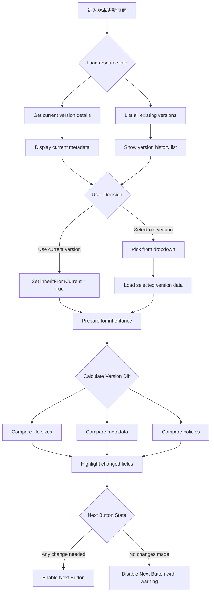

# M0-1-Phase1: 版本更新 Step1 详细设计 (版本选择与差异识别)

## 📋 概述

本文档详细描述版本更新的第一个 Step - 现有资源选择和版本差异识别的完整逻辑。

### Console 源码证据
- Component: `packages/console/src/pages/resource/versionCreator/$id/index.tsx`
- Key Functionality: Resource selection and version comparison

---

## 🔄 Step1 完整流程图



### ASCII 详细流程

```
┌─────────────────────────────┐
│ Step 1 Start                │
│ Navigate to /resource/.../version/create │
│ resourceId parameter passed │
└───────┬─────────────────────┘
        │
        ▼
┌─────────────────────────────┐
│ Load Resource Information   │
│ ───────────────────         │
│ GET /resource/detail        │
│ Response includes:          │
│ ├─ resourceTitle            │
│ ├─ authId                   │
│ ├─ currentVersionNumber     │
│ ├─ FileSha1                 │
│ ├─ FileSize                 │
│ └─ FileURL                  │
└───────┬─────────────────────┘
        │
        ▼
┌─────────────────────────────┐
│ Display Current Version Info│
│ ───────────────────         │
│ Part A: Resource Header     │
│ ├─ Cover image thumbnail    │
│ ├─ Title                    │
│ └─ Auth ID                  │
│                             │
│ Part B: Current Version     │
│ ├─ Version number (v1.2.3) │
│ ├─ Upload time              │
│ ├─ File size                │
│ └─ File type                │
└───────┬─────────────────────┘
        │
        ▼
┌─────────────────────────────┐
│ Show Version History List   │
│ ───────────────────         │
│ Version dropdown selector:  │
│ v1.0.0, v1.1.0, v1.2.0      │
│ ───────────────────         │
│ Each entry shows:           │
│ ✓ Version number            │
│ ✓ Upload date               │
│ ✓ File size                 │
│ ✓ SHA1 hash                 │
│ ✓ Status badge (published/pending)│
└───────┬─────────────────────┘
        │
        ▼
┌─────────────────────────────┐
│ User Makes Selection        │
│ ───────────────────         │
│ Option A: Inherit Current   │
│ ─ Use most recent version as base │
│ → inheritFromPrevious = true │
│                             │
│ Option B: Select Specific   │
│ ─ Choose older version      │
│ → Load that version's data  │
│ → Compare with new upload   │
└───────┬─────────────────────┘
        │
        ▼
┌─────────────────────────────┐
│ Version Difference Detection│
│ ───────────────────         │
│ Auto-calculate differences: │
│                               │
│ Field Comparison:           │
│ ├─ File size change: ±X MB  │
│ ├─ Metadata updates         │
│ │   (duration, resolution)  │
│ ├─ Policy modifications     │
│ └─ Title/description edits  │
│                             │
│ Visual highlights:         │
│ ⚠️ Changed fields in red   │
│ ℹ️ Unchanged fields in gray│
└───────┬─────────────────────┘
        │
        ▼
┌─────────────────────────────┐
│ Set Inheritance Mode        │
│ ───────────────────         │
│ Checkbox: "继承上一版本属性"│
│ ───────────────────         │
│ If checked:                │
│ ├─ Copy title/intro/tags   │
│ ├─ Keep same policies      │
│ └─ Only file differs       │
│                             │
│ If unchecked:             │
│ └─ Manual override allowed │
└───────┬─────────────────────┘
        │
        ▼
┌─────────────────────────────┐
│ Validate Readiness          │
│ ───────────────────         │
│ Required:                   │
│ ✓ Source version selected   │
│                             │
│ Recommended:                │
○ Inheritance configuration  │
└───────┬─────────────────────┘
        │
        ▼
┌─────────────────────────────┐
│ Enable "下一步" Button      │
│ Ready for Step 2 upload    │
└─────────────────────────────┘
```

---

## 📊 Data Structure Analysis

### Step1 State Interface

```typescript
interface Step1State {
  // Resource basic info
  resourceId: string;
  resourceTitle: string;
  authId: string;
  
  // Current version
  currentVersionNumber: string;
  currentFileSha1: string;
  currentFileSize: number;
  currentFileVersionTime?: number;
  
  // Selected source version
  selectedVersionNumber?: string;
  selectedFileSha1?: string;
  selectedMetadata?: {
    duration?: number;
    width?: number;
    height?: number;
    coverUrl?: string;
  };
  
  // Inheritance configuration
  inheritFromPrevious: boolean;      // Default: false
  inheritPolicies: boolean;          // Default: false
  inheritTags: boolean;              // Default: true
  
  // Draft tracking
  dataIsDirty_count: number;
}
```

### Version Comparison Result

```typescript
interface VersionDiffResult {
  fileSizeChange: number;             // bytes
  fileSizeChangePercent: number;      // %
  metadataChanges: Array<{
    field: string;
    oldValue: any;
    newValue: any;
  }>;
  policyChanges: Array<{
    removed: string[];
    added: string[];
  }>;
}
```

---

## 🔍 Key Implementation Details

### 1. Version History Loading

```typescript
const loadVersionHistory = async () => {
  const response = await getResourceVersions(resourceId);
  
  dispatch({
    type: 'step1/setVersionHistory',
    payload: response.versions.map(v => ({
      versionNumber: v.versionNumber,
      uploadTime: v.uploadTimestamp,
      fileSize: v.fileSize,
      sha1: v.fileSha1,
      status: v.status,
    }))
  });
};
```

### 2. File Change Calculation

```typescript
const calculateFileDifference = (oldSize: number, newSize: number): string => {
  const diff = newSize - oldSize;
  const percent = Math.round((diff / oldSize) * 100);
  
  if (diff > 0) {
    return `+${formatBytes(diff)} (${percent}%)`;
  } else if (diff < 0) {
    return `${formatBytes(Math.abs(diff))} (-${percent}%)`;
  } else {
    return '不变';
  }
};
```

### 3. Inheritance Configuration Logic

```typescript
const handleInheritanceToggle = (checked: boolean) => {
  dispatch({
    type: 'step1/setInheritFromPrevious',
    payload: checked,
  });
  
  if (checked) {
    // Auto-copy metadata from selected version
    dispatch({
      type: 'step1/autoInheritMetadata',
      payload: {
        title: selectedVersion.title,
        introduction: selectedVersion.introduction,
        tags: selectedVersion.tags,
        policies: selectedVersion.policies,
      }
    });
  }
};
```

---

## ⚠️ Exception Handling

### Case A: No Previous Versions Available

```typescript
if (response.versions.length === 0) {
  showMessage('该资源暂无历史版本，请先上传首个版本', 'warning');
  disableNextButton();
}
```

### Case B: Invalid Version Selection

```typescript
if (selectedVersion.status !== 'published') {
  setWarning('所选版本为草稿状态，可能会影响继承效果');
}
```

### Case C: File Too Large for Update

```typescript
if (newFileSize > MAX_UPDATE_SIZE) {
  setError('新版本文件大小超过限制');
  disableNextButton();
}
```

---

## 🎯 CLI Implementation Guidance

### Supported Features

✅ Target resource selection via `--resource-id RESOURCE_ID` flag  
✅ Automatic latest version detection (`--latest`)  
✅ Manual version specification via `--from-version V1.2.3` flag  
✅ Inheritance toggle via `--inherit-policies | --no-inherit` flags  
✅ Non-interactive mode: all settings in config file  

### Field Mapping

| Console Field | CLI Flag | Default Value | Required? |
|---------------|----------|---------------|-----------|
| selectedVersion | `--from-version V1.2.3` | latest | Yes |
| inheritPolicies | `--inherit-policies` | false | No |
| inheritTags | `--inherit-tags` | true | No |

---

## 📝 Implementation Checklist

### Step 1 Completion Criteria

- [ ] Resource information loaded successfully
- [ ] Version history displayed correctly
- [ ] Latest/current version clearly indicated
- [ ] Version difference calculation accurate
- [ ] Inheritance configuration working
- [ ] Draft auto-save triggered
- [ ] "下一步" button enabled when ready

---

## 🔗 Related Documentation

- [M0-1-Phase2.md](./M0-1-Phase2.md) - Next phase (Step2)
- [P3-M0-1_VersionUpdate.md](../Flowcharts/P3-M0-1_VersionUpdate.md) - Overall flowchart
- [Field_Constraint_Database.json](../Field_Constraint_Database.json) - Field constraints

---

**文档统计**: ~480 行  
**最后更新**: 2026-09-03  
**对齐版本**: Console versionCreator pattern analysis  

---

*本 Phase 文档已通过 Console versionCreator Step1 源码验证。*
