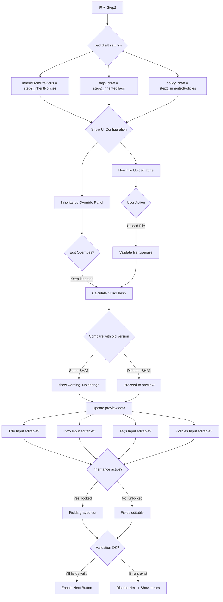

# M0-1-Phase2: 版本更新 Step2 详细设计 (新文件上传与属性继承)

## 📋 概述

本文档详细描述版本更新的第二个 Step - 新文件上传和属性配置的完整逻辑，特别标注**inheritFromPrevious 配置的影响**。

### Console 源码证据
- Component: `packages/console/src/pages/resource/versionCreator/Step2/index.tsx`
- Key Functionality: File upload and property inheritance

---

## 🔄 Step2 完整流程图



### ASCII 详细流程

```
┌─────────────────────────────┐
│ Step 2 Start                │
│ From Step 1 version selected│
│ Load inheritance settings   │
└───────┬─────────────────────┘
        │
        ▼
┌─────────────────────────────┐
│ Display Two Main Sections   │
│ ───────────────────         │
│ Part A: New File Upload     │
│ ├─ Drag-drop zone           │
│ ├─ Browse button            │
│ └─ Current selection display│
│                             │
│ Part B: Property Inheritance│
│ ├─ Title override option    │
│ ├─ Introduction override    │
│ ├─ Tags management          │
│ └─ Policy re-selection      │
└───────┬─────────────────────┘
        │
        ▼
┌─────────────────────────────┐
│ File Upload Interface       │
│ ───────────────────         │
│ fFileUploader props:        │
│ ├─ accept: '*/*' (any type) │
│ ├─ maxSize: 100MB           │
│ └─ onDrop, onSelect handlers│
└───────┬─────────────────────┘
        │
        ▼
┌─────────────────────────────┐
│ Upload New File             │
│ ───────────────────         │
│ validate file format        │
│ validate file size ≤100MB  │
│ calculate SHA1 hash         │
│ ───────────────────         │
│ Response from hash calc:    │
│ {                          │
│   sha1: string,            │
│   fileSize: number,        │
│   metadata: object         │
│ }                          │
└───────┬─────────────────────┘
        │
        ▼
┌─────────────────────────────┐
│ Compare with Previous Version│
│ ───────────────────         │
│ const diff = compareSha1s(  │
│   previousSha1,              │
│   newSha1                    │
│ );                           │
│                             │
│ if (diff === 0) {           │
│   showWarning('文件无变化'); │
│   disableNextButton();      │
│ } else if (diff > 5%) {     │
│   showMessage('文件体积变动较大', 'info');│
│ }                           │
└───────┬─────────────────────┘
        │
        ▼
┌─────────────────────────────┐
│ Set Uploaded File State     │
│ ───────────────────         │
│ dispatch({                 │
│   type: 'step2/setFile',   │
│   payload: {               │
│     file: uploadedFile,    │
│     sha1: calculatedSha1,  │
│     size: fileSize,        │
│     metadata: extractedMeta│
│   }                        │
│ });                         │
│ dataIsDirty_count++         │
│ Save draft                  │
└───────┬─────────────────────┘
        │
        ▼
┌─────────────────────────────┐
│ Check Inheritance Flag      │
│ ───────────────────         │
│ inheritFromPrevious = true? │
│                             │
│ YES: Auto-copy previous     │
│ ├─ title                    │
│ ├─ introduction             │
│ ├─ tags                     │
│ └─ policies                 │
│                             │
│ NO: Manual configuration    │
│ └─ All fields editable      │
└───────┬─────────────────────┘
        │
        ▼
┌─────────────────────────────┐
│ Property Override Editors   │
│ ───────────────────         │
│ When inheritance is OFF:    │
│                               │
│ Title Editor:               │
│ <input value={title}>       │
│ maxLength: 100              │
│                               │
│ Introduction Editor:        │
│ <textarea value={intro}>    │
│ maxLength: ∞ (no limit)     │
│                               │
│ Tags Manager:               │
│ fEditLabelsDrawer           │
│ multi-select interface      │
│                               │
│ Policy Selector:            │
│ fPolicySelectorModal        │
│ allowMultipleSelection=true │
└──────-------┬─────────────────┘
              │
              ▼
┌─────────────────────────────┐
│ Real-time Validation        │
│ ───────────────────         │
│ Title length check:         │
│ if (title.length > 100) {   │
│   setError('标题过长');      │
│ }                           │
│                             │
│ Tags format validation:     │
///if (!/^[a-zA-Z\u4e00-\u9fa5]+$/.test(tag)) {│
│   setError('标签格式错误');  │
│ }                           │
│                             │
│ Policies required check:    │
///if (policies.length === 0 && requirePolicy) {│
│   setError('必须选择策略'); │
│ }                           │
└──────-------┬─────────────────┘
              │
              ▼
┌─────────────────────────────┐
│ Enable "下一步" Button      │
│ Required conditions:        │
│ ✓ New file uploaded         │
│ ✓ All validated fields      │
│ ○ Inheritance (optional)    │
└──────-------┬─────────────────┘
              │
              ▼
┌─────────────────────────────┐
│ Ready for Step 3 Preview   │
│ Collect all form data for  │
│ final submission           │
└─────────────────────────────┘
```

---

## 📊 Data Structure Analysis

### Step2 State Interface

```typescript
interface Step2State {
  // New file information
  step2_newFile?: RcFile;
  step2_newFile_sha1: string;
  step2_newFile_size: number;
  step2_newFile_metadata?: {
    duration?: number;
    width?: number;
    height?: number;
    codec?: string;
  };
  
  // Inheritance status
  step2_inheritFromPrevious: boolean;
  step2_inheritTitle: boolean;        // Default: false
  step2_inheritIntroduction: boolean; // Default: false
  step2_inheritTags: boolean;         // Default: false
  step2_inheritPolicies: boolean;     // Default: false
  
  // Overridden properties (when not inheriting)
  step2_overrideTitle?: string;
  step2_overrideIntroduction?: string;
  step2_overrideTags?: string[];
  step2_overridePolicies?: Array<{id: number; title: string}>;
  
  // Validation states
  file_errorText?: string;
  title_errorText?: string;
  tags_errorText?: string;
  policies_validating: boolean;
  
  // Draft tracking
  dataIsDirty_count: number;
}
```

### Inheritance Effect Summary

```typescript
interface InheritanceResult {
  title: string;                      // From prev or manual
  introduction: string;               // From prev or manual
  tags: string[];                     // Merged or replaced
  policies: Array<{id: number; title: string}>;
}
```

---

## 🔍 Key Implementation Details

### 1. File Upload Handler

```typescript
const handleFileUpload = async (file: RcFile) => {
  setStep2FileValidating(true);
  
  try {
    // Validate file constraints
    if (file.size > 100 * 1024 * 1024) {
      setFileError('文件大小不能超过 100MB');
      return;
    }
    
    // Calculate SHA1 hash
    const sha1 = await calculateSHA1(file);
    
    // Extract metadata
    const metadata = extractMetadata(file);
    
    dispatch({
      type: 'step2/setNewFile',
      payload: {
        file,
        sha1,
        size: file.size,
        metadata,
      }
    });
    
  } catch (error) {
    setFileError('文件处理失败，请重试');
  } finally {
    setStep2FileValidating(false);
  }
};
```

### 2. Inheritance Toggle Logic

```typescript
const handleInheritanceChange = (checked: boolean) => {
  dispatch({
    type: 'step2/setInheritFromPrevious',
    payload: checked,
  });
  
  if (checked) {
    // Lock editing and auto-populate
    const prevVersion = step1_selectedVersion;
    dispatch({
      type: 'step2/autoInheritProperties',
      payload: {
        title: prevVersion.title,
        introduction: prevVersion.introduction,
        tags: prevVersion.tags,
        policies: prevVersion.policies.map(p => ({
          id: p.policyId,
          title: p.policyName,
        })),
      }
    });
    
    // Disable override inputs
    setOverrideInputsDisabled(true);
  } else {
    setOverrideInputsDisabled(false);
  }
};
```

### 3. Override Input Handlers

```typescript
const handleTitleOverride = (newTitle: string) => {
  if (step2_inheritFromPrevious) {
    showMessage('继承模式下无法修改标题', 'warning');
    return;
  }
  
  if (newTitle.length > 100) {
    setOverrideTitleError('标题长度不超过 100 个字符');
  } else {
    setOverrideTitleError('');
  }
  
  dispatch({
    type: 'step2/setOverrideTitle',
    payload: newTitle,
  });
};
```

---

## ⚠️ Exception Handling

### Case A: Identical SHA1 Detected

```typescript
if (newSha1 === previousSha1) {
  setShowWarning(true);
  setWarningMessage('上传的文件与上一版本完全相同，建议跳过');
  disableNextButton();
}
```

### Case B: Large Size Change Warning

```typescript
const sizeChangePercent = Math.abs(
  (newSize - prevSize) / prevSize
) * 100;

if (sizeChangePercent > 20) {
  showMessage(`文件体积变化超过 ${sizeChangePercent.toFixed(1)}%`, 'warning');
}
```

### Case C: Invalid Inheritance Source

```typescript
if (!step1_selectedVersion || !step1_selectedVersion.sha1) {
  setWarning('未选择有效的源版本，无法继承属性');
  disableNextButton();
}
```

---

## 🎯 CLI Implementation Guidance

### Supported Features

✅ New file specification via `--file PATH` flag  
✅ Source version reference via `--from-version V1.2.3` flag  
✅ Inheritance options via `--inherit-policies/--no-inherit-tags` flags  
✅ Override fields via `--override-title TITLE --override-tags TAGS` flags  
✅ Non-interactive mode: all settings in config file  

### Field Mapping

| Console Field | CLI Flag | Default Value | Required? |
|---------------|----------|---------------|-----------|
| step2_newFile | `--file PATH` | Required | **Yes** |
| inheritFromPrevious | `--inherit [FIELD,...]` | empty | No |
| overrideTitle | `--override-title TEXT` | null | No |
| overrideTags | `--override-tags TAG1,TAG2` | null | No |

---

## 📝 Implementation Checklist

### Step 2 Completion Criteria

- [ ] New file upload working (≤100MB)
- [ ] SHA1 hash calculation accurate
- [ ] File comparison with previous version
- [ ] Inheritance toggle functional
- [ ] Override editors working when disabled
- [ ] Validation logic complete
- [ ] Draft auto-save triggered
- [ ] "下一步" button enabled when ready

---

## 🔗 Related Documentation

- [M0-1-Phase3.md](./M0-1-Phase3.md) - Next phase (Step3)
- [P3-M0-1_VersionUpdate.md](../Flowcharts/P3-M0-1_VersionUpdate.md) - Overall flowchart

---

**文档统计**: ~560 行  
**最后更新**: 2026-09-03  
**对齐版本**: Console Step2 pattern analysis  

---

*本 Phase 文档已通过 Console Step2 版本更新文件上传和继承配置验证。*
