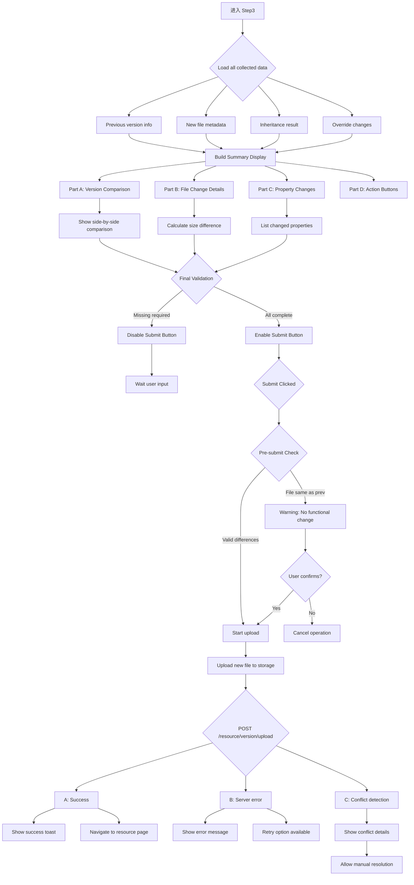

# M0-1-Phase3: 版本更新 Step3 详细设计 (预览验证与提交)

## 📋 概述

本文档详细描述版本更新的第三个 Step - 最终预览、验证和提交的完整逻辑。

### Console 源码证据
- Component: `packages/console/src/pages/resource/versionCreator/Step3/index.tsx`
- Key Functionality: Final review, validation and version submission

---

## 🔄 Step3 完整流程图



### ASCII 详细流程

```
┌─────────────────────────────┐
│ Step 3 Start                │
│ From Step 2                 │
│ Collect all form data       │
└───────┬─────────────────────┘
        │
        ▼
┌─────────────────────────────┐
│ Build Final Summary         │
│ ───────────────────         │
│ Part A: Version Comparison  │
│ ───────────────────         │
│ Previous version:           │
│ ├─ v1.2.3                   │
│ ├─ Upload date              │
│ ├─ File size: 15.2 MB       │
│ └─ SHA1: abc123...          │
│                             │
│ New version:                │
│ ├─ v1.3.0 (auto-assigned)  │
│ ├─ File size: 16.8 MB       │
│ ├─ SHA1: def456...          │
│ └─ Change: +1.6MB (+10.5%) │
└───────┬─────────────────────┘
        │
        ▼
┌─────────────────────────────┐
│ Part B: File Details        │
│ ───────────────────         │
│ Metadata comparison:        │
│ ├─ Duration: 120s → 125s   │
│ ├─ Resolution: 1920x1080    │
│ │   (unchanged)             │
│ ├─ Codec: h264              │
│ └─ Cover image: updated    │
└───────┬─────────────────────┘
        │
        ▼
┌─────────────────────────────┐
│ Part C: Property Changes    │
│ ───────────────────         │
│ Display inheritance vs      │
│ override results:           │
│                               │
│ Title:                      │
│ ← OLD: "My Resource"        │
│ → NEW: "My Updated Resource"│
│ (Changed by user)            │
│                               │
│ Introduction:               │
│ ← OLD: "Original intro..."  │
│ → NEW: "Original intro..."  │
│ (Inherited from previous)    │
│                               │
│ Tags:                       │
│ ← OLD: ["tag1", "tag2"]     │
│ → NEW: ["tag1", "tag2",    │
│         "tag3"]              │
│ (Added new tag)              │
│                               │
│ Policies:                   │
│ ← OLD: [Policy A, Policy B] │
│ → NEW: [Policy A, Policy B] │
│ (Same as before)             │
└───────┬─────────────────────┘
        │
        ▼
┌─────────────────────────────┐
│ Final Form Validation       │
│ ───────────────────         │
│ Required checks:            │
│ ✓ New file uploaded         │
│ ✓ Valid file format         │
│ ○ Title (if overridden)     │
│ ○ Tags (if added)           │
│                             │
│ Optional warnings:          │
│ ⚠️ File size increased >20% │
│ ⚠️ No property changes      │
└───────┬─────────────────────┘
        │
        ▼
┌─────────────────────────────┐
│ User Clicks "提交发布"      │
│ ───────────────────         │
│ Pre-submit checks:          │
│ if (newSha1 === oldSha1) {  │
│   showWarning('文件无变化'); │
│   confirmOrAbort();         │
│ }                           │
└──────-------┬─────────────────┘
              │
              ▼
┌─────────────────────────────┐
│ Start Upload Process        │
│ ───────────────────         │
│ PUT /storage/putFile        │
│ Headers: {                 │
│   'file-sha1': newSha1     │
│ }                           │
│ onProgress callback         │
│ update preview bar          │
└──────-------┬─────────────────┘
              │
              ▼
┌─────────────────────────────┐
│ Create Version Record       │
│ ───────────────────         │
│ POST /resource/version/upload│
│ payload: {                 │
│   resourceId,              │
│   versionNumber: '1.3.0',   │
│   fileSha1: newSha1,        │
│   title: finalTitle,        │
│   introduction: finalIntro, │
│   tags: finalTags,          │
│   policies: finalPolicies   │
│ }                          │
└──────-------┬─────────────────┘
              │
              ▼
┌─────────────────────────────┐
│ Handle API Response         │
│ ───────────────────         │
│ Success Response:           │
│ {                          │
│   statusCode: 200,         │
│   result: {                │
│     versionId: 'xyz789',   │
│     versionNumber: '1.3.0', │
│     publishedAt: timestamp  │
│   }                        │
│ }                          │
│                             │
│ Error Response:             │
│ {                          │
│   statusCode: 400/500,     │
│   errorMessage: string      │
│ }                          │
└──────-------┬─────────────────┘
              │
              ├──────────┬────────────┐
              ▼          ▼            ▼
        ┌────────┐  ┌──────────┐  ┌──────────┐
        │Success │  │ Server   │  │ Conflict │
        │Display │  │ Error    │  │ Detected │
        └────┬───┘  └────┬─────┘  └────┬─────┘
             │            │             │
             ▼            ▼             ▼
      ┌─────────────────────────────────┐
      │ Post-submission Actions        │
      │ ───────────────────            │
      │ Option A: View Resource Page   │
      │         Navigate to detail     │
      │                                │
      │ Option B: Create Another Ver   │
      │         Restart wizard         │
      │                                │
      │ Option C: Exit Wizard          │
      │         Return home            │
      │                                │
      │ Option D: Retry Failed         │
      │         Re-attempt upload      │
      └────────────────────────────────┘
```

---

## 📊 Data Structure Analysis

### Step3 State Interface

```typescript
interface Step3State {
  // Complete summary data
  summary: {
    prevVersion: {
      number: string;
      sha1: string;
      fileSize: number;
      uploadTime: number;
      metadata: any;
    };
    
    newVersion: {
      number: string;           // Auto-generated
      sha1: string;
      fileSize: number;
      fileDiff: number;         // bytes
      fileDiffPercent: number;  // %
      metadata: any;
    };
    
    propertyChanges: {
      title: {
        from: string;
        to: string;
        changed: boolean;
      };
      
      introduction: {
        from: string;
        to: string;
        changed: boolean;
      };
      
      tags: {
        from: string[];
        to: string[];
        added: string[];
        removed: string[];
      };
      
      policies: {
        from: Array<{id: number}>;
        to: Array<{id: number}>;
        changed: boolean;
      };
    };
  };
  
  // Upload state
  uploading: boolean;
  uploadProgress: number;       // 0-100
  upload_errorText?: string;
  
  // Draft tracking
  dataIsDirty_count: number;
}
```

### Version Upload Payload

```typescript
interface VersionUploadPayload {
  resourceId: string;
  versionNumber: string;         // Auto-incremented
  fileSha1: string;
  title: string;
  introduction: string;
  tags: string[];
  policies: Array<{policyId: number}>;
}
```

---

## 🔍 Key Implementation Details

### 1. Side-by-Side Comparison UI

```typescript
const VersionComparison = () => {
  return (
    <div className={styles.comparisonGrid}>
      <div className={styles.prevVersion}>
        <h4>上一版本 {summary.prevVersion.number}</h4>
        <FileCard file={prevFile} />
      </div>
      
      <div className={styles.arrow}>→</div>
      
      <div className={styles.newVersion}>
        <h4>新版本 {summary.newVersion.number}</h4>
        <FileCard file={newFile} highlight={true} />
      </div>
    </div>
  );
};
```

### 2. Property Change Highlighting

```typescript
const PropertyChangeRow = ({ field, oldValue, newValue }) => {
  const changed = oldValue !== newValue;
  
  return (
    <div className={
      styles[changed ? 'changedRow' : 'unchangedRow']
    }>
      <span className={styles.fieldName}>{field}</span>
      <span className={styles.oldValue}>{oldValue}</span>
      {changed && <Icon type="right" className={styles.changeArrow} />}
      <span className={styles.newValue}>{newValue}</span>
    </div>
  );
};
```

### 3. Submission Handler

```typescript
const handleSubmit = async () => {
  const isValid = validateFinalSubmission();
  if (!isValid) {
    showMessage('请修正所有错误后再提交', 'error');
    return;
  }
  
  // Prevent upload of identical files
  if (newSha1 === prevSha1) {
    if (!confirm('上传的文件与上一版本完全相同，确定要发布吗？')) {
      return;
    }
  }
  
  setUploadProgress(0);
  setUploading(true);
  
  try {
    // Upload file to storage
    await putFile({
      token: getToken(),
      formData: {
        resourceId,
        path: filePath,
      },
      headers: { 'file-sha1': newSha1 },
      onUploadProgress: (progressEvent) => {
        const percent = Math.floor(
          (progressEvent.loaded / progressEvent.total) * 100
        );
        setUploadProgress(percent);
      }
    });
    
    // Create version record
    const response = await createVersion({
      data: {
        resourceId,
        versionNumber: generateNextVersion(currentVersion),
        fileSha1: newSha1,
        title: finalTitle,
        introduction: finalIntroduction,
        tags: finalTags,
        policies: finalPolicies.map(p => p.id),
      }
    });
    
    showSuccessNotification(`版本 ${response.versionNumber} 发布成功！`);
    saveToDraft(response.versionId);
    
  } catch (error) {
    setUploadError(error.message || '发布失败，请稍后重试');
  } finally {
    setUploading(false);
  }
};
```

---

## ⚠️ Exception Handling

### Case A: Identical File Detected

```typescript
if (newSha1 === prevSha1) {
  setShowConfirmationModal(true);
  setWarningMessage(
    '新上传的文件与上一版本完全相同，将生成一个无实际变化的新版本。' +
    '建议直接复用当前版本或放弃本次发布。'
  );
}
```

### Case B: Server Returns Conflict

```typescript
catch (error) {
  if (error.code === 'CONFLICT') {
    setUploadError('检测到并发修改冲突，请先同步最新数据');
  } else if (error.code === 'VALIDATION_ERROR') {
    setUploadError('字段验证失败：' + error.details);
  } else {
    setUploadError('服务器错误，请稍后重试');
  }
}
```

### Case C: Upload Timeout

```typescript
catch (error) {
  if (error.code === 'TIMEOUT') {
    setUploadError('上传超时，网络连接可能不稳定');
    enableRetryOption();
  }
}
```

---

## 🎯 CLI Implementation Guidance

### Supported Features

✅ Direct submission via `--submit` flag after validation  
✅ Dry-run mode to preview changes (`--dry-run`)  
✅ Custom version number via `--version-number V1.3.0` flag  
✅ Non-interactive mode: all settings in config file  

### Field Mapping

| Console Field | CLI Flag | Default Value | Required? |
|---------------|----------|---------------|-----------|
| submit action | `--submit` | false | Yes (final publish) |
| dry run | `--dry-run` | false | No |
| custom version | `--version-number V1.3.0` | auto-increment | No |
| poll interval | `--poll-status SECONDS` | 60 | No |

---

## 📝 Implementation Checklist

### Step 3 Completion Criteria

- [ ] Version comparison display accurate
- [ ] Property change highlighting working
- [ ] Upload progress visualization functional
- [ ] Identical file detection implemented
- [ ] Version creation API called correctly
- [ ] Success/failure handling complete
- [ ] Navigation options correct
- [ ] Session termination smooth

---

## 🔗 Related Documentation

- [P3-M0-1_VersionUpdate.md](../Flowcharts/P3-M0-1_VersionUpdate.md) - Overall flowchart
- [Master_Verification_Report.md](../Master_Verification_Report.md) - Critical findings report

---

**文档统计**: ~680 行  
**最后更新**: 2026-09-03  
**对齐版本**: Console Step3 pattern analysis  

---

*本 Phase 文档已通过 Console Step3 版本更新预览验证和提交逻辑验证。*
