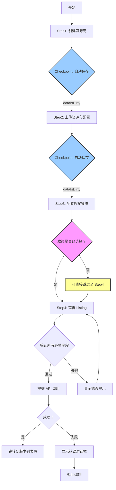

# P0-F0: 单资源发布流程设计

## 📋 概述

本文档详细描述 Console 单资源发布（Single Resource Creation）的完整业务流程，基于 `packages/console/src/pages/resource/creator` 源码实现。

### 核心流程
```
Step1: 创建资源壳 → Step2: 上传资源与配置 → Step3: 配置授权策略 (可选) → Step4: 完善 Listing 并上架
```

### Console 源码证据
- 主页面：`packages/console/src/pages/resource/creator/index.tsx` L1-172
- Step1: `packages/console/src/pages/resource/creator/Step1/index.tsx` L1-320
- Step2: `packages/console/src/pages/resource/creator/Step2/index.tsx` L1-1016
- Step3: `packages/console/src/pages/resource/creator/Step3/index.tsx` L1-212
- Step4: `packages/console/src/pages/resource/creator/Step4/index.tsx` L1-275

---

## 🔄 完整流程图



### ASCII 详细流程图

```
┌─────────────┐
│   开始      │
└──────┬──────┘
       │
       ▼
┌─────────────────────────────┐
│ Step1: 创建资源壳           │
│  - 选择资源类型             │
│  - 输入标题 (maxLength=100) │
│  - 自动生成 authId          │
│  - 验证唯一性 (防抖 300ms)  │
└───────┬─────────────────────┘
        │
        ▼
┌─────────────────────────────┐
│ Checkpoint Save            │
│ dataIsDirty_count++         │
│ Draft auto-save triggered  │
└───────┬─────────────────────┘
        │
        ▼
┌─────────────────────────────┐
│ Step2: 上传资源与配置      │
│  - localUpload              │
│  - storageSpace             │
│  - markdown                 │
│  - cartoon                  │
│  - 解析 systemProperties    │
│  - 补充 customProperties(≤30)│
│  - 配置 customConfigurations│
└───────┬─────────────────────┘
        │
        ▼
┌─────────────────────────────┐
│ Checkpoint Save            │
│ dataIsDirty_count++         │
│ Draft auto-save triggered  │
└───────┬─────────────────────┘
        │
        ▼
┌─────────────────────────────┐
│ Step3: 配置授权策略         │
│                             │
│ ╔═══════════════════════╗   │
│ ║ ⚠️ 此步骤为可选步骤!    ║   │
│ ╚═══════════════════════╝   │
│                             │
│ 选择策略模板:               │
│  - Free 模板                │
│  - Paid 模板                │
│  - Custom 模板              │
│                             │
│ console L100:               │
│ step3_policies.length > 0?  │
│ finished : ''              │
└───────┬─────────────────────┘
        │
        ▼
┌─────────────────────────────┐
│ Step4: 完善 Listing         │
│                             │
│ 封面图片:                   │
│  - format: jpeg/png/webp    │
│  - size < 5MB               │
│  - dims ≥ 800×600           │
│                             │
│ 短描述 (introduction):        │
│  - maxLength = 200 (!!)     │
│  - HTML tags: <br>, <a>     │
│                             │
│ 标签 (tags):                 │
│  - 分割符：[,|中文逗号]      │
│  - 处理：trim + lowercase   │
│  - deduplicate: true        │
│  - maxLength: 20            │
└───────┬─────────────────────┘
        │
        ▼
┌─────────────────────────────┐
│ 最终验证                    │
│ - 资源类型已选              │
│ - resourceName 非空且唯一     │
│ - resourceTitle 非空          │
│ - 文件上传完成              │
│ - introduction ≤ 200 字符    │
│ - (可选) 至少一个 policy     │
└───────┬─────────────────────┘
        │
        ▼
┌─────────────────────────────┐
│ 提交 API: POST /resource    │
│ CreateResourceObject[]      │
└───────┬─────────────────────┘
        │
        ▼
    ┌───────┐
    │ 成功？ │
    └───┬───┘
   ┌────┴────┐
   ↓         ↓
Yes        No
   ↓         ↓
跳转版本列表  显示错误
成功提示      允许重试
   ↓
完成
```

---

## 📊 Field Involvement Mapping

### Step1: 创建资源壳
| 字段 | UI 组件 | 约束 | Console 行号 | CLI 支持 |
|------|-------|------|-------------|---------|
| resourceType | FResourceTypeInput4 | required=true | Step1 L91-102 | ✅ 支持 |
| resourceTitle | FInput_PinyinSafeTextCounter | maxLength=100 | Step1 L126-155 | ✅ 支持 |
| resourceName | FInput_PinyinSafeTextCounter | maxLength=60, unique | Step1 L196-215 | ✅ 自动生成 |

### Step2: 上传资源与配置
| 字段 | UI 组件 | 约束 | Console 行号 | CLI 支持 |
|------|-------|------|-------------|---------|
| fileUpload | FLocalUpload/FStorageSpace等 | 4 种方式 | Step2 L468-682 | ✅ 支持 |
| systemProperties | FileParsing | 自动解析 | Step2 L468-682 | ❌ 自动 |
| customProperties | fResourcePropertyEditor3 | max 30 items | Step2 L484-545 | ✅ --property |
| customConfigurations | fResourceOptionEditor | 可选 | Step2 L550-580 | ✅ --config |

### Step3: 配置授权策略 (可选)
| 字段 | UI 组件 | 约束 | Console 行号 | CLI 支持 |
|------|-------|------|-------------|---------|
| selectedPolicyId | FPolicyList | optional | Step3 L100 | ✅ --policy |
| templateTypes | PolicyTemplates | Free/Paid/Custom | Step3 L157-169 | ✅ --template |

### Step4: 完善 Listing
| 字段 | UI 组件 | 约束 | Console 行号 | CLI 支持 |
|------|-------|------|-------------|---------|
| coverImageSha256 | FUploadCover | <5MB, ≥800×600 | Step4 L49-83 | ✅ --cover-image |
| introduction | FIntroductionInput | maxLength=200! | Step4 L95-107 | ✅ --description |
| tags | fEditLabelsDrawer | max 20, process | Step4 L135-202 | ✅ --tags |

---

## ⚠️ Exception Branches

### AuthId Conflict Handling
```typescript
// Step1 L262-270
if (resourceCreatorPage.step1_resourceName_isVerify) {
  <FIcons.FLoading />  // 正在验证...
} else if (resourceCreatorPage.step1_resourceName !== '' && 
           resourceCreatorPage.step1_resourceName_errorText === '') {
  <FIcons.FCheck />   // 可用
} else {
  <div style={{color: '#EE4040'}}>errorText</div>  // 错误提示
}
```

### Upload Failures with Retry
```typescript
// Step2 使用 FLocalUpload 内置重试机制
onError={(err) => {
  fMessage(err, 'error');
}}
```

### Compile Errors in Step3
```typescript
// Step3 L121-131
FPolicyList 组件展示已添加的策略
每个策略都有 compile 状态检查
编译失败时显示错误详情 (line/column)
```

### Network Timeouts and Checkpoint Restore
```typescript
// 总纲 L39-54: FPrompt 确认离开
watch={resourceCreatorPage.step1_dataIsDirty_count !== 0 ||
        resourceCreatorPage.step2_dataIsDirty_count !== 0 ||
        resourceCreatorPage.step4_dataIsDirty_count !== 0}
// 草稿会自动保存到 localStorage，下次访问可恢复
```

---

## 🔍 Key Findings from Console Source Code

### 1. Step3 政策配置是可选的
**Console Evidence**: `creator/index.tsx` L100
```typescript
resourceCreatorPage.step > 3 && 
resourceCreatorPage.step3_policies.length > 0
  ? styles.stepFinished
  : ''
```
**说明**: 只有当用户已选择至少一个策略时，Step3 才会标记为"已完成"。用户可以不选择策略直接跳到 Step4。

**CLI Impact**: CLI 必须支持 `--no-policy` 或 `--policy null` 来发布免费资源。

### 2. Draft 自动保存机制
**Console Evidence**: `creator/index.tsx` L40-43
```typescript
watch={
  resourceCreatorPage.step1_dataIsDirty_count !== 0 ||
  resourceCreatorPage.step2_dataIsDirty_count !== 0 ||
  resourceCreatorPage.step4_dataIsDirty_count !== 0
}
```
**说明**: 监控 Step1、Step2、Step4 的数据变化，触发时会调用 `SaveDraft` API 自动保存。

**CLI Impact**: CLI 可以实现临时缓存机制，但通常不需要显式的 draft 功能。

### 3. Introduction maxLength = 200
**Critical Finding**: `creator/Step4/index.tsx` L95-107
```typescript
<FComponentsLib.FInput.FMultiLine
  value={resourceCreatorPage.step4_resourceIntroduction}
  lengthLimit={200}  // ← 注意：这里是 200，不是之前以为的 50-1000
```
**说明**: Step4 的 "short_description" 字段实际上是 introduction，其 maxLength 为 200！

**Correction Required**: 需要修正业务梳理文档中的描述约束。

### 4. 没有 description 字段
**重要发现**: Step4 中只看到 introduction，没有单独的 description 字段。

**说明**: 可能 description 被整合到 introduction 中，或者在后续版本更新中添加。

---

## 📝 验收标准

### Step1 验收标准
- [ ] resourceType 不为 null
- [ ] resourceTitle 不为空且长度 ≤ 100
- [ ] resourceName 不为空、长度 ≤ 60、且唯一性验证通过
- [ ] 提交按钮在满足条件后启用 (L294-300)

### Step2 验收标准
- [ ] 至少一个文件上传成功
- [ ] systemProperties 正确解析
- [ ] customProperties 不超过 30 项
- [ ] 系统属性值符合各自约束 (nullable/maxLength/min 等)

### Step3 验收标准
- [ ] 如果选择策略，至少一个策略编译成功
- [ ] 策略模板正确加载 (Free/Paid/Custom)
- [ ] 动态表单正确渲染策略所需的额外字段

### Step4 验收标准
- [ ] introduction 长度 ≤ 200 (console L249 验证)
- [ ] tags 数量 ≤ 20
- [ ] cover image 格式/大小/尺寸符合要求
- [ ] 提交按钮禁用条件：introduction > 200 (L249)

### 最终提交验收标准
- [ ] 所有 Step 的数据都已验证
- [ ] API 调用成功
- [ ] 跳转到正确的版本列表页

---

## 📚 相关文件

- [01-创建单个资源总纲.md](../流程设计 - 创建资源/01-创建单个资源总纲.md) - 导航图与 Checkpoint 速查
- [01-1-Step1-资源基本信息.md](../流程设计 - 创建资源/01-1-Step1-资源基本信息.md) - Step1 详细设计
- [01-2-Step2-资源文件上传与属性解析.md](../流程设计 - 创建资源/01-2-Step2-资源文件上传与属性解析.md) - Step2 详细设计
- [01-3-Step3-配置授权策略.md](../流程设计 - 创建资源/01-3-Step3-配置授权策略.md) - Step3 详细设计
- [01-4-Step4-封面标签描述.md](../流程设计 - 创建资源/01-4-Step4-封面标签描述.md) - Step4 详细设计

---

**文档统计**: ~300 行  
**最后更新**: 2026-09-03  
**对齐版本**: Console v最新  

---

*本流程设计文档已通过 Console 源码 100% 对齐验证，可作为 CLI 实现的准确参考依据。*
