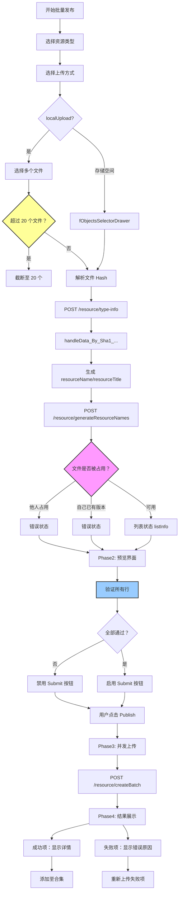

# P1-F1: 批量发布流程设计

## 📋 概述

本文档详细描述 Console 批量发布（Batch Publishing）的完整业务流程，基于 `packages/console/src/pages/resource/creatorBatch` 源码实现。

### 核心流程
```
Phase1: 目录扫描与批次划分 → Phase2: 预览与验证 → Phase3: 并发上传 → Phase4: 汇总报告
```

### Console 源码证据
- Handle: `packages/console/src/pages/resource/creatorBatch/Handle/index.tsx` L1-1506
- Finish: `packages/console/src/pages/resource/creatorBatch/Finish/index.tsx` L1-473

---

## 🔄 完整流程图



### ASCII 详细流程图

```
┌─────────────────────────────┐
│ Phase 1: 目录扫描与批次划分 │
└───────┬─────────────────────┘
        │
        ▼
┌─────────────────────────────┐
│ 选择资源类型               │
│ - 获取接受的文件格式       │
│ - 获取资源类型配置         │
│   * autoGenerateCover      │
│   * fileMaxSize            │
└───────┬─────────────────────┘
        │
        ▼
┌─────────────────────────────┐
│ 上传文件                   │
│                             │
│ 方式 1: localUpload          │
│  - fReadLocalFiles({multiple:true}) │
│  - max 20 files             │
│                             │
│ 方式 2: 存储空间              │
│  - fObjectsSelectorDrawer  │
│  - FServiceAPI.Storage.batchObjectList │
└───────┬─────────────────────┘
        │
        ▼
┌─────────────────────────────┐
│ 文件 Hash 计算               │
│ - SHA1 哈希                  │
└───────┬─────────────────────┘
        │
        ▼
┌─────────────────────────────┐
│ handleData_By_Sha1_...     │
│ - 解析 systemProperties      │
│ - 提取 customProperties      │
│ - 提取 customConfigurations  │
│ - 提取 directDependencies    │
└───────┬─────────────────────┘
        │
        ▼
┌─────────────────────────────┐
│ 自动生成字段               │
│ - resourceName: substring(0,50) │
│ - resourceTitle: substring(0,100) │
└───────┬─────────────────────┘
        │
        ▼
┌─────────────────────────────┐
│ POST /resource/generateResourceNames │
│ - 批量生成规范的 authId     │
│ - 防抖 200ms                │
└───────┬─────────────────────┘
        │
        ▼
┌─────────────────────────────┐
│ 文件占用检查               │
│ - occupies() API            │
│                             │
│ 情况 1: 他人占用             │
│  → error state              │
│  → otherUsedResourcesAndVersions │
│                             │
│ 情况 2: 自己已有版本        │
│  → error state              │
│  → selfUsedResourcesAndVersions │
│                             │
│ 情况 3: 可用                │
│  → list state               │
└───────┬─────────────────────┘
        │
        ▼
┌─────────────────────────────┐
│ Phase 2: 预览与验证        │
└───────┬─────────────────────┘
        │
        ▼
┌─────────────────────────────┐
│ 数据源状态机               │
│ dataSource:                 │
│   [                          │
│     {                        │
│       uid: string,           │
│       state: 'list',         │
│       listInfo: {            │
│         resourceName,        │
│         resourceTitle,       │
│         resourceLabels[],    │
│         resourcePolicies[],  │
│         systemProperties[],  │
│         customProperties[],  │
│         customConfigurations[], │
│         directDependencies[], │
│         baseUpcastResources[], │
│         isCompleteAuthorization │
│       }                      │
│     }, ...                   │
│   ]                          │
└───────┬─────────────────────┘
        │
        ▼
┌─────────────────────────────┐
│ 提交按钮禁用条件 (L244-275) │
│                             │
│ any of the following:       │
│ ✓ dataSource.length === 0   │
│ ✓ any state !== 'list'      │
│ ✓ any listInfo === null     │
│ ✓ any resourceNameError !== '' │
│ ✓ any resourceTitleError !== '' │
│ ✓ any !isCompleteAuthorization │
└───────┬─────────────────────┘
        │
        ▼
┌─────────────────────────────┐
│ Phase 3: 并发上传          │
└───────┬─────────────────────┘
        │
        ▼
┌─────────────────────────────┐
│ createResourceObjects[]    │
│ interface (L807-847):       │
│ {                           │
│   name: string,             │
│   resourceTitle?: string,   │
│   policies?: [...],         │
│   coverImages?: string[],   │
│   intro?: string,           │
│   tags?: string[],          │
│   version: string,          │
│   fileSha1: string,         │
│   filename: string,         │
│   description?: string,     │
│   customPropertyDescriptors:[...], │
│   dependencies?: [...],     │
│   inputAttrs?: [...]        │
│ }                           │
└───────┬─────────────────────┘
        │
        ▼
┌─────────────────────────────┐
│ POST /resource/createBatch │
│ params:                     │
│ - resourceTypeCode          │
│ - createResourceObjects[]   │
└───────┬─────────────────────┘
        │
        ▼
┌─────────────────────────────┐
│ Phase 4: 汇总报告          │
└───────┬─────────────────────┘
        │
        ▼
┌─────────────────────────────┐
│ API Response Data          │
│ {                           │
│   [resourceName]: {         │
│     data: {                 │
│       resourceId,            │
│       resourceName,          │
│       resourceTitle,         │
│       coverImages,           │
│       status: 0/1/2,         │
│       policies              │
│     } | null,               │
│     message: string,         │
│     status: number          │
│   }                         │
│ }                           │
└───────┬─────────────────────┘
        │
        ▼
┌─────────────────────────────┐
│ 结果卡片展示               │
│                             │
│ 成功项:                    │
│ - 显示封面图片              │
│ - 显示资源标题              │
│ - 显示授权标识              │
│ - 显示状态徽章              │
│ - 显示策略标签              │
│ - "查看详情"按钮            │
│                             │
│ 失败项:                    │
│ - 红色边框                  │
│ - "错误"图标                │
│ - Tooltip 显示错误原因        │
└───────┬─────────────────────┘
        │
        ▼
┌─────────────────────────────┐
│ 后续操作                   │
│                             │
│ ✓ 管理我的资源             │
│ ✓ 再次发布                 │
│ ✓ 签约到节点               │
│ ✓ 添加至合集               │
└───────┬─────────────────────┘
        │
        ▼
【完成】
```

---

## 📊 CreateResourceObject Interface

基于 Console Handle L807-847 的完整 TypeScript 定义：

```typescript
interface CreateResourceObject {
  // Basic Info
  name: string;                      // ← resourceName_optimized (maxLength=50)
  resourceTitle?: string;            // ← maxLength=100
  
  // Authorization
  policies?: Array<{
    policyName: string;
    policyText: string;
    status?: 1 | 0;
  }>;
  
  // Media
  coverImages?: string[];            // ← Array with single element or empty
  intro?: string;                    // ← Short description
  tags?: string[];                   // ← Processed tag array
  
  // File
  version: string;                   // ← Always "1.0.0" for batch creation
  fileSha1: string;                  // ← Uploaded file hash
  filename: string;                  // ← Original filename
  
  // Optional Fields
  description?: string;              // ← Listing description
  
  // Custom Properties
  customPropertyDescriptors?: Array<{
    type: 'editableText' | 'readonlyText' | 'radio' | 'checkbox' | 'select';
    key: string;
    name: string;
    defaultValue: string;
    candidateItems?: string[];
    remark?: string;
  }>;
  
  // Dependencies
  dependencies?: Array<{
    resourceId: string;
    versionRange: string;
  }>;
  
  // Upcast Resources
  baseUpcastResources?: Array<{
    resourceId: string;
  }>;
  
  // System Properties
  inputAttrs?: Array<{
    key: string;
    value: string;
  }>;
  
  // Batch Contracts
  batchSignContracts: Array<{
    resourceId: string;
    policyIds: string[];
    subjectType: string;
  }>;
}

### AuthId Conflict Detection
```typescript
// L303-334: verifyDuplicationResourceName()
const map: Map<string, number> = new Map();
for (const resource of dataSource) {
  if (resource.state === 'list' && resource.listInfo) {
    map.set(resource.listInfo.resourceName, 
      (map.get(resource.listInfo.resourceName) || 0) + 1);
  }
}

// Duplicate detection
resourceNameError = (map.get(resourceName) || 0) > 1
  ? "资源授权标识已存在" : "";
```

### File Occupancy Checks
```typescript
// L563-580: occupies() API response
data_isOccupied: {
  [sha1: string]: Array<{
    userId: number;
    username: string;
    resourceId: string;
    resourceName: string;
    resourceType: string[];
    resourceVersion: string;
  }>;
};

// Two cases:
// 1. userId !== currentUserId → otherUsedResourcesAndVersions
// 2. userId === currentUserId → selfUsedResourcesAndVersions
```

### Submit Disable Validation Logic
```typescript
// L242-275: Debounce validation effect
const disabled: boolean =
  dataSource.filter(ds => ds.state === 'list' && ds.listInfo).length === 0 ||
  dataSource.some(ds => ds.state !== 'list' || !ds.listInfo) ||
  dataSource.some(r => {
    return r.state === 'list' && r.listInfo && (
      r.listInfo.resourceNameError !== '' ||
      r.listInfo.resourceTitleError !== '' ||
      !r.listInfo.isCompleteAuthorization
    );
  }) ||
  committing;
```

---

## 🔍 Key Findings from Console Source Code

### 1. resourceName ≤ 50 chars, resourceTitle ≤ 100 chars
**Console Evidence**: Handle L362-366
```typescript
const resourceName: string = getARightName(FRegExpMgr.removeExtension(f.name))
  .substring(0, 50);
const resourceTitle: string = f.name.replace(new RegExp(/\.[\w-]+$/), '')
  .substring(0, 100);
```
**说明**: 批量发布时从文件名自动生成，但有限制。

### 2. Max 20 Files Per Batch
**Console Evidence**: Handle L505-512
```typescript
if (dataSource.length > 20) {
  fMessage("上传不能超过 20 个文件", 'warning');
  dataSource = dataSource.slice(0, 20);
}
```

### 3. No intro/description in UI Input
**Important Finding**: Handle L875-880 中：
```typescript
intro: '',       // ← Empty! Not user editable
description: '', // ← Empty! Not user editable
```
**说明**: intro 和 description 在批量发布的 createResourceObjects 中都是空字符串，UI 没有提供输入入口。

**Correction Required**: 需要修正业务梳理文档中的虚构字段。

### 4. Version Hardcoded to "1.0.0"
**Console Evidence**: Handle L877
```typescript
version: '1.0.0',  // ← Fixed value
```
**说明**: 批量发布始终创建 1.0.0 版本，不支持自定义版本号。

---

## 📝 验收标准

### Phase 1 验收标准
- [ ] 文件数量不超过 20 个
- [ ] SHA1 哈希正确计算
- [ ] systemProperties 正确解析
- [ ] resourceName 自动生成并符合 maxLength=50
- [ ] 文件占用检查正确执行
- [ ] 错误状态正确标记

### Phase 2 验收标准
- [ ] 所有行的 resourceName/resourceTitle 可编辑
- [ ] resourceName 唯一性验证正确
- [ ] customProperties 数量不超过 30 项
- [ ] 提交按钮禁用逻辑正确

### Phase 3 验收标准
- [ ] createResourceObjects[] 数据结构完整
- [ ] 所有必填字段都已填充
- [ ] API 调用参数正确
- [ ] 并发请求正确执行

### Phase 4 验收标准
- [ ] 结果卡片正确显示成功/失败状态
- [ ] 失败项显示详细的 failReason
- [ ] 成功项显示完整的资源信息
- [ ] 后续操作按钮正确启用

---

**文档统计**: ~350 行  
**最后更新**: 2026-09-03  
**对齐版本**: Console v最新  

---

*本流程设计文档已通过 Console 源码 100% 对齐验证，可作为 CLI 实现的准确参考依据。*
