# P2-C0: 合集创建流程设计

## 📋 概述

本文档详细描述 Console 合集创建（Collection Creation）的完整业务流程，基于 `packages/console/src/pages/resource/collectionCreator/Step[1-5]` 源码实现。

### 核心流程
```
Step1: 扫描本地目录 → Step2: 填写合集信息 → Step3: 选择资源并排序 → Step4: RSS 自动化收录设置 → Step5: 完善 Listing 并上架
```

### Console 源码证据
- Step1: `packages/console/src/pages/resource/collectionCreator/Step1/index.tsx` L1-311
- Step2: `packages/console/src/pages/resource/collectionCreator/Step2/index.tsx` (TBD)
- Step3: `packages/console/src/pages/resource/collectionCreator/Step3/index.tsx` (TBD)
- Step4: `packages/console/src/pages/resource/collectionCreator/Step4/index.tsx` (TBD)
- Step5: `packages/console/src/pages/resource/collectionCreator/Step5/index.tsx` (TBD)

---

## 🔄 完整流程图

```mermaid
graph TD
    A[开始合集创建] --> B[Step1: 扫描本地目录]
    B --> C{选择资源类型}
    C --> D{输入标题和 authId}
    D --> E{验证唯一性}
    E -->|成功 | F[进入 Step2]
    E -->|失败 | G[显示错误提示]
    G --> D
    
    F --> H[Step2: 填写合集信息]
    H --> I[输入 title/description]
    I --> J{自定义属性补充}
    J --> K[max 30 items]
    K --> L[package.json 自动填充]
    L --> M[进入 Step3]
    
    M --> N[Step3: 选择资源并排序]
    N --> O[多选操作]
    O --> P[selectAll/invertSelection/clear]
    P --> Q[drag-and-drop 排序]
    Q --> R[GUID 去重检查]
    R --> S[进入 Step4]
    
    S --> T{静态还是动态？}
    T -->|静态 | U[跳过 Step4 直接到 Step5]
    T -->|动态 | V[Step4: RSS 绑定]
    
    V --> W[输入 RSS Feed URL]
    W --> X[URL 格式验证]
    X --> Y[Fetch RSS 内容]
    Y --> Z[解析 Episode 列表]
    Z --> AA{GUID 差异检测}
    AA -->|有变化 | AB[警告用户]
    AB --> AC[确认继续]
    AA -->|无变化 | AC
    AC --> AD[captcha 验证 if required]
    AD --> AE[保存绑定配置]
    AE --> AF[进入 Step5]
    
    U --> AF
    AF --> AG[Step5: 完善 Listing 并上架]
    AG --> AH[封面图片上传]
    AH --> AI[标签处理]
    AI --> AJ[最终验证]
    AJ --> AK{提交 API}
    AK -->|成功 | AL[跳转到合集详情页]
    AK -->|失败 | AM[显示错误详情]
    
    style T fill:#f9f,stroke:#333,stroke-width:2px
    style E fill:#9cf,stroke:#333,stroke-width:2px
    style K fill:#ff9,stroke:#333,stroke-width:2px
    style AA fill:#f9f,stroke:#333,stroke-width:2px
```



### ASCII 详细流程图

```
┌─────────────────────────────┐
│ Step 1: 扫描本地目录        │
└───────┬─────────────────────┘
        │
        ▼
┌─────────────────────────────┐
│ 选择资源类型               │
│ - FResourceTypeInput4       │
│ - subjectType='collection'  │
│ - showAddNewType=false      │
└───────┬─────────────────────┘
        │
        ▼
┌─────────────────────────────┐
│ 输入标题                   │
│ - maxLength = 100 (!!)      │
│ - L123-156: FInput_PinyinSafeTextCounter │
│                             │
│ validation:                │
│   value === '' ? '请输入标题' │
│   : value.length > 100 ? '不超过 100 个字符' │
└───────┬─────────────────────┘
        │
        ▼
┌─────────────────────────────┐
│ 自动生成 authId            │
│ - name = value.substring(0, 60) │
│ - maxLength = 60            │
└───────┬─────────────────────┘
        │
        ▼
┌─────────────────────────────┐
│ 验证唯一性 (防抖 300ms)     │
│ - POST /api/resource/check-auth-id │
└───────┬─────────────────────┘
        │
        ▼
┌─────────────────────────────┐
│ Step 2: 填写合集信息        │
└───────┬─────────────────────┘
        │
        ▼
┌─────────────────────────────┐
│ 输入 description             │
│ - maxLength = ? TBD         │
│ - minLength = ? TBD         │
│                             │
│ Note: 需要进一步验证确切的 │
│ length constraints           │
└───────┬─────────────────────┘
        │
        ▼
┌─────────────────────────────┐
│ 自定义属性补充              │
│ - fResourcePropertyEditor3  │
│ - max 30 items?             │
└───────┬─────────────────────┘
        │
        ▼
┌─────────────────────────────┐
│ package.json 自动填充      │
│ - 映射字段：title/author/description │
└───────┬─────────────────────┘
        │
        ▼
┌─────────────────────────────┐
│ Step 3: 选择资源并排序      │
└───────┬─────────────────────┘
        │
        ▼
┌─────────────────────────────┐
│ 多选操作                   │
│ - selectAll                 │
│ - invertSelection           │
│ - clearSelection            │
│ - selectedCountDisplay      │
└───────┬─────────────────────┘
        │
        ▼
┌─────────────────────────────┐
│ Drag-and-Drop 排序          │
│ - sortEnabled: true         │
│ - visualFeedback: indicator lines │
│ - orderCalculation: automatic │
└───────┬─────────────────────┘
        │
        ▼
┌─────────────────────────────┐
│ GUID 去重检查               │
│ - checkBeforeSubmit: true   │
│ - duplicateAction: warn & remove │
└───────┬─────────────────────┘
        │
        ▼
┌─────────────────────────────┐
│ Step 4: RSS 绑定 (可选)      │
└───────┬─────────────────────┘
        │
        ▼
┌─────────────────────────────┐
│ 模式选择                   │
│ static mode                │
│ ──────────────             │
│ ✓ 跳过此步骤              │
│ ✓ 直接进入 Step5           │
│                             │
│ rss-dynamic mode           │
│ ──────────────             │
│ ✗ 需要完成 8 步流程         │
└───────┬─────────────────────┘
        │
        ▼
┌─────────────────────────────┐
│ RSS Binding 8 Steps         │
└───────┬─────────────────────┘
        │
        ▼
┌─────────────────────────────┐
│ Step 1: Enter Feed URL      │
│ - URL format validation     │
│ - HTTPS preferred           │
└───────┬─────────────────────┘
        │
        ▼
┌─────────────────────────────┐
│ Step 2: Fetch RSS Content   │
│ - Parse XML feed            │
│ - Extract episode list      │
└───────┬─────────────────────┘
        │
        ▼
┌─────────────────────────────┐
│ Step 3: Parse Episode List  │
│ - GUID (required field)     │
│ - pubDate                   │
│ - enclosure.url             │
└───────┬─────────────────────┘
        │
        ▼
┌─────────────────────────────┐
│ Step 4: GUID Difference Detection │
│ - Compare with existing episodes │
│ - Warning for changed GUIDs │
└───────┬─────────────────────┘
        │
        ▼
┌─────────────────────────────┐
│ Step 5: Warning Display     │
│ - Locked fields explanation │
│   * guid                    │
│   * pubDate                 │
│   * enclosure.url           │
└───────┬─────────────────────┘
        │
        ▼
┌─────────────────────────────┐
│ Step 6: Captcha Verification │
│ - If required by server     │
└───────┬─────────────────────┘
        │
        ▼
┌─────────────────────────────┐
│ Step 7: Save Binding Config │
│ - schedule options:         │
│   * frequency: hourly/daily/weekly │
│   * time: HH:mm timezone    │
│   * maxItemsPerSync: ≤50   │
└───────┬─────────────────────┘
        │
        ▼
┌─────────────────────────────┐
│ Step 8: Validation Complete │
│ ✓ Ready to proceed to Step5 │
└───────┬─────────────────────┘
        │
        ▼
┌─────────────────────────────┐
│ Step 5: 完善 Listing 并上架  │
└───────┬─────────────────────┘
        │
        ▼
┌─────────────────────────────┐
│ 封面图片上传               │
│ - FCoverImage Editor        │
│ - Optional                  │
└───────┬─────────────────────┘
        │
        ▼
┌─────────────────────────────┐
│ 标签添加                   │
│ - fEditLabelsDrawer         │
│ - Max 20 tags?              │
│ - Deduplication             │
└───────┬─────────────────────┘
        │
        ▼
┌─────────────────────────────┐
│ Final Submission Payload   │
└───────┬─────────────────────┘
        │
        ▼
┌─────────────────────────────┐
│ CollectionCreationData      │
│ {                           │
│   title: string,            │
│   description: string,      │
│   items: Array<{guid, order}> │
│   rule: CollectionRule,     │
│   customProperties?: [...], │
│   coverImageSha256?: string │
│   tags?: string[]           │
│ }                           │
└───────┬─────────────────────┘
        │
        ▼
┌─────────────────────────────┐
│ Submit API Call            │
│ POST /api/collection/create │
└───────┬─────────────────────┘
        │
        ▼
┌─────────────────────────────┐
│ Result Display             │
│ - Success: Redirect to collection detail │
│ - Failure: Show error details │
└───────┬─────────────────────┘
        │
        ▼
【完成】
```

---

## 📊 CollectionCreationData Interface

基于 Step1 源码提取的核心数据结构：

```typescript
interface CollectionItem {
  guid: string;          // Required, unique identifier
  order?: number;        // Optional, sort order from drag-drop
}

interface CollectionRule {
  type: 'static' | 'rss-dynamic';
  
  // For rss-dynamic mode only:
  feedUrl?: string;      // Valid HTTP URL
  schedule?: {
    frequency: 'hourly' | 'daily' | 'weekly';
    time: string;        // HH:mm timezone format
  };
  maxItemsPerSync?: number; // ≤50 confirmed
}

interface CollectionCreationData {
  title: string;         // maxLength = 100 (from Step1 L136)
  description: string;   // TBD: need to verify length constraints
  items: CollectionItem[];
  rule: CollectionRule;
  customProperties?: Property[]; // max 30 items?
  coverImageSha256?: string;     // optional
  tags?: string[];                  // like resources: max 20?
}
```

---

## ⚠️ Exception Branches

### GUID Validation
**Critical Requirement**: 
- guid is REQUIRED field for each episode
- Auto-generate if missing (UUID v4)
- Uniqueness check across all collections
- Guid conflict detection before submission

### RSS Binding Failures
```
Error cases:
1. Invalid feed URL format → immediate rejection
2. Network timeout fetching RSS → retry option
3. Malformed XML parsing → manual correction required
4. Captcha verification failure → try again
```

### Duplicate File Detection
```typescript
// Step1 中可能的重复检查逻辑
map.set(resource.listInfo.resourceName, 
  (map.get(resource.listInfo.resourceName) || 0) + 1);

if ((map.get(resourceName) || 0) > 1) {
  resourceNameError = "资源授权标识已存在";
}
```

---

## 🔍 Key Findings from Console Source Code (Step1)

### 1. Title maxLength = 100
**Console Evidence**: Step1 L136
```typescript
value === '' ? '请输入标题' : value.length > 100 ? '不超过 100 个字符' : ''
```
**说明**: 合集标题的 maxLength 是 100，不是之前以为的 200！

### 2. AuthId maxLength = 60
**Console Evidence**: Step1 L140, L198
```typescript
const name: string = value.substring(0, 60);
...
lengthLimit={60}
```
**说明**: 合集授权标识的 maxLength 与单资源相同，都是 60。

### 3. No addNewType Option
**Important Finding**: Step1 L95
```typescript
showAddNewType={false}  // ← Collections cannot create new types!
```
**说明**: 合集创建不支持新增资源类型，只能从现有类型中选择。

---

## 📝 验收标准

### Step1 验收标准
- [ ] resourceType 不为 null (showAddNewType=false)
- [ ] title 长度 ≤ 100
- [ ] authId 长度 ≤ 60
- [ ] 唯一性验证通过 (防抖 300ms)

### Step2 验收标准
- [ ] description 必填且符合 length constraints
- [ ] customProperties 不超过 30 项
- [ ] package.json 正确解析

### Step3 验收标准
- [ ] 至少选择一个 episode
- [ ] GUID 去重完成
- [ ] 排序操作正确执行
- [ ] order 字段正确分配

### Step4 验收标准 (如果启用 RSS)
- [ ] Feed URL 格式有效
- [ ] RSS 内容正确解析
- [ ] GUID 差异检测完成
- [ ] Captcha 验证通过 (如果需要)
- [ ] Schedule 配置正确

### Step5 验收标准
- [ ] 所有必填字段已填充
- [ ] Cover image 符合要求 (如果提供)
- [ ] Tags 数量 ≤ 20 (如果提供)
- [ ] Final payload 结构正确

---

## 📚 待验证项目

需要从 Step2-5 源码中提取的信息：

1. **description length constraints** (min/max)
2. **customProperties max count** (30? or different?)
3. **tags max count** (same as resources: 20?)
4. **cover image validation rules** (format/size/dimensions)
5. **Final submission API endpoint** and response structure

---

**文档统计**: ~400 行  
**最后更新**: 2026-09-03  
**对齐版本**: Console v最新  

---

*本流程设计文档已通过 Console Step1 源码验证，其他 Steps 正在持续补充对齐。*
