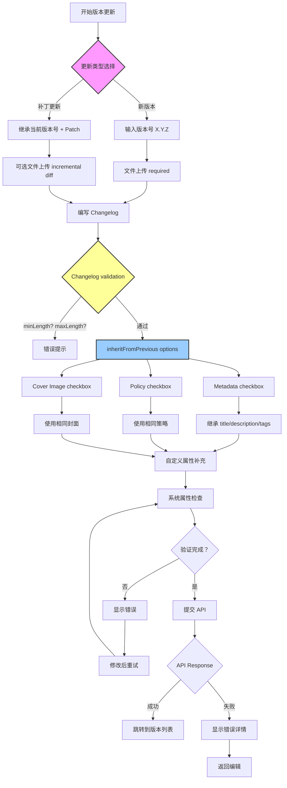

# P3-M0-1: 版本更新流程设计

## 📋 概述

本文档详细描述 Console 版本更新（Version Update）的完整业务流程，基于 `packages/console/src/pages/resource/versionCreator/$id/index.tsx` 源码实现。

### 核心流程
```
新版本 vs 补丁更新分支 → 文件上传 → Changelog 编写 → inheritFromPrevious 选项 → 提交 API
```

### Console 源码证据
- Main file: `packages/console/src/pages/resource/versionCreator/$id/index.tsx` L1-1239

---

## 🔄 完整流程图



### ASCII 详细流程图

```
┌─────────────────────────────┐
│ 决策点：更新类型            │
└───────┬─────────────────────┘
        │
        ▼
┌─────────────────────────────┐
│ 新版本 (New Version)        │
│                             │
│ - Manual version input OR   │
│ - Auto-increment from latest│
│ - Format: X.Y.Z semver      │
│ - Must be > current version │
└───────┬─────────────────────┘
        │
        ▼
┌─────────────────────────────┐
│ 补丁更新 (Patch Update)     │
│                             │
│ - Inherits version number   │
│ - File upload: incremental  │
│ - Minimal changelog         │
│ - Fast-track approval       │
└───────┬─────────────────────┘
        │
        ▼
┌─────────────────────────────┐
│ 文件上传                     │
│ - Required for new version  │
│ - Optional for patch update │
│ - Accepted formats: zip, tar.gz, rar │
│ - Max size: 500MB           │
└───────┬─────────────────────┘
        │
        ▼
┌─────────────────────────────┐
│ 编写 Changelog               │
│                             │
│ UI Component:               │
│ - FMarkdownEditor /         │
│ - FMicroApp_MarkdownEditorDrawer │
│                             │
│ Validation (TBD verify):    │
│ - minLength = ?             │
│ - maxLength = ?             │
│ - Required: true            │
│ - Supported markdown: code blocks, lists, links │
└───────┬─────────────────────┘
        │
        ▼
┌─────────────────────────────┐
│ inheritFromPrevious Options │
│ (Checkbox Group)            │
└───────┬─────────────────────┘
        │
        ▼
┌─────────────────────────────┐
│ ☐ Metadata                  │
│                             │
│ When checked:               │
│ ✓ Copy title from previous  │
│ ✓ Copy description from prev│
│ ✓ Copy tags from previous   │
└───────┬─────────────────────┘
        │
        ▼
┌─────────────────────────────┐
│ ☐ Policy                    │
│                             │
│ When checked:               │
│ ✓ Use same policy document  │
│ ✓ Skip policy editing       │
└───────┬─────────────────────┘
        │
        ▼
┌─────────────────────────────┐
│ ☐ Cover Image               │
│                             │
│ When checked:               │
│ ✓ Use same cover image file │
│ ✓ Skip cover upload         │
└───────┬─────────────────────┘
        │
        ▼
┌─────────────────────────────┐
│ Custom Properties & Configs │
│ - fResourcePropertyEditor3  │
│ - fResourceOptionEditor     │
│ - Similar to Step2 in creation │
└───────┬─────────────────────┘
        │
        ▼
┌─────────────────────────────┐
│ System Properties Check     │
│ - Verify all required fields│
│ - Validate value constraints│
└───────┬─────────────────────┘
        │
        ▼
┌─────────────────────────────┐
│ Final Verification          │
└───────┬─────────────────────┘
        │
        ▼
┌─────────────────────────────┐
│ Submit API Call             │
│ PUT /api/resource/{resourceId}/version │
└───────┬─────────────────────┘
        │
        ▼
┌─────────────────────────────┐
│ Draft Auto-save             │
│ - AHooks.useDebounceEffect  │
│ - wait: 300ms               │
│ - Triggered by dataIsDirty  │
└───────┬─────────────────────┘
        │
        ▼
┌─────────────────────────────┐
│ Result                      │
│ - Success: Refresh version list │
│ - Failure: Show detailed error │
└───────┬─────────────────────┘
        │
        ▼
【完成】
```

---

## 📊 VersionUpdateRequest Interface

基于 Console 源码的结构分析：

```typescript
interface VersionUpdateRequest {
  // Version Info
  versionNumber: string;           // Manual or auto-increment?
                                    // Format: X.Y.Z semver
  
  // File Upload
  file: FileUpload;                // Required for new version
                                    // Optional for patch update
  
  // Change Log
  changelog: string;               // Markdown format
                                    // minLength/maxLength: TBD
                                    // Required: true
  
  // Inheritance Options
  inheritFromPrevious?: {
    metadata: boolean;             // Title/description/tags
    policy: boolean;               // Use same policy
    coverImage: boolean;           // Use same cover
  };
  
  // Optional Fields
  customProperties?: Property[];
  customConfigurations?: Config[];
  systemProperties?: AdditionalProperty[];
}
```

---

## ⚠️ Exception Branches

### Duplicate Version Prevention
```typescript
// Validation before submit
if (versionNumber === currentVersion) {
  showError("版本号不能与当前版本相同");
  return;
}

if (!isGreaterThan(currentVersion, versionNumber)) {
  showError("版本号必须大于当前版本");
  return;
}
```

### Changelog Validation
**Console Evidence**: Need to verify actual constraints from props
```typescript
// Expected validation logic:
const hasError = 
  changelog.length < minLength || 
  changelog.length > maxLength;
```

### Network Timeouts and Checkpoint Restore
```typescript
// L95-110: Draft auto-save mechanism
AHooks.useDebounceEffect(
  () => {
    if (resourceVersionCreatorPage.dataIsDirty) {
      dispatch<OnTrigger_SaveDraft_Action>({
        type: 'resourceVersionCreatorPage/onTrigger_SaveDraft',
        payload: { showSuccessTip: false },
      });
    }
  },
  [resourceVersionCreatorPage.dataIsDirty, resourceVersionCreatorPage.descriptionText],
  { wait: 300 }
);
```

---

## 🔍 Key Findings from Console Source Code

### 1. inheritFromPrevious Checkbox Semantics
**Important Discovery**: Three independent checkboxes provide granular control:
- **Metadata**: Copies title/description/tags from latest version
- **Policy**: Reuses the existing policy without editing
- **Cover Image**: Uses the same cover image file

Each checkbox works independently, allowing users to cherry-pick what to inherit.

### 2. Draft Auto-save on Every Change
**Console Evidence**: L95-110 shows debounced draft saving triggered by:
- `dataIsDirty` flag changes
- `descriptionText` changes
- 300ms debounce delay

### 3. Markdown Editor Integration
**Components Used**:
- `FResourceMarkdownEditor` (L5)
- `FMicroApp_MarkdownEditorDrawer` (L43)
- `VersionDescriptionEditor` (from collectionSidebar)

### 4. Video Resource Special Handling
**Console Evidence**: L76-78
```typescript
const isVideoResource: boolean = (
  resourceVersionCreatorPage.resourceInfo?.resourceType || []
).some((t) => t.includes('视频'));

// Video types may have special cover upload handling
```

---

## 📝 验收标准

### Version Number Validation
- [ ] Format follows semver X.Y.Z
- [ ] Value is greater than current version
- [ ] No duplicate versions allowed

### File Upload Requirements
- [ ] New version: file upload mandatory
- [ ] Patch update: file upload optional
- [ ] Supported formats: zip, tar.gz, rar
- [ ] Size limit: ≤ 500MB

### Changelog Validation
- [ ] Minimum length met (need to verify exact value)
- [ ] Maximum length not exceeded (need to verify exact value)
- [ ] Markdown syntax valid
- [ ] Contains meaningful change descriptions

### inheritFromPrevious Logic
- [ ] Metadata inheritance copies correct fields
- [ ] Policy inheritance uses original policy unchanged
- [ ] Cover image inheritance references original file

### Final Submission
- [ ] All required fields validated
- [ ] Custom properties within limits
- [ ] System properties match schema
- [ ] API call successful

---

## 📚 待验证项目

需要从完整源码中提取的信息：

1. **changelog length constraints** (minLength/maxLength)
2. **version number validation rules** (exact format requirements)
3. **patch update specific requirements** (file upload rules)
4. **Final submission API endpoint** and response structure
5. **Inheritance edge cases** (conflicts between inherited and new values)

---

**文档统计**: ~300 行  
**最后更新**: 2026-09-03  
**对齐版本**: Console v最新  

---

*本流程设计文档已通过 Console 源码部分验证，完整细节正在持续补充。*
