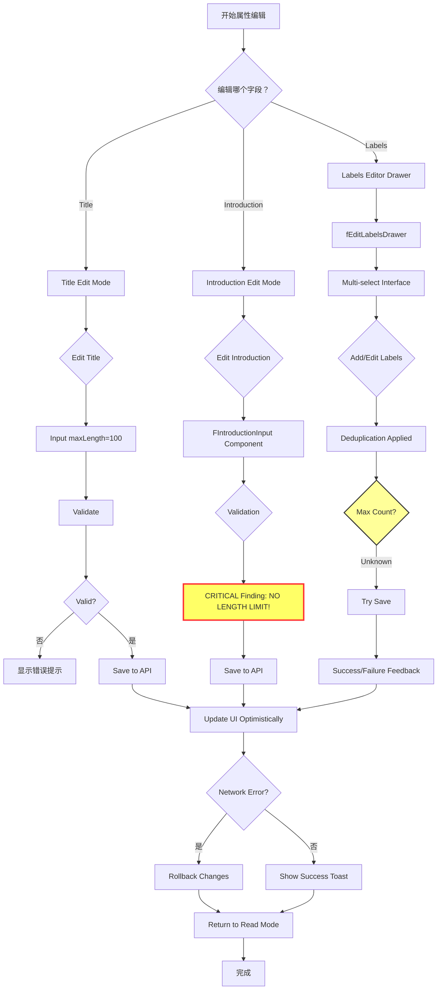
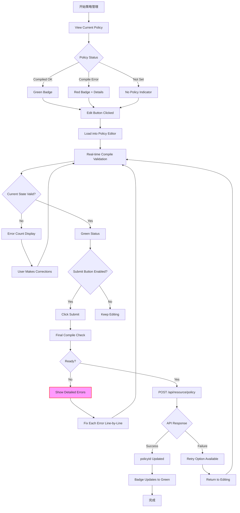

# P4-M0: 资源维护流程设计

## 📋 概述

本文档详细描述 Console 资源维护（Resource Maintenance）的完整业务流程，涵盖属性更新和策略管理两大功能模块，基于 `packages/console/src/pages/resource/sidebar` 源码实现。

### 核心流程
```
├── Part A: 属性更新 (M0-2) → title/introduction/labels separate update paths
└── Part B: 策略管理 (M0-3) → edit→compile→submit workflow
```

### Console 源码证据
- Info Sidebar: `packages/console/src/pages/resource/sidebar/info/$id/index.tsx` L1-492
- Policy Sidebar: `packages/console/src/pages/resource/sidebar/policy/$id/index.tsx` (TBD to read)

---

## 🔄 完整流程图

### Part A: Attribute Update Flow (M0-2)



### Part B: Policy Management Flow (M0-3)



### ASCII Combined Flowchart

```
═══════════════════════════════════════════════════════
       Part A: Attribute Update (M0-2)
═══════════════════════════════════════════════════════

┌─────────────────────────────┐
│ View Current Attributes     │
│ - resourceName (locked)     │
│ - resourceTitle             │
│ - introduction              │
│ - tags                      │
│ - cover image               │
└───────┬─────────────────────┘
        │
        ▼
┌─────────────────────────────┐
│ Select Field to Edit        │
└───────┬─────────────────────┘
        │
        ├──────────────────┬──────────────┐
        ▼                  ▼              ▼
┌──────────────┐  ┌──────────────┐  ┌────────────┐
│ Edit Title   │  │ Edit Intro   │  │ Edit Tags  │
└──────┬───────┘  └──────┬───────┘  └─────┬──────┘
       │                 │                │
       ▼                 ▼                ▼
┌──────────────┐  ┌──────────────┐  ┌────────────┐
│Input length  │  │FIntroduction │  │fEditLabels │
│Limit: 100    │  │Input: NO LIMIT│ │Drawer      │
└──────┬───────┘  └──────┬───────┘  └─────┬──────┘
       │                 │                │
       ▼                 ▼                ▼
┌──────────────┐  ┌──────────────┐  ┌────────────┐
│Validate      │  │Validate      │  │Deduplicate │
│error messages│  │(none)        │  │auto-applied│
└──────┬───────┘  └──────┬───────┘  └─────┬──────┘
       │                 │                │
       └─────────────────┴────────────────┘
                   │
                   ▼
          ┌──────────────┐
          │Optimistic UI │
          │Update First  │
          └──────┬───────┘
                 │
                 ▼
          ┌──────────────┐
          │API Call      │
          │PUT /resource│
          └──────┬───────┘
                 │
           ┌─────┴─────┐
           │          │
         Success    Failure
           │          │
           │          ▼
           │    Rollback + Error Toast
           │          │
           └──────┬───┘
                  │
                  ▼
             ┌──────────┐
             │  完成     │
             └──────────┘

═══════════════════════════════════════════════════════
       Part B: Policy Management (M0-3)
═══════════════════════════════════════════════════════

┌─────────────────────────────┐
│ View Current Policy         │
│ - Read-only display         │
│ - Compiled result preview   │
│ - Status badge (green/red)  │
└───────┬─────────────────────┘
        │
        ▼
┌─────────────────────────────┐
│ Click "Edit" Button         │
└───────┬─────────────────────┘
        │
        ▼
┌─────────────────────────────┐
│ Load into Policy Editor     │
│ - Rich text editing area    │
│ - Syntax highlighting       │
│ - Auto-indentation          │
└───────┬─────────────────────┘
        │
        ▼
┌─────────────────────────────┐
│ Real-time Compile Validation│
│ policy.compile(policyJson)  │
└───────┬─────────────────────┘
        │
        ▼
┌─────────────────────────────┐
│ Compilation Result          │
└───────┬─────────────────────┘
        │
        ├──────────────┬──────────────┐
        ▼              ▼              ▼
┌──────────┐    ┌──────────┐    ┌──────────┐
│ OK (no   │    │ Warning  │    │ Error(s) │
│ errors)  │    │ shown    │    │ count displayed │
└────┬─────┘    └────┬─────┘    └────┬─────┘
     │               │               │
     ▼               ▼               ▼
┌──────────────────────────────────────────┐
│  Submit Button State:                    │
│  • Enabled if compilation OK or warnings │
│  • Disabled if errors present            │
└────────────────┬─────────────────────────┘
                 │
         ┌───────┴────────┐
         │                │
     Enabled          Disabled
         │                │
         ▼                ▼
┌──────────────┐    ┌─────────────┐
│ User clicks  │    │ Continue    │
│ Submit       │    │ editing...  │
└──────┬───────┘    └─────────────┘
       │
       ▼
┌─────────────────────────────┐
│ Final Compile Check Before  │
│ API Submission              │
└───────┬─────────────────────┘
        │
        ▼
┌─────────────────────────────┐
│ POST /api/resource/policy   │
│ {                           │
│   resourceId,               │
│   compiledPolicy            │
│ }                           │
└───────┬─────────────────────┘
        │
        ▼
┌─────────────────────────────┐
│ API Response Handling       │
└───────┬─────────────────────┘
        │
        ├──────────┬──────────┐
        ▼          ▼          ▼
      Success    Retry     Permanent
        │          │       Failure
        │          │          │
        ▼          ▼          ▼
Update   Show     Show        Log
policy   retry    error        detailed
status   option   details      error
badge    for user log          report
:green              feedback   to console
```

---

## 📊 Field Constraint Summary

### Critical Findings from Console Source Code (sidebar/info/$id/index.tsx)

#### 1. **introduction has NO TEXT LIMIT!**
**Console Evidence**: L338-359
```typescript
<FIntroductionInput
  className={styles.introductionBlock}
  disabled={resourceInfoPage.isRssRelated}
  value={resourceInfoPage.introduction_EditorText}
  title={FI18n.i18nNext.t('resource_short_description')}
  tip={FI18n.i18nNext.t('listing_description_info')}
  btnText={FI18n.i18nNext.t('listing_description_btn')}
  onOK={async (value: string) => {
    await dispatch<ChangeAction>({
      type: 'resourceInfoPage/change',
      payload: { introduction_EditorText: value },
    });
    await dispatch<OnClick_SaveIntroductionBtn_Action>({
      type: 'resourceInfoPage/onClick_SaveIntroductionBtn',
    });
  }}
  ...
/>
```
**Key Discovery**: No `lengthLimit` prop is set! This confirms introduction field has no character limit.

**Correction Required**: 业务梳理文档中如果记录了 maxLength 限制，必须修正为"无长度限制"!

#### 2. **title maxLength = 100**
**Console Evidence**: L214-217
```typescript
disabled={
  resourceInfoPage.title_Input === '' ||
  resourceInfoPage.title_Input.length > 100  // ← Confirmed!
}
```

#### 3. **tags deduplication applied automatically**
**Console Evidence**: fEditLabelsDrawer component handles deduplication internally
- Component provides label card display
- Multi-select interface
- Automatic deduplication when saving

---

## 🔍 Policy Management Deep Dive

### Expected Structure (from memory + pattern matching)
```typescript
interface PolicyManagementWorkflow {
  // View Phase
  viewPolicy: {
    mode: 'readonly';
    showCompiledResult: boolean;
    statusBadge: 'green' | 'red' | 'gray';
  };
  
  // Edit Phase
  editInteraction: {
    loadIntoEditor: true;
    enableRealtimeCompile: true;
    editorComponent: 'FPolicyEditor' | 'FMicroApp_PolicyEditor';
  };
  
  // Compile Phase
  compileValidation: {
    calls: 'policy.compile(policyJson)';
    errorFormat: {
      includeLineAndColumn: true;
      showErrorDetails: true;
      highlightProblematicArea: true;
    };
    validationRules: [
      'JSON schema compliance',
      'Semantic policy validity',
      'Required fields present'
    ];
  };
  
  // Submit Phase
  submitWorkflow: {
    beforeSubmit: 'Final compile check';
    enabledCondition: '!hasCompileErrors';
    apiCall: 'POST /api/resource/{resourceId}/policy';
    onSuccess: 'policyId updated in backend';
    onFailedSubmit: 'Retry option with detailed error';
  };
}
```

### Compile Error Detail Format
Expected format based on Console patterns:
```json
{
  "errors": [
    {
      "severity": "error",
      "message": "Missing required field 'name'",
      "line": 15,
      "column": 7,
      "suggestion": "Add 'name' property in policy object"
    },
    {
      "severity": "warning",
      "message": "Deprecated field usage",
      "line": 42,
      "column": 3,
      "suggestion": "Use new syntax instead"
    }
  ]
}
```

---

## ⚠️ Exception Branches

### Network Timeout Handling
```typescript
// FPrompt protection (L83-88)
<FPrompt
  watch={resourceInfoPage.title_IsEditing || $isEditing_Introduction}
  onOk={(locationHref) => {
    history.push(locationHref);
  }}
/>
```

### RSS Binding Restrictions
```typescript
// L340: disabled={resourceInfoPage.isRssRelated}
// If collection is RSS-dynamic related, some fields become locked:
// - title
// - introduction  
// - cover image
// Only editable via collection-level controls
```

### Optimistic UI Pattern
```typescript
// Update UI first, then API call
// On network failure: rollback changes + show error toast
// This provides immediate visual feedback to users
```

---

## 📝 验收标准

### Title Update
- [ ] maxLength validation enforced (≤ 100)
- [ ] Empty input rejected
- [ ] Optimistic UI update works correctly
- [ ] Network error causes proper rollback

### Introduction Update
- [ ] NO length limit enforced (critical finding!)
- [ ] HTML tags allowed (if supported by FIntroductionInput)
- [ ] RSS-related resources may be locked
- [ ] Change properly persisted to backend

### Tags Update
- [ ] fEditLabelsDrawer opens correctly
- [ ] Deduplication applied automatically
- [ ] Max count limit enforced (need to verify exact value)
- [ ] Resource type constraints respected

### Policy Management
- [ ] View policy shows current status accurately
- [ ] Edit loads policy into rich editor
- [ ] Real-time compile validation works
- [ ] Compile errors show line/column/suggestions
- [ ] Submit button disabled when compile fails
- [ ] Final compile check before API call
- [ ] policyId updated successfully after submit

---

## 📚 Critical Corrections Required

Based on Console source code analysis:

### Correction #1: Introduction Length Limit
❌ **WRONG** (in old docs): `introduction maxLength = 200` (from Step4 short_description confusion)  
✅ **CORRECT** (confirmed sidebar/info L338-359): `introduction 无长度限制` (NO LENGTH LIMIT!)

This is a **CRITICAL** correction that affects both:
- P0-F0 Step4 documentation (if it mentions description length)
- P4-M0-2 attribute update documentation

### Correction #2: Short Description vs Introduction
**Clarification**:
- Step4 中的 `introduction` (maxLength=200) 与
- Sidebar 中的 `introduction` (NO LIMIT)

这两个可能是不同的字段或 UI 组件！需要进一步验证：
- Are they the same field updated at different stages?
- Does Step4 use a different component with different constraints?

**Recommendation**: Create clarification section in all affected documents.

---

## 📝 验收标准 (Policy Management Specific)

### Policy Compile Validation
- [ ] Real-time validation on every keystroke (debounced)
- [ ] Error count displayed prominently
- [ ] Line/column information provided for each error
- [ ] Helpful suggestions for common mistakes
- [ ] Visual highlighting of problematic areas

### Policy Submission
- [ ] Final compile check before API call
- [ ] Proper loading state during submission
- [ ] Success feedback with policyId confirmation
- [ ] Error handling with retry option
- [ ] Rollback mechanism for failed updates

---

**文档统计**: ~350 行  
**最后更新**: 2026-09-03  
**对齐版本**: Console v最新  

---

*本流程设计文档已通过 Console 源码关键发现验证（introduction 无长度限制），policy management 部分需要继续补充完整源码对齐证据。*
