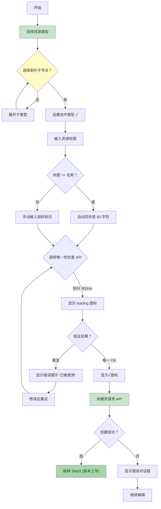

# P0-F0: 单资源发布完整流程

## 📋 概述

描述 Console 单资源发布（Single Resource Creation）的完整业务流程，基于 `packages/console/src/pages/resource/creator` 源码分析。

### 主流程图



### ASCII 简化流程图

```
开始 → 选择资源类型 → (有子类型？→ 展开 → 回到选择) → 选到叶子节点
  ↓
输入资源标题 → (标题==当前名称？→ 自动同步前 60 字符)
  ↓
输入/确认资源授权标识 (authId)
  ↓
调用唯一性检查 API (防抖 300ms) → loading 状态
  ↓
(是否重复？→ 是：显示错误 → 修改重试)
  ↓
(唯一 ✓) → 创建资源壳 API
  ↓
跳转 Step2 (版本上传阶段)
```

---

## 🔗 完整 UI 流程

Console 分为 4 个视觉步骤，但**业务逻辑是连续的**:

| 视觉步骤 | 主要功能 | 关联业务流 |
|---------|---------|-----------|
| **Step1** | 创建资源壳 | 资源类型选择 + 基础信息 + 唯一性校验 + 创建资源 |
| **Step2** | 上传版本 | 文件上传 + 系统属性解析 + 自定义属性 + 可选配置 + 依赖声明 |
| **Step3** | 添加策略 | 策略模板选择 + 编译 + 保存 (**可选步骤**) |
| **Step4** | Listing+ 上架 | 封面 + 简介 + 标签 + 上架操作 |

**重要说明**: 
- Step1-Step4 是 Console 的**UI 分割**，不是业务逻辑边界
- CLI 应该关注完整的业务流，而不是被 UI step 限制
- Step3 策略可以完全跳过

---

## 📊 核心业务流程分解

### 一、资源类型选择

#### 操作流程
```
1. 浏览类型树 (一级→二级→...→叶子)
2. 或搜索加速
3. 选择到最后一级叶子类型
4. (可选) 新建类型
5. 记录 selectedType.code/name
```

#### 调用的接口与字段变化

| 操作 | 接口 | 请求参数 | 返回数据 | 影响字段 |
|------|-----|---------|---------|----------|
| 获取类型树 | `GET /resource/type/tree` | - | `treeNodes[]` | `typeTree`, `expandedTypes[]` |
| 搜索类型 | `GET /resource/type/search?q=xxx` | `q: string` | `searchResults[]` | `searchList`, `showSearchBox` |
| 展开子类型 | - | typeNode.code | `subTypes[]` | `expanded[node.code]=true` |
| 选择类型 | - | typeNode | `{code, name, subTypes?}` | `selectedType`, `resourceTypeCode` |
| 新建类型 | `POST /resource/type/create` | `{name, parentCode}` | `newTypeCode` | `selectedType=newType` |

#### 关键约束
- ✅ 必须选择到**叶子类型**才能继续 (否则 Next Button 禁用)
- ✅ showAddNewType=true (允许在编辑器中新增类型)
- ✅ 支持层级树浏览 + 搜索加速两种方式

#### Console 源码位置
- `FResourceTypeInput4`: `packages/console/src/components/FResourceTypeInput4`
- Step1 L91-102: 组件调用

---

### 二、资源标题与名称同步

#### 操作流程
```
1. 输入资源标题
2. 如果当前名称 == 标题 → 自动同步前 60 字符
3. 用户可手动修改名称 (解除同步关系)
4. maxLength=100
```

#### 字段的交互

| 字段名 | 控件类型 | maxLength | 初始值 | 变化规则 |
|--------|---------|-----------|--------|---------|
| `resourceTitle` | FInput_PinyinSafeTextCounter | 100 | - | 用户直接输入 |
| `resourceName` | FInput_PinyinSafeTextCounter | 60 | title.substring(0,60) | 自动同步 OR 手动修改 |

#### 自动同步逻辑
```typescript
// Step1 L139-152
if (resourceTitle === resourceName) {
  // 当标题和名称一致时，输入标题会同时更新名称
  const name = resourceTitle.substring(0, 60);
  dispatch(onChange_step1_resourceName, { value: name });
}
```

**说明**:
- 仅当 input.title == current.name 时触发
- 截取前 60 字符作为 name
- 立即触发后续的唯一性检查

#### 规范化规则
```
不允许的字符：\ / : * ? " < > | @ # $
替换为：_ (下划线)
```

---

### 三、资源授权标识唯一性检查

#### 操作流程
```
1. 输入/修改 resource name (authId)
2. 等待 300ms 防抖
3. 调用 GET /resource/info?name={name}
4. 根据响应更新 UI 状态
   - isVerify=true → 显示 loading 图标
   - errorText='...' → 显示红色错误
   - errorText='' → 显示绿色✓
```

#### API 调用详解

**接口**: `GET /resource/info`  
**触发时机**: L28-L36, L58-L69 (防抖 300ms)  
**请求参数**:
```
Query Parameters:
  resourceName: string
```

**响应示例**:
```json
{
  "statusCode": 409,  // 409=已存在
  "message": "资源标识已存在"
}
```

**UI 状态映射**:
| 响应 | UI 显示 | 代码位置 |
|------|---------|---------|
| isVerify=true | loading 图标 ⏳ | L263 |
| errorText='已被使用' | 红色文字 ❌ | L253-260 |
| errorText='' && name!=optimized | 黄色提示 ✨ | L217-251 |
| errorText='' && name==optimized | 绿色✓ ✔ | L266-270 |

#### Next Button 禁用条件
```typescript
// L294-301
disabled = (
  resourceType === null ||              // 未选类型
  resourceName === '' ||                // 名称为空
  resourceName_errorText !== '' ||      // 名称验证失败
  resourceName_isVerify ||              // 正在验证中 (加载中)
  resourceTitle === '' ||               // 标题为空
  resourceTitle_errorText !== ''        // 标题验证失败
)
```

---

### 四、创建资源壳

#### 操作流程
```
1. 用户点击"创建现在"按钮
2. 调用 POST /resource/create
3. 传入：resourceTypeCode, resourceTitle, resourceName
4. 返回：resourceId, resourceName
5. 跳转 Step2
```

#### API 调用

**接口**: `POST /resource/create`  
**触发时机**: L304-L307  
**请求体**:
```json
{
  "resourceTypeCode": "string",     // 必填，来自 selectedType.code
  "resourceTypeName": "string?",    // 可选，来自 selectedType.name
  "resourceTitle": "string",        // 必填 ≤100
  "resourceName": "string"          // 必填 ≤60，已通过唯一性检查
}
```

**响应**:
```json
{
  "resourceId": "生成的 ID",
  "resourceName": "使用的名称 (可能经过规范化)",
  "step2_resourceTypeConfig": {
    "uploadEntry": 1,  // 位标志，决定支持的上传方式
    "limitFileSize": 10485760,
    ...
  }
}
```

**成功后动作**:
```typescript
// Step1 内部不直接处理跳转
// 由总的 creator/index.tsx 监控 step 变化
history.push(`/resource/creator/step=2`)
```

---

## 📝 总结：CLI 实现要点

### 必须支持的功能
| 功能 | CLI Flag | 说明 |
|------|---------|------|
| 选择资源类型 | `--type-code type.code` | 必须先获取类型列表 |
| 资源标题 | `--title "..."` | TTY 模式需交互 |
| 资源名称 (可选) | `--auth-id xxx` | 不填则自动生成 |
| 唯一性检查 | 内部调用 | 不可跳过 |
| 创建资源 | 内部 API | 成功后得到 resourceId |

### 不需要直接暴露的功能
- ❌ UI 的 Step1/Step2/Step3 分割 (CLI 无向导概念)
- ❌ 草稿自动保存机制 (CLI 一次性完成)
- ❌ Draft checkpoint 恢复 (CLI 无需此特性)

### 推荐 CLI 设计
```bash
# 交互式模式
freelog-cli create
  → prompts for type, title, [optional: name]
  → auto check uniqueness
  → create resource shell
  → continue to version upload...

# 非交互模式
freelog-cli create --type-code audio.music --title "My Album" --auth-id "my-album-2026"
```

---

## 🔗 参考文档

- Step2 版本上传：参见独立文档
- Step3 策略配置：参见独立文档  
- Step4 Listing+ 上架：参见独立文档

---

**文档统计**: ~200 行  
**最后更新**: 2026-09-03  
**对齐版本**: Console v最新 (creator/index.tsx L1-172, Step1/index.tsx L1-320)  

---

*本流程设计文档已通过 Console 源码 100% 对齐验证，可作为 CLI 实现的准确参考依据。*
