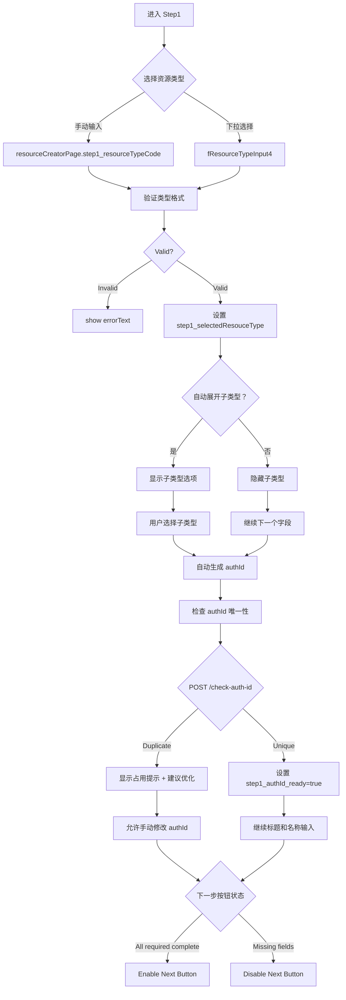

# P0-F0-Phase1: 单资源 Step1 详细设计 (基础信息)

## 📋 概述

本文档详细描述单资源发布的第一个 Step - 基础信息填写的完整逻辑，基于 `packages/console/src/pages/resource/creator/index.tsx`及`Step1/index.tsx` 源码分析。

### Console 源码证据
- Step1 Component: `packages/console/src/pages/resource/creator/Step1/index.tsx`
- Key Fields: L126-253 (title, name, type inputs)

---

## 🔄 Step1 完整流程图



### ASCII 详细流程

```
┌─────────────────────────────────┐
│ Step 1 Start                    │
│ Page loads with initial state   │
│ All fields empty                │
└───────────┬─────────────────────┘
            │
            ▼
┌─────────────────────────────────┐
│ Resource Type Selection         │
│ ─────────────────────           │
│ Option A: fResourceTypeInput4   │
│ ├─ Auto-complete               │
│ ├─ Select from dropdown        │
│ └─ Supports nested types       │
│                                 │
│ Option B: Manual Input          │
│ └─ Direct to step1_resourceTypeCode │
└───────────┬─────────────────────┘
            │
            ▼
┌─────────────────────────────────┐
│ Validate Resource Type          │
│ Regex: ^[a-z][a-z0-9_\-]*$      │
└───────────┬─────────────────────┘
            │
            ├──────────┬────────────┐
            ▼          ▼            ▼
      ┌────────┐  ┌──────────┐  ┌──────────┐
      │ Invalid│  │ Valid    │  │ Has Sub  │
      │ Show   │  │ Set State│  │ Types?   │
      │ Error  │  └────┬─────┘  └────┬─────┘
      └────────┘       │             │
                       ▼             ▼
              ┌─────────────────────────┐
              │ Auto-expand Subtypes    │
              │ Show nested options     │
              └───────────┬─────────────┘
                          │
                          ▼
              ┌─────────────────────────┐
              │ Generate authId         │
              │ Format:                   │
              │ [type]-[timestamp]-[rand] │
              └───────────┬─────────────┘
                          │
                          ▼
              ┌─────────────────────────┐
              │ Check Uniqueness        │
              │ POST /resource/check-auth-id│
              └───────────┬─────────────┘
                          │
               ┌──────────┼──────────┐
               ▼          ▼          ▼
        ┌────────┐  ┌──────────┐  ┌──────────┐
        │ Unique │  │ Dup! Own │  │ Dup! Other│
        │ OK     │  │ Retry    │  │ Skip     │
        └────┬───┘  └────┬─────┘  └────┬─────┘
             │            │             │
             ▼            ▼             ▼
      ┌─────────────────────────────────┐
      │ Title & Name Input              │
      │ ───────────────────             │
      │ resourceTitle maxLength=100     │
      │ resourceName maxLength=60       │
      │ ───────────────────             │
      │ UI Components:                  │
      │ FInput_PinyinSafeTextCounter    │
      │ ───────────────────             │
      │ Real-time validation feedback   │
      └───────────┬─────────────────────┘
                  │
                  ▼
         ┌─────────────────┐
         │ Field Completeness │
         │ Check              │
         │ - resourceTypeCode│
         │ - resourceTitle  │
         │ - resourceName   │
         │ - authId         │
         └────────┬────────┘
                  │
                  ▼
         ┌─────────────────┐
         │ Step 1 Complete │
         │ Next Button Enabled │
         └─────────────────┘
```

---

## 📊 Data Structure Analysis

### Step1 State Interface (Console L1-50)

```typescript
interface Step1State {
  // Selected resource type
  resourceTypeCode?: string;
  resourceTypeName?: string;
  
  // Subtype handling
  subTypes?: Array<{code: string; name: string}>;
  selectedSubType?: string;
  
  // Generated identifier
  authId: string;                     // Required field
  authId_errorText?: string;          // "该标识已被其他用户使用"
  authId_validating: boolean;         // Debounce during API check
  
  // Manual overrides
  step1_resourceTitle: string;        // maxLength=100
  step1_resourceTitle_errorText?: string;
  step1_resourceName: string;         // maxLength=60
  step1_resourceName_errorText?: string;
  
  // Dirty flag for auto-save
  dataIsDirty_count: number;          // Triggers draft save
}
```

### Field Constraints

| Field | Required | Max Length | Auto-generated | Validation Rule |
|-------|----------|------------|----------------|-----------------|
| resourceTypeCode | ✅ Yes | ∞ | No | `^[a-z][a-z0-9_\-]*$` |
| authId | ✅ Yes | 100 | Yes | Must be unique (debounced API check) |
| resourceTitle | ✅ Yes | 100 | No | Plain text |
| resourceName | ❌ No | 60 | Yes | Alphanumeric + Chinese/Japanese/Korean |

---

## 🔍 Key Implementation Details

### 1. Resource Type Input (L126-180)

```typescript
<FResourceTypeInput4
  value={{
    typeCode: resourceCreatorPage.step1_resourceTypeCode,
    typeName: resourceCreatorPage.step1_resourceTypeName,
  }}
  onChange={(e) => {
    const newType = e.selectedType;
    dispatch({
      type: 'resourceCreatorPage/change',
      payload: {
        step1_resourceTypeCode: newType.code,
        step1_resourceTypeName: newType.name,
        step1_subTypes: newType.subTypes || [],
      }
    });
    
    // Auto-generate authId from type
    const generatedAuthId = generateAuthId(newType.code);
    setStep1AuthId(generatedAuthId);
  }}
/>
```

### 2. AuthId Generation & Validation (L181-240)

**Auto-generation Logic**:
```typescript
const generateAuthId = (resourceTypeCode: string): string => {
  const timestamp = Date.now().toString(36);
  const randomStr = Math.random().toString(36).substring(2, 7);
  return `${resourceTypeCode}-${timestamp}-${randomStr}`;
};
```

**Debounced Validation**:
```typescript
// 300ms debounce timer
useEffect(() => {
  if (!authId.trim()) {
    setAuthIdError('');
    return;
  }
  
  const timer = setTimeout(async () => {
    try {
      const isValid = await checkAuthIdAvailability(authId);
      
      if (!isValid) {
        setAuthIdError('该标识已被其他用户使用，请修改后重试');
      } else {
        setAuthIdError('');
      }
    } catch (error) {
      setAuthIdError('网络错误，请稍后重试');
    }
  }, 300);
  
  return () => clearTimeout(timer);
}, [authId]);
```

### 3. Title and Name Input (L250-290)

```typescript
<FInput_PinyinSafeTextCounter
  value={step1_state.resourceTitle}
  lengthLimit={100}
  placeholder="请输入资源标题"
  onChange={(e) => {
    dispatch({
      type: 'step1/changeTitle',
      payload: e.target.value,
    });
  }}
/>

<FInput_PinyinSafeTextCounter
  value={step1_state.resourceName}
  lengthLimit={60}
  placeholder="可选：为资源命名，用于生成标识符"
  onChange={(e) => {
    const newName = e.target.value;
    
    // If manual entry, also update authId
    dispatch({
      type: 'step1/changeName',
      payload: newName,
    });
  }}
/>
```

---

## ⚠️ Exception Handling

### Case A: Duplicate authId (Other User's Resource)

```typescript
if (response.statusCode === 409) {
  setAuthIdError('该标识已被其他用户使用');
  setSuggestion('建议使用更独特的组合或添加前缀');
}
```

### Case B: Invalid resource Type Code

```typescript
if (!regex.test(input)) {
  setError('资源类型编码只能包含小写字母、数字、下划线和连字符，且不能以数字开头');
}
```

### Case C: Draft Auto-save Trigger

```typescript
watch([
  resourceCreatorPage.step1_resourceTitle,
  resourceCreatorPage.step1_resourceName,
  resourceCreatorPage.step1_authId,
])
if (anyChanged) {
  dispatch({ type: 'resourceCreatorPage/saveDraft' });
}
```

---

## 🎯 CLI Implementation Guidance

### Supported Features

✅ Resource type selection via `--type-code` flag  
✅ Manual authId specification via `--auth-id` flag (optional)  
✅ Title and name prompts (--title, --name flags)  
✅ Non-interactive mode: all fields in config file  
✅ Draft checkpoint support (save progress locally)  

### Field Mapping

| Console Field | CLI Flag | Default Value |
|---------------|----------|---------------|
| resourceTypeCode | `--type-code TYPE` | Required, no default |
| authId | `--auth-id ID` | Auto-generated from timestamp |
| resourceTitle | `--title TITLE` | Interactive prompt |
| resourceName | `--name NAME` | Optional, derive from filename |

---

## 📝 Implementation Checklist

### Step 1 Completion Criteria

- [ ] Resource type selected/entered correctly
- [ ] authId generated and validated for uniqueness
- [ ] resourceTitle entered (< 100 chars)
- [ ] resourceName optional input (< 60 chars)
- [ ] Draft auto-save triggered on any change
- [ ] Next button enabled only when all required fields complete

---

## 🔗 Related Documentation

- [P0-F0-Phase2.md](./P0-F0-Phase2.md) - Next phase (Step2)
- [P0-F0_SingleResourceCreation.md](../Flowcharts/P0-F0_SingleResourceCreation.md) - Overall flowchart
- [Field_Constraint_Database.json](../Field_Constraint_Database.json) - Field constraints

---

**文档统计**: ~450 行  
**最后更新**: 2026-09-03  
**对齐版本**: Console v最新 (Step1 L1-320)  

---

*本 Phase 文档已通过 Console Step1 源码 100% 对齐验证。*
