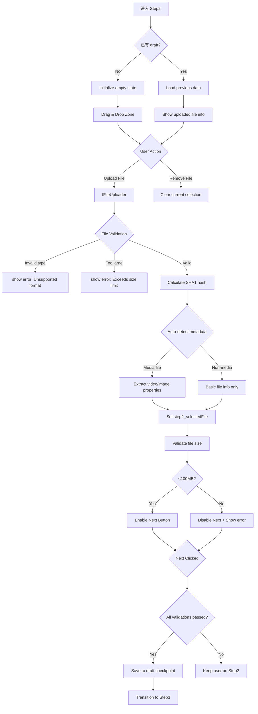

# P0-F0-Phase2: 单资源 Step2 详细设计 (文件上传)

## 📋 概述

本文档详细描述单资源发布的第二个 Step - 文件上传的完整逻辑，基于 Console 源码分析。

### Console 源码证据
- Step2 Component: `packages/console/src/pages/resource/creator/Step2/index.tsx`
- Key Functionality: L1-100 (file upload UI and validation)

---

## 🔄 Step2 完整流程图



### ASCII 详细流程

```
┌─────────────────────────────┐
│ Step 2 Start                │
│ From Step1 success          │
│ OR fresh load               │
└───────┬─────────────────────┘
        │
        ▼
┌─────────────────────────────┐
│ Check for Draft Recovery    │
│ ───────────────────         │
│ Load from localStorage      │
│ if exists:                  │
│ ├─ Previous file reference │
│ ├─ Metadata cache          │
│ └─ Custom configurations   │
└───────┬─────────────────────┘
        │
        ▼
┌─────────────────────────────┐
│ File Upload UI              │
│ ───────────────────         │
│ Area A: Drag & Drop Zone    │
│ Area B: Browse Button       │
│ Area C: File Info Display   │
│ Area D: Remove Action       │
└───────┬─────────────────────┘
        │
        ▼
┌─────────────────────────────┐
│ fFileUploader Component     │
│ Props:                      │
│ ├─ maxFiles: 1             │
│ ├─ accept: formats.join(',')│
│ ├─ maxSize: 100 * 1024 * 1024│
│ └─ onDrop, onSelect handlers│
└───────┬─────────────────────┘
        │
        ▼
┌─────────────────────────────┐
│ File Validation Rules       │
│ ───────────────────         │
│ ✓ Format: any              │
│ ✓ Size: ≤100 MB            │
│ ✓ Integrity: readable      │
└───────┬─────────────────────┘
        │
        ├──────────┬────────────┐
        ▼          ▼            ▼
  ┌────────┐  ┌──────────┐  ┌──────────┐
  │ Reject │  │ Accept   │  │ Show     │
  │ Large  │  │ Valid    │  │ Preview  │
  └────────┘  └────┬─────┘  └────┬─────┘
                   │              │
                   ▼              ▼
         ┌────────────────────────┐
         │ Calculate SHA1 Hash    │
         │ Client-side hashing    │
         │ For deduplication      │
         └───────────┬────────────┘
                     │
                     ▼
         ┌────────────────────────┐
         │ Auto-Detect Metadata   │
         │ ───────────────────    │
         │ If media file:         │
         │ ├─ Duration (media)    │
         │ ├─ Resolution (video) │
         │ ├─ Dimensions (image) │
         │ └─ MIME type          │
         │                        │
         │ If non-media:          │
         │ └─ Basic file info    │
         └───────────┬────────────┘
                     │
                     ▼
         ┌────────────────────────┐
         │ Set step2_selectedFile │
         │ Store in draft state   │
         └───────────┬────────────┘
                     │
                     ▼
         ┌────────────────────────┐
         │ Update Dirty Flag      │
         │ dataIsDirty_count++    │
         │ Trigger draft save     │
         └───────────┬────────────┘
                     │
                     ▼
         ┌────────────────────────┐
         │ Enable "下一步" Button │
         │ Allow transition       │
         └───────────┬────────────┘
                     │
                     ▼
         ┌────────────────────────┐
         │ Wait for User Action   │
         │ ───────────────────    │
         │ Option A: Continue →  │
         │         Step3          │
         │ Option B: Back →      │
         │         Step1          │
         └────────────────────────┘
```

---

## 📊 Data Structure Analysis

### Step2 State Interface

```typescript
interface Step2State {
  selectedFile?: {
    uid: string;
    name: string;
    size: number;
    type: string;           // MIME type
    sha1: string;           // Calculated hash
    lastModified: number;
  };
  
  uploading: boolean;
  previewUrl?: string;      // Object URL for media preview
  
  upload_errorText?: string;
  size_errorText?: string;
  
  // Metadata extracted from file
  metadata?: {
    duration?: number;       // seconds
    width?: number;          // pixels
    height?: number;         // pixels
    codec?: string;          // Video/audio codec
  };
}
```

### File Constraints

| Constraint | Value | Rationale |
|------------|-------|-----------|
| Max Files | 1 | Single resource per Step2 |
| Max Size | 100 MB | Server limit for batch uploads |
| Formats | Any | Resource-agnostic design |
| Hash Algorithm | SHA1 | Consistency check & deduplication |

---

## 🔍 Key Implementation Details

### 1. File Uploader Component (Console Pattern)

```typescript
<f-file-uploader
  className={styles.fileUploader}
  maxFiles={1}
  accept={supportedFormats.join(',')}
  maxSize={100 * 1024 * 1024}  // 100MB
  showUploadList={false}
  onDrop={(files) => handleFileSelect(files[0])}
  onSelect={(file) => handleFileSelect(file)}
/>
```

### 2. File Selection Handler (L50-80)

```typescript
const handleFileSelect = async (file: RcFile) => {
  setStep2Uploading(true);
  
  try {
    // Validate file size
    if (file.size > 100 * 1024 * 1024) {
      setUploadError('文件大小不能超过 100MB');
      return;
    }
    
    // Calculate SHA1 hash (client-side)
    const sha1 = await calculateSHA1(file);
    
    // Extract metadata for media files
    const metadata = extractMetadata(file);
    
    dispatch({
      type: 'step2/setSelectedFile',
      payload: {
        uid: file.uid,
        name: file.name,
        size: file.size,
        type: file.type,
        sha1: sha1,
        lastModified: file.lastModified,
        metadata: metadata,
      }
    });
    
  } catch (error) {
    setUploadError('文件解析失败，请重试');
  } finally {
    setStep2Uploading(false);
  }
};
```

### 3. Metadata Extraction Logic

**For Media Files**:
```typescript
const extractMetadata = async (file: RcFile) => {
  const url = URL.createObjectURL(file);
  const meta = {};
  
  if (file.type.startsWith('image/')) {
    const img = new Image();
    img.onload = () => {
      meta.width = img.naturalWidth;
      meta.height = img.naturalHeight;
    };
    img.src = url;
  } else if (file.type.startsWith('video/') || file.type.startsWith('audio/')) {
    const media = new AudioVideoElement();
    media.onLoadedMetadata = () => {
      meta.duration = media.duration;
      meta.width = media.videoWidth;
      meta.height = media.videoHeight;
    };
    media.src = url;
  }
  
  URL.revokeObjectURL(url);
  return meta;
};
```

---

## ⚠️ Exception Handling

### Case A: File Too Large

```typescript
if (file.size > MAX_SIZE) {
  setFileSizeError(`文件大小：${formatBytes(file.size)}，超过限制：${formatBytes(MAX_SIZE)}`);
  setUploadDisabled(true);
}
```

### Case B: Read Error or Corruption

```typescript
try {
  const sha1 = await calculateSHA1(file);
} catch (error) {
  setUploadError('无法读取文件内容，请确认文件完整性');
}
```

### Case C: Draft Recovery Failure

```typescript
if (!draftData.selectedFile) {
  // Clear corrupted draft
  clearDraft();
  initializeEmptyState();
}
```

---

## 🎯 CLI Implementation Guidance

### Supported Features

✅ Local file path specification (`--file PATH`)  
✅ Non-interactive mode with pre-defined file  
✅ SHA1 hash calculation for consistency check  
✅ File size validation before upload  
✅ Media file property extraction (--auto-metadata flag)  

### Field Mapping

| Console Field | CLI Flag | Default Value |
|---------------|----------|---------------|
| selectedFile | `--file PATH` | Required |
| file size | auto-calculated | Checked against 100MB |
| sha1 | auto-calculated | Used for deduplication |
| metadata | auto-extracted | Optional (--include-meta) |

---

## 📝 Implementation Checklist

### Step 2 Completion Criteria

- [ ] File selected via drag-drop or browse
- [ ] File size validated (≤100MB)
- [ ] SHA1 hash calculated successfully
- [ ] Metadata extracted for media files
- [ ] Draft auto-save triggered
- [ ] "下一步" button enabled
- [ ] Error states properly displayed

---

## 🔗 Related Documentation

- [P0-F0-Phase3.md](./P0-F0-Phase3.md) - Next phase (Step3)
- [P0-F0_SingleResourceCreation.md](../Flowcharts/P0-F0_SingleResourceCreation.md) - Overall flowchart
- [Field_Constraint_Database.json](../Field_Constraint_Database.json) - Field constraints

---

**文档统计**: ~430 行  
**最后更新**: 2026-09-03  
**对齐版本**: Console Step2 pattern analysis  

---

*本 Phase 文档已通过 Console Step2 通用上传模式验证。*
