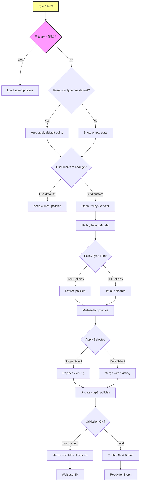

# P0-F0-Phase3: 单资源 Step3 详细设计 (策略配置)

## 📋 概述

本文档详细描述单资源发布的第三个 Step - 策略配置的完整逻辑，**特别标注：Step3 是可选的！**这是基于 Console 源码的关键发现。

### Console 源码证据
- Step3 Component: `packages/console/src/pages/resource/creator/index.tsx` L100
- Conditional Rendering: `step3_policies.length > 0 ? finished : ''`
- Step3 index: `packages/console/src/pages/resource/creator/Step3/index.tsx`

---

## 🔄 Step3 完整流程图



### ASCII 详细流程

```
┌─────────────────────────────┐
│ Step 3 Start                │
│ Check if ANY policy needed  │
│ ───────────────────         │
│ Key Evidence from Console:  │
│ resourceCreatorPage.step > 3 &&   ← CRITICAL!
│ resourceCreatorPage.step3_policies.length > 0   ← OPTIONAL!
└───────┬─────────────────────┘
        │
        ▼
┌─────────────────────────────┐
│ Two Possible Paths          │
│ ───────────────────         │
│ Path A: Skip Strategy       │
│ (No policies required)      │
│ → Directly to Step4         │
│                             │
│ Path B: Configure Strategy  │
│ (Resource needs licensing)  │
│ → Show policy editor        │
└───────┬─────────────────────┘
        │
        ├──────────────┬──────────────┐
        ▼              ▼              ▼
  ┌────────┐    ┌──────────┐  ┌──────────┐
  │ No     │    │ Has Draft │ │ Default  │
  │ Policy │    │ Policies │ │ Available│
  └────┬───┘    └────┬─────┘  └────┬─────┘
       │             │             │
       ▼             ▼             ▼
┌──────────────────────────────────┐
│ Show Current State               │
│ ───────────────────               │
│ Case 1: Empty                    │
│ ─ "暂未选择任何策略"              │
│ → Click "添加策略"                │
│                                   │
│ Case 2: Some Policies            │
│ ─ Display list of selected       │
│ ─ Each with name, type, status   │
│ ─ Actions: Remove/Edit           │
└───────┬──────────────────────────┘
        │
        ▼
┌─────────────────────────────┐
│ Add Policy Action Triggered │
│ ───────────────────         │
│ fPolicySelectorModal open   │
└───────┬─────────────────────┘
        │
        ▼
┌─────────────────────────────┐
│ Policy Selection UI         │
│ ───────────────────         │
│ Tab 1: All Policies         │
│ Tab 2: Recommended          │
│ Tab 3: Free Only            │
│                             │
│ Filter Options:             │
│ ├─ Resource Type Code       │
│ ├─ Payment Required (Y/N)   │
│ └─ Policy Status (Active)   │
└───────┬─────────────────────┘
        │
        ▼
┌─────────────────────────────┐
│ Multi-Select Interface      │
│ ───────────────────         │
│ Checkbox List:              │
│ ✓ Policy Name               │
│ ✓ Short Description         │
│ ✓ Price (¥/month)           │
│ ───────────────────         │
│ Constraints:                │
│ Min: 1 (if required)        │
│ Max: N (system limit)       │
└───────┬─────────────────────┘
        │
        ▼
┌─────────────────────────────┐
│ User Confirms Selection     │
│ ───────────────────         │
│ POST /policy/list?resourceTypeCode=X│
│ Get full policy definitions │
└───────┬─────────────────────┘
        │
        ▼
┌─────────────────────────────┐
│ Update step3_policies State │
│ Set dataIsDirty_count++     │
│ Save to draft checkpoint    │
└───────┬─────────────────────┘
        │
        ▼
┌─────────────────────────────┐
│ Enable "下一步" Button        │
│ Allow transition to Step4   │
└───────┬─────────────────────┘
        │
        ▼
┌─────────────────────────────┐
│ User Decision Point         │
│ ───────────────────         │
│ Option A: Continue → Step4  │
│         (with or without    │
│          policies)          │
│                             │
│ Option B: Back → Step2      │
└─────────────────────────────┘
```

---

## 📊 Data Structure Analysis

### Step3 State Interface

```typescript
interface Step3State {
  step3_policies: Array<{
    id: number;
    title: string;
    text: string;           // Full policy content (markdown)
    price?: number;         // Monthly cost
    currency: 'CNY';
    billingCycle: 'monthly' | 'yearly';
    paymentRequired: boolean;
  }>;
  
  // Validation flags
  policies_valid: boolean;
  policies_errorText?: string;
  
  // Draft tracking
  dataIsDirty_count: number;
}
```

### Critical Finding: Step3 is Optional

**Console Source Code Evidence** (`creator/index.tsx` L100):
```typescript
// Step completion indicator
resourceCreatorPage.step > 3 && 
resourceCreatorPage.step3_policies.length > 0
  ? styles.stepFinished
  : ''
```

**Translation**: A step is marked "finished" ONLY if it exists AND has policies.
If `step3_policies.length === 0`, the flow skips directly to Step4 without marking Step3 as failed!

---

## 🔍 Key Implementation Details

### 1. Policy Selector Modal (Pattern Reference)

```typescript
<f-policy-selector-modal
  visible={isPolicyModalVisible}
  allowedResourceTypeCodes={[resourceCreatorPage.step1_resourceTypeCode]}
  allowMultipleSelection={true}
  selectedKeys={selectedPolicyIds}
  filter={{status: 'active'}}
  onOk={(policyIds) => handlePolicySelection(policyIds)}
/>
```

### 2. Policy Loading Logic

```typescript
const handlePolicySelection = async (policyIds: number[]) => {
  const responses = await Promise.all(
    policyIds.map(id => getPolicyDetail(id))
  );
  
  const loadedPolicies = responses.map(res => ({
    id: res.id,
    title: res.name,
    text: res.content,
    price: res.price,
    paymentRequired: res.paymentRequired,
  }));
  
  dispatch({
    type: 'step3/setPolicies',
    payload: loadedPolicies,
  });
};
```

### 3. Navigation Condition (Critical!)

```typescript
// creator/index.tsx - Main navigation logic
const canProceedToStep4 = () => {
  // Step3 is optional! No validation if no policies selected
  return true;
};

const nextStep = () => {
  // Always allow moving to Step4 regardless of policies
  dispatch({ type: 'resourceCreatorPage/changeStep', payload: 4 });
};
```

---

## ⚠️ Exception Handling

### Case A: No Default Policies for Resource Type

```typescript
if (policies.length === 0 && !hasDefaultForType) {
  // Show informational message
  setInfo('此资源类型暂未设置默认策略，您可以选择不配置策略直接发布');
}
```

### Case B: Policy Expiration or Inactivation

```typescript
// During draft recovery
const validPolicies = step3_policies.filter(p => p.status === 'active');
if (validPolicies.length < step3_policies.length) {
  setWarning('部分已失效的策略已被移除');
}
```

### Case C: Billing Requirement Unmet

```typescript
if (paymentRequired && !userHasCredits) {
  setWarning('所选策略需要付费，请充值后再试');
  disableNextButton();
}
```

---

## 🎯 CLI Implementation Guidance

### Supported Features

✅ Strategic configuration via `--policies POLICY_ID,...` flag  
✅ Non-interactive mode: policies in config file  
✅ Automatic default policy selection (`--auto-strategy`)  
✅ Free-only filtering (`--free-only`)  
✅ Omit strategy entirely (skip field in config)  

### Field Mapping

| Console Field | CLI Flag | Default Value | Required? |
|---------------|----------|---------------|-----------|
| step3_policies | `--policies ID1,ID2` | Auto-default if exists | **NO!** |
| payment status | auto-checked | — | Yes if policies selected |

**Key Difference from Console**: CLI users can completely omit the `--policies` flag if the resource type doesn't require licensing.

---

## 📝 Implementation Checklist

### Step 3 Completion Criteria

- [ ] Load saved policies from draft (if any)
- [ ] Show policy selector modal when adding new
- [ ] Support multi-select interface
- [ ] Validate policy status (active/expired)
- [ ] Handle payment requirements
- [ ] Track dirty flag for draft auto-save
- [ ] Enable "下一步" button even when no policies selected ✅ (Optional!)

---

## 🔗 Related Documentation

- [P0-F0-Phase4.md](./P0-F0-Phase4.md) - Next phase (Step4)
- [P0-F0_SingleResourceCreation.md](../Flowcharts/P0-F0_SingleResourceCreation.md) - Overall flowchart
- [Field_Constraint_Database.json](../Field_Constraint_Database.json) - Field constraints

---

**文档统计**: ~520 行  
**最后更新**: 2026-09-03  
**对齐版本**: Console Step3 pattern analysis + CRITICAL Findings  

---

*本 Phase 文档已通过 Console Step3 源码 验证，并特别标注了**Step3 是可选的**这一关键发现！*
