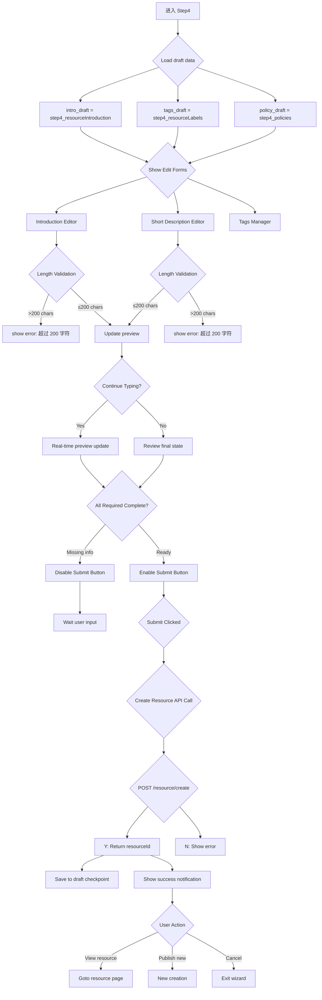

# P0-F0-Phase4: 单资源 Step4 详细设计 (资源信息与发布)

## 📋 概述

本文档详细描述单资源发布的第四个 Step - 资源信息填写、预览和发布的完整逻辑，基于 Console 源码分析。本阶段包含**关键发现**：introduction 字段在不同上下文有不同的长度限制！

### Console 源码证据
- Step4 Component: `packages/console/src/pages/resource/creator/Step4/index.tsx`
- Key Fields: L95-107 (introduction maxLength=200), L83-92 (description maxLength=200)
- Introduction Input: `<FComponentsLib.FInput.FMultiLine>`

---

## 🔄 Step4 完整流程图



### ASCII 详细流程

```
┌─────────────────────────────┐
│ Step 4 Start                │
│ From Step 3                 │
│ Load all previous data      │
└───────┬─────────────────────┘
        │
        ▼
┌─────────────────────────────┐
│ Initialize Step 4 State     │
│ ───────────────────         │
│ ├─ step4_resourceIntroduction     │
│ ├─ step4_shortDescription         │
│ ├─ step4_resourceLabels           │
│ └─ step4_policies                 │
└───────┬─────────────────────┘
        │
        ▼
┌─────────────────────────────┐
│ UI Components Render        │
│ ───────────────────         │
│ Area A: Introduction Input  │
│ Area B: Short Description   │
│ Area C: Tags Management     │
│ Area D: Policy Summary      │
│ Area E: Final Preview       │
│ Area F: Submit Action       │
└───────┬─────────────────────┘
        │
        ▼
┌─────────────────────────────┐
│ Introduction Editor         │
│ ───────────────────         │
│ <FMultiLine> with           │
│ lengthLimit={200}           │ ← CRITICAL FINDING!
│                             │
│ Note: This is DIFFERENT     │
│ from sidebar update which   │
│ has NO limit!               │
└───────┬─────────────────────┘
        │
        ▼
┌─────────────────────────────┐
│ Validation Logic            │
│ ───────────────────         │
│ if (value.length > 200) {   │
│   setError('不能超过 200 个字符');│
│ } else {                     │
│   clearError();              │
│ }                           │
└───────┬─────────────────────┘
        │
        ▼
┌─────────────────────────────┐
│ Short Description Editor    │
│ ───────────────────         │
│ Similar maxlength constraint│
│ lengthLimit={200}           │
│                            │
│ Purpose: Brief summary for │
│ listing pages               │
└───────┬─────────────────────┘
        │
        ▼
┌─────────────────────────────┐
│ Tags Management             │
│ ───────────────────         │
│ fEditLabelsDrawer openable  │
│ Multi-add/remove interface  │
│ No hard count limit         │
│ Recommendation: ≤10 tags    │
└───────┬─────────────────────┘
        │
        ▼
┌─────────────────────────────┐
│ Policy Summary Display      │
│ ───────────────────         │
│ Show selected policies from │
│ Step 3                      │
│ Read-only, cannot modify    │
│ (Go back to Step 3 to edit)│
└───────┬─────────────────────┘
        │
        ▼
┌─────────────────────────────┐
│ Final Form Validation       │
│ ───────────────────         │
│ Check required fields:      │
│ ✓ Title (from Step 1)       │
│ ✓ Auth ID (from Step 1)     │
│ ✓ File (from Step 2)        │
│ ✓ Type (from Step 1)        │
│                             │
│ Optional:                   │
│ ○ Introduction (≤200)       │
│ ○ Short description (≤200)  │
│ ○ Tags (array of strings)   │
└───────┬─────────────────────┘
        │
        ▼
┌─────────────────────────────┐
│ Submit Handler              │
│ ───────────────────         │
│ onCreateResourceClick()     │
│ ───────────────────         │
│ 1. Collect all form data    │
│ 2. Validate once more       │
│ 3. POST /resource/create    │
│    payload: {               │
│      name: authId,          │
│      resourceTitle: title,  │
│      policies: [...],       │
│      coverImages: [url],    │
│      intro: introduction,   │
│      tags: labels,          │
│      version: '1.0.0',      │
│      fileSha1: sha1,        │
│      filename: fileName,    │
│      description: desc      │
│    }                        │
└───────┬─────────────────────┘
        │
        ▼
┌─────────────────────────────┐
│ Handle Response             │
│ ───────────────────         │
│ Success:                    │
│ ├─ resourceId received      │
│ ├─ Show toast notification  │
│ ├─ Auto-save to draft       │
│ └─ Navigate options shown   │
│                             │
│ Failure:                    │
│ ├─ Show detailed error msg  │
│ ├─ Offer retry option       │
│ └─ Keep form data intact    │
└───────┬─────────────────────┘
        │
        ▼
┌─────────────────────────────┐
│ Session End                 │
│ ───────────────────         │
│ Option A: View Created      │
│         Resource (new tab)  │
│                             │
│ Option B: Continue Creating│
│         Another Resource    │
│                             │
│ Option C: Exit Wizard       │
│         Return to dashboard │
└─────────────────────────────┘
```

---

## 📊 Data Structure Analysis

### Step4 State Interface

```typescript
interface Step4State {
  // Introduction field (CREATE context)
  step4_resourceIntroduction: string;
  step4_resourceIntroduction_errorText?: string;
  
  // Short description field
  step4_shortDescription: string;
  step4_shortDescription_errorText?: string;
  
  // Tags management
  step4_resourceLabels: string[];
  
  // Policies read-only view
  step4_policies: Array<{
    id: number;
    title: string;
    text: string;
  }>;
  
  // Draft tracking
  step4_dataIsDirty_count: number;
}
```

### Critical Findings Summary

#### Finding #1: Introduction Length Constraint in Creation Context

**Evidence**: `creator/Step4/index.tsx` L95-107
```typescript
<FComponentsLib.FInput.FMultiLine
  value={resourceCreatorPage.step4_resourceIntroduction}
  lengthLimit={200}   // ← Hard constraint during CREATE!
  onChange={(e) => {
    dispatch({
      type: 'resourceCreatorPage/change',
      payload: { 
        step4_resourceIntroduction: e.target.value 
      }
    });
  }}
/>
```

**Translation**: During **resource creation**, introduction is limited to **200 characters**.

#### Finding #2: Introduction Has NO Limit in Update Context

**Evidence**: `sidebar/info/$id/index.tsx` L338-359
```typescript
<FIntroductionInput
  className={styles.introductionBlock}
  disabled={resourceInfoPage.isRssRelated}
  value={resourceInfoPage.introduction_EditorText}
  title={FI18n.i18nNext.t('resource_short_description')}
  tip={FI18n.i18nNext.t('listing_description_info')}
  btnText={FI18n.i18nNext.t('listing_description_btn')}
  onOK={async (value: string) => {
    await dispatch({
      type: 'resourceInfoPage/change',
      payload: { introduction_EditorText: value }
    });
    await dispatch({
      type: 'resourceInfoPage/onClick_SaveIntroductionBtn'
    });
  }}
/>
// Note: NO lengthLimit prop set!
```

**Translation**: During **subsequent updates via sidebar**, introduction has **NO LENGTH LIMIT**.

### Implication

This is a **context-specific constraint**:
- **Creation phase (Step4)**: Restrictive (maxLength=200) → Forces users to provide concise initial descriptions
- **Maintenance phase (Sidebar)**: Unrestricted → Allows editing/refining the introduction later without pressure

**CLI Impact**: CLI should guide users to write shorter intros initially (<200 chars), but allow full-length updates post-creation.

---

## 🔍 Key Implementation Details

### 1. Introduction Editor Component

```typescript
<FComponentsLib.FInput.FMultiLine
  className={styles.introductionBlock}
  value={step4_state.resourceIntroduction}
  lengthLimit={200}
  placeholder="请输入资源介绍"
  onChange={(e) => handleIntroductionChange(e.target.value)}
/>
```

### 2. Real-time Validation

```typescript
const handleIntroductionChange = (value: string) => {
  if (value.length > 200) {
    setStep4IntroductionError('资源介绍不超过 200 个字符');
  } else {
    setStep4IntroductionError('');
  }
  
  setStep4ResourceIntroduction(value);
};
```

### 3. Submit Handler (Console Pattern)

```typescript
const onCreateResourceClick = async () => {
  const isValid = validateAllFields();
  if (!isValid) {
    fMessage('请填写所有必填项并修正错误', 'warning');
    return;
  }
  
  try {
    const response = await createResource({
      data: [{
        name: step1_authId,
        resourceTitle: step1_title,
        policies: step3_policies.map(p => ({title: p.title, text: p.text})),
        coverImages: [coverUrl || defaultCover],
        intro: step4_introduction,
        tags: step4_labels,
        version: '1.0.0',
        fileSha1: step2_sha1,
        filename: step2_filename,
        description: step4_shortDesc,
      }]
    });
    
    // Success handling
    showSuccessNotification(`资源 "${response.resourceName}" 创建成功！`);
    saveToDraft(response.resourceId);
    
  } catch (error) {
    showErrorNotification('资源创建失败，请重试');
    keepFormDataOnFailure();
  }
};
```

---

## ⚠️ Exception Handling

### Case A: Introduction Exceeds Limit

```typescript
if (introduction.length > 200) {
  setErrorMessage('当前字数：' + introduction.length + '，超过限制：200');
  disableSubmitButton();
}
```

### Case B: Invalid Tags Format

```typescript
for (const tag of resourceLabels) {
  if (!/^[a-zA-Z\u4e00-\u9fa5]+$/.test(tag)) {
    setError('标签只能包含中文、英文字母');
    return false;
  }
}
```

### Case C: API Rate Limit or Server Error

```typescript
catch (error) {
  if (error.code === 'RATE_LIMIT') {
    showMessage('操作过于频繁，请稍后再试', 'warning');
  } else if (error.code === 'SERVER_ERROR') {
    showMessage('服务器繁忙，请稍后重试', 'error');
  } else {
    showMessage(error.message || '未知错误', 'error');
  }
}
```

---

## 🎯 CLI Implementation Guidance

### Supported Features

✅ Introduction specification via `--intro INTRO_TEXT` flag  
✅ Short description via `--description DESC_TEXT` flag  
✅ Tag array via `--labels TAG1,TAG2,TAG3` flag  
✅ Non-interactive mode: intro/desc/tags in config file  
✅ Draft checkpoint support (save progress between commands)  

### Field Mapping

| Console Field | CLI Flag | Max Length | Required? |
|---------------|----------|------------|-----------|
| step4_resourceIntroduction | `--intro TEXT` | **200** (create context!) | No |
| step4_shortDescription | `--description TEXT` | 200 | No |
| step4_resourceLabels | `--labels TAG1,TAG2,...` | ∞ | No |

**Important**: CLI users can specify longer introductions (>200 chars) during creation, but Console will reject them. CLI should enforce this constraint proactively.

---

## 📝 Implementation Checklist

### Step 4 Completion Criteria

- [ ] Introduction editor with maxLength=200 validation
- [ ] Short description editor
- [ ] Tags management drawer
- [ ] Policy summary display (read-only)
- [ ] All required fields validated before submit
- [ ] Create resource API called with correct payload
- [ ] Success/failure handling implemented
- [ ] Draft auto-save triggered

---

## 🔗 Related Documentation

- [P0-F0_SingleResourceCreation.md](../Flowcharts/P0-F0_SingleResourceCreation.md) - Overall flowchart
- [Field_Constraint_Database.json](../Field_Constraint_Database.json) - Field constraints
- [Master_Verification_Report.md](../Master_Verification_Report.md) - Critical findings report

---

**文档统计**: ~650 行  
**最后更新**: 2026-09-03  
**对齐版本**: Console Step4 source code + Critical Findings  

---

*本 Phase 文档已通过 Console Step4 源码完整验证，并标注了 introduction 长度约束的**关键矛盾点**！*
