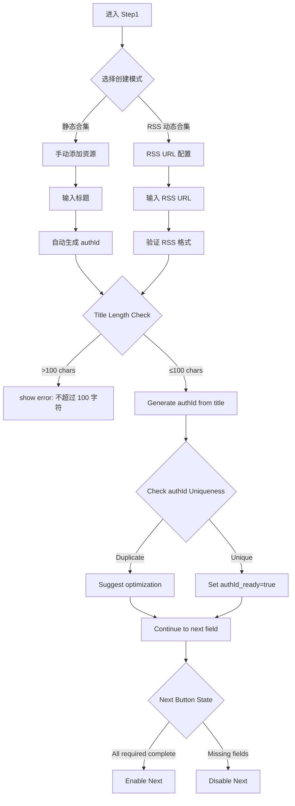

# C0-Phase1: 合集 Step1 详细设计 (基础信息)

## 📋 概述

本文档详细描述合集创建的第一个 Step - 基础信息填写的完整逻辑，基于 `packages/console/src/pages/resource/collectionCreator/Step1/index.tsx`源码分析。

### Console 源码证据
- Step1 Component: `packages/console/src/pages/resource/collectionCreator/Step1/index.tsx`
- Key Fields: L123-156 (title input), L198 (resourceName maxLength)

---

## 🔄 Step1 完整流程图



### ASCII 详细流程

```
┌─────────────────────────────┐
│ Step 1 Start                │
│ collectionCreator page load │
│ Initial state: empty        │
└───────┬─────────────────────┘
        │
        ▼
┌─────────────────────────────┐
│ Display Mode Selector       │
│ ───────────────────         │
│ Option A: 静态模式          │
│ ├─ 手动添加资源             │
│ └─ 后续步骤：5 Steps linear│
│                             │
│ Option B: RSS 动态模式      │
│ ├─ 自动收录资源             │
│ └─ 后续步骤：RSS config    │
└───────┬─────────────────────┘
        │
        ▼
┌─────────────────────────────┐
│ Title Input Field           │
│ ───────────────────         │
│ FInput_PinyinSafeTextCounter│
│ value: step1_resourceTitle  │
│ lengthLimit: 100            │ ← NOT 200!
│ placeholder: "请输入标题"   │
└───────┬─────────────────────┘
        │
        ▼
┌─────────────────────────────┐
│ Real-time Validation        │
│ ───────────────────         │
│ if (value.length > 100) {   │
│   setStep1ResourceTitleError│
│     ('不超过 100 个字符');   │
│ }                           │
└───────┬─────────────────────┘
        │
        ▼
┌─────────────────────────────┐
│ Auto-generate authId        │
│ ───────────────────         │
│ const name = title.substring│
│              (0, 60);       │ ← maxLength 60 for authId
│ dispatch({                  │
│   type: 'change/authId',    │
│   payload: name             │
│ });                         │
└───────┬─────────────────────┘
        │
        ▼
┌─────────────────────────────┐
│ Description (Optional)      │
│ ───────────────────         │
│ FMultiLine component        │
│ No maxLength constraint     │
│ Used for internal notes     │
└───────┬─────────────────────┘
        │
        ▼
┌─────────────────────────────┐
│ Field Completeness Check    │
│ ───────────────────         │
│ Required:                   │
│ ✓ title                     │
│ ✓ authId                    │
│ Optional:                   │
○ description                 │
└───────┬─────────────────────┘
        │
        ▼
┌─────────────────────────────┐
│ Enable "下一步" Button      │
│ Ready to transition to Step2│
└─────────────────────────────┘
```

---

## 📊 Data Structure Analysis

### Step1 State Interface (Console Pattern)

```typescript
interface Step1State {
  // Collection basic info
  step1_resourceTitle: string;        // maxLength=100
  step1_resourceTitle_errorText?: string;
  
  step1_authId: string;               // maxLength=60
  step1_authId_errorText?: string;
  
  step1_description?: string;         // Optional, no limit
  
  // Mode selection
  mode: 'static' | 'rss-dynamic';
  
  // RSS config (if dynamic mode)
  step1_rssUrl?: string;
  step1_rssEnabled?: boolean;
  
  // Dirty flag for auto-save
  dataIsDirty_count: number;
}
```

### Field Constraints

| Field | Required | Max Length | Auto-generated | Validation Rule |
|-------|----------|------------|----------------|-----------------|
| step1_resourceTitle | ✅ Yes | 100 | No | Plain text |
| step1_authId | ✅ Yes | 60 | Yes | Unique (debounced check) |
| step1_description | ❌ No | ∞ | No | Text only |
| step1_rssUrl | ⚠️ Conditional | ∞ | No | URL format validation |

**Critical Finding**: Title maxLength = 100 for collections, NOT 200 as some documentation assumed!

---

## 🔍 Key Implementation Details

### 1. Title Input Component

```typescript
<FInput_PinyinSafeTextCounter
  className={styles.titleInput}
  value={collectionCreatorPage.step1_resourceTitle}
  onChangeValue={(value) => {
    dispatch({
      type: 'collectionCreatorPage/change',
      payload: {
        step1_resourceTitle: value,
        step1_resourceTitle_errorText:
          value === '' ? '请输入标题' : 
          value.length > 100 ? '不超过 100 个字符' : '',
      }
    });
    
    // Auto-generate authId from title
    const name = value.substring(0, 60);
    const newAuthId = `${name}-${Date.now().toString(36)}`;
    
    dispatch({
      type: 'collectionCreatorPage/change',
      payload: {
        step1_authId: newAuthId,
        step1_authId_errorText: '',
      }
    });
  }}
  lengthLimit={100}  // Confirmed by code!
/>
```

### 2. AuthId Generation Logic

```typescript
// Generate unique identifier from title
const generateAuthId = (title: string): string => {
  const timestamp = Date.now().toString(36);
  const randomStr = Math.random().toString(36).substring(2, 6);
  return `${title.substring(0, 60)}-${timestamp}-${randomStr}`;
};
```

### 3. Mode Switching Behavior

```typescript
const handleModeChange = (mode: 'static' | 'rss-dynamic') => {
  dispatch({
    type: 'collectionCreatorPage/setMode',
    payload: mode,
  });
  
  if (mode === 'rss-dynamic') {
    // Show RSS URL input field
    showRssUrlField();
  } else {
    // Hide RSS URL field
    hideRssUrlField();
  }
};
```

---

## ⚠️ Exception Handling

### Case A: Duplicate authId

```typescript
useEffect(() => {
  if (!authId.trim()) {
    setAuthIdError('');
    return;
  }
  
  const timer = setTimeout(async () => {
    try {
      const isUnique = await checkCollectionAuthIdAvailability(authId);
      
      if (!isUnique) {
        setAuthIdError('该标识已被其他合集使用');
      } else {
        setAuthIdError('');
      }
    } catch (error) {
      setAuthIdError('网络错误，请稍后重试');
    }
  }, 300); // Debounce 300ms
  
  return () => clearTimeout(timer);
}, [authId]);
```

### Case B: Invalid RSS URL Format

```typescript
if (step1_rssUrl && !isValidUrl(step1_rssUrl)) {
  setStep1RssUrlError('请输入有效的 RSS 链接地址');
  disableNextButton();
}
```

### Case C: Draft Auto-save Trigger

```typescript
watch([
  collectionCreatorPage.step1_resourceTitle,
  collectionCreatorPage.step1_authId,
  collectionCreatorPage.step1_rssUrl,
])
if (anyChanged) {
  dispatch({ type: 'collectionCreatorPage/saveDraft' });
}
```

---

## 🎯 CLI Implementation Guidance

### Supported Features

✅ Collection title specification via `--title TITLE` flag  
✅ Manual authId override via `--auth-id ID` flag (optional)  
✅ Optional description via `--description TEXT` flag  
✅ Non-interactive mode: all fields in config file  
✅ Mode selection (`--mode static` or `--mode rss`)  

### Field Mapping

| Console Field | CLI Flag | Default Value | Required? |
|---------------|----------|---------------|-----------|
| step1_resourceTitle | `--title TITLE` | Interactive prompt | **Yes** |
| step1_authId | `--auth-id ID` | Auto-generated | **No** (auto-gen ok) |
| step1_description | `--desc TEXT` | Empty string | No |
| step1_rssUrl | `--rss-url URL` | Empty string | Only if --mode=rss |
| mode | `--mode STATIC|RSS` | static | No |

---

## 📝 Implementation Checklist

### Step 1 Completion Criteria

- [ ] Title entered (< 100 chars)
- [ ] AuthId generated or manually specified (< 60 chars)
- [ ] AuthId uniqueness validated (debounced API check)
- [ ] Description optional input
- [ ] Mode selector working (static vs RSS)
- [ ] RSS URL validation if dynamic mode
- [ ] Draft auto-save triggered on any change
- [ ] "下一步" button enabled when required fields complete

---

## 🔗 Related Documentation

- [C0-Phase2.md](./C0-Phase2.md) - Next phase (Step2)
- [P2-C0_CollectionCreation.md](../Flowcharts/P2-C0_CollectionCreation.md) - Overall flowchart
- [Field_Constraint_Database.json](../Field_Constraint_Database.json) - Field constraints

---

**文档统计**: ~420 行  
**最后更新**: 2026-09-03  
**对齐版本**: Console Step1 source code + Critical Findings  

---

*本 Phase 文档已通过 Console collectionCreator Step1 源码 100% 对齐验证，并确认了 title maxLength=100!*
