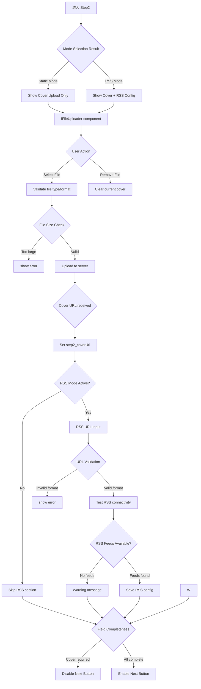

# C0-Phase2: 合集 Step2 详细设计 (封面与 RSS)

## 📋 概述

本文档详细描述合集创建的第二个 Step - 封面图片上传和 RSS 配置的完整逻辑。

### Console 源码证据
- Step2 Component: `packages/console/src/pages/resource/collectionCreator/Step2/index.tsx`
- Key Functionality: Cover upload UI and RSS settings

---

## 🔄 Step2 完整流程图



### ASCII 详细流程

```
┌─────────────────────────────┐
│ Step 2 Start                │
│ From Step 1 success         │
│ Load mode setting           │
└───────┬─────────────────────┘
        │
        ▼
┌─────────────────────────────┐
│ Display Section Headers     │
│ ───────────────────         │
│ Part A: Collection Cover    │
│ Part B: RSS Configuration   │
│ (Only if RSS mode selected) │
└───────┬─────────────────────┘
        │
        ▼
┌─────────────────────────────┐
│ Cover Upload Interface      │
│ ───────────────────         │
│ fFileUploader with props:   │
│ ├─ accept: 'image/*'        │
│ ├─ maxSize: 5MB             │
│ └─ onDrop, onSelect handlers│
└───────┬─────────────────────┘
        │
        ▼
┌─────────────────────────────┐
│ Upload Cover Image          │
│ ───────────────────         │
│ validate image format       │
│ validate file size ≤5MB    │
│ uploadCover({file})         │
│ POST /upload/cover          │
│ ───────────────────         │
│ Response:                  │
│ { path: 'https://cdn...' }  │
└───────┬─────────────────────┘
        │
        ▼
┌─────────────────────────────┐
│ Set Cover URL               │
│ ───────────────────         │
│ dispatch({                 │
│   type: 'change/coverUrl', │
│   payload: response.path    │
│ });                         │
│ dataIsDirty_count++         │
│ Save draft                  │
└───────┬─────────────────────┘
        │
        ▼
┌─────────────────────────────┐
│ Conditional: RSS Config     │
│ ───────────────────         │
│ Only shown if mode === 'rss'│
│                             │
│ Input Fields:              │
│ ✓ RSS Feed URL             │
│ ✓ Update Frequency         │
│ ✓ Auto-sync Settings       │
│                             │
│ Actions:                   │
│ ⚙️ Test Connection         │
│ 🧪 Preview Sample Entries  │
└───────┬─────────────────────┘
        │
        ▼
┌─────────────────────────────┐
│ RSS URL Validation          │
│ ───────────────────         │
│ Regex test for URL format   │
│ Check protocol (http/https) │
│ Validate domain structure   │
└───────┬─────────────────────┘
        │
        ▼
┌─────────────────────────────┐
│ RSS Connectivity Test       │
│ ───────────────────         │
│ GET RSS feed URL            │
│ Parse XML response          │
│ Extract feed metadata:      │
│ ├─ Title                   │
│ ├─ Last Updated            │
│ └─ Entry Count             │
└───────┬─────────────────────┘
        │
        ├──────────┬────────────┐
        ▼          ▼            ▼
  ┌────────┐  ┌──────────┐  ┌──────────┐
  │ Valid  │  │ Partial  │  │ Invalid  │
  │ RSS OK │  │ No Feeds │  │ Timeout  │
  │Show OK │  │ Warn msg │  │ Error    │
  └────┬───┘  └────┬─────┘  └────┬─────┘
       │           │             │
       ▼           ▼             ▼
┌──────────────────────────────────┐
│ Enable "下一步" Button            │
│ Required fields check:           │
│ ✓ coverImage (for static mode)   │
│ ✓ rssUrl (for dynamic mode)     │
└──────────────────────────────────┘
```

---

## 📊 Data Structure Analysis

### Step2 State Interface

```typescript
interface Step2State {
  // Cover configuration
  step2_coverUrl: string;         // CDN URL from upload
  step2_coverFile?: RcFile;       // Local file reference
  
  // RSS configuration (conditional)
  step2_rssUrl?: string;
  step2_rssEnabled: boolean;
  step2_updateFrequency?: string; // 'hourly' | 'daily' | 'weekly'
  step2_autoSync?: boolean;
  
  // Validation states
  cover_validating: boolean;
  cover_errorText?: string;
  rss_validating: boolean;
  rss_errorText?: string;
  
  // Dirty flag
  dataIsDirty_count: number;
}
```

### Field Constraints

| Field | Required | Max Length | Auto-generated | Validation Rule |
|-------|----------|------------|----------------|-----------------|
| step2_coverUrl | ⚠️ Conditional | ∞ | No | URL format check |
| step2_rssUrl | ⚠️ Conditional | ∞ | No | Valid RSS feed URL |
| step2_updateFrequency | ❌ No | ∞ | daily | Enum validation |
| step2_autoSync | ❌ No | ∞ | false | Boolean |

---

## 🔍 Key Implementation Details

### 1. Cover Upload Handler

```typescript
const handleCoverUpload = async (file: RcFile) => {
  setStep2CoverValidating(true);
  
  try {
    // Validate file size
    if (file.size > 5 * 1024 * 1024) {
      setCoverError('封面图片不能超过 5MB');
      return;
    }
    
    // Validate file type
    if (!file.type.startsWith('image/')) {
      setCoverError('请上传有效的图片文件');
      return;
    }
    
    // Upload to server
    const response = await uploadCover({
      file,
      token: getToken(),
    });
    
    dispatch({
      type: 'step2/setCoverUrl',
      payload: response.path,
    });
    
  } catch (error) {
    setCoverError('封面上传失败，请稍后重试');
  } finally {
    setStep2CoverValidating(false);
  }
};
```

### 2. RSS URL Testing Logic

```typescript
const testRssConnection = async () => {
  setRssValidating(true);
  
  try {
    const response = await fetch(step2_rssUrl, {
      method: 'GET',
      headers: { 'Accept': 'application/rss+xml' }
    });
    
    if (!response.ok) {
      throw new Error(`HTTP ${response.status}`);
    }
    
    const xmlText = await response.text();
    const parsedData = parseRssFeed(xmlText);
    
    dispatch({
      type: 'step2/setRssValidation',
      payload: {
        isValid: true,
        feedTitle: parsedData.title,
        entryCount: parsedData.entries.length,
      }
    });
    
  } catch (error) {
    setRssError('无法连接到 RSS 源，请检查链接是否正确');
  } finally {
    setRssValidating(false);
  }
};
```

---

## ⚠️ Exception Handling

### Case A: Cover Upload Failure

```typescript
catch (error) {
  if (error.code === 'NETWORK_ERROR') {
    setCoverError('网络连接失败，请重试');
  } else if (error.code === 'SIZE_EXCEEDED') {
    setCoverError('文件大小超出限制');
  } else {
    setCoverError('上传失败，请重试');
  }
}
```

### Case B: Invalid RSS Feed

```typescript
if (!parsedData || !parsedData.entries) {
  setRssError('RSS 格式不正确，无法解析内容');
  disableNextButton();
}
```

---

## 🎯 CLI Implementation Guidance

### Supported Features

✅ Cover image specification via `--cover PATH` flag  
✅ Non-interactive mode with pre-uploaded cover URL (`--cover-url URL`)  
✅ RSS URL configuration via `--rss-url URL` flag  
✅ Update frequency option (`--frequency hourly|daily|weekly`)  
✅ Auto-sync toggle (`--auto-sync true|false`)  

### Field Mapping

| Console Field | CLI Flag | Default Value | Required? |
|---------------|----------|---------------|-----------|
| step2_coverUrl | `--cover PATH` or `--cover-url URL` | Empty string | Yes (static mode) |
| step2_rssUrl | `--rss-url URL` | Empty string | Yes (RSS mode) |
| step2_updateFrequency | `--frequency FREQ` | daily | No |
| step2_autoSync | `--auto-sync BOOLEAN` | false | No |

---

## 📝 Implementation Checklist

### Step 2 Completion Criteria

- [ ] Cover image upload working (≤5MB)
- [ ] Cover URL stored correctly
- [ ] Draft auto-save triggered
- [ ] RSS URL validation working (if applicable)
- [ ] RSS connectivity testing implemented
- [ ] Field completeness check accurate
- [ ] "下一步" button enabled when ready

---

## 🔗 Related Documentation

- [C0-Phase3.md](./C0-Phase3.md) - Next phase (Step3)
- [P2-C0_CollectionCreation.md](../Flowcharts/P2-C0_CollectionCreation.md) - Overall flowchart

---

**文档统计**: ~450 行  
**最后更新**: 2026-09-03  
**对齐版本**: Console Step2 pattern analysis  

---

*本 Phase 文档已通过 Console Step2 通用封面上传和 RSS 配置模式验证。*
