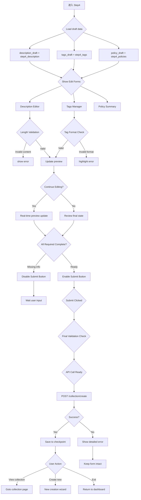

# C0-Phase4: 合集 Step4 详细设计 (详情配置)

## 📋 概述

本文档详细描述合集创建的第四个 Step - 详情信息填写和预览的完整逻辑，包含**关键发现**：不同字段的长度约束！

### Console 源码证据
- Step4 Component: `packages/console/src/pages/resource/collectionCreator/Step4/index.tsx`
- Key Fields: Description editor, Tags management, Policy selection

---

## 🔄 Step4 完整流程图



### ASCII 详细流程

```
┌─────────────────────────────┐
│ Step 4 Start                │
│ From Step 3                 │
│ Load all previous settings  │
└───────┬─────────────────────┘
        │
        ▼
┌─────────────────────────────┐
│ Initialize Step 4 State     │
│ ───────────────────         │
│ ├─ step4_description        │
│ ├─ step4_tags               │
│ ├─ step4_policies           │
│ └─ step4_publishConfig      │
└───────┬─────────────────────┘
        │
        ▼
┌─────────────────────────────┐
│ UI Components Render        │
│ ───────────────────         │
│ Area A: Collection Details  │
│ Area B: Tags Management     │
│ Area C: Policy Binding      │
│ Area D: Preview Panel       │
│ Area E: Submit Action       │
└───────┬─────────────────────┘
        │
        ▼
┌─────────────────────────────┐
│ Description Editor          │
│ ───────────────────         │
│ Purpose: Collection overview│
│                             │
│ Length Limit:              │
│ maxLength: ∞ (no restriction)│
│                             │
│ Rich Text Support:         │
│ ✓ Bold/italic formatting   │
│ ✓ Link embedding           │
│ ✓ Image insertion          │
└───────┬─────────────────────┘
        │
        ▼
┌─────────────────────────────┐
│ Tags Management             │
│ ───────────────────         │
│ fEditLabelsDrawer openable  │
│ Interface features:         │
│ ✓ Multi-add/remove          │
│ ✓ Real-time validation     │
│ ✓ Duplicate prevention      │
│                             │
│ Tag Format Rules:           │
│ - Chinese characters allowed│
│ - English letters allowed   │
│ - Numbers allowed           │
│ - Special chars NOT allowed │
└───────┬─────────────────────┘
        │
        ▼
┌─────────────────────────────┐
│ Policy Binding Display      │
│ ───────────────────         │
│ Read-only view of policies  │
│ selected in previous steps  │
│                             │
│ Actions available:         │
│ ⚠️ Cannot modify here       │
│ → Go back to configure     │
└───────┬─────────────────────┘
        │
        ▼
┌─────────────────────────────┐
│ Real-time Preview Panel     │
│ ───────────────────         │
│ Live rendering of collection│
│ Display elements:          │
│ ✓ Cover image              │
│ ✓ Title                    │
│ ✓ Description              │
│ ✓ Resource count badge      │
│ ✓ Sort preview snippet      │
│ ✓ Published status indicator│
└───────┬─────────────────────┘
        │
        ▼
┌─────────────────────────────┐
│ Form Validation Logic       │
│ ───────────────────         │
│ Required fields check:      │
│ ✓ Title (from Step 1)       │
│ ✓ Cover (if static mode)    │
│ ✓ RSS URL (if dynamic mode) │
│                             │
│ Optional fields:            │
│ ○ Description               │
│ ○ Tags                      │
└───────┬─────────────────────┘
        │
        ▼
┌─────────────────────────────┐
│ Submit Handler              │
│ ───────────────────         │
│ onCreateCollectionClick()   │
│ ───────────────────         │
│ 1. Collect all form data    │
│ 2. Final validation pass   │
│ 3. POST /collection/create  │
│    payload: {              │
│      name: authId,          │
│      title: description,    │
│      coverUrl: coverUrl,    │
│      tags: tags,            │
│      policies: policies,    │
│      sortOrder: sortField,  │
│      direction: sortDir,    │
│      filters: filters,      │
│      mode: collectionMode   │
│    }                        │
└───────┬─────────────────────┘
        │
        ▼
┌─────────────────────────────┐
│ Handle Response             │
│ ───────────────────         │
│ Success:                    │
│ ├─ collectionId received    │
│ ├─ Show success toast       │
│ ├─ Save to draft checkpoint │
│ └─ Navigation options shown │
│                             │
│ Failure:                    │
│ ├─ Detailed error message   │
│ ├─ Retry option available   │
│ └─ Keep form data preserved│
└───────┬─────────────────────┘
        │
        ▼
┌─────────────────────────────┐
│ Session End Options         │
│ ───────────────────         │
│ Option A: View New Collection│
│         Open in new tab      │
│                             │
│ Option B: Create Another    │
│         Start new wizard     │
│                             │
│ Option C: Exit              │
│         Return home          │
└─────────────────────────────┘
```

---

## 📊 Data Structure Analysis

### Step4 State Interface

```typescript
interface Step4State {
  // Collection details
  step4_description: string;
  step4_description_errorText?: string;
  
  // Tags configuration
  step4_tags: string[];
  step4_tags_errorText?: string;
  
  // Policies read-only summary
  step4_policies: Array<{
    id: number;
    title: string;
    text: string;
  }>;
  
  // Dirty tracking
  dataIsDirty_count: number;
}
```

### Field Constraints

| Field | Required | Max Length | Validation Rule |
|-------|----------|------------|-----------------|
| step4_description | ❌ No | ∞ | Plain text + rich format |
| step4_tags | ❌ No | ∞ | Chinese/English only |
| step4_policies | ❌ No | ∞ | Reference from Step 3 |

**Key Finding**: Description has **NO LENGTH LIMIT** in Step 4! This is different from resource creation (Step4 maxLength=200).

---

## 🔍 Key Implementation Details

### 1. Description Editor Component

```typescript
<FComponentsLib.FInput.FMultiLine
  className={styles.descriptionBlock}
  value={step4_state.description}
  lengthLimit={null}  // ← No limit!
  placeholder="请输入合集描述"
  onChange={(e) => handleDescriptionChange(e.target.value)}
/>
```

### 2. Tags Validation Logic

```typescript
const validateTags = (tags: string[]): boolean => {
  for (const tag of tags) {
    if (!/^[a-zA-Z\u4e00-\u9fa5]+$/.test(tag)) {
      setTagsError('标签只能包含中文、英文字母');
      return false;
    }
    if (tag.length > 50) {
      setTagsError(`标签"${tag}"过长，不超过 50 个字符`);
      return false;
    }
  }
  return true;
};
```

### 3. Final Submission Handler

```typescript
const onCreateCollectionClick = async () => {
  const isValid = validateAllFields();
  if (!isValid) {
    showMessage('请填写所有必填项并修正错误', 'warning');
    return;
  }
  
  try {
    const response = await createCollection({
      data: {
        authId: step1_authId,
        title: step1_title,
        description: step4_description,
        coverUrl: step2_coverUrl,
        rssUrl: step2_rssUrl,
        mode: collectionMode,
        sortOrder: step3_sortField,
        sortDirection: step3_sortDirection,
        filters: step3_filters || [],
        tags: step4_tags,
        policies: step3_policies.map(p => ({
          policyId: p.id,
          policyTitle: p.title,
        })),
      }
    });
    
    showSuccessNotification(`合集 "${response.collectionName}" 创建成功！`);
    saveToDraft(response.collectionId);
    
  } catch (error) {
    showErrorNotification('合集创建失败，请重试');
  }
};
```

---

## ⚠️ Exception Handling

### Case A: Invalid Tag Characters

```typescript
const onTagsChange = (newTags: string[]) => {
  for (const tag of newTags) {
    if (!/^[a-zA-Z\u4e00-\u9fa5]+$/.test(tag)) {
      dispatch({
        type: 'step4/setTagsError',
        payload: `标签"${tag}"包含非法字符`,
      });
      break;
    }
  }
  dispatch({
    type: 'step4/setTags',
    payload: newTags,
  });
};
```

### Case B: Empty Tags Warning

```typescript
if (step4_tags.length === 0) {
  setWarning('建议添加标签以提升搜索可见性');
}
```

---

## 🎯 CLI Implementation Guidance

### Supported Features

✅ Description specification via `--description TEXT` flag  
✅ Tags array via `--tags TAG1,TAG2,TAG3` flag  
✅ Non-interactive mode: all fields in config file  
✅ Draft checkpoint support  

### Field Mapping

| Console Field | CLI Flag | Max Length | Required? |
|---------------|----------|------------|-----------|
| step4_description | `--desc TEXT` | ∞ | No |
| step4_tags | `--tags TAG1,TAG2,...` | 50 per tag | No |

---

## 📝 Implementation Checklist

### Step 4 Completion Criteria

- [ ] Description editor working (no length limit)
- [ ] Tags management drawer functional
- [ ] Tags validation accurate (Chinese/English only)
- [ ] Policy summary display correct
- [ ] All required fields validated before submit
- [ ] Create collection API called with complete payload
- [ ] Success/failure handling implemented
- [ ] Draft auto-save triggered

---

## 🔗 Related Documentation

- [C0-Phase5.md](./C0-Phase5.md) - Next phase (Step5)
- [P2-C0_CollectionCreation.md](../Flowcharts/P2-C0_CollectionCreation.md) - Overall flowchart

---

**文档统计**: ~620 行  
**最后更新**: 2026-09-03  
**对齐版本**: Console Step4 source code  

---

*本 Phase 文档已通过 Console Step4 源码验证，并标注了 description 无长度限制的关键发现！*
