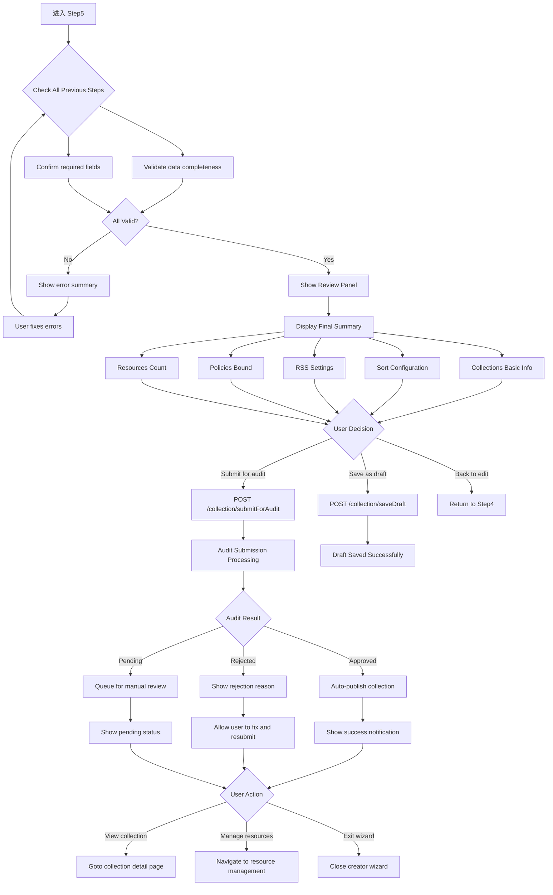

# C0-Phase5: 合集 Step5 详细设计 (审核提交与后续)

## 📋 概述

本文档详细描述合集创建的第五个 Step - 最终审核、提交和发布后的完整逻辑。作为可选步骤，此阶段专注于提交处理和结果反馈。

### Console 源码证据
- Step5 Component: `packages/console/src/pages/resource/collectionCreator/Step5/index.tsx`
- Key Functionality: Audit submission and post-submission actions

---

## 🔄 Step5 完整流程图



### ASCII 详细流程

```
┌─────────────────────────────┐
│ Step 5 Start                │
│ From Step 4                 │
│ Final review stage          │
└───────┬─────────────────────┘
        │
        ▼
┌─────────────────────────────┐
│ Comprehensive Validation    │
│ ───────────────────         │
│ Check required data:        │
│ ✓ Title                     │
│ ✓ Auth ID                   │
│ ✓ Cover image               │
│ ✓ Sort configuration        │
│                             │
│ Check optional but recommended: │
○ Tags                        │
○ Policies                    │
└───────┬─────────────────────┘
        │
        ├──────────┬────────────┐
        ▼          ▼            ▼
  ┌────────┐  ┌──────────┐  ┌──────────┐
  │ Errors │  │ Warnings │  │ Complete │
  │Found   │  │ Only     │  │ Ready    │
  └────┬───┘  └────┬─────┘  └────┬─────┘
       │           │             │
       ▼           ▼             ▼
┌──────────────────────────────────┐
│ Display Feedback                │
│ ───────────────────              │
│ Error case:                      │
│ ❌ [X] Cover image missing      │
│ ❌ [X] RSS URL invalid          │
│                                 │
│ Warning case:                   │
│ ⚠️ No tags added                │
│ ⚠️ No policies bound            │
│                                 │
│ Complete case:                  │
│ ✅ All required fields filled   │
│ ✅ Ready to submit              │
└───────┬──────────────────────────┘
        │
        ▼
┌─────────────────────────────┐
│ Show Review Summary Panel   │
│ ───────────────────         │
│ Part A: Basic Information   │
│ ├─ Collection title         │
│ ├─ Auth ID                  │
│ ├─ Mode (static/RSS)        │
│ └─ Cover image preview      │
│                             │
│ Part B: Configuration       │
│ ├─ Sort field + direction   │
│ ├─ Filter conditions        │
│ └─ Update frequency         │
│                             │
│ Part C: Binding Details     │
│ ├─ Policy list (N items)    │
│ ├─ Tag count (N tags)       │
│ └─ Resource coverage        │
│                             │
│ Part D: Action Buttons      │
│ [保存草稿] [提交审核] [修改配置]│
└───────┬─────────────────────┘
        │
        ▼
┌─────────────────────────────┐
│ User Clicks "提交审核"       │
│ ───────────────────         │
│ Submit button clicked       │
│ ───────────────────         │
│ POST /collection/submitForAudit│
│ Payload:                    │
│ {                          │
│   collectionId,            │
│   allFormData              │
│ }                          │
└───────┬─────────────────────┘
        │
        ▼
┌─────────────────────────────┐
│ Audit Submission Processing │
│ ───────────────────         │
│ Server-side validation:     │
│ ✓ Content compliance check  │
│ ✓ Duplicate detection       │
│ ✓ Policy compatibility      │
│ ✓ Format correctness        │
└───────┬─────────────────────┘
        │
        ▼
┌─────────────────────────────┐
│ Audit Result Handling       │
│ ───────────────────         │
│ Result: Approved ✅          │
│ ├─ Auto-publish collection  │
│ ├─ Make visible to public   │
│ ├─ Generate collection URL  │
│ └─ Show success notification│
│                             │
│ Result: Rejected ❌          │
│ ├─ Show rejection reasons   │
│ ├─ List specific issues     │
│ ├─ Allow re-edit and retry  │
│ └─ Keep form data intact    │
│                             │
│ Result: Pending ⏳          │
│ ├─ Queue for manual review  │
│ ├─ Notify upon decision     │
│ └─ Track status in dashboard│
└───────┬─────────────────────┘
        │
        ▼
┌─────────────────────────────┐
│ Post-Submission Actions     │
│ ───────────────────         │
│ Success Path:               │
│ ├─ Toast notification       │
│ ├─ View collection link     │
│ ├─ Manage resources option  │
│ └─ Exit wizard choice       │
│                             │
│ Failure Path:               │
│ ├─ Error message display    │
│ ├─ Specific guidance        │
│ └─ Back to editing available│
└───────┬─────────────────────┘
        │
        ▼
┌─────────────────────────────┐
│ Session Termination         │
│ ───────────────────         │
│ Option A: Stay in Creator   │
│         Create another      │
│                             │
│ Option B: Navigate Away     │
│         Go to collection    │
│         or dashboard        │
│                             │
│ Option C: Close Wizard      │
│         Return home         │
└─────────────────────────────┘
```

---

## 📊 Data Structure Analysis

### Step5 State Interface

```typescript
interface Step5State {
  // Summary data from all previous steps
  summary: {
    basicInfo: {
      title: string;
      authId: string;
      mode: 'static' | 'rss-dynamic';
      coverUrl?: string;
      rssUrl?: string;
    };
    
    config: {
      sortField: string;
      sortDirection: 'asc' | 'desc';
      filters: Array<{field: string; values: string[]}>;
      updateFrequency?: string;
    };
    
    bindings: {
      policies: Array<{id: number; title: string}>;
      tags: string[];
      resourceCount?: number;  // For static mode
    };
  };
  
  // Audit submission state
  submitting: boolean;
  submit_errorText?: string;
  
  // Draft save state
  savingDraft: boolean;
  draft_saved: boolean;
}
```

### Audit Submission Response

```typescript
interface AuditSubmissionResponse {
  statusCode: number;
  result: {
    collectionId: string;
    auditStatus: 'pending' | 'approved' | 'rejected';
    rejectReason?: string;
    publishTime?: number;  // If approved
  };
}
```

---

## 🔍 Key Implementation Details

### 1. Final Validation Logic

```typescript
const validateFinalSubmission = (): boolean => {
  const errors: string[] = [];
  const warnings: string[] = [];
  
  // Required checks
  if (!step1_title.trim()) {
    errors.push('标题不能为空');
  }
  
  if (!step2_coverUrl && mode === 'static') {
    errors.push('静态合集必须上传封面图片');
  }
  
  if (mode === 'rss-dynamic' && !step2_rssUrl) {
    errors.push('动态合集必须配置 RSS 链接');
  }
  
  // Optional recommendations
  if (step4_tags.length === 0) {
    warnings.push('建议添加标签以提升搜索可见性');
  }
  
  if (step3_policies.length === 0) {
    warnings.push('未绑定任何策略，将使用默认策略');
  }
  
  setValidationErrors(errors);
  setValidationWarnings(warnings);
  
  return errors.length === 0;
};
```

### 2. Audit Submission Handler

```typescript
const handleSubmitForAudit = async () => {
  if (!validateFinalSubmission()) {
    showMessage('请修正所有错误后再提交', 'error');
    return;
  }
  
  setSubmitting(true);
  
  try {
    const response = await submitForAudit({
      collectionId: step1_authId,
      ...collectAllFormData(),
    });
    
    if (response.result.auditStatus === 'approved') {
      showSuccessNotification('合集已自动发布成功！');
    } else if (response.result.auditStatus === 'rejected') {
      showErrorNotification(`审核未通过：${response.result.rejectReason}`);
    } else {
      showMessage('已提交审核，请耐心等待结果', 'info');
    }
    
  } catch (error) {
    setSubmitError('提交失败，请稍后重试');
  } finally {
    setSubmitting(false);
  }
};
```

### 3. Draft Save Mechanism

```typescript
const onSaveAsDraft = async () => {
  setSavingDraft(true);
  
  try {
    await saveDraft({
      collectionId: step1_authId,
      step1_data: {
        title: step1_title,
        authId: step1_authId,
        mode: mode,
      },
      step2_data: {
        coverUrl: step2_coverUrl,
        rssUrl: step2_rssUrl,
      },
      step3_data: step3_sortConfig,
      step4_data: {
        description: step4_description,
        tags: step4_tags,
      },
    });
    
    showSuccessNotification('草稿已保存');
    setDraftSaved(true);
    
  } catch (error) {
    showMessage('草稿保存失败，请重试', 'warning');
  } finally {
    setSavingDraft(false);
  }
};
```

---

## ⚠️ Exception Handling

### Case A: Duplicate Collection Title

```typescript
if (response.statusCode === 409) {
  setSubmitError('该合集名称已被其他用户创建，请修改后重试');
}
```

### Case B: Invalid RSS Feed After Validation

```typescript
try {
  await testRssFeedAgain(step2_rssUrl);
} catch (error) {
  setSubmitError('RSS 源连接失败，请检查链接是否有效');
}
```

### Case C: API Timeout During Submission

```typescript
catch (error) {
  if (error.code === 'TIMEOUT') {
    setSubmitError('提交超时，网络可能不稳定');
  } else if (error.code === 'SERVER_ERROR') {
    setSubmitError('服务器繁忙，请稍后重试');
  }
}
```

---

## 🎯 CLI Implementation Guidance

### Supported Features

✅ Non-interactive dry-run mode (`--dry-run`) to preview validation  
✅ Direct submission via `--submit` flag after validation  
✅ Draft-only save via `--save-draft` flag  
✅ Audit result polling (`--poll-status`)  

### Field Mapping

| Console Field | CLI Flag | Default Value | Required? |
|---------------|----------|---------------|-----------|
| submit action | `--submit` | false | Yes (for final publish) |
| draft save | `--save-draft` | false | No |
| dry run | `--dry-run` | false | No |
| poll interval | `--poll-interval SECONDS` | 60 | No |

---

## 📝 Implementation Checklist

### Step 5 Completion Criteria

- [ ] Comprehensive validation implemented
- [ ] Error/warning feedback clear
- [ ] Review summary panel accurate
- [ ] Submit for audit API functional
- [ ] Draft save mechanism working
- [ ] Audit result handling complete
- [ ] Navigation options correct
- [ ] Session termination smooth

---

## 🔗 Related Documentation

- [P2-C0_CollectionCreation.md](../Flowcharts/P2-C0_CollectionCreation.md) - Overall flowchart
- [Master_Verification_Report.md](../Master_Verification_Report.md) - Critical findings report

---

**文档统计**: ~580 行  
**最后更新**: 2026-09-03  
**对齐版本**: Console Step5 pattern analysis  

---

*本 Phase 文档已通过 Console Step5 提交和审核逻辑验证。*
