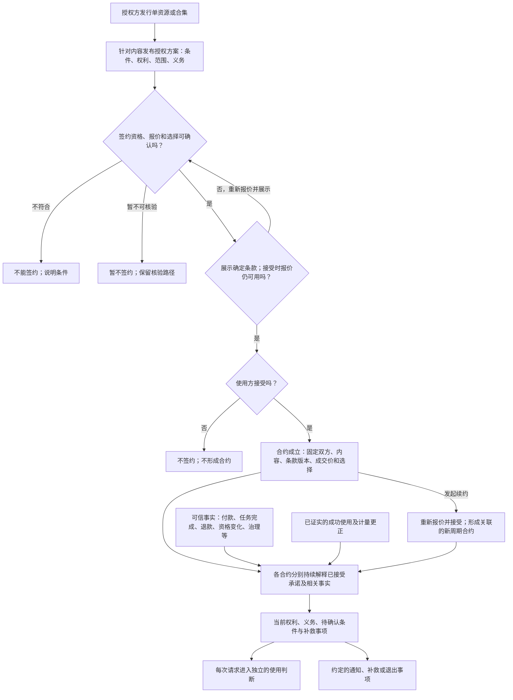
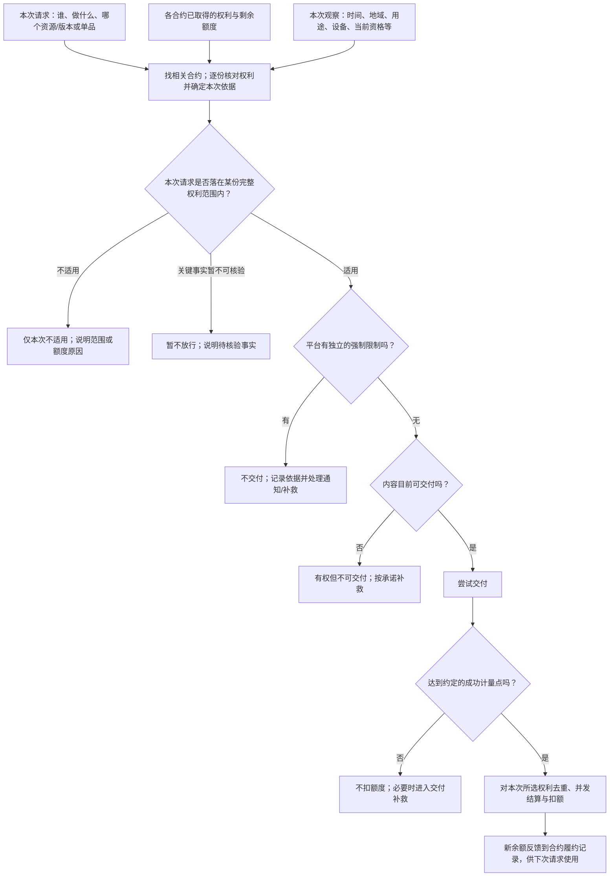
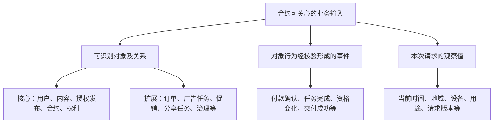
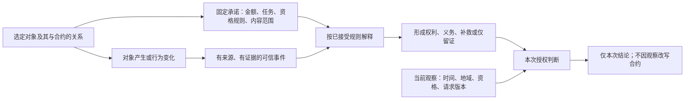

# 授权业务的最小流程与对象全景

状态：**下一代授权产品模型讨论稿**。这里设计平台应能表达的业务，不宣称相关能力已经上线，也不规定策略语言句法、状态机或 CLI 实现。先看流程，再看对象；不从旧文档或技术原型倒推业务概念。

## 一、最小核心：平台到底在做什么

一句话：**授权方针对明确内容提出承诺；使用方确认资格、价格和条款后接受并形成合约；平台持续依据可信事实与使用记录解释权利和义务；每次使用单独判断、交付和计量；续约另立合约，异常按原承诺补救。**

先看合约从形成到后续履约的循环。这里的“解释”可以得到多项已取得权利、待履行义务、待确认条件或补救事项，不是一次性通过一个“有权”开关：

再看一次具体使用。授权判断、平台限制、实际交付和成功计量是不同结果；交付反馈会改变下一次可用的额度，但不倒改已接受的条款：

这条流程至少区分六类结果：**能否签约、合约是否存在、权利是否已取得、本次请求是否适用、内容能否交付、使用是否已成功计量**；其中“不符合”和“暂不可核验”还必须各自解释。平台强制限制是独立覆盖层，不能伪装成授权方修改了旧约。策略下线影响未来签约，不会倒改旧约；中国可用、美国不可用通常是两次请求的不同结论，不是同一合约来回迁移。

### 流程阶段与输入口

| 阶段 | 固定或产生什么 | 可以从哪里取得输入 |
|---|---|---|
| ① 发行与发布 | 线上内容、可选策略及其版本 | 单资源、合集、版本、平台开放的能力 |
| ② 报价与签约 | 核验签约资格和报价，展示确定条款；接受时确认报价仍可用，接受后固定合约依据 | 用户身份、资源范围、促销及卖方参与关系、当前资格快照；未知、不符合与用户放弃须区分 |
| ③ 持续履约解释 | 依据相关事实、义务履行和使用历史，形成或调整权利、额度与补救事项 | 免费立即取得、付款/任务完成、退款、资格变化、上游授权、使用结算及更正 |
| ④ 逐次使用 | 对相关合约逐份判断，确定本次依据；分别输出适用、不适用或暂不可核验 | 各合约的完整权利范围，以及当前时间、地域、主体、版本、用途、额度 |
| ⑤ 交付与计量 | 独立检查平台限制和可交付性；只按实际成功点去重、并发结算并反馈额度 | 治理依据、内容供给、下载/播放结果、失败、重试和更正证据 |
| ⑥ 后续处理 | 可从履约或交付异常进入通知、退出和补救；续约重新报价并形成新合约 | 内容撤回、退款、争议、治理决定、迟到或更正的事实 |

③—⑤不是一次性直线：后续可信事件可重新进入③，成功使用或计量更正由⑤反馈到③，下一次请求再使用更新后的权利与额度。⑥也不是所有合约必经的终点；没有异常的合同可以正常用到约定期间结束，续约属于新的签约周期。

如果平台引导用户**付款、观看广告或完成任务来取得某项权利**，签约前还必须确认这条承诺有可履行且有界的取得路径；用户按约完成后，要么形成所承诺的可用权利，要么在无法兑现时进入已披露且可执行的补救。仅让合约状态迁移、或仅存在一个名叫“授权”的节点，都不算履约。这只是众多顶层约束中的一条；完整的[策略产品规则、事件边界及验收](./13-策略产品规则与能力边界.md)必须先于语言句法确定。

## 二、先把“对象”说清楚

对象是平台能**稳定识别、关联并管理其生命周期**的业务个体。一个对象既有相对稳定的身份和规则，也可能产生、改变或结束。**行为不是另一种与对象并列的实体**：用户点击支付、看广告、分享、下载是动作；下单可能创建订单，平台核验付款或任务完成后才形成可信事件。策略可以关注这些事件，但不能把用户的意图直接当成已完成结果。

下列清单是授权流程需要认识的**对象域全景**，不是说每一项都已被现有产品实现。按对象在流程中的职责分组；具体的数据库表或 API 不决定它是不是业务对象。

### A. 内容、参与者与承诺：核心对象

| 对象或关系 | 相对静的部分：稳定身份、约定或快照 | 动的部分：产生、行为、变化 | 主要进入流程 |
|---|---|---|---|
| 平台用户、组织 | 用户/组织 ID；在合约中的授权方、签约方、受益人或实际使用方角色 | 注册、注销、组织成员变更、主体关系变更 | ①②④⑥ |
| 身份与资格记录 | 资格类型、归属人、可信来源；签约时被采用的资格快照 | 认证、升级、失效、撤销、更正；也可读取当前资格 | ②③④⑥ |
| 单资源 | 线上资源 ID、类型、归属授权方 | 发行、改标题、停止新签、撤回、供给状态改变 | ①②④⑤⑥ |
| 资源版本 | 版本身份、所属资源、内容摘要 | 发布新版、版本不可交付、修复或撤回 | ①②④⑤⑥ |
| 合集 | 合集 ID、归属授权方、合集类型 | 发行、更新元信息、停止新签、撤回 | ①②④⑤⑥ |
| 合集—单品关系 | 合集 ID、线上单资源 ID；签约时固定的单品选择或明确的动态成员规则 | 收录、移出、关系更正；不能靠当前页面列表倒改旧约 | ①②④⑤⑥ |
| 平台能力与资源类型目录 | 平台开放的资源类型及各类型可使用的授权能力 | 后台新增、调整、停用；不倒改旧约 | ①⑥ |
| 策略模板/规则 | 可复用的条件与权利表达；尚未绑定某个具体资源和成交选择 | 发布模板、修订、下线 | ① |
| 资源的授权发布 | 具体资源、所用规则及参数、公开条件和精确发布版本 | 发布、改版、停止新签；旧发布版本仍是旧约依据 | ①②⑥ |
| 合约 | 合约 ID、双方、内容、接受的精确授权发布版本、签约选择与价格 | 履约、续约形成关联的新合约、解除、争议和补救记录 | ②③④⑤⑥ |
| 权利与义务 | 权利的主体、行为、内容/版本、时间、地域、额度等范围；义务的承担方和事项 | 条件满足后取得、成功使用后消耗、履行或发生补救 | ③④⑤⑥ |

### B. 条件、运营与履约：可接入的能力对象

这些能力应按同一接口原则扩展：**对象有身份，行为有可证明的结果，事件能关联到明确合约，策略必须声明它的作用**。广告、平台折扣、分享奖励等是产品设计的能力候选；列在这里不等于当前已上线或已可在策略中引用。

| 对象或关系 | 相对静的部分：稳定身份、约定或快照 | 动的部分：产生、行为、变化 | 主要进入流程 |
|---|---|---|---|
| 订单 | 订单 ID、应付金额/币种、所关联的合约与购买选择 | 创建、待付、取消、超时、纠错 | ②③⑥ |
| 支付、退款记录 | 交易 ID、金额、来源及订单关联 | 到账确认、失败、退款完成、撤销或更正 | ③⑥ |
| 广告/活动任务 | 广告或任务 ID、要求完成的内容、参与者和奖励规则 | 开始、完成、中断、失效、更正 | ②③⑥ |
| 平台促销活动 | 活动 ID、折扣规则、时间窗口、适用资源/用户范围 | 开始、结束、规则发布新版本或撤销 | ①②⑥ |
| 授权方参与活动的关系 | 授权方/资源与活动的关联及参与范围 | 报名、审核、加入、退出；不能追改旧约成交价 | ①②⑥ |
| 优惠资格或凭证 | 凭证 ID、归属、适用范围、可用次数 | 发放、领取、核销、失效、更正 | ②③⑥ |
| 分享/邀请任务 | 活动和任务 ID、分享者/受邀者关系、明确的完成标准 | 创建链接、实际触达、注册或付款等分别被核验 | ②③⑥ |
| 上游许可与依赖关系 | 上游合约/许可 ID、被授权内容和范围 | 授权取得、到期、撤销、恢复 | ①③⑤⑥ |
| 交付与使用记录 | 请求 ID、实际依据的合约权利、计量单位 | 成功交付、失败、重试、时长累计、更正 | ④⑤⑥ |
| 平台治理决定 | 决定 ID、对象、理由、权限与生效范围 | 审核、限制、撤回、恢复、裁决 | ①③⑤⑥ |
| 可信证明与更正记录 | 证明来源、所指对象、发生/确认时间、唯一性 | 核验、补报、冲突、撤销、更正 | ②③④⑤⑥ |

这里把**订单**与**支付结果**分开，是因为创建订单不等于到账；把**广告任务**与**看完广告的证明**分开，是因为开始播放不等于完成；把**平台促销**与**授权方参与关系**分开，是因为“平台全场八折”不自动意味着每位卖方都参加。成交价应在用户接受时固定，后续活动结束或卖方退出通常只影响新签约。

用户行为横切上面多个对象域，不宜再造一个万能的“用户行为对象”：

| 行为 | 首先产生或改变什么 | 何时成为合约可采信的事实 |
|---|---|---|
| 授权方发行、发新版、改合集 | 资源、版本或成员关系 | 平台确认线上发布或关系变更后 |
| 使用方接受授权发布 | 合约及固定的签约选择 | 接受动作和精确条款版本被记录后 |
| 使用方下单、付款 | 订单；随后可能有支付记录 | 指定订单收款被可信来源确认后，而非点击支付时 |
| 使用方看广告、参加活动、分享 | 对应任务及进度 | 达到事先约定且可验证的完成点后 |
| 使用方浏览、下载、播放 | 使用请求；随后可能有交付记录 | 实际成功交付或达到计量点后 |
| 使用方续约、取消、申诉 | 新周期合约、退出或争议事项 | 对应接受、取消或裁决得到平台确认后 |

### C. 时间、地域等：重要输入域，但不必都造为持久对象

| 输入域 | 策略或合约中相对静的约定 | 运行时动的输入 | 默认用法 |
|---|---|---|---|
| 时间 | 签约窗口、权利起止、活动期间、计量周期 | 当前时刻推进、约定时刻到达 | 可用于签后约定条件的履约判断，也可在逐次请求中判断当时是否适用 |
| 国家/区域 | 允许或排除的区域集合、判定口径 | 本次请求的地域观察及其可信度 | 多数情况下只决定本次适用性；换 IP 不迁移合约 |
| 设备、渠道、用途 | 允许的设备、渠道、用途及证据要求 | 本次请求的具体值 | 逐次判断，不反向改变已接受条款 |
| 请求版本、合集单品 | 合约接受的版本规则、固定或动态成员规则 | 本次要用的版本/单品及当前可交付状态 | 先判断范围，再判断供给 |

如果平台把“区域目录”“计时任务”或“设备凭证”做成可独立管理的能力，它们也可以有对象身份；但**当前时间、这次 IP 所在地**仍是一次观察值，不因为能变化就必须成为要广播给所有合约的事件。

## 三、动与静只是其中一条轴

同一个输入要沿几条互不替代的轴描述，不能把“对象种类”“是否变化”“合约会怎么用”揉成一类。

下表的“动与静”描述输入本身的特征，不直接决定策略怎样使用它。对象是否变化、签约承诺是否固定、何时取值、判断后是否改变权利，是四个独立问题：地域可以变化却只在每次访问时读取；时间可以在约定时刻参与签后履约，也可以只用于本次使用期间判断。产品层不以是否调用同一个合约执行器来区分两者。

| 分类轴 | 要问的问题 | 可能的取值 |
|---|---|---|
| 对象域 | 关注谁或什么，怎样与合约关联？ | 用户、资源/版本、订单、任务、活动、交付、治理等 |
| 时间形态 | 什么固定，什么会变化？ | 稳定 ID、已接受的规则、签约快照、当前值、变化事件、累计历史 |
| 动因与来源 | 谁造成变化，谁能证明？ | 用户行为、授权方行为、平台运营/治理、支付/广告服务、时间、请求环境 |
| 检查时点 | 在哪个流程阶段使用？ | 发布、报价/签约、事实确认、每次使用、交付结算、续约/补救 |
| 合约作用 | 输入能改变哪种业务结果？ | 可签约性、成交价、权利取得、持续义务、本次适用性、额度、补救 |
| 事实质量 | 能否信任和解释？ | 已确认、不符合、暂不可核验、重复、迟到、冲突、更正 |

**静态不等于“对象永远不会变”；动态不等于“必须监听并改变合约”。**例如“付 10 元”是已接受的静态条件，指定订单到账是动态事件；用户 ID 稳定，会员资格可以变化，但策略可选择只取签约快照、监听撤销、每次使用读取当前资格，或根本不引用它。

一个“用户行为”也可拆开：**动作意图 → 对象或关系变化 → 来源确认的事件 → 按合同解释结果**。分享尤其如此：生成分享链接、有人点击、受邀者注册、受邀者付款是四件不同的事；策略要先选定哪一件算完成，以及如何防止重复和自我邀请，才可能据此发放权利。

## 四、对象如何真正进入流程：四个最小例子

| 例子 | 固定什么 | 何时接收动态输入 | 产生什么结果 |
|---|---|---|---|
| 付费下载 | 资源/版本、10 元金额、币种、订单关联、下载范围 | 指定订单被支付服务确认到账；下载时观察地域和请求版本 | 到账形成下载权；中国请求可能适用，美国请求可能不适用；失败下载不扣次数 |
| 会员资格 | 用户 ID、采用的资格类型、取样或持续检查规则 | 签约取样；或资格变化事件；或每次请求读取当前资格，依已接受规则选择 | 可影响新价格、权利取得或本次适用性；资格变化不会自动倒改旧价 |
| 平台八折活动 | 活动规则和时间、卖方参与范围、签约时计算出的实际价格 | 平台启动活动、卖方加入/退出、用户在窗口内签约 | 只对满足全部条件的新合约生效；旧约的成交价不随活动结束变化 |
| 合集/版本更新 | 内容 ID、已接受的版本和单品范围规则 | 发布新版、收录或移出单品；每次请求给出具体目标 | 依据旧约固定的范围规则判断，不依据当前页面列表猜测；不可交付另行补救 |

**固定主流程后，新增平台能力不等于只登记对象名和事件名。**每项能力至少须填满下面的准入卡；同一类时间、地域等输入可按承诺分别用于签约取样、签后约定条件或逐次观察，不能仅凭它会变化就推定必须改变合约状态。

| 必填项 | 必须回答的问题 |
|---|---|
| 对象与绑定 | 稳定身份是什么，怎样关联用户、资源、授权发布或具体合约？ |
| 静态约定与取样 | 哪些参数在发布或签约时固定，哪些事实只在某时点取样？ |
| 动态输入 | 谁能创建、改变和证明它；输出的是可信事件、当前观察，还是成功使用记录？ |
| 流程位置与作用 | 在①—⑥哪个阶段读取；影响签约、报价、权利、义务、本次适用性、计量，还是补救？ |
| 结果与异常 | 不满足、暂不可核验、重复、迟到、并发、撤销和更正分别怎样处理与解释？ |

做不到这些，平台就还没有提供一项可可靠授权的能力，不能先开放一个模糊的“监听对象变化”。新增能力通常复用六阶段主流程；只有发现一种**无法落入这些阶段的新业务结果或责任**时，才需要重新审查主流程，而不是靠补事件名掩盖缺口。

## 五、用哪些场景检验这套抽象

这不是宣称未来所有行为都已枚举完；它是新增对象或规则时必须走的检验维度。每个格子至少区分“成功、不满足、不可核验”，并检查重复、迟到、更正和多合约关系。

| 改变一个输入 | 应改变的结果 | 不应被连带改变的东西 |
|---|---|---|
| 签约报价或资格暂不可核验 | 暂不签约并告知待核验原因；与已确认不符合分开 | 不凭未知条件形成合约 |
| 同一签约/付款请求重试 | 返回原合同和订单进度，不创建第二份或再次收费 | 原有承诺和支付历史 |
| 已有授权后选择另一授权发布 | 按受益人、未来权益、容量、义务和真正冲突判断重复、并存或续期；细则见[多合同专题](./14-已有授权后的再次签约与多合同.md) | 不凭资源 ID、策略 ID 或一次请求地域猜测旧约无效 |
| “付 1 元/看两次广告得下载权”却无有界、可兑现的权利路径 | 不得发布或开放该取得方式；若履约中能力失效则按已接受承诺补救 | 不让付款或广告完成者停在无权死路或无限循环 |
| 支付从未到账变为已确认到账 | 约定下载权可以形成 | 原合同价格和标的 |
| 同一到账通知再次送达 | 不再重复授予 | 首次到账的事实与审计记录 |
| 已付款后退款或资格变化 | 按原约定重新解释相关权利、义务或补救；也可能仅留证 | 不因收到事件就自动撤销全部旧权利 |
| 用户从中国请求改为美国请求 | 这一次地域适用性 | 合约、已取得权利、剩余额度 |
| 地域无法核验而不是已确认不在范围内 | 暂不放行并说明需要核验 | 不谎称该用户已确认不符合地域条件 |
| 新版本发布或合集新增单品 | 是否落入原约接受的范围规则 | 原约写定的版本/成员规则 |
| 活动结束或授权方退出活动 | 新签约是否仍可享优惠 | 已接受合约的成交价 |
| 用户资格被撤销 | 仅改变策略曾明确绑定的后续判断 | 未约定持续资格条件的旧约 |
| 内容从可交付变为不可交付 | 交付结论与约定补救 | 已有权利的范围判断 |
| 下载失败、重试或并发使用最后一次额度 | 依成功点、去重和并发规则结算 | 不凭请求次数直接扣减 |
| 一次下载被证实成功 | 对本次所选合约权利扣额，并影响下一次可用余额 | 不重算旧合同条款，也不扣另一份合同 |
| 平台停止新签或策略下线 | 后续签约机会 | 已成立合约的履约责任 |
| 使用方续约 | 重新报价、接受并形成关联的新周期合约 | 不覆盖上一个周期的条款和计量历史 |

## 六、尚需产品决策，不能由语言或状态机猜测

1. 用户资格是签约快照、取得权利的事件条件，还是每次使用的持续条件？不同策略可否组合，如何向用户展示？
2. 平台促销需要卖方逐资源参与，还是可按卖方账户批量参与？报价锁定与活动结束的时间边界是什么？
3. 分享或广告任务以哪个**被核验的结果**算完成，能否跨合约复用，如何处理撤销、作弊和补报？
4. “所有版本”和合集动态单品的边界如何在签约时展示并固定，后续移出导致不可交付时如何补救？
5. 多份合约都覆盖一次请求时，选哪份结算、能否由用户选择；不能拼接不同合约的行为和地域形成新权利。
6. 已付款内容被撤回或因上游许可失效无法交付时，平台的最低退款、替代、通知和申诉保护是什么？

这些决策定稿后，才由策略语言表达、由平台能力提供可信事实、由状态机等技术处理必要的持久过程。**产品对象与核心流程先于语言句法。**
