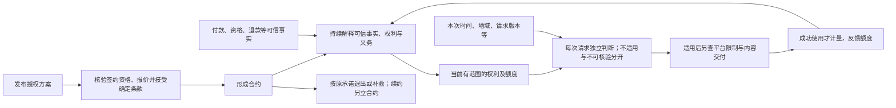
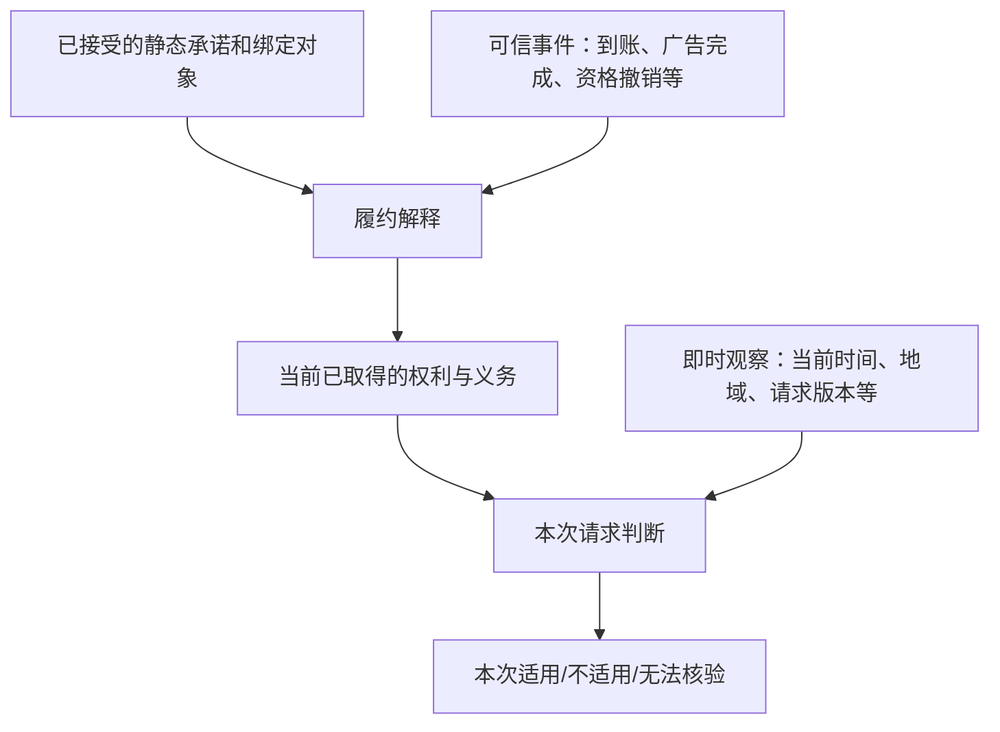
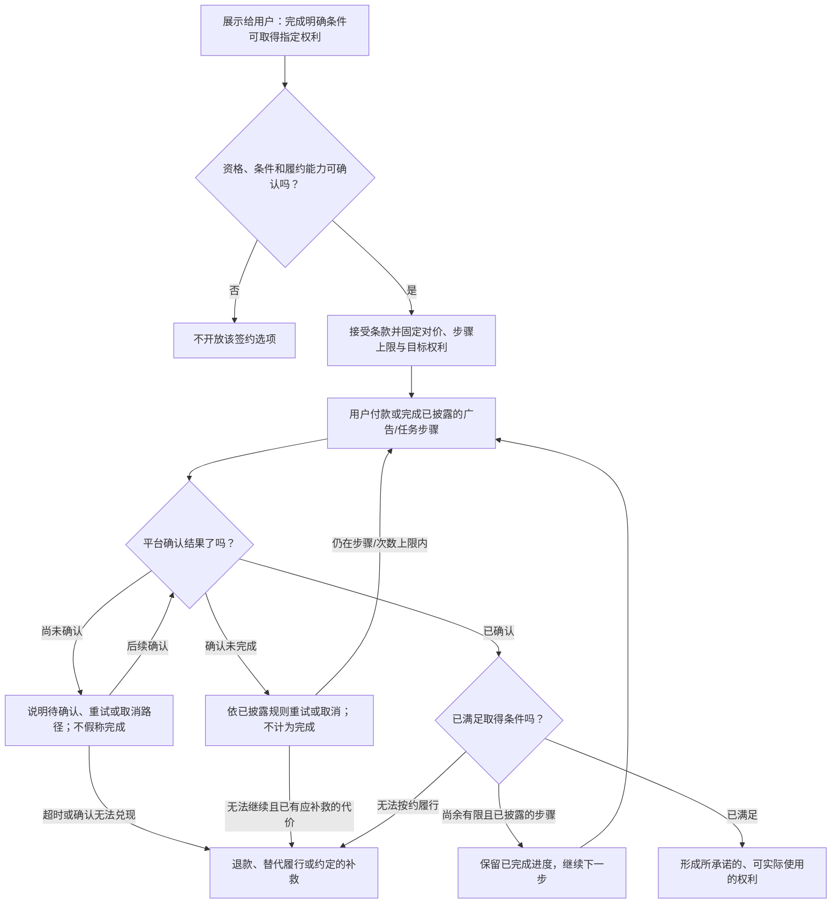

# 策略产品规则与能力边界

状态：**下一代产品规则讨论稿，不是现行语法或已上线能力**。本篇接在[最小流程与对象全景](./12-策略合约核心抽象与场景覆盖.md)之后。先确定平台能提供哪些能力、策略能作出什么承诺、什么设计不得发布；**事件、状态机和语言都是实现这些产品规则的工具，语法最后设计**。旧版语言以[《函数事件环境变量说明文档（2026.8.3）》](https://freelog.yuque.com/fsl0oy/gkva0w/nttygn2gzpwnoe4s?singleDoc#gmlYw)为依据；[原先的下一代草稿](./archive/13-下一代策略语言-分析与目标设计.md)仍在 archive。

## 1. 顶层产品规则：平台究竟允许承诺什么

策略的产品本质是**可供接受、可证明兑现的授权承诺**，不是“监听事件后跳到某状态”的程序。授权方可以在平台开放的能力内选择条件、价格、权利范围和补救方式；平台负责核验事实、保存接受的承诺、交付和审计。下面的「底线」是目标产品不得让策略绕过的约束；「可配置」表示作者可在平台批准的选项内选择；「待决」不能由语言设计者擅自补成默认值。此表是当前主规则索引，早期专题仅作为[归档的历史材料](./README.md)供回溯，不构成规则依据；后续新增业务对象必须复查这些规则，而不是只增加事件名。

| 编号 | 层次 | 顶层规则 | 性质 |
|---|---|---|---|
| R01 | 对象 | 标的、主体、授权发布、合约、订单、任务、权利都以稳定身份及明确关系绑定；标题、标签、当前页面不是合同依据。 | 底线 |
| R02 | 能力 | 策略只能引用平台已登记、适用于该内容类型的权利、条件和能力；每项能力声明提供者、证据、适用时点及失败处理。 | 底线 |
| R03 | 公开承诺 | 每个签约选项在接受前说清标的、可得权利、取得条件、总成本/步骤上限、范围、有效期、义务及不能履约时的处理。不得在付出代价后新增隐藏门槛。 | 底线 |
| R04 | 可兑现性 | 免费、支付、广告等每个宣称能取得权利的选项，都要对合格用户有有界、可达、非空的目标权利；正常完成的所有合法分支必须兑现，付出代价后不能兑现的分支必须进入可执行补救。 | 底线 |
| R05 | 签约 | 平台核验内容可签约、资格、报价和已有合同；使用方接受确定条款后才形成合约。报价失效须重新展示和接受，不能悄悄改变成交价。 | 底线 |
| R06 | 固定与变动 | 合约固定双方、标的、条款版本、成交价、选择、版本/单品范围规则和补救依据；签后变化只能按已接受规则影响后续履约，不得倒改历史。 | 底线 |
| R07 | 可信事实 | 用户动作、服务回调或对象变化不是自动生效的授权事实；经平台按来源、身份、关联、时间、唯一性确认后才可作用于合约，重复、迟到、撤销、更正须可处理。 | 底线 |
| R08 | 权利形成 | 一项权利必须指明受益主体、行为、标的及版本/单品、时间、地域/用途/设备、额度等适用边界和合同依据；付款、身份或一个名叫「授权」的状态本身不是权利。 | 底线 |
| R09 | 作用时点 | 每个输入必须明确是发布时配置、签约取样、持续事实、逐次观察还是成功使用结算。签约折扣不能因活动结束重算；本次 IP 变化通常只影响本次适用性。 | 底线 |
| R10 | 逐次判断 | 合约存续、权利已取得、本次请求是否落在范围内、平台强制限制、内容能否交付、是否成功计量必须分别判断；不符合与暂不可核验不可混同。 | 底线 |
| R11 | 多合约 | 已有授权不自动禁止再签。先区分同一交易重试、可证明无增量、独立增量、续期与真正冲突；旧约继续独立履行。每次使用须有一份完整适用的合同，不得拼接局部范围或混同额度、义务。 | 底线；增量/扣额细则见[多合同专题](./14-已有授权后的再次签约与多合同.md) |
| R12 | 交付与计量 | 获得权利不保证每次内容都可交付；不可交付要解释与补救。只有达到事先定义的成功点才扣对应权利额度，重试和并发不能重复扣。 | 底线 |
| R13 | 变更与退出 | 策略下线、停止新签、资源发新版或合集编辑不得默默削减旧约；续费是重新报价、接受并关联的新周期。彻底撤回或强制限制须处理受影响合约。 | 底线；范围模式可配置 |
| R14 | 最低保护 | 作者可选择平台允许的退款、替代、宽限等方案，但不能取消平台最低保护；未履约、争议、撤销或治理限制均须有可执行、可审计的处置路径。 | 底线；保护额度待决 |
| R15 | 可解释与可恢复 | 签约、权利变化、拒绝、未知、扣额和补救应说明所依据的条款与事实；关键异步步骤可重试、可更正、可申诉，不让用户困在无出口中间态。 | 底线 |
| R16 | 数据与权限 | 策略不能自造平台身份、支付成功或治理结论，不能任意调用外部服务或读取无关隐私；通知、退款、身份变更等副作用由受权限约束的能力执行。 | 底线 |

规则之间不是「后写覆盖先写」。平台最低保护与强制治理限定可承诺的外边界；签约时接受的条款限定作者后续行为；可信事实解释这些条款；本次请求观察只决定这一次的适用性。平台治理可以阻断交付，却不能伪称旧合约从未存在。R04 的有界兑现要求尤其适用于用户付款、观看广告或完成任务，详见第 7 节。


## 2. 事件只是对象变化的可信表达

对象可被创建、发生可证明的变化、结束或被更正。平台把**与授权有关、已经核验的变化**表达为事件，使合约能按已接受规则作出后续处理；事件本身不决定授予、撤销或暂停。行为意图与事件之间有一层确认：点击付款 → 订单创建 → 支付服务确认到账，只有约定的到账事实能满足付款条件。平台还要明确变更前后所指对象、来源和证据、发生/确认时间、作用范围、去重键及更正关系。

| 输入 | 例子 | 默认作用 |
|---|---|---|
| 对象产生/变化/结束的可信事件 | 合约成立、订单到账、广告任务完成、会员资格撤销、合集成员发布、治理决定、退款完成 | 按原承诺更新履约事实、进度、权利或补救；不是事件名直接映射一个授权状态 |
| 当前观察 | 此次请求时间、IP 推定地域、请求的版本/设备、当前可核验资格 | 只参与当前阶段或本次请求判断；通常不广播「IP 变化事件」给所有合约 |
| 成功使用及更正 | 下载达到交付成功点、播放达到计量点、先前计量被纠错 | 对选定合同权利结算额度；失败或重复不结算 |
| 无法核验 | 支付回调延迟、资格服务故障、地域证据不足 | 保持待确认或暂不放行，并提供恢复/申诉路径；不能伪装成「已确认失败」 |

新增广告、分享、活动或任何能力时，先问：**新增了什么可识别对象与关系、什么变化由谁证明、在六阶段主流程的哪里使用、能造成什么已披露的合同效果、失败怎样补救**。答不全就不能让策略自由监听一个字符串。时间到期若确需驱动通知或结算，可以生成经平台记录的到期事项；逐次访问时比较当前时间，不需要每秒制造事件。

## 3. 策略的表达边界与产品验收

策略的可写空间不是「凡是语言能执行的都能写」。产品先为每个位置划定输入、承诺和权力边界；语言只能表达这些已批准的选择：

| 策略位置 | 可以由授权方选择和承诺 | 不属于策略的权力 |
|---|---|---|
| 发布与签约 | 适用的资源/合集、权利选项、使用方资格、报价和可选择的范围 | 创造资源类型能力；强迫用户接受未展示的条款；替平台确认身份 |
| 取得权利 | 免费、付款、广告、任务等已登记条件；完成点、上限、目标权利及失败补救选项 | 把点击当完成；自造支付成功；无限追加代价；以无权进度冒充最终授权 |
| 权利边界 | 行为、主体、版本/单品、期限、地域、用途、设备、额度及适用事实的读取时点 | 事后缩小旧约；从另一份合约借范围；让标题或当前目录取代稳定身份 |
| 使用与结算 | 已登记的成功计量点、额度来源以及本次需观察的环境 | 自行宣布交付成功；失败扣额；未知事实默认满足；任意访问用户隐私 |
| 后续履约 | 在平台底线内选择续约、宽限、通知、退款、替代或解除方案 | 直接改写历史合同；跳过平台结算/治理；静默撤回有合同的内容 |

策略可声明对已登记事件的**业务反应**，但不能定义任意事件提供者或私有「支付成功」，也不能任意调用服务、修改身份或治理结论。平台能力的具体注册、权限和最低保护先定，语法才知道应开放哪些表达式。

产品验收分四次，不应把「能编译」等同「可发行」：

1. **能力登记**：核对对象关系、可信来源、权限、证据、去重/更正、失败及隐私边界。
2. **发布审查**：逐签约选项核对完整承诺、权利范围、所有有代价的正常完成分支、上限、死路及补救；不满足顶层底线即不得发布。
3. **签约复核**：检查当下标的/依赖可交付、资格、报价、活动参与和能力可用，展示最终选择与旧合同比较结果，再固定条款。
4. **履约审计**：按可信事实执行、逐次判断、成功计量及补救；重复/迟到/更正要能恢复并解释给当事人。

待决的默认保护、动态合集范围、重复签约细则和平台能力权限须由产品定稿，再允许作者选择。**产品规则与能力契约是语言的输入，语言只负责无歧义表达；状态机是其中一种履约执行技术，不是产品规则来源。**

## 4. 从旧语言继承什么、纠正什么

旧版已有签约对象限制（`FOR`）、发布时的 `policy.*`、签约后的 `contract.*`、`USE/DEMAND` 声明、事件与动作、状态/色块，以及支付、广告、分享、时间、标签等平台能力。这些证明平台已经在处理**谁签约、发生什么、合约如何变化**；不能简单说旧语言只有一个 Permit/Deny。

但旧版把很多业务结果压在“事件 → 状态 → 授权色块”里。例如付款可以让合约取得下载权；地域从中国变成美国却通常只改变**本次请求是否落在下载权范围内**，不应为每次 IP 变化迁移整份合约。旧文档中的 `Event.Custom.AcceptEvent` 是通用接收入口，不能让任意标题字符串自动成为可信支付、身份或折扣事实。旧版教程还包含 pending/待讨论项目；本篇不能据此宣称它们已可用。

因此新语言的主语不再是“当前状态叫什么”，而是：

> 哪个使用方接受了哪份确定承诺；凭什么可信事实取得什么权利；此权利允许他在什么范围内做什么；一次使用如何判断和计量；不能履约时如何处理。

## 5. 承诺从签约到使用的闭环



一份策略应分成六个语义块。块名只是**产品语义名称**，不是已经确定的 DSL 关键字：

| 语义块 | 作者必须说明 | 平台固定或执行什么 |
|---|---|---|
| **授权发布** | 授权方、线上资源/合集、可授予行为、适用策略版本 | 绑定稳定身份；停用只影响未来签约 |
| **签约与报价** | 谁有资格签；价格与促销怎样算；哪些选择和事实按签约时固定 | 形成独立合约，固定接受的条款版本和成交价 |
| **权利取得** | 免费立即取得，或哪项经核验的支付/广告/资格事实使哪项权利形成 | 按对象关系、来源、时间、唯一性核验；不能把点击当完成 |
| **权利范围** | 使用主体、行为、资源/版本/单品、期间、地域、用途、设备、额度 | 保存有边界的权利，不只保存 Permit/Deny |
| **逐次使用与计量** | 哪些当前事实要重新读取；什么算成功使用、扣哪份权利 | 每次独立判断；交付和授权分开；成功后原子结算 |
| **后续履约与补救** | 续约、退款、撤回、不可交付、争议的约定选项 | 新周期另立合约；旧约有解释和平台最低保护 |

## 6. 输入不是一律“监听事件”



语言应强制作者标明一个事实在**什么时候**被使用，而不是只写事实名称：

| 读取方式 | 例子 | 后续变化的作用 |
|---|---|---|
| **签约取样** | 会员身份参与本次折扣；活动与卖方参与均有效 | 成交价固定；之后资格或活动变化不倒改 |
| **事实确认后处理** | 本合约订单到账；指定广告任务完成 | 可形成权利、履行义务或留下补救依据；重复事实只处理一次 |
| **持续变化关注** | 策略明确约定资格被撤销后的某项后果 | 只影响该策略声明的后续履约；不得暗中改变未约定的权利 |
| **逐次读取** | 本次地域、时间、请求版本、当前资格 | 只形成这次使用结论；不因请求情境变化改写合约 |
| **成功结果结算** | 成功下载一次、播放达到计量点 | 扣明确的一份权利额度；失败和重复通知不扣 |

同一种平台身份可以同时用于不同位置，但每个用途都须显式选择。对“平台全场八折”，平台活动、授权方参与关系、使用方资格三项在**签约报价时**共同决定本次价格；活动开始、卖方加入等可以是动态事件，却不应让旧合约不断重算价格。

## 7. 状态流程必须兑现承诺：不是流转了就算履约

状态可以记录“待付款、已看一次广告、待核验、已退款”等过程，但**状态变化本身不是授权成果**。对外宣称“支付 1 元获得下载权”或“看两次广告获得浏览权”时，语言必须把这一选项的**对价、完成条件、目标权利、最多步骤及失败补救**绑定成一份可检查的承诺。免费立即授权也要真的在签约后形成权利，不能只进入一个叫 `Auth`、实际没有任何可用范围的状态。



这里要求的不是“图上**存在一条**通向 Permit 的箭头”。对每个向用户展示的获得权益选项、每类被允许签约的使用方，在其满足已披露且可履行的条件后，**所有正常完成路径**都应兑现对应权利；已经实际付出金钱或完成了被计入的广告/任务，却因平台、作者或外部能力失败而无法兑现时，必须有可执行的补救路径。用户主动放弃、条件经确认未完成可以不授予，但已完成步骤的有效期或放弃后果必须事先说明，不能伪装成已履约。若选项只承诺一个中间积分或资格，也必须明确它最终能换取什么；不能以“获得进度”掩盖永远拿不到宣传的授权。

| 产品不变量 | 必须拒绝或阻止的设计 | 何时把关 |
|---|---|---|
| **目标权利明确且非空** | “授权状态”没有可用行为、标的、版本/单品或有效期间；零额度伪装为可用权；宣传多项权益却只授予其中一项 | 发布前逐项检查；签约前展示 |
| **承诺路径可达** | 支付/广告成功后只能流向无权状态；授予条件互相矛盾，或依赖未注册、无法提供的事件 | 发布前检查状态图、条件和能力；签约时复核前提 |
| **付出代价后的每条分支有结局** | 某个合法分支在用户付款或完成广告后落入无权死路，既无权利也无补救 | 发布前检查所有可达分支；运行时处理失败与超时 |
| **步骤、成本和等待有界** | 为取得本次承诺的权利无限要求再看广告、再付款，或循环重置已完成进度；额外条件在签约后才出现 | 发布前检查循环和上限；签约展示最大对价、次数、期限 |
| **条件可核验，进度可保留** | 把点击支付当到账、把广告开始当完成；已证实的步骤因重试或通知重复而丢失 | 事件能力接入与运行时去重、更正 |
| **获得的权利可以按约使用** | 路径到达 `Auth`，但指定内容/版本不存在、期间在取得前已过或范围明显为空；后来不可交付却宣称无权 | 发布及签约前检查显然不可兑现的范围；运行时独立检查交付并补救 |
| **旧约不受后续改动偷袭** | 作者改策略、活动结束或新加条件，使已付款/已看广告者的目标权利消失 | 合约固定条款版本；后续变化只能按原承诺处理 |
| **结果确定且能解释** | 同一可信事件同时走向互斥结果；付费后因未披露的优先级、随机分支或脚本副作用失去权益 | 发布前检查分支冲突和每种结果；运行时记录所依据的事实与条款 |

例子：

- **应拒绝发布**：初始 → 看广告 → 待广告 → 看广告 → 待广告；循环没有次数上限，也没有取得浏览权或补救的出口。
- **仍应拒绝发布**：初始 → 支付 1 元 → 待 VIP 身份 → 下载权；签约前未披露 VIP 条件，或合格使用方也没有可行途径取得它。图上虽有授权节点，付款承诺仍不可兑现。
- **可以成立**：明确“最多看两次指定广告取得 24 小时浏览权”；每次经核验的完成记录被保留，第二次完成后授予有标的和范围的权利；广告不可用、超时或无法兑现时，按签约前展示的替代/补救规则处理。

“可实际使用”不等于保证用户在任何地域、任何时刻都能使用；而是权利的标的和范围不为空，且在已披露条件下存在可行的使用情境。地域、版本、期限限制必须在签约前看得见；不能让 24 小时权益在完成多步任务前已经过期。

发布前只能证明**结构和已知条件**：是否存在有意义的权利、可达路径、不可满足条件、无出口循环、无补救的有对价终局。它不能证明未来广告服务永不故障或内容永远可交付。因此签约时还须核实当下的资源、资格、报价与能力可用性；运行时必须保存进度、处理迟到/重复事实，并在无法兑现时实际执行补救。三层都必要，不能把一项编译通过当作产品履约保证。

## 8. 一份策略应该能表达的产品说明示例

下面是**候选的可读句式，不是旧编译器可执行源码，也不是已定稿关键字**。故意用业务块展示语义，避免先为状态机造句法：

```text
授权发布「视频 R 的个人下载许可」
  标的：线上资源 R
  授权方：资源所属方

签约
  使用方：个人用户
  报价：30 元；若平台活动 A 有效、授权方已参加且用户符合资格，
        在接受时确定折后价
  承诺：本合约订单按成交价付款确认后取得下述下载权；不能兑现时按后续条款补救
  固定：授权发布版本、双方、资源 R、版本范围 1.x、成交价、补救条款

取得权利「下载」
  条件：本合约订单按固定成交价和币种由支付服务确认到账
  授予：本合约使用方对资源 R 的 1.x 版本下载
  期间：从付款确认起 30 天
  使用范围：每次请求所在国家/区域为中国大陆
  额度：最多 10 次成功下载

使用「下载」
  每次核对：使用者、行为、资源及版本、当前时间/地域、剩余额度
  结论：适用 / 不适用 / 关键事实暂不可核验，并给出依据
  交付：适用后另查内容是否可交付
  计量：成功交付一次，才从本次所依据的权利扣一次

后续
  续约：重新报价和接受，形成关联的新周期合约
  不可交付：按已接受条款和平台最低保护通知、退款或其他补救
```

同一合约在中国的请求可适用、在美国的请求可不适用；付款事实、合约、下载权和余额均不因换 IP 自动变化。若改成广告换取 24 小时浏览权，替换的是**取得条件、权利行为与期间**，而不是发明一套新核心流程。

## 9. 旧版概念如何迁移

| 旧版概念 | 下一代保留的业务含义 | 不再照搬的部分 |
|---|---|---|
| `FOR` | 签约方类型及资格限制 | 不把签约资格与使用时持续资格混为一谈 |
| `policy.*` / `contract.*` | 发布时与签约后是不同作用域 | 增加明确的事件事实、请求情境、交付结果作用域；不允许跨时点偷读 |
| `USE/DEMAND` | 对外部对象和事实可以绑定或延后读取 | “惰性”不能掩盖究竟是签约快照、事件核验还是每次请求读取 |
| `Event.Transaction.Pay` 等 | 平台注册、带身份和证据的业务事实能力 | 通用事件名或支付按钮不能代替订单到账证明 |
| `Event.Custom.WatchAD/ShareResource` | 广告、分享等行为可成为权利条件 | 先规定哪个完成点可信；观看开始、链接生成、实际完成不能混用 |
| `Event.Time.Relative/Schedule` | 时限和需要执行的时间边界事项 | 不为每秒经过或每次到期访问强迫合约状态迁移 |
| 状态、色块、`Initial/Permit/Deny` | 可表示订单、争议、补救等持久履约阶段 | 不充当所有权利范围和每次授权结论的唯一容器 |
| `Query/fun/api` | 平台可提供查询、通知和受控履约能力 | 策略不得任意调用服务或修改别人的身份；副作用须有权限和可审计边界 |

**兼容路线**：现行线上策略继续由旧语言处理。下一代语言须有独立版本和显式迁移评估；不能靠把旧语法替换关键字自动升级，更不能让新设计文档冒充当前服务端编译能力。[现行 CLI 手写策略接入边界](../一期/产品方案/脚手架设计/ARCHITECTURE/10-策略语言接入.md)仍以旧语言为准。

## 10. 发布前和运行时的最低保障

- 发布前校验对象类型、稳定身份、关系、事件来源与参数类型；指定版本/合集成员规则、价格、时间、地域、额度的语义必须无歧义。
- 对每个宣称可通过付费、广告或任务取得权利的选项，验证第 7 节的承诺路径、有界成本和无权补救；不能以“存在一个授权状态”代替验证。
- 编译/验证要区分签约取样、持续事实、逐次观察和成功使用；不得把一个作用域的值假装能在另一阶段读取。
- 每种外部事件都要有提供者、发生与确认时间、去重键、撤销/更正路径。未知来源和已确认不符合是不同结果，均不能凭猜测放行。
- 多合同逐份判断，不能拼接两份合同的局部范围制造任何一份都没授予的权利；一次额度消耗须有明确归属和并发一致性。
- 交付异常、退款、下架、争议不能绕过平台最低保护。策略的机器语义必须能生成给使用方看的签约说明和每次拒绝/补救解释。

## 11. 尚未定稿的产品问题

1. 平台促销和卖方参与在报价到签约之间变化时，锁价窗口与复核规则是什么？
2. 广告和分享奖励的完成点、证据来源、重复领取及跨合同复用规则是什么？
3. 持续资格撤销是限制后续使用、终止某项权利，还是只影响续约？须让作者在平台允许的范围内选择，并向使用方提前展示。
4. 版本“全部”和合集动态成员是否包含签约后新增项；移出或不可交付时何种补救是最低保障？
5. 多份合同同时覆盖请求时的依据选择和额度扣减顺序是什么？
6. 哪些平台能力有权产生副作用，例如设置身份标签或发送事件；哪些只能提供可信事实，绝不能由作者策略直接操作？
7. 已完成一次广告但后续广告不可用时，进度保留多久、提供何种替代或补救？用户主动放弃时怎样事先说明结果？
8. 是否允许“付出代价仅换取抽奖机会”等非确定权益？若允许，必须独立于“完成条件即获授权”的产品类型，不能用随机状态流转伪装确定承诺。

先拿免费、付费、广告、分享、会员资格、平台促销、版本/合集变化、地域变化、额度并发、退款撤回各写一份**签约前可读、运行时可解释**的样例，检验这六个语义块。样例走通后再定正式句法与编译模型。
