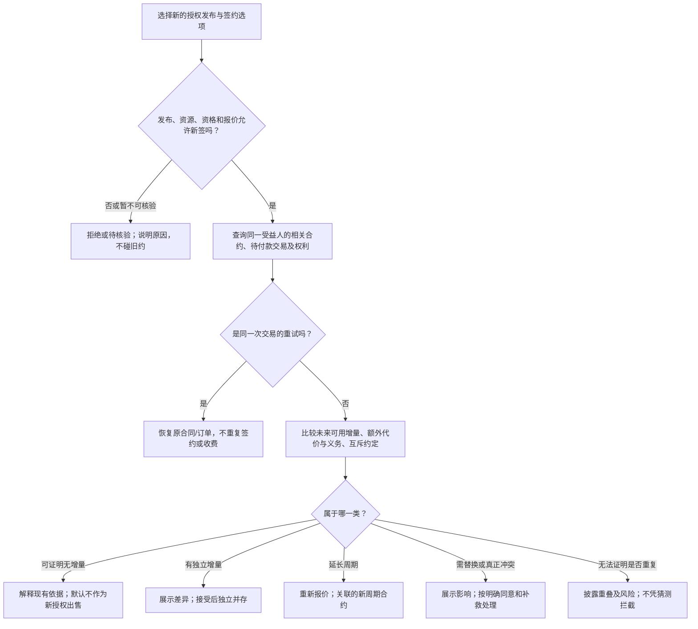

# 已有授权后的再次签约、多合同与续费

状态：**下一代授权产品规则讨论稿，不代表现行接口已实现**。本篇讨论同一受益人对同一内容或重叠内容再次选择授权发布的情况；不同受益人的购买、赠与和组织分配，先分别确认真正的权利归属，不能只按付款账户查重。基础对象和流程见[12](./12-策略合约核心抽象与场景覆盖.md)，顶层规则见[13](./13-策略产品规则与能力边界.md)。

## 目标

用户签过约并取得一项授权后，可以签另一项**确有独立价值且与既有承诺相容**的授权。平台须先核实新授权发布仍开放、用户仍符合签约资格，再比较新选项带来的权利、期间、容量、保障及新增义务。完全重复的交易应恢复原交易；可证明没有新增价值的授权不应冒充新权益再次收费；有真实增量的可以并存、升级或续期；真正互斥的必须先解决冲突。旧合同始终独立存在，除非双方按明确规则完成替换或解除。

这里的「策略」不是模板名或一段语言代码。比较单位是**具体资源上的授权发布及其签约选项**，并且要拿它与使用方已有的全部相关合约及平台发放的可执行权利比较。两个不同策略 ID 可以卖出完全相同的权益；一个策略下的两个档位也可能有实质差异。每次接受都会产生自己的合同依据，不能修改旧合同来模拟新签约。

## 1. 签约前的判断顺序

先区分**能否发起新签约**与**签约是否值得、如何共存**。资源或该授权发布停止新签、使用方不符合资格、报价无法确认时，不进入后一步；但这不改变旧约。新选项还须独立满足[可兑现承诺规则](./13-策略产品规则与能力边界.md)：不能拿旧约已经提供的权利，冒充新付费/广告承诺已履行。只有新交易本身可成立，才比较旧合同与新选项。

| 比较维度 | 签约前要问什么 | 常见误判 |
|---|---|---|
| 主体与来源 | 谁是真正受益人？权利来自单资源、合集、活动、试用还是其他合同？ | 同一付款人替不同受益人签约，被当成重复 |
| 行为与标的 | 浏览、下载、安装、商用、转授权等是否相同？是合集整体权利还是某单品权利？ | 有单品浏览权，就以为拥有合集整体发行权 |
| 内容范围 | 版本、合集单品、未来新增版本/成员规则怎样重叠？ | 只比较资源 ID 或当前页面目录 |
| 使用情境 | 地域、用途、设备、渠道、同时使用数、证据要求有何不同？ | 把两份合约的宽松字段拼成一份不存在的授权 |
| 时间与条件 | 何时开始、何时结束？旧约是否依赖持续会员资格？新约能否在旧约失效时独立起效？ | 只看「今天有权」，漏掉到期后的价值或资格风险 |
| 容量与服务 | 次数、时长、并发席位是否可累加？是否有不同的交付或补救保障？ | 把可再次购买的 10 次额度当作零增量 |
| 对价与义务 | 新价格、广告任务、署名、用途限制、自动续费、撤回条款和持续义务是什么？ | 只比较权利范围，忽略新负担或误以为旧债被新约抵消 |

「没有增量」只在能够确认**合同已声明的当前与未来适用情境中，新选项没有新增可行使能力、容量、期间、较轻的使用义务或独立保障**，且不存在不同的受益人或合法的并行席位时成立。旧约今天可用但明天到期、旧约可因持续资格失效而不可用、新选项提供额外额度或更强的可执行保障，都不能简单判为重复。新策略仅更便宜，不会自动返还旧约已付费用，因此价格下降本身不是旧用户再买同一权利的增量；若要补差价、退差价或迁移，应另有明确产品方案。

策略可很复杂，平台未必能证明两个选项语义等价。**仅以「重复」为由强拦截时，必须是同一交易重试或可证明无增量；无法证明时标示「可能重叠」并展示并存后的代价与义务**，不能假装一定更好，也不能因比较器能力不足封锁有效交易。这不放松独立的签约资格、治理和真实冲突门槛；「无法比较」也不是让未知支付状态再次收费的理由。签约时再次确认报价与合同状态，避免同时点击、并发购买或支付回调迟到造成双合同、双扣款。

### 已有记录处于什么状态

| 情况 | 新签约的默认处理 |
|---|---|
| 同一请求重试、支付回调重送 | 返回原签约和订单结果；不得生成第二份合同、扣第二次款。 |
| 已接受但仍待付款/待广告完成 | 优先恢复原待履行事项；选择不同选项时展示放弃、取消或并存后果，不把「尚未取得权利」误认为没有合同。 |
| 已付款但权利仍待核验或发放 | 先查明和恢复原交易，不再出售同一承诺来掩盖履约故障。 |
| 生效中且本次请求不在地域、版本等范围内 | 旧约仍有效；新选项若覆盖缺失范围可签，不能称旧约「暂停」或「已无授权」。 |
| 暂停、宽限、资格待恢复 | 保留旧约未来可能恢复的价值；新选项若独立有效，可并存，但要说明两约条件及重复风险。 |
| 交付受限、争议或补救中 | 不把旧约从比较中删除；新签不得替代应完成的退款、修复或争议处理。若确有其他可交付方案，说明其独立代价。 |
| 额度耗尽但合同未到期 | 若新选项明确增加可使用额度，可签；旧约的零余额与其历史、义务仍保留。 |
| 旧约已预付下一周期或开启自动续费 | 把已确定的未来周期或将发生的续费义务纳入比较；新签可能产生重叠收费，须展示下一次扣款及取消入口，但不擅自关闭旧约自动续费。 |
| 已到期、已解除或取消 | 不再提供当前权利，但历史、退款与补救仍可查；新授权可按当下资格和报价签订，续期关系另行标明。 |

停止某条策略的新签约只使**那条授权发布**不能再被选；不自动关闭同资源的其他开放选项，也不改变旧约。资源整体停止新签约则阻断其所有新交易，但老用户的交付和补救仍依旧约继续。平台强制限制优先作为独立治理门槛，不能被另一条策略绕过。这些是[顶层规则](./13-策略产品规则与能力边界.md)的产品目标，不代表现行接口已有这些状态。

## 2. 正交场景：新选项到底增加了什么

下面每行只改变一个主要维度；真实签约可能同时命中数行，应先算完整新选项，再展示每一项增量与负担。表中「允许」的前提均是新发布可签、资格满足、承诺可履行且无真实互斥约定。

| 已有权利 → 新选项 | 结果及解释 |
|---|---|
| 同一条免费许可、同一期间与范围，再点一次 | 指向原合同；不产生毫无意义的第二份合同。 |
| 已有从今天起算的 30 天下载权，再买一份起止日相同的下载权 | 若无额外额度、席位或保障，属于无增量；默认不出售。 |
| 当前 30 天下载权将在 10 天后到期，新 30 天从今天起算 | 可能有 20 天的未来增量，但重叠期会被浪费；展示确切起止，优先提供明确的续期起算方案。 |
| 当前可浏览，新选项可下载或商用 | 新能力可独立签约；浏览合同不因新约消失。 |
| 已有免费浏览，新选项把浏览与下载打包出售 | 只因下载部分有增量而可签；须展示浏览部分已拥有，不能擅自把套餐总价按比例减免或称两项都是新增。 |
| 当前只覆盖版本 1.x，新选项覆盖 2.x 或全部未来版本 | 有版本增量；签约前具体说明新旧版本范围和后续版本规则。 |
| 当前只可在中国使用，新选项可在美国使用 | 地域增量，可并存；到美国不使旧合同暂停。 |
| 当前有 10 次且尚余 2 次，新选项另给可累加的 10 次 | 容量增量，可签；不能把旧合同改成 20 次或把两边义务混合。 |
| 当前有 10 次且已用完，新选项可再次购入 10 次 | 允许再购；若产品规定「每人仅购一次」，该限制须事先披露且不能剥夺旧约。 |
| 当前权利持续依赖会员身份，新选项同范围但不依赖会员 | 新约在会员资格失效时仍可用，存在独立保障；不能只看签约当天两约都可用就判重复。 |
| 当前合集仅授予单品 A 的浏览，新选项授予 A 的下载 | 有行为增量；要逐项比较该单品版本范围。 |
| 当前合集已授予 A 的下载，新选项单独授权 A 的同一下载 | 若期限、额度、版本、条件、保障均相同且无其他增量，默认提示已有依据；不能仅因为来源不同就收费。 |
| 当前分别拥有 A、B 的单品使用权，新选项授予整个合集的发行/改编权 | 单品权利不自动拼成合集整体行为；有新的合同行为，可签。 |
| 当前个人许可，新选项商业许可 | 可以并存；商用请求须依商业合约，个人许可本身不构成禁止购买商业权的「冲突」。 |
| 旧许可使用时必须署名，新许可对其所授权的使用无需署名 | 若该差异可独立兑现，属于较轻使用义务，可签；新约不自动免除已发生的旧约署名或其他持续义务。 |
| 旧约提供普通使用，新约提供确实可执行的独占权或更高交付保障 | 属于不同承诺，可签；须核查授权方有权提供且能兑现，不能只换一个策略标题。 |
| 旧约付费，新条款免费或降价但权益完全相同 | 不重新收费或自动改价；是否允许退差价、迁移到新方案是另行明确的产品规则。 |
| 新选项附赠另一个资源、独立保障或额外席位 | 即使主权利重叠，也需把附加项作为真实增量核验和展示；不能用模糊赠品掩盖重复收费。 |
| 用户为另一个家庭成员或组织受益人购买 | 先核对平台是否支持该受益人和转授关系；若是独立受益人，不按付款账户当作重复。 |

发行方可在平台允许范围内设置促销次数、席位容量、仅限新用户等签约资格，但「新用户」究竟指从未签过、当前无有效合约，还是首次购买该选项，必须在报价前定义并明示。这类限制只约束**未来新签约**，不能靠新策略暗中限制旧合约。试用、赠送、活动取得的权利也参与重复比较，不能只查询付费合同。若几份旧约合起来看似覆盖新选项的各次独立使用，还要核查新选项是否提供它们不能共同提供的整体行为、连续期间或统一保障；不能仅以范围集合相似就判无增量。

## 3. 什么才算真正冲突

两个许可范围不同，或一个更严格、一个更宽松，**并不天然冲突**。授权是按合约来源存在的正面许可：个人合同不禁止同一用户后来获得商用许可；中国限定合同也不禁止美国限定合同。旧合同中的付款、署名、保密等义务不会因新合同较宽松而自动消失。

真正的冲突须指出明确来源和无法同时履行的事项，例如：旧约经明示接受的排他使用义务与新约要求的相反行为、平台只允许一份占用型席位合同、同一周期明示不得叠加的订阅方案，或经过平台确认的治理禁令。仅仅「作者不想用户买别人的策略」不是充分理由。冲突不能靠给策略设一个模糊优先级解决，须在签约前给出：所依据的旧约条款、新选项条款、受影响权利与费用，以及等待、并存受限、显式替换或人工处理的可行路径。

## 4. 多合同的默认聚合规则

推荐规则是“**权利按合同来源分别存在，使用时选择能够完整支持该动作的一份有效合同**”。

- 对浏览、下载、使用等可独立判断的能力，只要任一有效合同在相应范围内授予，即可行使。
- 次数、额度、设备数、地域、用途等限制不应简单取最大值；平台必须知道本次使用消耗或依据的是哪一份合同。
- 付款、署名、分成、通知等义务仍归属于产生它的合同，不能因另一份合同存在而自动消失。
- 用户页面应给出“当前使用依据哪份合同”的解释，并允许在多份都可用时查看选择逻辑。

一次请求不能从 A 合同取「允许商用」、B 合同取「允许美国」再拼出一份两者都没有授予的「美国商用」授权。若行为本身需要合集整体许可，分别获得各单品许可也不自动满足。

当多份完整合同都可支持这一次请求，平台须在交付前确定依据，成功后只计量选定合同。建议的产品顺序是：尊重用户已明确选择的完整适用合同；否则优先不会消耗有限额度且不会新增不利义务的合同；若仍有多个可比较的额度合同，可优先使用更早到期的一份。**若义务、期限或计量效果无法可靠比较，不得暗中择一消耗，应给用户选择或按事先明示的稳定规则处理。**交付失败不扣额，并发使用最后一次额度也不能在两份合同中双扣。若选定额度在并发请求中先被耗尽，应在交付前重新取得有效依据；不能事后暗扣另一份合同。六阶段的授权、交付与计量边界见[12](./12-策略合约核心抽象与场景覆盖.md)。

平台显示「你现在可以下载」时，还应能展开：依据哪份合同、适用范围、剩余额度、另一份合同为何未被选、完成后会扣哪份额度。停止新签约、合集移出单品、发布新版本，都不应让这些解释凭空消失。

## 5. 升级与替换

升级不是悄悄让新合同覆盖旧合同，而是一项明确交易。升级页应显示：

- 旧合同与新合同各自的权利和限制；
- 新增、减少和保持不变的权益；
- 旧合同是否继续有效、是否按比例抵扣、是否提前结束；
- 支付差额、退款或不可退款条款；
- 发生失败时恢复到哪个合同状态。

推荐默认：新合同只增加新权益，旧合同继续保留。替换属于单独交易：展示旧权利将失去什么、旧约剩余期间与额度如何处理、是否退费或抵扣、新约不生效时旧约如何恢复。使用方明确接受、新约达到约定的生效条件且平台确认必要结算前，不得先终止旧约；失败或超时要保留或恢复原权利。之后才可终止或迁移旧约的指定部分；不得擦除合同历史。新合同「等级更高」或「价格更贵」不是自动覆盖旧约的理由。最低退款、抵扣和补救方案尚待[顶层规则中的产品决策](./13-策略产品规则与能力边界.md)。

## 6. 续费：新的周期合同

续费应创建新的合同周期并关联上一周期，而不是修改旧合同。这样可保留每一期的价格、资格、付款和实际条款，也可支持首期优惠、连续续费折扣和恢复订阅。

续费产品需要明确：

| 决策 | 推荐规则 |
|---|---|
| 何时可续 | 在到期前的续费窗口内；到期后可转为重新签约；窗口长度待产品定稿 |
| 续费起算 | 显示新周期起止；提前付款不应无提示地从付款当天起算、吞掉旧约剩余天数 |
| 续费内容范围 | 默认沿用上一周期的单品范围和版本范围；若任一范围会变，必须显式确认 |
| 续费条款 | 默认沿用上一期已接受条款；采用新版时必须展示差异并重新确认 |
| 续费价格 | 显示原价、续费价、折扣依据与下次价格规则 |
| 自动续费 | 必须单独授权、可随时关闭，并在扣款前提供提醒和取消窗口 |
| 付款失败 | 不倒改旧周期；按宽限期或到期规则进入暂停/结束 |

## 7. 签约前展示与验收矩阵

比较结论应展示「已有哪份合同」「新选项实际增加/重叠/减少什么」「新增费用和持续义务」「旧约是否仍有效」「新旧期间和额度怎样结算」。结果要区分**已证实重复、已证实增量、已证实冲突、暂不可核验/难以比较**；后两种不能被偷换成普通的「已有授权」。有偿但可能重叠的选项，接受前需特别说明并让用户确认。

至少用下列组合验收产品判断，而非只测试「同一资源再签一次」：

| 变化轴 | 必测对照 |
|---|---|
| 合同状态 | 待付款/到账待发权、生效、暂停可恢复、补救中、额度耗尽、到期/解除 |
| 权利关系 | 完全相同、真包含、部分交叉、不同动作、整体合集权利与单品权利、独立受益人 |
| 未来关系 | 即将到期、新约立即起算/到期后起算、已预付周期/自动续费、旧约资格可能失效、新约持续条件不同 |
| 成本与义务 | 免费/付费、价格变动、额外任务、署名/商用义务、排他义务、补救保障不同 |
| 事件与并发 | 同一签约重试、两端同时签、支付迟到、退款中、额度并发用尽、事实更正 |
| 渠道与供给 | 单资源/合集交叉、试用/活动/赠送、策略停签/资源停签、平台强制限制 |

尚须由产品、法务与结算共同定稿：哪些保障差异足以构成可售增量；不能可靠比较时有偿签约是否必须二次确认；平台允许哪些排他或「每人一次」商品；续费锁价和起算窗口；多份均适用合同时用户能否预设扣额偏好；旧约替换时最低退款/抵扣与失败恢复。**这些未决点不应由某条策略语言或客户端自行选择默认值。**
