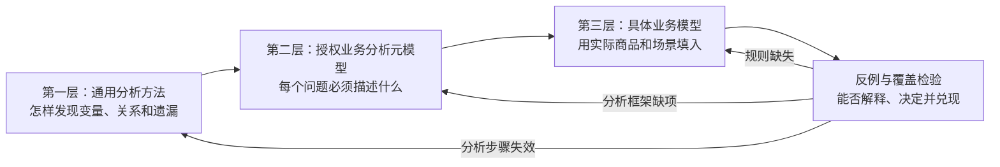
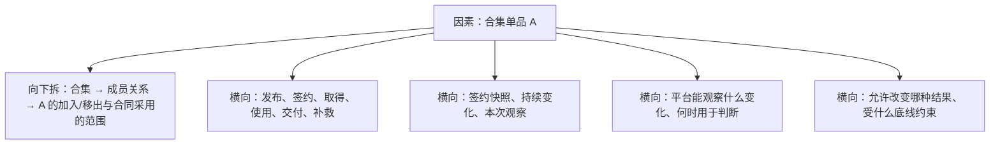
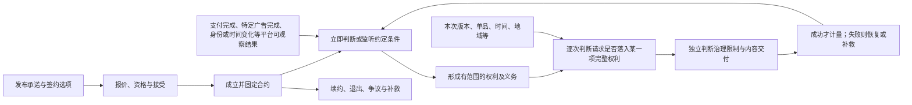
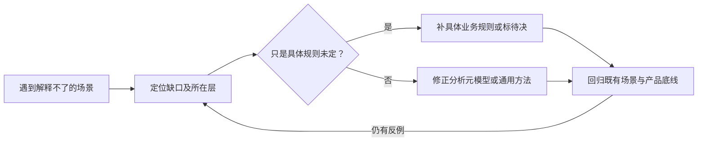

# 授权产品的分析方法与可修正元模型

状态：**下一代授权产品的分析方案讨论稿**。本篇不是策略语言语法、系统实现方案，也不新增已经定稿的平台规则。[第 12 篇](./12-策略合约核心抽象与场景覆盖.md)给出当前核心业务流程，[第 13 篇](./13-策略产品规则与能力边界.md)给出当前产品底线；本篇回答另一个问题：**怎样系统地分析它们尚未覆盖的业务，以及发现分析不充分时怎样修正分析方法本身。**平台如何采集、核验和投递观察结果属于能力实现，不在本篇展开；产品层只规定哪些结果可供策略判断或监听、结果的业务含义及其允许造成的合同效果。

这不是“把能想到的名词列完”。业务对象和能力会不断扩展，不存在一次列举便覆盖未来一切的清单。我们需要一套可以复用、可以被反例挑战、可以迭代的分析模型；完整性只针对**当前承诺支持的产品能力和场景**检验，未知与待决必须显式留下。

## 阅读地图：三层模型，一个反馈环

第一层是跨领域可用的思考方法；第二层是分析授权产品的“表格结构”，规定问题必须拆到什么程度；第三层才是资源、合集、身份、付款等具体内容。反例不一定推翻整套模型：要先定位缺口属于哪一层，不能每遇到一个异常就给单个场景打补丁。

## 第一层：通用分析方法

### 1. 从目标和决策出发，不从名词出发

先说清系统要作出哪些不同的决定，以及每个决定的依据和结果。授权业务至少有六类主结果：**能否新签约、合约是否成立、哪项权利已取得、本次请求是否适用、能否交付、是否成功计量**；退出、争议与补救是贯穿其间的后续处理，不应被塞成某一种“无权”结果。一个问题若不能指出影响哪个结果或后续责任，就仍然只是话题，不是可分析的因素。

分析同时沿两个方向展开：

- **从结果向后追问**：要作出“本次请求是否适用”的决定，需要哪项权利、哪份合同、哪个请求、哪些范围字段，以及平台提供哪种可观察结果？
- **从变化向前追问**：如果用户资格变化、资源发布新版或合集移出单品，会影响哪些后续决定？哪些既有承诺绝不能因此改变？

两条路径在同一个决策点会合。只做前一种，容易遗漏变化；只做后一种，容易把所有变化都误写成“授权状态迁移”。

### 2. 先纵向分解，再横向交叉

纵向分解用于找到事物内部的层次：**领域 → 对象或关系 → 属性 → 子属性、取值及边界**。例如“合集”不能停在一个名词上，还要看到合集与单品的成员关系、关系何时生效、某份合同采用什么成员范围，以及“单品数量”只是从关系算出的派生值。

横向交叉用于看同一因素在不同视角下的意义：**流程位置、对象是否变化、承诺是否固定、平台可观察能力、判断时机、业务效果、未知时的产品结果和产品约束**。这些不是对象树的子节点，而是可以反复作用于不同对象的分析轴；“动静”不能代替其中任何一项的具体定义。

可以把一次分析记为：**对象/关系 → 属性/子属性 → 取值与变化方式 × 流程位置 × 可观察能力 × 允许效果 × 产品约束**。箭头表示向下细分，乘号表示交叉检查；这不是计算授权的公式。交叉结果矛盾时，先检查它们是否针对同一主体、合同、权利、请求和时点。

### 3. 用组合与时间推演检验，而不是机械穷举

先为每个变量划分有业务意义的状态：成立、不成立、未知、暂不可判断、不适用，以及边界值。再组合会共同影响同一决定的变量；优先覆盖高风险的两两组合和必要的三轴以上组合，最后沿时间推进，检验签约前后、条件满足前后及对象变化后的不同结果。

例如“已付款 × 合集单品被移出 × 后来发布新版”有共同的合同范围问题，值得组合；“广告封面颜色 × 资源版本”若不影响任何同一决定，不需要为了矩阵完整而相乘。**场景的选择依据是可能的因果与规则交互，不是笛卡尔积的大小。**

### 4. 用反例衡量模型，不用篇幅衡量模型

好的分析模型不仅能解释典型成功路径，还能回答：条件未满足会怎样、平台暂时无法给出确定观察会怎样、用户已经付出代价却不能履约会怎样、多个合同互相重叠会怎样、规则变更能否影响旧约。每个反例都应落到一个明确的决策结果或待决问题，不能以“边界情况”略过。

## 第二层：授权业务分析元模型

元模型不是具体策略，也不是数据库结构。它定义分析一个授权问题时**必须识别的类别、类别间的关系和不可混淆的结果**。若新问题无法放进这些类别，就要检查元模型本身是否缺项。

### 1. 先固定核心流程和不可混淆的输出

这条流程是分析的主干，不把所有问题塞进一个“授权状态”。同一份合同可以产生多项权利；一项权利已取得，不代表每次请求都适用；本次适用，不代表内容一定可交付。若发现主干之外的独立业务结果或责任，应明确提出并修正流程，而不是强行归类。

### 2. 必须识别的分析单元

| 单元 | 要问清的问题 | 常见误判 |
|---|---|---|
| 对象 | 谁或什么具有稳定身份？授权方、签约方、受益人、资源、版本、合集、合同、权利等是否指向同一个实例？ | 用标题、标签、当前页面识别合同标的 |
| 关系 | 谁与谁有什么关系，关系何时成立、变化、结束？例如合集—单品、资源—版本、合同—受益人、订单—合同。 | 只看当前单品数量，就推断旧合同涵盖的单品 |
| 属性 | 属性属于哪个对象或关系，取值、单位、粒度、默认值、有效期和派生依据是什么？ | 把“地域”“全部版本”当成无需进一步定义的值 |
| 变化与观察 | 哪个对象的什么状态可以被读取或监听？观察结果代表当前值、变化还是某个特定行为已完成？ | 开始看广告被当成“特定广告已看完” |
| 平台能力 | 策略可引用哪种已开放的观察能力？它的业务含义、适用对象和可用时点是什么？ | 策略自造一个平台并未开放的可监听事件 |
| 判断时机 | 签约时立即判断、签后按约定条件判断，还是每次使用时判断？条件何时开始、何时停止参与？ | 把访问时的地域检查误当成重新签约或改变合约 |
| 条款与权利 | 签约固定了什么、承诺取得什么权利及义务、该权利的主体/行为/标的/范围是什么？ | 付款成功本身就是无限制授权 |
| 决策与效果 | 因素进入流程的哪一步，只允许改变哪一种输出？ | IP 变化直接取消合同，或停售直接抹掉旧约 |
| 异常与补救 | 条件失败、暂不可判断、供给中断和争议时，用户得到什么解释与出口？ | 用户已付代价却永远停在中间状态 |

这里的“对象”不等于所有输入都要建持久实体。当前时间、本次请求地域可以是观察值；平台管理的资格、区域目录或活动规则若有自身身份和生命周期，才需要按对象或关系继续拆解。**关系也是一等分析单元**：合集成员、组织成员、代理人与受益人之间的关系各有自己的生效时间，不能被对象属性草草替代。

### 3. 可观察能力：策略能判断或监听什么

产品层的“事件”不是消息格式或投递机制，而是**平台承诺可供策略识别的一类业务变化或完成结果**。策略还可以读取某个当前值；两者共同构成可观察能力。每项能力只需定义：观察的对象与含义、可用时点、可用于哪类条件、结果未知时怎样处理。具体如何产生和传递，由平台能力实现负责。

| 能力例子 | 产品层能观察什么 | 进入合约的方式 |
|---|---|---|
| 时间 | 当前是否处于约定时段，或约定时间点是否已到 | 约定时刻到达可使签后条件接受判断；当前时间也可用于逐次使用判断 |
| 平台身份 | 某用户当前具有何种平台资格，以及约定资格是否发生变化 | 可在签约时判断；只有条款明示持续条件时才影响后续履约 |
| 特定广告完成 | 指定用户是否完成约定广告；“开始观看”不是“完成” | 可作为签后取得权利的条件；广告是任务的一种，但本篇不设计任务执行系统 |
| 支付完成 | 约定支付义务是否已完成 | 可作为取得权利的条件；不把发起支付当成完成 |
| 本次地域 | 使用者此次请求处于哪一允许范围 | 通常逐次判断适用性，不改变已成立的合约 |
| 内容变化 | 资源新版本、合集成员变化等平台可见变化 | 只有合同预先选定的范围规则允许时，才影响该合同后续适用范围 |

这张表是**分析样例，不是平台已开放能力清单**。任务完成属于可观察结果的一类；它可能来自广告或其他活动，但分析授权产品不必进一步设计任务如何运行。可监听也不意味着每次变化都要让合约状态迁移：能否取得权利、权利范围是否包含新内容、这次请求能否使用，是不同问题。

### 4. 独立分析“何时判断”，不预设内部怎样执行

“合约运行”在产品层只表示：**已成立的合约依据约定条件和平台可观察结果，持续确定权利、义务与后续事项。**它不是某个技术函数被调用的次数。签约时判断、条件发生后判断、逐次访问判断及成功使用后的计量，既有关联又有不同的业务输出：

| 业务时机 | 为什么需要判断 | 本次应得到的产品结果 | 不应混淆的结果 |
|---|---|---|---|
| 发布与签约前 | 选项能否承诺；当前资格、报价、标的是否适合接受 | 可否展示和接受确定的签约选项 | 尚无合约，不能把资格检查当成已取得权利 |
| 签约成立时 | 条款和主体已固定；立即条件是否满足；哪些后续条件开始受到关注 | 形成合约，可能立即取得权利，也可能留下待满足的条件 | “合约成立”不等于“所有权利已取得” |
| 签后约定条件出现时 | 时间到达、身份变化、指定广告完成、付款完成等是否满足合同所选条件 | 按原承诺形成权利、履行义务、记录进度或进入补救；也可能不产生变化 | 平台观察到变化，不等于任何合约都必须迁移状态 |
| 用户每次请求时 | 此人此次请求是否落入**已经取得的一项完整权利**，及本次时间、地域、版本等限制 | 本次适用、不适用或暂不能判断；随后另查治理与交付 | 一次请求不重新签约，也不必改变合约或已取得的权利 |
| 使用成功或履约异常后 | 是否达到计量点，额度或补救事项是否需要变化 | 结算所用权利的额度，或按约定进入补救 | 发起请求、尝试交付与成功使用不是一件事 |

因此，“用户每次访问是否算运行合约”没有必要在产品模型中二选一。对外可称为**逐次使用判断**：它读取合约已形成的权利及本次限制，给出这次结论；是否复用同一个内部执行器是实现问题。只有成功使用造成额度变化，或条款明示某种持续条件需影响后续权利时，才另有履约结果需要解释。平台治理、停售、续约等后续事项也要放回相应业务时机；续约重新签约，不是在旧合约内暗改价格。

运行时机还要继续向下拆：**何时开始关注条件、何时取值、满足一次是否足够、是否有期限或次数、条件后来不再满足是否影响已取得权利**。这几项是策略承诺的产品语义，不是监听注册或状态机执行方式。时间、身份、广告完成都可以参与，但不能因为共享“可监听”特征，就默认具有相同的生效时点和后果。

### 5. 把“动与静”拆成四个独立问题

“地域是静的、时间是动的”便于描述某个例子，却不能成为对象分类规则。同一个对象的值会变化；策略可以只取一次快照、关注后续变化，或每次请求读取当前值；而判断结果又可能只对本次有效，也可能改变后续权利。这四件事应分开：

| 分析轴 | 真正要问什么 | 不应推出什么 |
|---|---|---|
| 对象的变化 | 对象或属性在现实中是否会变化？ | 会变化 ≠ 合约必须关注每次变化 |
| 承诺的固定性 | 哪些条款在签约时固定，哪些动态范围规则被固定为条款的一部分？ | 约定动态规则 ≠ 作者可以事后改写旧约 |
| 判断的取值方式 | 签约取样、条件出现时判断、累计完成结果，还是每次请求读取当前值？ | 读取当前值 ≠ 必须监听变化或迁移合约状态 |
| 判断的业务效果 | 仅得出本次结论、留下进度、形成或改变权利、结算额度，还是进入补救？ | 条件被触发 ≠ 必然授予或撤销权利 |

| 同一个因素的用法 | 取值与判断 | 允许的产品结果 |
|---|---|---|
| 会员身份用于签约折扣 | 签约时读取当时资格 | 固定这份合约的成交价；后来资格变化不重算旧价 |
| 会员身份用于取得权利 | 按已接受条款，在签后关注约定资格变化或完成时点的当前资格 | 条件满足后形成指定权利；以后失去资格是否影响权利须另有明确条款 |
| 当前地域用于访问限制 | 每次请求读取当时地域 | 仅这次请求适用、不适用或暂不能判断；不因换国家改写合约 |
| 时间用于取得权利 | 约定时点到达后判断取得条件 | 可推进履约并形成权利或补救，依已接受承诺而定 |
| 时间用于权利期间 | 每次请求读取当前时间 | 仅判断此次是否处于许可期间；不必因每次时间变化跳转状态 |

所以“静态判定”是**在某个决策时刻以当时可用值作判断**，不是说输入永远不变；“动态履约”是**签后约定变化或完成结果参与后续判断**，不是说每次变化都必须改变权利。两者甚至可以作用于同一项平台能力。状态流转可以表达履约变化，但不能代替对承诺、权利和本次结论的定义。

### 6. 条件是承诺的一部分，不是监听结果的别名

同一个平台结果可以被不同策略以不同方式使用。例如会员身份可以只决定签约报价，也可以是取得权利的条件，还可以是每次使用的限制。必须把**平台可观察结果**与**策略选择的条件**分开，后者至少说明：

| 条件维度 | 产品问题 |
|---|---|
| 对象与位置 | 针对哪个签约方、受益人或标的；影响签约、权利取得、逐次使用还是补救？ |
| 组合方式 | 多项条件是同时满足、任选其一、达到约定次数，还是有先后顺序？条件能否跨期累计？ |
| 判定时刻 | 签约时判断、约定变化出现后判断，还是每次使用判断？期限从何时开始、何时结束？ |
| 满足后的持续性 | 一次满足便完成该取得条件，还是此后仍需持续符合？后续变化只影响未来判断，还是按已披露规则影响既有权利？ |
| 明确结果 | 满足后取得哪项有范围的权利或履行哪项义务；不满足、未知、期限到达后分别怎样解释？ |

这些问题决定一项承诺是否有界、可达且不会被后续变化偷袭。条件组合不能只画出一条通往“授权”状态的路线；每个对外宣称完成即可取得权利的正常完成路径，都须到达所承诺的权利或约定补救。这里仍不讨论内部如何注册监听、保存进度或调用状态机。

### 7. 一张因素卡怎样承载“维度的维度”

每发现一个重要因素，至少填出下列层次，而不是只在“对象维度”下面写一个名字：

| 层次 | 要记录的内容 | 例子：地域 |
|---|---|---|
| 归属 | 它是谁的属性、哪段关系或哪次观察？ | 账户登记地、付款服务地区、合同允许地区、本次请求所在地分别属于不同单元 |
| 细分 | 值域、粒度、有效期和未知状态是什么？ | 国家/地区粒度；结果未知不得假装在禁止地区 |
| 对象变化 | 此属性怎样变化；平台是否开放其当前值或变化供策略使用？ | 本次所在地会变化，但并不因此要求合约监听每次移动 |
| 承诺绑定 | 哪些规则在发布或签约时固定，哪些后续变化按约定有意义？ | 合同允许地区在签约时固定，不随当前所在地改写 |
| 判断方式与时机 | 签约取样、签后关注变化，还是每次请求读取？ | 本次所在地通常仅在该次使用时读取 |
| 结果与约束 | 影响哪个结果；未知或变化后怎样解释？ | 可影响本次适用性，但不能重算旧价格或伪造合同失效 |

同一方法可继续向下拆“用户身份”为账户主体、签约资格、持续资格、实际请求者与代理关系；拆“资源版本”为发布版本集合、合同采用的版本规则、本次请求版本及可交付性；拆“合集单品数量”为成员关系的派生统计、签约时数量承诺和当前目录数量。**维度可以有子维度，但子维度仍须说明归属与业务作用。**

### 8. 产品约束是覆盖所有单元的横轴

| 约束类别 | 要检验的命题 |
|---|---|
| 安全性 | 无合同或请求不在某一项完整权利范围内不得越权；多份合同的宽松字段不能拼接；同一履约结果不能重复授予或扣额。 |
| 可兑现性 | 宣称“完成条件取得权利”的签约选项，对合格用户有非空、可达、有界的目标权利；正常完成路径必须兑现，不能兑现时有可执行补救。 |
| 承诺稳定性 | 签约时固定的条款不能被后来的报价、目录或规则变化倒改；预先约定的动态条件才能按约定影响履约。 |
| 对价与公平 | 用户在接受前知道最大成本、步骤、等待、失败后果；实际付出后不能追加隐藏门槛。 |
| 可解释 | 用户能够知道哪项平台可观察结果与哪条已接受条件决定了结果；不符合、未知、被治理限制和无法交付要给出不同解释。 |
| 可恢复性 | 条件长期不能完成、平台暂不能判断、供给失败、争议和退款有界且有出口，不让用户困在无法完成的状态。 |

“必须能获得授权”主要是**可兑现性**，不是单纯的安全性：安全性防止不该发生的授予；可兑现性保证公开承诺的取得路径能够到达权利。若产品出售的是抽奖机会等非确定权益，必须明示为另一种承诺，不能标成“看完广告必得下载权”。具体底线仍以[第 13 篇](./13-策略产品规则与能力边界.md)为准。

## 第三层：把元模型用于具体业务

下面不是预设所有产品规则的答案，而是展示怎样从一项商品推导维度、拆开决策，并识别必须讨论的缺口。

### 例一：付款取得单资源下载权

从目标逆推：用户要下载资源 R 的版本 V，必须找到某项完整的下载权；权利应绑定受益人、R、版本规则、期间和其他限制；权利取得条件是合同 C 约定的支付已完成。再从变化顺推：平台观察到支付完成、R 发布新版、报价结束或内容无法交付，分别影响哪里？这里不分析平台如何确认支付完成，只要求该能力的业务含义足以区别“发起支付”和“完成支付”。

由此至少产生这些不能合并的判断：报价结束影响**未来签约**，不能重算 C 的成交价；支付完成影响**C 下权利的取得**，但点击付款不算完成；新版本是否可下载取决于 **C 已接受的版本范围规则**；文件丢失是**交付失败**，不能解释成用户无权；成功点之前不能扣下载次数。若购买时写“支付后可下载”，却找不到正常付款后可达的非空版本范围，这是元模型的“可兑现性”检查发现的产品缺陷，而非语法错误。

### 例二：合集成员移出、资源发新版、用户跨地域

用户签约合集 C，合同约定取得其中单品 A、B 的某类使用权。付款后 A 从公开目录移出，A 发布 2.0，用户从另一个国家请求使用 A 2.0。此时按元模型逐一提问：

| 独立问题 | 应检查的单元 | 不能直接推断 |
|---|---|---|
| A 仍在旧合同标的内吗？ | 合同采用的成员范围模式、A 的稳定身份、成员关系的历史 | 当前目录没有 A 就自动删除旧约权利 |
| 2.0 在权利范围内吗？ | A 的版本规则及新版发布时间 | “有 A 的授权”就自动包括所有未来版本 |
| 此次地域适用吗？ | 该项权利的允许地域与本次可信观察 | 换国家就令合同失效或进入“暂停” |
| 能否交付、如何计量？ | 平台限制、A 2.0 的可交付性、成功点和所用合同额度 | 本次适用便一定交付；失败仍扣额 |

这里的固定或动态成员范围、未来版本是否包含在内，仍是待定的具体产品规则。分析模型的职责是**把必须选择的规则显露出来，并保证选择之后能在所有时间路径上自洽**，不是替产品负责人猜答案。

### 例三：广告、会员与时间共同决定何时取得权利

假设一个选项对外说：“签约后七天内看完两次指定广告，且具有会员资格，获得 24 小时中国境内浏览权。”这句承诺仍不够精确；使用元模型不是猜实现，而是沿业务时机追问：

| 时机 | 平台可供策略使用的结果 | 必须由条款说清的产品问题 |
|---|---|---|
| 签约成立 | 用户身份、当前时间；之后可以关注约定广告完成、会员变化和期限 | 七天从何时起算？签约时就必须是会员，还是以后满足即可？尚未取得浏览权能否被清楚展示？ |
| 第一次广告完成 | 指定广告的一次完成结果 | 两次能否累计？必须是同一个广告还是所列广告之一？完成一次后用户获得的是进度，不应冒充浏览权。 |
| 第二次广告完成及会员变化 | 广告完成次数、约定时点的会员资格 | 是第二次完成当时必须为会员，还是七天内后来成为会员也可？资格变更会改变哪个尚待满足的条件？ |
| 七天到达 | 取得条件的截止时刻 | 条件已满足但权利尚未展示、只完成广告却不满足会员、平台暂不能给出确定结果时，各是什么结局？此前用户付出的代价如何处理？ |
| 权利取得后的访问 | 已取得权利、本次时间与地域 | 24 小时从何时起算？美国请求只是不落在此次地域范围；会员后来变化是否影响既有权利，必须看签约时有无持续资格约定。 |

这个例子把“签后合约依据约定结果继续判断”与“每次访问按既有权利作前置适用判断”分开。两者都依赖平台能力，却不必称为同一种“运行”。上表标出的是**必须由产品选择并向用户说明的问题**，不是本篇替具体策略定下的答案；广告完成、时间到达和身份变化如何在系统内部触发，不属于这里的分析。

### 例四：分析模型本身遇到反例

假设原模型只有“用户”和“用户身份属性”，面对组织替员工签约、员工实际使用、组织付款、员工离职时，就无法回答谁是签约方、付款方、受益人和实际使用者。如果只给“离职”场景写特例，下次遇到家庭成员共享或代理签约还会再失败。真正的修正是把**参与角色及其关系**提升为元模型的必答单元，补上关系的生效时间、平台是否开放关系变化的观察能力，以及变化对合同允许产生的效果；然后重新检验已写过的个人签约场景是否仍成立。这就是修改“分析解决方案”，而不只是补充一个业务例子。

## 反例驱动的修正机制

模型是工具，必须允许被检验和修改。每发现一个分析不清的场景，依次做四件事：

1. **定位断点**：具体哪一个决定无法作出？是平台尚未开放所需的可观察能力，还是观察能力存在但产品规则未定？把“不知道”写在流程中的准确位置。
2. **分类缺口**：是当前能力范围以外、具体规则待定，还是漏了对象/关系、属性层次、时间语义、可观察能力、决策输出或顶层约束？前两者属于具体业务模型；后面可复用的缺项应修正元模型。
3. **最小修正并反推**：新增的类别应能解释一组问题，而不是为一个例子创造特殊名词。若原来的“从目标逆推、从变化顺推”仍找不到问题，才修订第一层通用分析步骤。
4. **回归检查**：用新模型重跑既有典型、边界、组合与时间场景；确认新解释不与已接受的承诺和第 13 篇底线冲突，并记录尚未定稿的产品选择。

为免“分析完整”变成空话，每项**当前开放的授权能力**都应有一张覆盖记录：它在哪些业务时机参与判断，涉及哪些对象与关系，能与哪些条件组合；正常、拒绝、未知、失败分别怎样输出；关键时间变化与高风险组合是否有场景；每个待决规则由谁决定。覆盖记录能证明的是**相对于已声明产品范围的充分性**，不是未来所有平台能力都已穷尽。

本篇的广告、会员和时间例子揭示了必须明确的选择，但还没有替具体商品作出这些选择。后续可选择一个完整的授权商品，按三层方法从承诺到补救逐格填实；若仍有场景无法判断，应定位并修正对应层，而不是继续堆积未经验证的维度清单。
