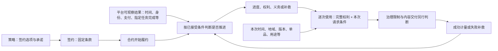
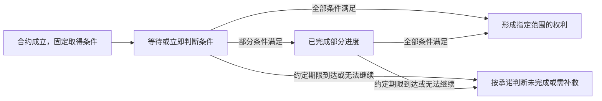
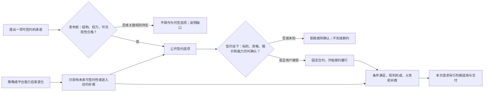

# 策略与合约状态机：产品模型

状态：**下一代授权产品模型讨论稿**。本篇只定义业务对象、规则和可检验的结果；状态机是已经选定的合约履约模型，不在这里设计语言语法、事件产生方式或执行架构。最小业务流程见[第 12 篇](./12-策略合约核心抽象与场景覆盖.md)，平台底线见[第 13 篇](./13-策略产品规则与能力边界.md)，新签与多合同见[第 14 篇](./14-已有授权后的再次签约与多合同.md)；本模型按[第 15 篇的分析方法](./15-多轴维度拆解与场景分析方法.md)持续接受场景反例检验。

## 一句话模型

**策略是可供用户接受的授权承诺；签约把确定的承诺固定为一份合约；合约状态机依据约定条件推进履约并形成有范围的权利和义务；每次使用依据已取得的完整权利及当次限制独立判断；成功使用才计量，异常进入约定补救。**

图中“推进”是业务后果，不表示每次观察都要迁移状态；“逐次使用”也不表示内部一定或一定不调用状态机。产品设计只要求两者的**结果与责任不能混同**。

## 1. 策略承诺的组成

一份可供签约的策略至少要明确下列业务部分；它们可以组合，但不能相互冒充：

| 部分 | 产品必须说清什么 |
|---|---|
| 标的与主体 | 授权方是谁，谁能签约、谁实际受益；是哪个线上单资源或合集，以及权利所指的稳定内容范围。 |
| 签约选项 | 签约资格、价格或其他对价、允许的选择，以及签约时要固定的条款版本。 |
| 取得条件 | 免费立即取得，或完成哪些已展示、平台可观察的条件后取得；多条件的且/或、顺序、次数、期限及未完成后果。 |
| 目标权利 | 取得后谁能对什么标的做什么；版本、合集单品、期间、地域、用途、设备、额度等边界。可以承诺多项彼此独立的权利。 |
| 持续事项 | 哪些已约定变化会影响以后履约，哪些义务与成功使用结果需要结算；不能把签约后任意变化都当成撤权理由。 |
| 退出与补救 | 条件无法完成、内容无法交付、提前撤回、争议或到期时，用户与授权方各承担什么、可以得到什么。 |

上述每个对外宣称“完成条件即可取得权利”的选项，都须有**非空、可达、有界**的目标权利；正常完成路径应兑现，已付出代价却无法兑现时须有明确补救。这是[第 13 篇的产品底线](./13-策略产品规则与能力边界.md)，不是由状态图上出现一个叫“授权”的节点来证明。

## 2. 合约状态机处理什么，不处理什么

签约前的资格与报价是**能否形成合约**的判断。用户接受确定条款后，合约才存在并开始履约；“已签约”不等于“所有权利已取得”。

单个“待付／有权／无权”标签不足以描述合约。产品上至少要分清三类随履约变化的结果，以及一份不被后续事件改写的依据：

| 层次 | 说明 | 例子 |
|---|---|---|
| 已接受的承诺 | 作为后续判断依据固定下来：主体、标的、成交价、选项、取得条件、范围规则和补救安排。 | 活动结束不能重算已签合同的价格。 |
| 条件与义务进度 | 每条取得路径或义务目前满足了什么，是否仍可继续、已完成或需补救。 | 已完成第一次指定广告，仍需第二次。 |
| 已形成的权利 | 每项权利独立具有受益人、行为、标的、适用范围与额度。 | 已取得 A 的浏览权，不代表取得 A 的下载权。 |
| 后续事项 | 争议、退出、无法交付、补救与续约关联；它们不能靠一个“无权”标签覆盖。 | 资源不可交付但合同和已取得权利仍有解释与补救依据。 |

这是**业务状态的组成**，不是数据库字段或要求策略作者手写四个并行状态机。一个合约可以同时有未完成的条件、已取得的另一项权利和待处理的补救；因此不能把整份合约压成一个互斥的授权颜色。

以下只画**一条取得权利的履约路径**；免费立即取得可以从签约直达权利，其他路径可按已承诺条件经过进度。合约可以同时拥有多条这样的路径，图中的“已取得”也不是整份合约的唯一状态：

每日白天、使用地域等逐次限制不作为这条取得路径的“有权／无权”来回切换；它们属于已取得权利在某次请求中的适用判断。权利到期或额度耗尽会影响后续使用，是否另有通知、续约或补救后果仍依已接受条款。

状态机在合约开始时判断立即条件，并在签后依据**该合约已约定**的时间到达、平台身份变化、支付完成、指定广告或其他任务完成等可观察结果，判断条件是否被满足以及允许产生什么业务效果。效果可以是进度、取得某项权利、履行义务、进入补救，也可能是不变；事件名本身没有授予权利的权力。平台如何产生和触发这些结果，不属于本模型。

## 3. 动态履约与逐次使用是两条不同的判断路径

对象会变化、条款被固定、何时判断、判断后果是什么，是四个独立维度。相同的时间或身份能力可以同时出现在不同路径：

| 产品用途 | 何时判断 | 对合约和权利的意义 |
|---|---|---|
| 签约门槛或报价 | 接受确定条款前 | 决定能否签及成交价；接受后不因同一输入变化而重算。 |
| 签约后的取得条件 | 合约开始时立即判断，或约定结果出现后判断 | 可以推进条件并形成权利；后续变化的效果必须预先承诺。 |
| 权利范围与当次限制 | 每次使用前读取当时的请求与环境 | 判断这一次是否落在**某一项完整权利**内；通常不改变合约。 |
| 使用后的结算 | 达到事先约定的成功点后 | 只结算此次所依据权利的额度或履约事项；尝试与失败不冒充成功。 |

“白天才可使用”通常是**权利的时段范围**；“仅可使用 24 小时”通常是**从约定起点算出的权利期间**。两者可在每次请求时判断，不要求每天昼夜切换合约状态。相反，“约定日期到达后授予一项权利”是签后的取得条件，可以推进履约。地域也能用于签约资格或逐次限制，但地域变化本身不应默认撤销已取得权利。

每次请求的产品结论至少区分：适用、不适用、暂不能判断；适用后仍要独立检查平台限制与内容能否交付。“有权但不可交付”不能被说成“没有签约”或“没有权利”。成功使用若消耗额度，会影响后续可用次数；这属于**成功后的计量**，不是把访问前置判断混成一次状态跳转。

## 4. 一条履约变化规则必须完整

状态机的每条有业务意义的变化，都要能回答下列问题。这是产品规则卡，不是事件接口或语法定义：

| 问题 | 必须明确的内容 |
|---|---|
| 属于哪份承诺？ | 哪份合约、哪条条件、哪个受益人和标的受到影响；不能借另一份合同的事实替本合同完成条件。 |
| 何时开始与结束？ | 签约立即、签后某段期间、某个约定时刻，还是达到次数后结束关注。 |
| 什么算满足？ | 当前值、一次变化、指定完成结果、累计次数，以及多条件的且/或与先后关系。 |
| 满足后产生什么？ | 指定进度、权利、义务或补救；形成权利时必须给出完整范围，而非只写状态名。 |
| 后来变化怎么办？ | 一次满足是否永久完成；资格失效或范围改变只影响未来判断，还是按已接受条款影响某项已有权利。 |
| 不满足或未知怎么办？ | 已披露的期限、代价上限、暂停进一步履约、退出或补救，不允许用户陷入无出口的付费／任务循环。 |

状态机可以包含中间状态，但**每个可达终局都必须对应用户看得懂的结果**：取得承诺权利、明确未满足条件，或按原承诺得到补救。不能靠隐藏优先级、无限循环或一次状态跳转抹去旧约。

## 5. 用一个商品检验模型

假设策略公开承诺：“支付 10 元后获得资源 R 自取得时起 24 小时的下载权；仅在北京时间每日 09:00—18:00 且使用地在中国时可下载。”这里的“24 小时”明确是连续时长，地域与时段是逐次适用限制，而不是付费后的额外任务。

| 业务时刻 | 模型应得出的结论 |
|---|---|
| 用户接受条款 | 合约成立、价格和范围固定；付款条件尚未满足，因此还未取得下载权。 |
| 首日 12:00 平台确认约定支付完成 | 合约的取得条件满足，形成 R 的下载权，期间至次日 12:00；不因当下是否处于允许时段而拒绝形成权利。 |
| 首日 20:00 在中国请求下载 | 权利已取得，但这一次不在每日允许时段；不把合约跳回“未付款”或“无权”。 |
| 次日 10:00 在美国请求下载 | 此次地域不适用；合约与权利仍存在。 |
| 次日 10:00 在中国请求下载 | 此次处于权利期间、允许时段与地域；若其他条件成立则适用，另行检查治理和交付，成功后才计量。 |
| 次日 12:00 以后 | 此权利不再适用于新请求；如约定到期通知或后续事项，再按条款处理，不要求为每日昼夜交替建立状态。 |

若把“每日白天”改为“到明天 09:00 自动取得下载权”，改变的是**取得条件**，才需要在约定时刻重新判断合约履约。若把“中国使用”改为“必须在签约时位于中国”，改变的是**签约资格**，不能用一次访问的地域变化倒改签约结果。这个检验说明：同一个平台能力的产品作用，由承诺和判断时机决定，不由“时间／地域属于动还是静”决定。

## 6. 策略合法性：从发布到履约的产品闭环

这里的“合法”指**符合平台授权产品规则，因而可以被发布、接受并按约履行**；不是“文本能解析”或“状态机能运行”，也不表示自动通过所有法律法规审查。授权方有权授予相应权益、用户条款与平台最低保护是否合法合规，仍须遵守平台另行确定的治理与法务要求。本节把[第 13 篇 R01—R16 及可兑现性规则](./13-策略产品规则与能力边界.md)落实为全生命周期的产品判定。

### 6.1 发布前：何种承诺才准成为可签约策略

下表是**每个签约选项都必须通过的产品检查**。一项策略有多个选项时，不能因某个选项可兑现就放过另一个无权死路。已知不成立应拒绝发布该选项；所依赖的产品规则或平台能力尚未确定，也不能把它假装成已合格。

| 检查面 | 必须成立的产品命题 | 反例及处理 |
|---|---|---|
| 授权资格与标的 | 授权方有权对稳定识别的线上资源或合集授予所选行为；内容、版本、单品及上游许可不会使承诺已知不可兑现。 | 将无权转授的上游内容卖作可转授权：不得发布该承诺。 |
| 平台能力与权限 | 取得条件、持续条件、权利行为和后续事项都在平台对该资源类型及主体开放的范围内；策略不能自造身份、支付完成或治理结论。 | 引用不存在的“广告完成”能力或越权修改用户资格：不得发布。 |
| 公开承诺完整 | 签约前可说明主体、标的、目标权利、取得条件、全部对价与步骤上限、范围、期限、义务、退出和不能履约时的后果。 | “先付款，以后再看是否需要会员”：隐藏门槛，拒绝发布。 |
| 状态路径可兑现 | 从签约后的初始履约结果出发，合格用户完成已披露条件的正常路径可在有界时间和代价内到达所承诺的非空权利；有代价却不能兑现的分支有补救。 | 无限看广告循环、只有进度没有目标权利、正常付费分支落入无权死路：拒绝发布。 |
| 分支与条件一致 | 多个条件的且/或、顺序、次数、期限及同时成立时的结果清楚；互斥结果不靠未披露的随机或优先级决定。 | 同一完成结果既授予又取消同一权利且没有明确选择规则：拒绝发布。 |
| 权利完整且可用 | 每项权利有受益人、行为、标的、版本/单品、期间、地域、额度等适用边界；至少存在依承诺可行使的情境。 | 取得权利时期间已结束、零额度却宣传可下载、把未提供且无未来交付承诺的版本宣传为立即可用：拒绝或先修正选项。 |
| 阶段不混用 | 签约资格、取得条件、持续履约、逐次使用限制和成功计量各有明确位置；不能用一次访问结果倒改签约价或旧约。 | 用户到了美国便把已付款合约改成“未签约”：拒绝该规则。 |
| 旧约与其他合同 | 新发布不倒改既有合约；可并存的权利和义务各自完整，不能跨合同拼接局部许可或悄悄替换旧约。 | 从 A 合同取“商用”、B 合同取“美国”拼出美国商用：不得作为合法授权结果。 |
| 异常与最低保护 | 平台暂不能判断、任务不可继续、内容无法交付、退出与争议有已披露且可执行的处理，不取消平台最低保护。 | 用户付款后服务长期不可用，既无权利又无退款或替代出口：拒绝发布。 |

“可兑现”不等于保证未来永不故障。发布前能排除**结构上已知不可能、无界、矛盾或无出口**的设计；签约当下和履约中还须分别处理变化与故障。若产品明确只出售抽奖机会等非确定权益，必须作为另一类承诺说明，不能把它包装成“完成广告必得下载权”。

### 6.2 签约时与签约后：合法性不是一次性盖章

| 时点 | 要重新确认或继续守住什么 | 不能做什么 |
|---|---|---|
| 签约当下 | 发布仍开放、标的可签、当前资格与报价可确认、必要平台能力当下可用且没有已知履约障碍；展示最终条款并由使用方接受。 | 报价失效仍按旧展示收费；关键事实未知却假定符合；把预检查当作已成立合约。 |
| 签后履约 | 只按已接受条件解释平台可观察结果；条件进度和权利变化有对应承诺，达到正常完成点就兑现。 | 后加门槛、重复收取同一对价、因平台能力故障直接宣称旧合同不存在。 |
| 本次使用 | 用某一项完整已取得权利与本次时间、地域、版本等判断；治理和交付另行检查。 | 因这次不适用便宣称策略本身不合法、合约暂停或所有权利被撤销。 |
| 使用结算与异常 | 达到成功点才结算所选权利额度；无法交付、能力不可用或争议按旧约与平台底线解释、补救。 | 失败仍扣额；把作者或平台的履约失败转嫁成用户“无授权”。 |
| 策略变更、停售或撤回 | 新条款或停售影响未来签约；对已签约者继续履行，不能履行时进入通知、替代、退款或争议处理。 | 新版策略覆盖旧合同；停签即取消已取得权利。 |

因此应把结果区分为：**发布可接受／拒绝／待产品决策，签约可成立／不符合／暂不能确认，履约已满足／待条件／应补救，本次使用适用／不适用／暂不能判断**。它们不是一个“策略有效”布尔值。签约后能力发生故障，通常是履约与补救问题，不使已经形成的合同在历史上变成“从未合法”；某次地域不适用，也不是发布时承诺失效。

### 6.3 用反例检验合法性闭环

| 场景 | 产品结论 |
|---|---|
| 免费签约后立即进入“授权状态”，却没有任何可用行为或标的 | 目标权利为空，不能发布该选项。 |
| 签约时是会员，付费后才新增“必须持续会员”条件 | 后加门槛不得作用于旧约；新条件只能进入未来明确展示并接受的承诺。 |
| 支付后取得 2 小时权利，但允许使用时段在这 2 小时内完全不相交 | 对该合格用户承诺的可用范围为空；必须在发布与签约设计中排除或改变起算规则。 |
| 已看一次广告，第二次广告不可用 | 不能无限等待或清零已披露的有效进度；按签约前说明的期限、替代或补救处理。 |
| 两条状态变化在同一条件下产生相互排斥的权利结果 | 选择、优先关系或互斥前提若未在承诺中明确，不得发布。 |
| 已有权利，但此次请求位于允许地域之外 | 仅本次不适用；策略、合约和已取得的其他范围权利仍可合法存在。 |
| 内容签约后不可交付 | 区分有权与无法交付；执行约定及平台最低补救，不能倒称原合约无效。 |

这些检查的目标不是罗列所有未来事件，而是用同一模型反复验证**对象、承诺、状态路径、权利、本次判断与补救**的连接是否完整。每加入一种新平台能力或权利类型，都要重新走发布、签约、履约、使用和变更五个时点；若遇到无法分类的反例，先修正本产品模型或[第 15 篇的分析元模型](./15-多轴维度拆解与场景分析方法.md)，不能仅加一个状态名。

## 7. 产品底线与待决范围

本模型必须同时满足：已接受条款不可被后来的策略、报价或目录变动倒改；每项权利有完整且可解释的范围；取得路径有界且可兑现；同一付出不能被重复收费或无端丢失；不符合与暂不能判断分开；交付失败与无授权分开；多份合同不得拼接各自的宽松字段。[多合同的比较、选择与额度归属](./14-已有授权后的再次签约与多合同.md)独立适用。

仍需逐项作出产品选择，不能由状态机默认决定：

- 持续会员资格丧失后，已取得的哪项权利是否受影响，以及用户签约前如何得知；
- “所有版本”与合集动态成员是否包含以后新增内容，成员移出如何影响旧约与交付；
- 广告等任务完成进度可否跨期或跨合约使用，条件无法继续时怎样补救；
- 相对期间从签约、条件完成还是权利形成时起算，日历日采用哪个时区；
- 已有授权后再签的增量、真正冲突、替换、续期及多合同时本次使用依据。

这些待决项不妨碍建立产品模型，但会限制具体策略能否发布。每确定一项规则，都要用[第 15 篇的方法](./15-多轴维度拆解与场景分析方法.md)在正常、边界、变化、组合和失败场景中回归检验；若无法解释，应修正产品模型或顶层规则，而不是补一个状态名。
