# 从核心到复杂的授权流程图解

状态：**下一代授权产品模型讨论稿；不是现行语言、接口或 CLI 行为说明。** 图中的「待决」必须在允许相应策略发布前定稿；「推荐」不是已批准的默认规则。各图描述产品可见的判断与结果，不规定内部事件实现。

## 0. 阅读路线：逐层增加一个问题

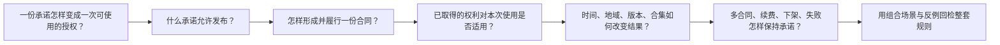

## 1. 最小闭环：先不加入任何特殊条件

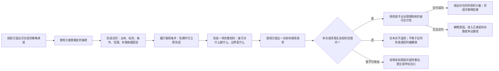

## 2. 策略发布：不能只检查状态图能否运行

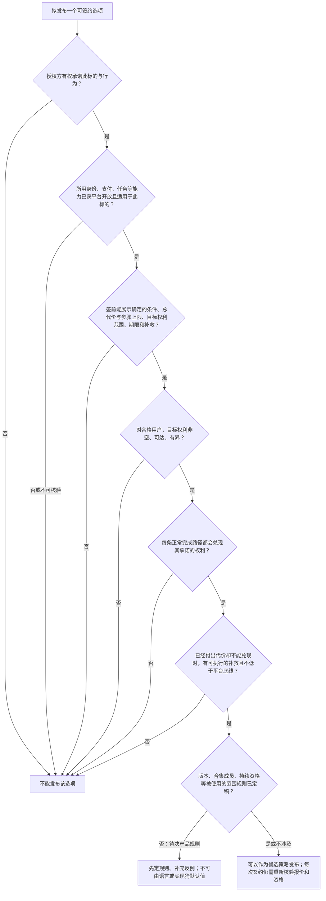

## 3. 签约：接受的是确定承诺，不是可随时改写的页面

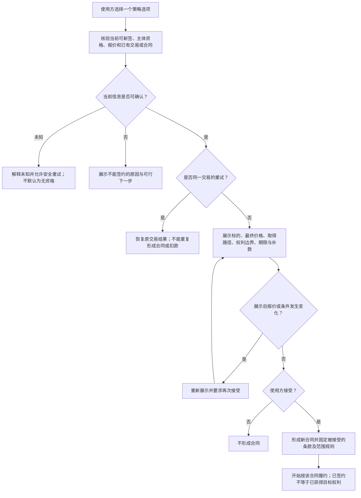

## 4. 合同履约：状态机推进承诺，不能用状态名冒充权利

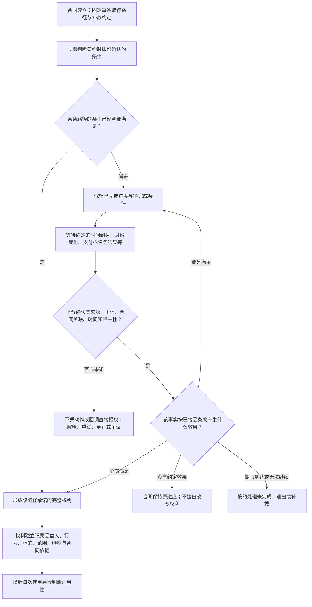

## 5. 逐次使用：把“有权”与“这一次能用”拆开

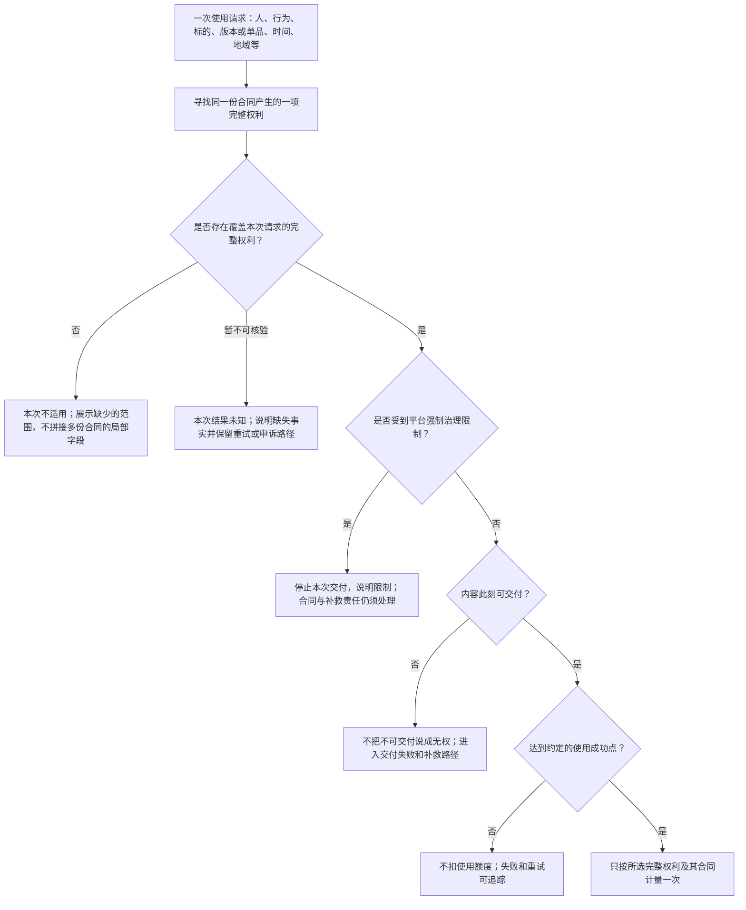

## 6. 同一个时间输入：可以推进合同，也可以只限制一次使用

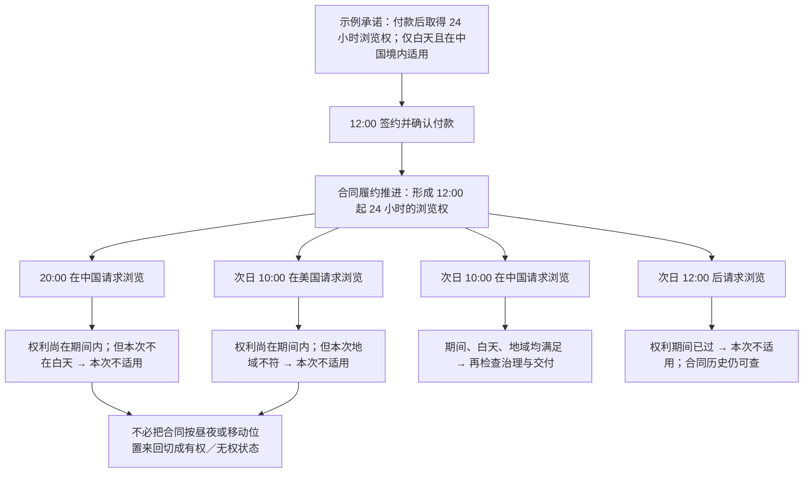

## 7. 多条件取得：每条承诺路径都要有出口

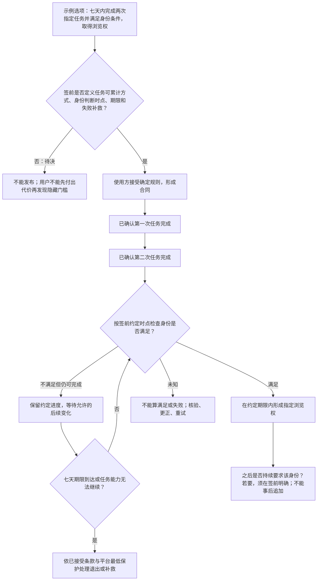

## 8. 版本和合集：内容变化不能偷偷改旧合同

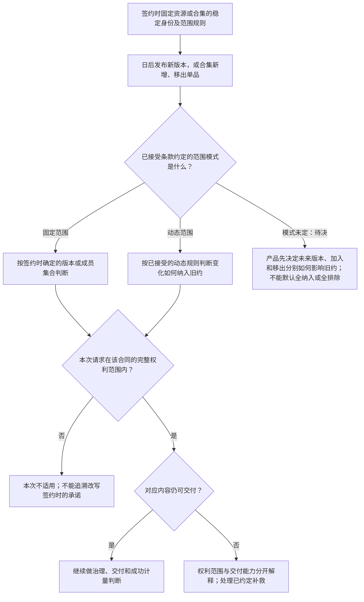

## 9. 已有权利后再签：合同并存，不拼接权利

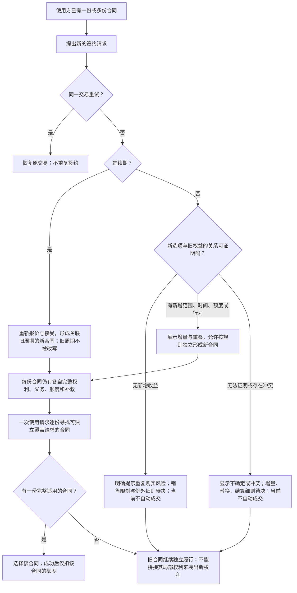

## 10. 停售、下架与无法交付：区分未来交易与既有责任

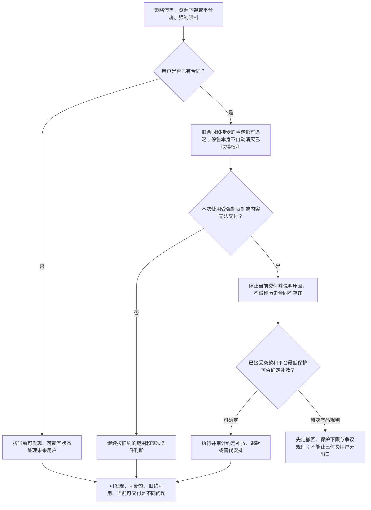

## 11. 组合演练：一份付费合集权利遇到新单品、跨境和交付失败

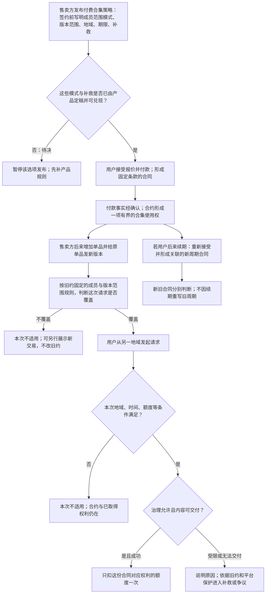

## 12. 用反例回检：流程图不是一次画完就算定稿

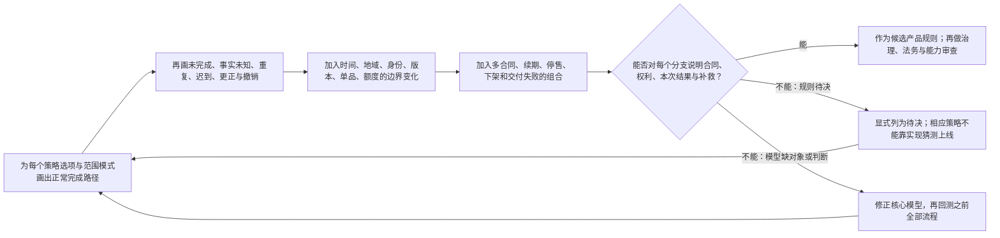
