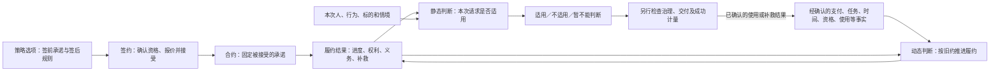
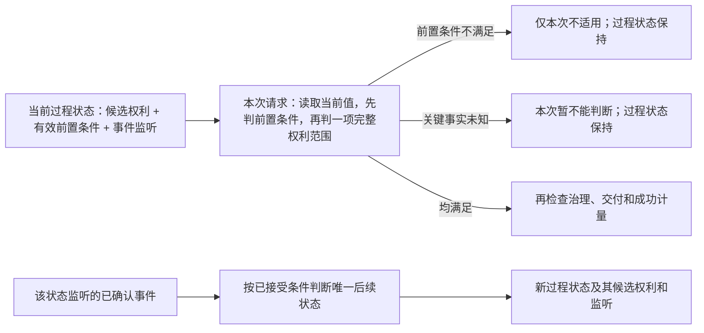
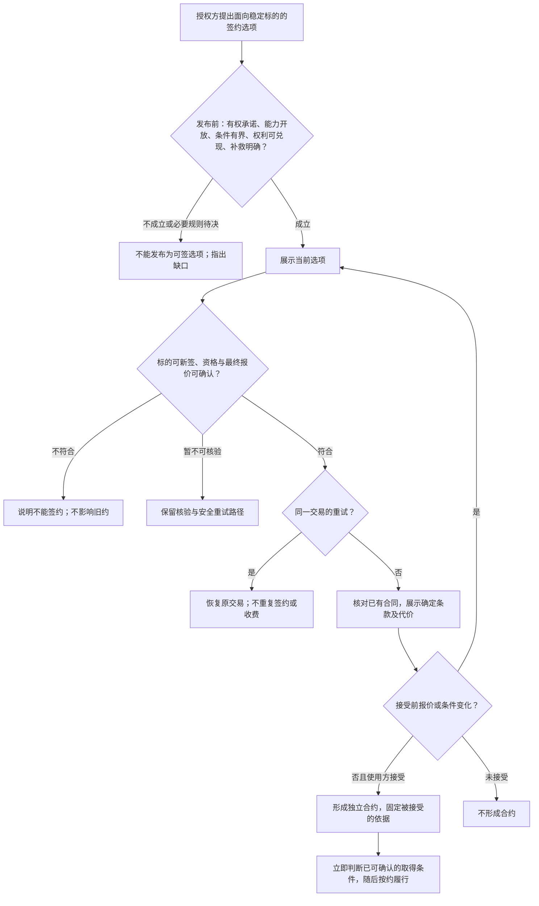
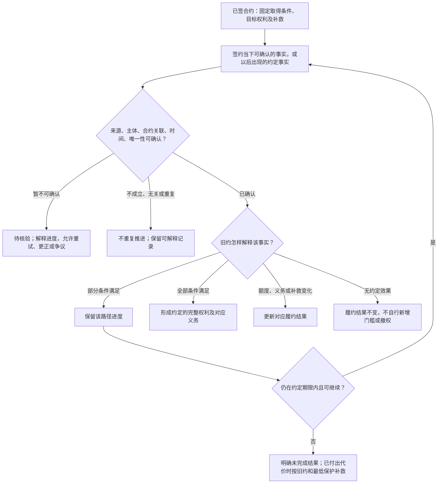
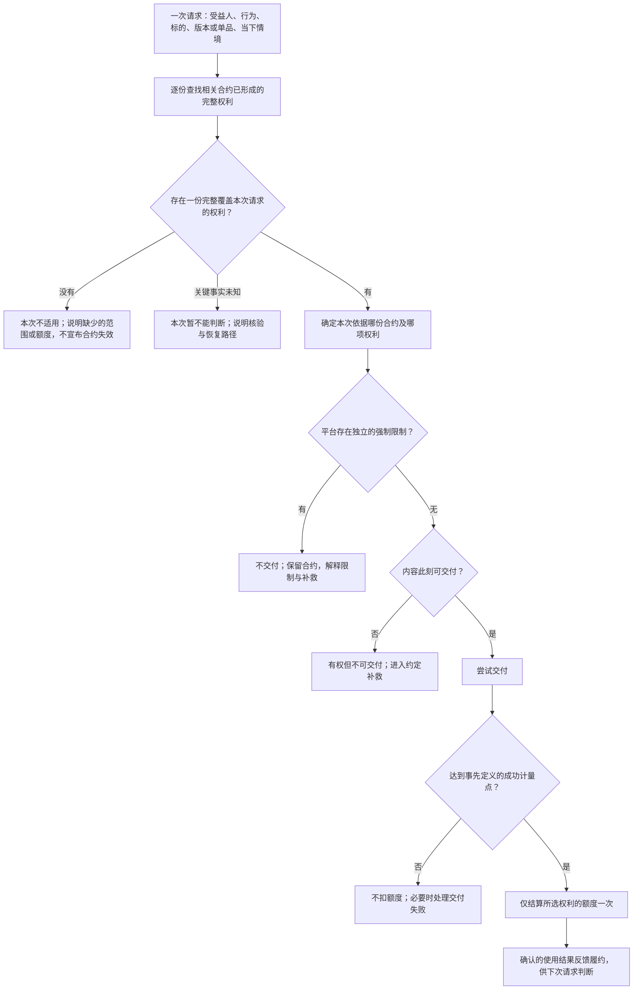
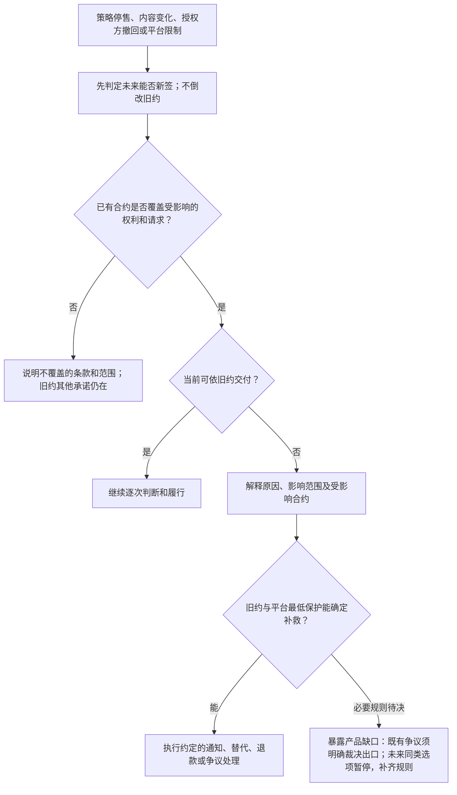
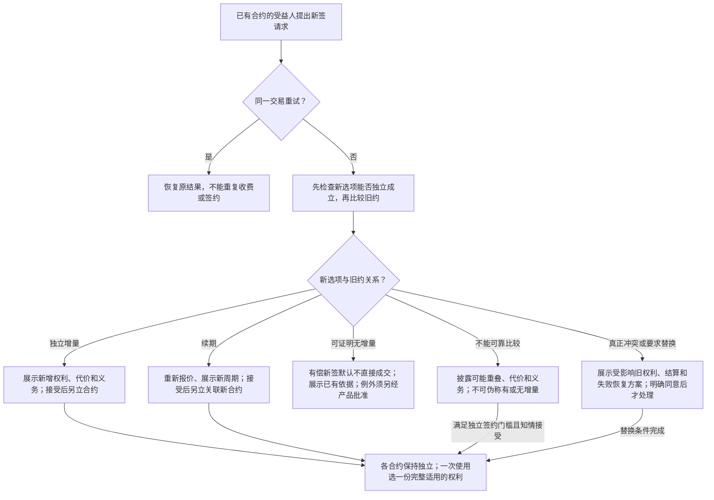

# 策略与合约：产品模型和运行流程

状态：**供复核的下一代产品设计稿**。本篇只规定参与者能得到什么承诺、平台何时判断、产生什么业务结果；不定义策略语言语法、接口、存储结构或事件投递方式。「底线」沿用[平台规则 R01—R16](./13-策略产品规则与能力边界.md)；「推荐」尚待确认；「待决」不能被实现方当成默认值。本篇不表示相关能力已经上线。

## 1. 最小模型：一份承诺、两种判断、一次结果回流

授权方为确定的资源或合集提出一个**可签约、可兑现的策略选项**。使用方接受当时确定的条款后，形成独立合约。合约保存被接受的承诺；后续事实可以推进履约、形成权利或补救事项。每次使用另行核对某一份完整权利与当次情境。成功交付或失败的结果可以反馈给履约过程，但不倒改历史承诺。

“静态”指**判断本身不因这次请求改写合约履约结果**，不是输入值永远不变，更不是判断“合约是否有效”。在美国不满足中国地域限制，通常只是这次不能使用；已取得的权利和合约仍在。“动态”指**可能改变持久、可解释的履约结果**，不是每见一个事件就必须迁移状态。签约、交付和事实确认是两种判断的业务边界，不必另造第三种合约运行模式。

## 2. 对象与关系

| 对象 | 产品含义 | 不能混同 |
|---|---|---|
| 授权方、使用方、受益人 | 谁有权作出承诺、谁接受并承担对价、谁实际享有权利；三者不必总是同一人。 | 只用付款账户代替受益人。 |
| 标的 | 稳定识别的线上单资源或合集；版本、单品属于内容范围。 | 标题、标签、当前页面列表。 |
| 策略及签约选项 | 面向未来签约者的承诺：能否签、如何取得、取得什么、如何使用、无法兑现怎么办；一项策略可有多个选项。 | 已签合约或单纯的状态跳转程序。 |
| 合约 | 某人接受某一确定选项后，与主体、标的、条款版本、选择和成交价格绑定的独立承诺。 | 当前展示的策略最新版。 |
| 可确认的事实 | 与合约关联、可核对来源和时间的支付、任务完成、时间到达、资格变化、成功使用、更正等结果。 | 未核实的点击、回调或策略自行声称的“已付款”。 |
| 履约结果 | 条件与义务进度、已形成的各项权利、待确认事实、退出或补救事项，可以同时存在。 | 单个互斥的“待付／有权／无权”标签。 |
| 权利 | 合约产生的一项完整许可：谁可对什么标的做什么，以及全部适用边界。 | 付款事实、资格事实或名为“授权”的状态。 |
| 义务 | 合约指定的责任方应在约定时机完成的事项，具有对象、完成依据和未履行后果。 | 所有义务都是取得权利前必须满足的条件。 |
| 使用请求 | 一次业务上不可拆分的授权行为，明确实际使用者、内容和情境。 | 将一个包含多项独立使用的批次当成一种整体授权行为。 |

同一策略选项可形成多份合约；同一受益人可持有多份独立合约。一份合约可有多条取得路径、多项权利、并行义务或补救事项。所有关系须以稳定身份及可追溯依据绑定，不能用标题或当前合集目录替代签约依据。

一个操作包含多项独立使用时，分别寻找各自完整的合同权利，不要求一项权利覆盖整个操作。若平台定义的是不可拆的整体行为，则须有完整的整体依据；单品下载许可不能自动拼成合集整体发行许可。这里规定业务粒度，不规定请求如何发送。

## 3. 策略规定什么

策略首先是**签前可理解的产品承诺**，其次才是合约签后的运行规则。一个可签约选项至少要在接受前说清：

1. **入口**：授权方、受益主体、稳定标的、签约资格、选择及确定报价。
2. **取得路径**：免费立即取得，或完成哪些支付、任务、资格、时间条件；多个条件的且／或、顺序、次数、期限，以及总代价和步骤上限。
3. **目标权利**：条件完成后可进行的行为和实际可行使的范围；版本、合集单品、期间、每日时段、地域、用途、设备、额度等若被使用，须写明其含义及判断时点。
4. **持续事项**：哪些后续事实会改变某条取得路径、某项权利、义务或补救；哪些输入只影响一次使用。不得事后把使用限制变为新的取得门槛。
5. **退出与补救**：超时、任务或内容不可用、支付更正、撤回、争议时的后果，以及平台最低保护。

策略只能使用平台对相应主体与资源类型开放的能力，不能自造平台身份、支付确认或治理结论。每个宣称“完成条件即可获得授权”的选项，必须对合格用户具有**非空、可达、有界**的目标权利；正常完成的所有合法分支须兑现，付出代价却不能兑现的分支须有可执行补救。复杂的状态图或名叫“授权”的节点都不能代替此项检查。

### 3.1 义务也须有完整结构

一项义务明确：**来源合约、责任方、应完成事项、受领方或针对对象、触发时机及期限、完成依据、未履行后果**。使用方可能承担付款、署名或分成义务；授权方也可能承担交付、通知或补救义务。

| 作用时机 | 产品含义 | 不能误判 |
|---|---|---|
| 取得前 | 已披露的义务完成后，才满足指定取得条件。 | 有付款意图就算履行。 |
| 使用时 | 对本次行为有可核验的要求。 | 任意缺少信息都算违约。 |
| 使用后 | 因已确认使用产生的后续署名、结算等事项。 | 必须在使用前完成只有使用后才产生的义务。 |
| 持续期间 | 按约持续履行，并说明结束或解除条件。 | 改选另一份合约就免除已有持续义务。 |

当前身份等资格事实与义务分开定义。未履行、尚未到期与暂不可核验是不同结果；后果须指向条款允许影响的权利或后续事项，不自动终止全部合同。新约可为其授权的使用约定较轻义务，但不抹掉旧约已发生或仍持续的义务。

## 4. 合约固定什么，什么仍会变化

签约固定的是**规则和当次选择**，不是冻结世界。至少固定：参与及受益主体、稳定标的、选项与条款版本、成交价格、取得条件、权利及范围解释规则、持续义务、退出与补救依据；需要签约取样的资格、折扣和活动结果也要可解释。

签后可能变化：付款与任务进度、当前会员资格、时间与地域、资源版本与合集成员、剩余额度、内容可交付性、平台治理结论。但变化对旧约的后果只能来自**已接受规则及平台最低保护**，不能由后来改页面、停售或发新版时临时决定。

| 同一种输入 | 约定用途 | 业务后果 |
|---|---|---|
| 签约时的会员身份及活动 | 签约取样，决定资格或成交价。 | 接受后价格不随活动结束重算。 |
| 指定订单付款完成 | 签后取得条件，经平台确认后参与履约。 | 可以推进进度并形成约定权利。 |
| 会员资格后来失去 | 仅当旧约明确约定持续条件时参与履约。 | 影响哪项权利、如何恢复须签前明示；具体模式待决。 |
| 本次 IP 所在地域 | 逐次观察。 | 通常只决定这次请求是否在已取得权利范围内。 |
| 时间 | “到日授予”可推进履约；“仅白天可用”是逐次范围判断。 | 前者可能改变履约结果；后者不要求昼夜切换合约状态。 |
| 成功下载一次 | 使用后的结算依据。 | 只扣本次所选合约的额度；失败、重试、并发不应双扣。 |

### 4.1 单资源与合集的内容范围：产品规则先于语言写法

权利必须说清它是针对**单资源的版本**、**合集整体行为**，还是**合集中单品及其版本**；取得合集整体权利不自动获得每个单品的下载或转授权。合集成员是平台已发布单资源与合集之间的稳定关系，不是用户本地目录。签约固定范围规则及其当时的依据，不是未来页面的当前列表。

合集单品许可的范围有**两个独立维度**：①哪些成员纳入；②每个纳入成员的哪些版本纳入。成员规则和各成员的版本规则分别选定，再组合为完整范围；不得用一个“固定／动态”选项同时代替二者。单资源只需确定自己的版本规则。

| 显式范围模式 | 对旧约的产品承诺 | 后来新增、移出或不可交付 |
|---|---|---|
| **固定快照** | 固定签约时确定的版本/成员身份集合。 | 新增不纳入；移出不抹去已承诺范围。范围内但不可交付时另行补救。 |
| **按规则纳入未来新增** | 固定纳入条件、时点和对用户展示的承诺。 | 符合规则的后来版本/成员纳入；已纳入者不得因目录调整而被静默撤回。 |
| **可轮换目录** | 明示目录可增减、最低供给或替代服务、通知、退出与补救。 | 仅在平台批准且最低保障可执行时开放；不得用“整个合集”暗示不受限的追溯移出。 |

固定与未来新增可分别用于成员、版本规则；可轮换目录描述获准的成员服务，不自动允许撤回已覆盖的旧版本。若要另设版本退出规则，须单独明确并获平台批准。

| 组合例子 | 成员规则 | 成员版本规则 |
|---|---|---|
| 十个既有视频及其未来修订 | 固定十个成员；新增第十一个不纳入。 | 按明确规则纳入这十个成员的未来版本。 |
| 持续加入课程，但每课仅覆盖纳入时版本 | 按明确规则纳入未来成员。 | 每个成员在纳入时固定版本集合。 |

没有分别选择明确规则，或成员/版本的新增、退出、下架后果尚不能展示，选项不得发布。**成员与版本均固定是推荐的保守初始组合，不是由“全部版本”“整个合集”等字样暗生的默认。**平台具体开放哪些未来新增/可轮换模式和最低补救标准仍需产品批准；未获批准的模式保持不可发行。语言如何表达见[第 20 篇](./20-策略语言设计-语义核心与表达轮廓.md)第 5 节。

## 5. 合约不是一个“授权开关”

合约由一份不被后续事实倒改的**已接受承诺**，以及可解释的**履约结果**组成。履约结果至少可同时容纳：各条件与义务的进度、每项已形成的完整权利、待确认事实、待处理补救或争议。一份合约可以已获浏览权、仍在争取下载权，并同时有交付补救待处理。

每项权利独立说明：来源合约、受益人、允许行为、标的、版本或合集单品范围、起止期间、每日时段、地域、用途、设备、次数或其他额度及其结算口径。不是所有策略都使用全部限制，但使用了的必须明确。**已形成权利**与**本次请求适用**是两个产品结果。

状态机是已选择的**合约履约模型**：它描述约定条件推进时产生哪些进度、权利、义务或补救；它不决定平台允许售卖什么，也不表示整份合约只能有一个互斥状态。正常可达终局须是取得承诺权利、明确未满足条件，或按原承诺获得补救；不能有付出代价后既无权利又无出口的死路。

### 5.1 已确定的状态内两种判断

**过程状态**记录合约当前履约到哪里。一个过程状态可以声明它对应的候选权利、这些权利的**当前有效前置条件**，以及在该状态下关注哪些已确认事件。这里的“状态有效”只回答“这个状态声明的权利此刻能否用于某次请求”，**不**回答“合约是否存在”，也不让状态因地域或时间变化而来回迁移。

- **当前有效前置判断**可读取已登记的当前资格、请求时间/地域等观察；它不得签约、迁移过程状态、扣额度或执行付款/退款。状态级共同前置条件是**可选的**，仅用于确实共享该条件的所有候选权利；每项权利还可有自己独立的适用条件与范围。若必要条件不满足，该项权利本次不可用；若关键事实未知，结果是暂不能判断而非“确认无权”。
- **状态内事件监听**仅处理与该合同关联、平台已确认且该状态声明关注的事实。符合迁移条件才转到明确的新状态；事实无关、重复或不满足条件时不擅自迁移。状态前置条件不满足，**不会自动关闭**该状态的事件监听；反过来，仅因当前条件恢复也不会自动产生状态迁移。
- 一个状态可给出多项候选权利。共同前置条件约束该状态的所有候选权利；某项权利特有的版本、单品、用途、额度等继续在该权利范围内判断。若不同权利有不同取得进度，不应强迫整份合同退化成一个“有权／无权”状态；产品上保持各路径和权利独立。
- 一个选项可以有多条具名履约路径，各有当前过程状态，并明确彼此是独立、同一目标替代还是共同完成。合约结果包含各路径的进度，不是一个全局授权色块；每条路径的迁移结果须确定，一次不可拆的授权行为仍由一项完整权利覆盖。
- 同一确认事实作用于多条路径时，分别确定迁移、无效果或待核验/错误，并按**已接受的承诺关系**形成完整结果。独立事项已确认可兑现就分别兑现，其他未知事项保留待核验、期限和恢复出口；不能只因共享一个事件就一起冻结。共同完成或不可拆的承诺按其共同条件兑现，但各项已确认进度仍保留。完整结果可以同时包含“下载权已取得、赠品资格待核验”，不能静默遗漏后者。
- 迁到补救、争议或其他后续状态，不表示旧状态已形成的全部权利自然消失。目标状态须明确保留仍有效的权利，或给出旧约允许其结束的条件；平台要核对前后变化与签约承诺一致。

例如合约在“已付款”状态，当前地域在中国才能使用其下载权。用户到美国，只使本次下载的前置判断不满足，状态仍是“已付款”，已约定的退款或资格变化事件仍可被处理。若策略另把“资格撤销”写为该状态内的迁移事件，只有经确认的撤销事实才按已接受规则改变履约状态。这两种用法必须分别向用户展示。

### 5.2 多条路径的关系须随承诺固定

条件中的且／或可以在一条路径内表达；只有需要独立进度时才拆路径。多条路径既可能针对不同权利，也可能针对**同一取得目标**。

| 关系 | 取得规则 | 其他路径或事项如何处理 |
|---|---|---|
| 独立履行 | 各自条件满足后兑现各自承诺。 | 一项未知不阻止已确认的独立事项；持续义务各自保留。 |
| 同一目标的替代取得 | 已接受的选择、切换或竞争规则确定由哪条路径满足目标。 | 同一取得目标只兑现一次；其他路径停止索取新代价，已有进度和代价按约结算。 |
| 共同完成 | 必须满足约定的全部共同条件，才形成指定目标权利或不可拆的权利包。 | 各项进度可分别完成、留证；未齐备时目标仍待取得，超时依约补救。 |

替代关系必须明确选择和切换时点、可否同时进行、同一时点多条完成的确定结果，以及目标完成后其他路径的后果。已接受为替代的同一目标，后来的另一完成事实不默认再次发权、增加额度或延长期间；这些新增价值须有独立、明确的承诺依据。原合同中已明确允许的再次购买或续期，是新的取得目标，不与此前一次混同。

例如“付款或完成广告取得同一次 24 小时浏览权”：广告先完成、先前付款随后确认，只形成一次目标权利；收到的额外付款按签前披露且获平台批准的结算/补救规则处理。不能声称重复事实规则已经解决两个不同完成事实的竞争。若无法处理额外代价或保证确定结果，该并行替代组合不得发行，可改为能履行的单路选择方案。

例如“付款取得下载权，并独立赠送符合会员资格者的附加权益”：付款确认且下载条件齐备时先兑现下载；赠品资格未知单独待核验。若用户接受的确实是不可拆的整体套餐，才按明示共同条件一起兑现或补救；不可在付款后新增这样的捆绑门槛。

## 6. 从发布到使用的完整运行流程

### 6.1 发布与签约：承诺何时成为合约

发布审查只能排除已知不可兑现、矛盾、无界或无出口的方案，不能保证未来永不发生服务或交付故障。签约时复核当下报价、资格和必要能力。签约是合约形成的边界，不等于目标权利已经全部取得。

### 6.2 动态履约：事实怎样产生持久业务后果

事实只是输入，必须经已接受规则解释才有后果；后果也可以是不变。事实重复、迟到、撤销或更正时，要能说明已产生结果是否需要调整、如何保护当事人。未核实的回调不能直接发放权利或扣费。

| 事实情形 | 产品上必须保持的结果边界 |
|---|---|
| 重复或与本合同无关 | 不把同一完成计两次，不让别人的订单推进本合同；保留可解释记录。 |
| 迟到 | 区分事实发生时间与确认时间，按签约前披露的期限口径决定是否满足；已收款却不能兑现不得静默留款。 |
| 未确认或证据冲突 | 维持待核验，不按成功或失败猜测；提供安全重试、更正或争议出口。 |
| 未使用进度被更正 | 按已接受规则修正受影响路径；不能连带抹除其他路径的正常成果。 |
| 已形成权利的依据后来撤销 | 是否影响未来使用、是否保留已取得权益，必须由签前条款和平台最低保护决定；不得仅凭“撤销事件”自动清空所有权利。 |
| 已成功使用后才被更正 | 历史交付不能抹去；后续通过明确的调整、补救或争议结果处理，不伪造从未发生过的状态。 |

这些是语言和平台能力必须能表达的**结果类别**，不是赋予作者任意追溯撤权的权限。对支付撤销、广告作弊、资格误判等具体能力，还须有各自获平台批准且签前可披露的后果；没有就不能开放相应策略写法。

### 6.3 静态适用、交付与结算

这条流程分开六种结论：可否签约、合约是否形成、权利是否取得、本次是否适用、内容是否可交付、使用是否成功计量。平台强制治理是独立外边界，不能伪称旧约从未存在。本次不适用也不使已取得的权利变回未取得。成功使用后的额度回写属于确认结果后的动态履约，而非请求前适用判断必然要发生状态跳转。

### 6.4 后续变化、退出与补救

策略修订或停售只改变未来可签选项；旧约继续按接受时的条款解释。资源发新版、合集编辑、授权方撤回、平台治理或平台能力故障时，依次区分：**未来能否新签、旧约权利是否覆盖、本次能否交付、不能兑现时谁承担什么责任**。四者不能压成一个“资源有效／无效”标志。

已取得权利却无法交付时，应说明原因、所依据合约和可行出口；替代、宽限、退款、争议须依旧约和平台最低保护处理。具体保护标准未定时，不能将高风险策略宣传为已有可执行补救。期限届满或补救完成后，合约、权利与计量历史仍须可查；续约另立关联的新周期合约。

### 6.5 再签、并存、替换与续费

这些分支只确定产品结果类别，不替待决的销售限制、默认选约、退款抵扣或续期起算规则作选择。新约存在不自动清除旧约义务；替换失败也不能让用户无端失去原权利。

## 7. 复杂情形复用同一模型

| 场景 | 不变的核心处理 | 须签前说明或仍待决的选择 |
|---|---|---|
| 免费立即授权 | 签约后立即形成有范围的权利；访问仍逐次判断。 | 标的与行为须确实可用，不能以空权利充数。 |
| 付费或完成广告取得授权 | 经确认的完成结果推进合约；满足旧约条件后发权。 | 代价和步骤上限、超时、任务不可继续、付出代价后的补救。 |
| 替代路径先后完成同一目标 | 按已接受关系只兑现一次目标；额外代价另行处理。 | 选择、切换、停止索取新代价、迟到付款与已完成任务的结算/补救。 |
| 独立付费权利与赠品资格未知 | 已确认的独立权利正常兑现，未知赠品明确待核验。 | 哪些承诺独立，哪些必须共同完成；未知事项的期限与出口。 |
| 使用后署名或分成 | 按来源合同记录义务、期限和完成依据。 | 不把使用后义务提前设为不可满足的使用门槛；违约影响须明确。 |
| 白天、地域、设备限制 | 已取得权利保留；按每次请求的当下事实判断适用。 | 时区、位置不可核验、设备归属等语义。 |
| 指定日期授予、持续会员条件 | 时间到达或资格变化可按旧约推进某项履约结果。 | 资格取样时点、失去和恢复后影响哪些权利。 |
| 版本和合集单品变化 | 分别固定成员纳入规则与各成员版本规则，组合判断内容范围；交付另判。 | 两个维度各自的新增/退出后果和不可交付补救，不用一种模式替代所有范围。 |
| 多份合约 | 各自履行；一次使用找到一份完整支持请求的合约，不拼接局部许可。 | 多份都适用时如何选和扣额、未知重叠、真正冲突、替换结算。 |
| 批量独立使用与不可拆整体行为 | 前者逐项判断，后者须有完整整体许可。 | 行为的业务粒度、各项结果和计量，不能用操作批次大小猜授权范围。 |
| 续费 | 重新报价和接受，形成关联旧周期的新合约，不改旧约。 | 续期窗口、起算点、范围沿用、自动续费条件。 |
| 停售或下架 | 停止未来新签与保护旧约分开；不能交付要有出口。 | 供给状态、旧约可见性、彻底撤回权限及最低补救。 |

例如“付款后取得 24 小时下载权，仅每天白天且在中国可使用”：付款确认推进履约并形成 24 小时权利；夜间或位于美国仅影响该次请求；到期后这项权利不再覆盖新请求。若 24 小时和允许时段对该合格用户完全不相交，承诺实际上为空，发布或签约时须排除这种组合。此例不替所有策略决定“24 小时从何时起算”的默认值。

已有授权不自动阻止再签。同一交易重试须恢复原结果；有独立增量的选项可形成另一合约；可证明无增量须提示并按已定销售规则处理；无法证明重叠时须披露不确定性和代价，既不伪称一定重复，也不伪称一定更好。真正互斥的义务或占用型权利另行处理，不能以模糊“新约优先”覆盖旧约。一次使用不能从 A 合约取“商用”、从 B 合约取“美国”，拼成并不存在的“美国商用”权利。

## 8. 策略选项的产品准入与生命周期检查

发布前对**每个选项**分别检查：授权方与标的关系明确；平台开放所引用的能力；全部条件、成本和范围可展示；正常完成路径能在有界代价内到达非空、可行使的目标权利；相互排斥的结果不会靠隐藏优先级或随机选择；付出代价但无法兑现、事实未知、交付失败和争议均有可执行出口。关键范围规则或能力权限未定，不能靠语法校验或一个“授权”状态假装已合格。

组合还须检查：义务有完整时机与后果；成员范围与版本范围分别确定；路径关系明确，独立事项不被无关未知阻塞，共同承诺不提前兑现，替代完成不重复发权且已有代价有出口；独立批量使用与不可拆整体行为的边界明确。

签约时复核资格、最终报价、标的及必要能力；签后依据旧约解释可信事实；每次使用独立得出适用／不适用／暂不能判断；交付失败与无权分开；达到成功点才计量。每个关键结果都要能说明条款、事实、合约及下一步。符合平台产品规则，不等于自动通过所有法律法规审查。

## 9. 仍需定稿的产品选择

下列选择不妨碍建立本最小模型，但决定**哪些具体策略选项可以发布**。每项定稿后，应回测发布、签约、动态履约、静态适用、交付与补救全过程。

1. **持续资格**：会员或身份丧失只影响未来签约、只影响本次使用，还是按旧约改变某项已取得权利？恢复时怎样处理？
2. **时间与内容范围**：相对期间从何时起算、日历日用哪个时区；本篇第 4.1 节已定义固定、未来新增与可轮换目录的显式模式，平台准许哪些动态模式，成员移出后最低交付保障是什么？
3. **任务与事实**：广告、分享等进度能否跨期或跨合约使用；迟到、撤销、更正后怎样解释和调整已发生的结果？
4. **多合约**：可证明无增量的有偿新签**默认不直接成交**，是否允许充分提示后的例外再售须定稿；未知重叠如何有偿确认；多个完整权利均适用时如何默认选取；替换、续费如何结算？
5. **退出与最低保护**：内容不可交付、授权方提前撤回、平台强制限制、能力故障时的最低退款或替代标准，以及申诉、人工裁决权限。
6. **能力治理**：不同资源类型开放哪些权利与事实能力，谁可证明资格，可读取哪些数据，不可核验时如何安全处理。

## 10. 怎样检验这份模型

对每类选项，从头问到尾：**谁能发布和签约；签约固定什么；哪些事实推进哪条取得路径；每项权利是否完整；本次不符合与未知如何区分；治理和交付失败怎么办；成功后扣哪份合约；重复、迟到、撤销和更正怎样解释；旧约遇到策略或内容变化怎样继续兑现或补救。**

至少用免费、付费、任务、身份变化、白天／地域、版本变化、合集成员变化、多合约、续费、停售、下架、无法交付、额度并发逐一验证，再交叉组合。若场景无法归入“签约固化／动态履约／静态适用／交付结算／退出补救”，先修正产品模型，不能仅追加一个没有业务含义的状态名。

本轮组合反例须逐项通过：付款已确认而独立赠品资格未知；广告先完成而替代付款迟到；先使用后产生署名/分成义务；固定十个成员但包含其未来修订；不同合约支持各次独立批量下载。这些反例分别检查履约关系、目标唯一性、义务时机、范围双轴和使用粒度，不能只检查一条正常路线。

本篇整合当前讨论；[第 12 篇](./12-策略合约核心抽象与场景覆盖.md)展开对象与场景，[第 13 篇](./13-策略产品规则与能力边界.md)保留 R01—R16 底线，[第 14 篇](./14-已有授权后的再次签约与多合同.md)细化多合约，[第 15 篇](./15-多轴维度拆解与场景分析方法.md)保留分析方法，[第 16 篇](./16-策略与合约状态机产品模型.md)保留此前模型推导，[第 17 篇](./17-从核心到复杂的授权流程图解.md)保留分层流程图。若发现冲突，须显式讨论和修正，不因本篇编号较新而自动覆盖。
