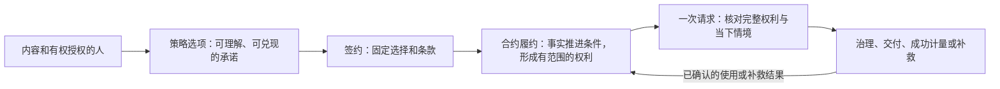
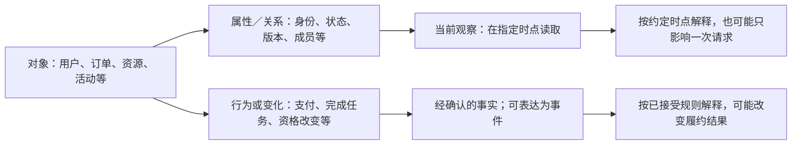
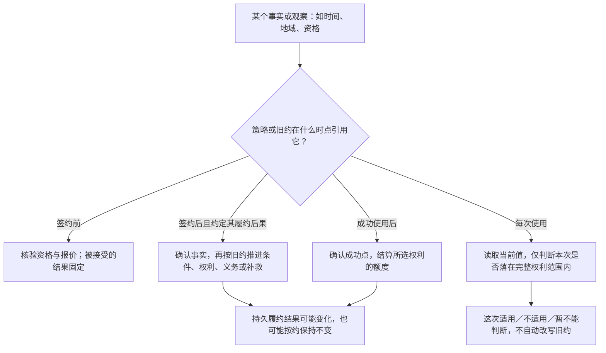
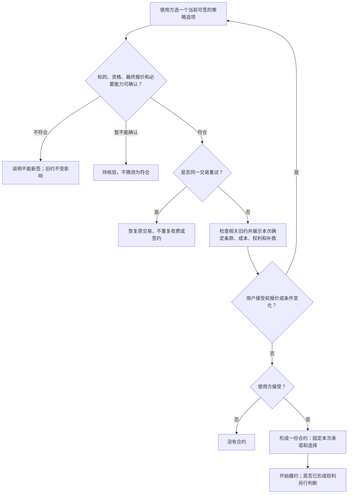
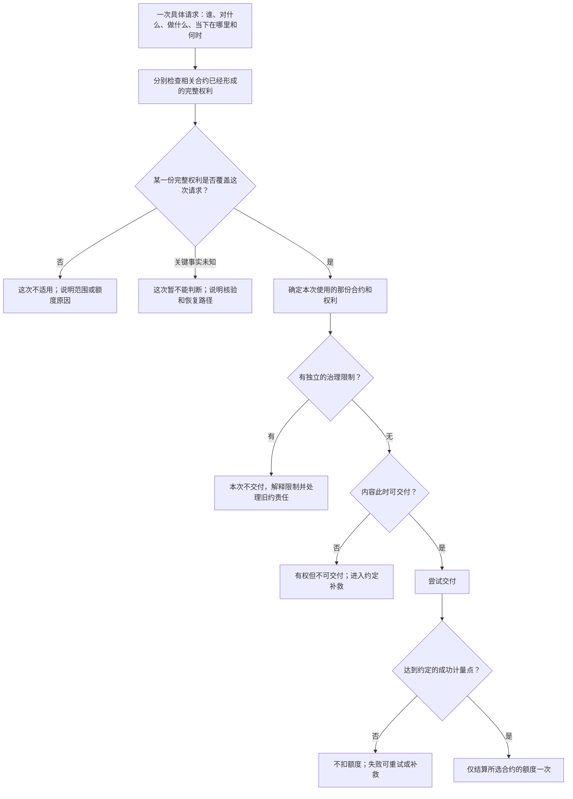
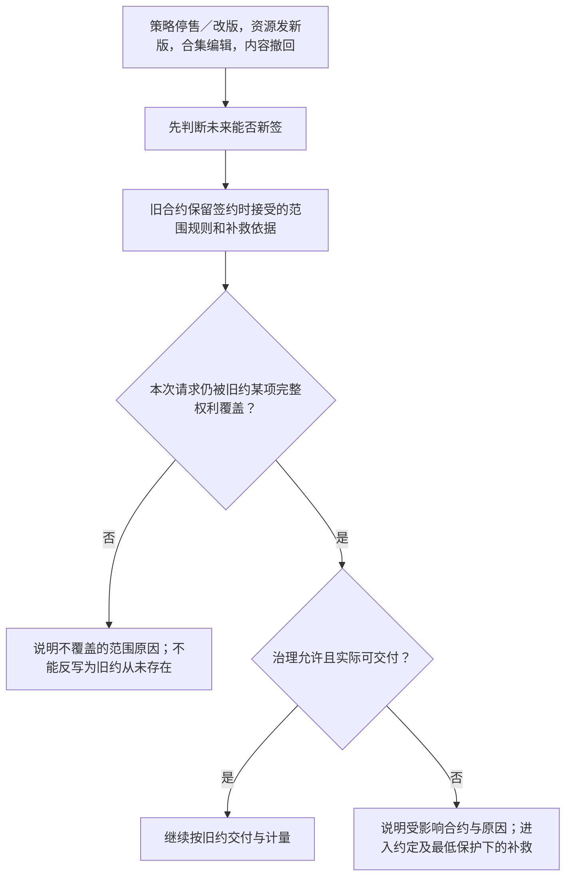
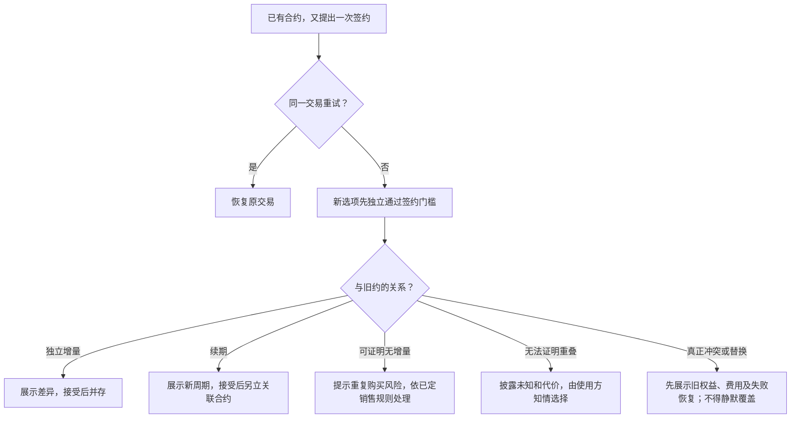

# 策略与合约团队讲解：定义、对象分类和全流程

状态：**下一代产品模型讲解稿，供团队统一语言与复核；不是已上线能力说明。** 本篇先教会读者区分对象与流程，再看复杂场景。产品规则以[整合主稿](./18-策略合约产品模型与运行流程.md)和[平台底线](./13-策略产品规则与能力边界.md)为依据；「待决」事项没有在此悄悄变成默认规则。不讨论策略语言句法、数据库或事件投递实现。

## 先用五句话说清业务

1. 授权方为**确定的内容**发布策略选项：用户要做什么，才能得到什么权利，不能兑现时怎么办。
2. 使用方接受**当时确定的条款**才形成合约；签约不等于已经获得全部权利。
3. 合约依据已接受条款解释付款、任务完成、时间到达等**已确认事实**，形成进度、权利、义务或补救。
4. 每一次使用都拿**某一份完整权利**与当前请求比较；这次不适用，不等于合约失效。
5. 是否可交付、是否成功、是否扣额度和如何补救，是授权判断之后的不同问题。

## 第一层：先认清五类东西

把名词先放回它在业务中的位置。**对象是什么、对象发生了什么、约定怎样解释、当前得出什么结果**，是四个不同问题。

| 类别 | 回答的问题 | 主要成员 | 不要混成 |
|---|---|---|---|
| ① 参与者与内容 | 谁对什么作出承诺，谁受益？ | 授权方、使用方、受益人、单资源、版本、合集、单品关系。 | 把资源标题或当前页面当作合同标的。 |
| ② 承诺与关系 | 约定了什么，哪一份约定被接受？ | 策略、签约选项、报价、合约、条款版本。 | 把后来修改的策略当作旧合约。 |
| ③ 输入与证据 | 哪个事实在何时可被用来判断？ | 支付结果、任务结果、身份、活动、时间、地域、成功使用及其可信依据。 | 把点击、未核实回调或当前观察直接当成授权。 |
| ④ 履约结果 | 合约至今产生了什么？ | 条件进度、已取得的权利、持续义务、待确认项、补救和争议。 | 把整份合约压成一个“有权／无权”标签。 |
| ⑤ 使用与后果 | 这次能否使用，实际上发生了什么？ | 使用请求、适用判断、治理限制、内容交付、成功计量。 | 把有权、可交付、已成功扣额当成同一结果。 |

### ① 参与者与内容：确定业务所指

| 术语 | 在本模型中的定义 | 一个检验问题 |
|---|---|---|
| 授权方 | 有资格针对标的提出许可条件并承担承诺的一方。 | 他是否有权授予所售行为？ |
| 使用方 | 查看、选择并接受条款、承担约定对价或义务的一方。 | 接受的是哪份确定条款？ |
| 受益人 | 最终可行使权利的主体；可以与付款或操作账户不同。 | 使用时验证的是谁的权利？ |
| 单资源 | 可稳定识别的一个线上授权标的；标题不是其身份。 | 所请求版本属于哪一个标的？ |
| 版本 | 单资源的某一内容版本；是否含未来版本，由已接受的范围规则决定。 | 本次请求的版本落在旧约范围内吗？ |
| 合集 | 本身可成为授权标的，并与线上单资源形成单品关系。 | 用户取得的是合集整体权利，还是某单品权利？ |
| 单品关系 | 某单资源被收录进某合集的关系；关系可以变化。 | 新增或移出如何作用于旧约，签约时约定了吗？ |

这些对象需要稳定的业务身份。资源标题、合集当前目录或用户当前页面可用于展示，却不能自动成为旧合约范围的最终依据。

### ② 承诺与关系：策略、选项和合约

| 术语 | 在本模型中的定义 | 不是什么 |
|---|---|---|
| 策略 | 授权方公开的可签约承诺及签后解释规则，限定在平台允许的能力和最低保护之内。 | 仅仅一段会跳转状态的程序。 |
| 签约选项 | 策略中供用户选择的一条完整交易路径，包含资格、对价、取得条件、目标权利和异常后果；每个选项分别接受产品审查。 | 只显示价格、把后续任务隐藏起来的按钮。 |
| 报价 | 在签约时针对当下资格、活动与选择给出的确定交易条件。 | 可在用户接受后随活动结束重新计算的价格。 |
| 合约 | 某个选项被具体使用方接受后形成的独立约定：固定主体、标的、版本、价格、条件、范围规则与补救依据，并记录其履约结果。 | 策略本身、当前最新条款或一张静态收据。 |
| 续约 | 关联上一周期、重新报价并接受的新合约。 | 把旧合约的价格和期间直接改掉。 |

**策略是可反复供人选择的承诺；合约是一次已被接受的承诺。**同一选项可对应许多合约，同一受益人也可能因不同选项、期间或标的持有多份合约。策略停售通常停止未来签约，不使已签旧约消失。

### ③ 输入与证据：对象、事实、事件与当前观察

| 术语 | 在本模型中的定义 | 例子 |
|---|---|---|
| 对象 | 具有业务身份和关系、可被承诺指向的参与者、内容或业务事项。 | 用户、资源、订单、任务、活动。 |
| 属性或当前值 | 对象或环境在某个判断时刻呈现的事实。 | 当前会员等级、本次地域、请求版本。 |
| 行为或变化 | 某人或平台做了某事，对象或关系可能因此改变。 | 点击支付、完成广告、会员资格被撤销。 |
| 已确认事实 | 平台可按来源、主体、合约关联、时间及唯一性确认的结果，才可按旧约产生业务后果。 | 本合约指定订单已到账、指定任务已完成。 |
| 事件 | 向业务说明“某项变化或结果已发生”的一种表达；它本身不是授权命令。 | 指定订单支付成功的已确认结果。 |
| 当前观察 | 为某次判断读取的当下事实，不要求改变合约。 | 这次请求发生在中国、现在是白天。 |

平台可逐步开放的**输入对象域**也要分类，但这不是要求把每种值都造为一份持久对象：

| 对象域 | 策略可能关心什么 | 典型判断位置 |
|---|---|---|
| 用户与资格 | 受益人身份、会员、组织归属及其变化。 | 签约资格、取得条件、持续条件或本次使用。 |
| 内容与关系 | 资源版本、合集成员、上游许可和发布方资格。 | 发布与签约核验、权利范围、本次交付。 |
| 交易与对价 | 指定订单、成交价、支付、退款及更正。 | 签约固定价格、签后取得权利或补救。 |
| 任务与行为 | 指定广告观看、活动任务、分享等及其完成结果。 | 经确认后推进条件；不能只看动作开始。 |
| 平台运营活动 | 折扣活动、授权方参与关系、适用对象。 | 报价时取样；签后不倒改旧价。 |
| 时间、地域与使用环境 | 约定日期、期间、每日时段、当前地域、设备或用途。 | 可以是签约门槛、动态履约事实或逐次范围输入，按承诺区分。 |
| 治理与供给 | 平台强制限制、资源是否可交付、撤回及争议。 | 独立于权利适用的交付判断及补救。 |

“对象会变化”不等于“合约要监听它”，“合约监听到变化”也不等于“必须发权”。同一种会员身份可用于签约优惠、签后的持续条件或每次使用限制；**用途和判断时点必须由承诺指定**。时间既能以“约定日期到达”推进履约，也能以“现在是否处于允许时段”仅判断一次使用。

### ④ 履约结果：条件、状态、权利、义务与补救

| 术语 | 在本模型中的定义 | 判别问题 |
|---|---|---|
| 取得条件 | 要形成某项权利前，合约要求满足的事项及其次数、顺序和期限。 | 付款到账还是仅打开支付页？两次任务可否累计？ |
| 条件进度 | 某条取得路径已经得到确认的部分成果。 | 已完成第一次广告，第二次尚未完成。 |
| 合约履约状态 | 对各路径进度、权利、义务、待确认项及补救事项的业务概括，可并行而非单个总开关。 | 浏览权已取得时，下载权仍可等待付款吗？可以。 |
| 权利 | 已由某份合约形成的一项完整许可，须有受益人、行为、标的、范围、额度及来源依据。 | “付款成功”有授予下载行为和具体范围吗？没有就还不是权利。 |
| 义务 | 已接受条款要求一方继续履行的事项。 | 后续署名或按约付款不能因另买一份合约自动消失。 |
| 补救 | 承诺无法兑现、不可交付、提前撤回或发生争议时，按旧约与平台最低保护承担的后续责任。 | 用户已付款却无法交付，有什么可执行出口？ |

状态机是**描述合约履约如何推进的产品模型**。它可以有中间进度，但不能靠一个叫“授权”的状态名代替具体权利，也不能让用户完成全部已展示条件后落入无权又无补救的终局。

讲解一个过程状态时，须分别说出三件事：**这个状态给出哪些候选权利；这些权利本次使用的有效前置条件是什么；它在此期间监听哪些已确认事件、满足什么条件才转往哪个状态。**前置条件因地域或时间不满足时，状态并没有“暂停”；该状态已约定的监听仍可推进履约。不同权利的独立取得进度可分属不同路径，合同不是单个总授权开关。

### ⑤ 使用与后果：权利不等于交付成功

| 术语 | 在本模型中的定义 | 与前一层的区别 |
|---|---|---|
| 使用请求 | 某个受益人此刻要对某个版本或单品执行指定行为，并带有时间、地域、用途等情境。 | 请求不是新的签约。 |
| 本次适用 | 至少有**一份合约的一项完整权利**覆盖这次请求；结果还可是不适用或暂不能判断。 | 已取得权利不保证每次、每地都适用。 |
| 平台治理限制 | 平台独立施加的强制边界，可能阻止这次交付。 | 不意味着历史合约从未存在。 |
| 可交付性 | 即使本次权利适用，内容此时是否真能提供。 | 无法交付不等于没有授权。 |
| 成功计量点 | 签约前已定义的、实际使用达到何种结果才算消耗额度。 | 发起请求或失败重试不能冒充成功。 |

如果 A 合约允许“中国个人使用”，B 合约允许“美国非商用”，平台不能从两份合约各取一半条件拼成两者都没授予的许可。一次请求须能由**某一份完整适用的合约**单独支持；成功后只结算选定合约。

## 第二层：怎样给一个新因素分类

任何新能力——广告、会员、活动、地域、版本，甚至未来新增的对象——都先回答下面五个问题，不先发明一个新状态：

| 问题 | 要说明什么 | 以会员身份为例 |
|---|---|---|
| 关注的是谁或什么？ | 对象及其与标的、合约的关系。 | 哪个受益人的哪种平台资格？ |
| 是固定值、当前值还是已发生变化？ | 签约快照、逐次观察、可累计历史或已确认变化不能混同。 | 签约时是会员、现在是会员、后来失去会员是不同输入。 |
| 何时判断？ | 发布、报价签约、签后取得、每次使用、成功后结算、补救。 | 折扣在签约时判断；使用限制可能每次判断。 |
| 判断会产生什么结果？ | 可签约性、成交价、条件进度、权利、一次适用性、额度或补救。 | 会员折扣不能因后来失去资格重算旧价。 |
| 谁能确认，未知时怎么办？ | 可信来源、权限、延迟、重复、更正及不可核验的出口。 | 平台暂不能确认资格时，不能凭猜测认定符合或撤权。 |

这五个问题彼此独立。“动态／静态”只回答**这一次解释是否要改变合约的持久履约结果**，不负责给对象贴永久标签：

因此“白天才可用”通常是每次读取的范围约束；“到明天 09:00 才取得权利”是合约取得条件。二者都提到时间，却属于不同流程。地域改变可能让一项既有权利这次不适用，**不叫合约暂停**。

## 第三层：沿时间讲完整流程

### 流程 A：发布选项——平台允许承诺什么

授权方先确定有权授予的标的和行为，再给出每个选项的签约资格、对价、取得路径、目标权利及失败后果。平台分别核验：引用的能力是否开放；所有正常完成路径是否能在有界成本与时间内到达非空、可用的权利；付出代价而无法兑现时是否有可执行补救。**一项策略有多个选项时，每个选项都必须自己成立。**

结果只有三类：可以成为候选可签选项；已知不成立而拒绝；关键范围规则或平台能力尚未定稿而暂不能发布。产品审查通过不等于保证未来内容永不故障，也不等于法律合规审查已自动完成。

### 流程 B：报价与签约——承诺何时固定

签约前的资格不是签约后天然持续有效的条件；若策略要求“必须一直是会员”，须另在签前说明它持续影响哪项权利。促销报价一旦被接受，活动后来结束也不能倒算旧价。

### 流程 C：动态履约——已确认事实怎样推进合约

签约后先判断立即条件：免费立即授权可以形成权利，付费选项可能只形成“等待指定订单付款”的进度。以后约定的支付、任务完成、时间到达或资格变化被确认时，只能按这份合约**已接受的规则**产生效果：保留部分进度、形成指定完整权利、履行某项义务、进入补救，或保持不变。

一条取得路径至少说清：属于哪份合约、哪些条件算完成、多个条件如何组合、完成期限、最终形成什么权利、未完成或无法继续怎么办。重复事实不重复发权；来源或关联暂不能确认时保持待核验；迟到、撤销和更正要能说明影响。不允许用户付款或完成任务后无限等待，也不允许临时追加隐藏门槛。

### 流程 D：逐次使用——合同不动，问题换了

六个问题不可合并：**能否签约、合同是否存在、权利是否取得、这次是否适用、能否交付、是否成功计量**。例如本次地域不符只回答第四问；内容暂不可交付只回答第五问，不能倒答成“用户没有签约”。

### 流程 E：使用结果怎样影响下一次

成功使用可能减少**本次选定权利**的剩余额度，使下一次请求得到不同结论；这是使用结果被确认后再进入动态履约，不代表每次访问前的适用判断都要跳状态。失败不扣额度；重复结果不重复扣；并发使用最后一次额度时，也不能一笔使用在两份合约里双扣。更正成功记录时应能解释更正后余额及受影响的后续判断。

### 流程 F：策略和内容后来变化怎样影响旧约

“停售”“用户仍有权”“用户这次可用”“此刻能交付”是四个不同结论。未来版本是否进入“所有版本”、合集新增或移出单品如何作用于旧约，必须按签约前说明并被固定的范围模式判断；**具体默认模式尚未定稿**。

### 流程 G：已有合约时怎样再签、替换或续约

先排除同一交易重试，恢复原结果而不重复收费。若是新的交易，先确认新选项自己可售、可兑现，再比较旧约：有独立增量的可另签并存；可证明无增量的须说明重复购买风险；无法可靠比较的应披露可能重叠及代价，不能假称一定有增量或一定重复。真正冲突或需要替换时，须展示旧权益、费用结算和失败恢复，再由使用方明确接受；不许因新约更贵就自动取消旧约。

续约重新报价并接受，形成**关联上一周期的新合约**；旧周期的价格、权利和履约历史不被改写。多份合约同时可用时，本次须选一份完整支持请求的合约，不能拼接范围；默认选哪份、替换如何退款抵扣、续期从何时起算仍待定稿，讲解时不能说成当前平台已有默认行为。

## 一例贯穿：付款取得有限次数的浏览权

以下仅是**用于检验模型的假设选项**，不是当前平台在售策略：授权方对资源 R 承诺，使用方支付 10 元后，受益人取得“自该笔付款被确认时起 48 小时内浏览 R 三次”的权利；仅每日北京时间 09:00—18:00、使用地在中国时适用。签约前说明付款期限、成功浏览的计量点与无法交付的补救。本例特意明确起算点，不推定其他选项也如此。

| 顺序 | 发生的事 | 应得到的业务结论 |
|---|---|---|
| 1 | 20:00 用户接受确定报价与条款。 | 合约成立；付款条件未满足，浏览权尚未形成。 |
| 2 | 20:05 平台确认本合约指定订单到账。 | 动态履约形成从 20:05 起 48 小时、最多三次的浏览权；此时夜间并不阻止权利形成。 |
| 3 | 20:10 用户在中国请求浏览。 | 权利已取得，但本次不在允许时段；不交付、不扣次数，合约不变成“未付款”。 |
| 4 | 次日 10:00 用户在美国请求。 | 本次地域不适用；回到中国可再判断，不称合约暂停。 |
| 5 | 次日 11:00 在中国请求，内容交付失败。 | 本次权利适用但无法交付；不扣次数，按已披露方式处理故障或补救。 |
| 6 | 次日 11:30 在中国成功浏览一次。 | 对这份合约的浏览权计量一次，剩余两次；下次请求读取新余额。 |
| 7 | 48 小时后再请求。 | 该项权利已超出期间，不再覆盖新请求；合约和历史仍可解释、查询。 |

若用户同时有另一份权利，必须找出哪份**单独完整覆盖**本次浏览，并在交付前确定依据；不能两份各借一个宽松条件。若 48 小时内对该合格用户根本没有任何可用的白天时段，则“付款可得到可用浏览权”的承诺实际上为空，发布或签约设计须排除该组合。

## 讲解时最容易混淆的八句话

| 容易说错 | 准确说法 |
|---|---|
| “策略就是合约。” | 策略是面向未来签约的承诺和规则；合约是某人接受确定条款后形成的一份独立约定。 |
| “签约成功就有授权。” | 合约已存在；是否形成某项权利，还要看该权利的取得条件。 |
| “付款成功就是权利。” | 付款是可确认的事实；按旧约解释后，才可能形成有完整范围的权利。 |
| “在美国不能用，合约暂停了。” | 通常是这一次不落在地域范围内；合约及权利并未因此暂停。 |
| “到了授权状态就可以使用。” | 状态名不能代替受益人、行为、标的、期间、地域、额度等完整权利。 |
| “有授权就一定能下载。” | 权利适用之后，还要看治理限制和内容实际能否交付。 |
| “请求发出就扣一次。” | 只在事先约定的成功点确认后，才结算所选权利的额度。 |
| “新策略或新合约覆盖旧约。” | 旧约依据原承诺独立履行；停售、再签、续约或替换有不同流程。 |

## 讲完后，团队应能回答什么

给出任意一个新场景，先画出**参与者和标的 → 策略选项 → 已接受合约 → 已确认输入 → 履约结果与完整权利 → 一次请求 → 治理／交付／计量或补救**。然后明确输入是签约取样、签后履约、逐次观察还是成功后结算；再分别说明“不符合”与“暂不能确认”、合约存在与权利形成、权利适用与内容可交付。

目前仍须由产品定稿：持续身份丧失的后果、[显式版本/合集范围模式](./18-策略合约产品模型与运行流程.md)中哪些动态模式准许发行、相对期间与时区、任务进度和更正、已有授权再售与默认选约、提前撤回和最低补救、各资源类型开放的能力。它们是**模型可容纳但具体政策尚未确定**的问题；团队不能把示例或历史材料中的一种选择当作已上线规则。进一步的完整规则与待决清单见[第 18 篇](./18-策略合约产品模型与运行流程.md)，按正常、边界、变化、组合和失败场景回检的方法见[第 15 篇](./15-多轴维度拆解与场景分析方法.md)。
