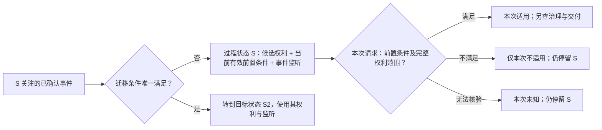

# 策略语言设计：语义核心与表达轮廓

状态：**下一代策略语言第一轮设计稿**。这里开始设计语言应能表达的对象、规则和执行含义；示例采用说明性结构，**不是已定稿的关键字、编译器语法或线上能力**。产品约束来自[18-产品模型与运行流程](./18-策略合约产品模型与运行流程.md)和[13-平台底线](./13-策略产品规则与能力边界.md)，团队术语见[19-定义分类与全流程](./19-团队讲解-定义分类与全流程.md)。产品待决项不因本篇出现示例而自动定稿。

## 1. 先确定语言要回答的六个问题

一份策略不是一个 `Permit/Deny` 表达式，也不是只有“事件→状态”的程序。它要让用户在接受前理解、让平台在接受后无歧义地执行六个问题：

| 问题 | 语言必须表达的业务结果 | 不能用什么代替 |
|---|---|---|
| 谁能签、按什么价格签？ | 标的、授权方、签约资格、可选项、报价和取样时刻。 | 付款事件或当前合同状态。 |
| 接受后固定了什么？ | 已选条款、双方、标的、成交价、范围规则、能力版本及补救依据。 | 一条始终指向“最新策略”的引用。 |
| 怎样取得权利？ | 免费即时取得，或有限步骤的支付、任务、时间/资格条件；每个完成点授予哪项权利。 | 一个名叫 `authorized` 的状态。 |
| 取得了什么权利？ | 受益人、行为、标的、版本/单品、期间、地域、用途、设备、额度。可有多项并存。 | “付款成功”或某个抽象授权颜色。 |
| 这次请求能不能用？ | 以**一份合同的一项完整权利**与本次请求、即时观察比较，产生适用／不适用／暂不能判断。 | 让地域/IP 变化反复迁移整份合同状态。 |
| 成功或故障之后怎么办？ | 成功点、额度结算、条件不能完成/无法交付/争议的补救与退出。 | 把交付失败当成从未取得授权。 |


语言描述**承诺及其可被解释的规则**。事实由平台按已登记能力确认；合约是策略被接受后的实例；每次使用结论不是策略文本的一次改写。

## 2. 最小语义单元及它们的关系

下表是建议作为语言第一层的业务结构。它们应能被人独立查看和解释；表中名称是语义名称，不是强制采用的语法词。

| 单元 | 作者需要声明 | 平台需要约束 |
|---|---|---|
| **标的与能力绑定** | 稳定的资源/合集标识，允许的行为，所用身份、支付、任务等能力。 | 核验授权资格、资源类型能力、能力定义的版本及权限；不能靠标题定位。 |
| **签约选项** | 谁可选、签约时如何报价、总对价/步骤上限、将取得哪些权利、异常后果。 | 每个选项独立审查，签约时形成确定报价并取得用户接受。 |
| **履约路径** | 从签约后初始进度出发，哪些已确认事实满足条件；组合、顺序、次数、期限和分支后果。 | 以状态机解释**持久履约进度**；不允许无界付出、歧义分支或无权死路。 |
| **权利定义** | 每项权利的受益人、行为、标的和完整范围；何时形成、何时结束及额度。 | 权利与授予它的合同和取得事实可追溯；一个状态可对应多项独立权利。 |
| **逐次适用条件** | 哪些值在每次使用时读取；范围不符和无法核验分别如何解释。 | 不借另一合同补足缺失条件；不把本次不适用写回成“合同无效”。 |
| **结算与补救** | 什么成功才消耗哪项额度；不能履约时有哪些已披露选项。 | 平台执行去重/扣额/最低保护；作者不能私自宣布成功、退款或撤销治理。 |

最小成立策略可以非常短：**一个可签选项 + 签约后即时形成的一项完整权利 + 该权利的逐次适用范围 + 适用的平台最低保护/退出规则**。不要求作者为了免费授权虚构支付事件或中间状态，也不能因为例子免费就省略合同异常的处理依据。支付、任务、资格变化等复杂性在其实际出现时才加入相应履约路径。

### 一个输入怎样进入语言

“时间”“身份”“地域”不是天然的动态规则或静态规则。作者必须声明**使用位置和读取时点**，平台能力再规定这个输入的来源与失败语义：

| 位置 | 例子 | 可以产生的效果 |
|---|---|---|
| 发布配置 | 资源 R、可授予的下载行为。 | 限定策略可承诺的空间。 |
| 签约取样 | 当前会员资格决定资格/成交价。 | 接受后固定结果；后来退会不倒改价格。 |
| 签后事实 | 本合同订单到账、指定广告完成、约定时刻到达。 | 按已接受路径推进进度、形成权利/义务或补救。 |
| 逐次观察 | 请求发生的时段、地域、版本、当前资格。 | 通常仅决定此次适用性；同一属性变化不必变成状态迁移。 |
| 成功结果 | 该次下载真正达到约定成功点。 | 对该次所依据的合同权利结算额度。 |

相同的平台身份能力可以同时用于“签约折扣”和“每次使用仍须为会员”，但必须分别声明；前者在签约时固定，后者在使用时读取。支付成功不是由策略文本自己制造的事实；它是平台能力对**本合约指定订单**确认的结果。

## 3. 确定的运行内核：状态前置判断 + 状态内事件监听

合约成立后进入已声明的初始**过程状态**。一个状态有三个互不替代的部分：①该状态输出的候选权利集合；②当前请求使用这些权利的有效前置判断；③仅在该状态下关注的已登记事件及迁移。状态是合约的持久履约位置；前置判断是每次使用的临时结论。对应的[产品模型](./18-策略合约产品模型与运行流程.md)第 5.1 节也按此区分。



| 状态内部分 | 读取什么 | 输出什么 | 不得做什么 |
|---|---|---|---|
| **候选权利** | 已接受的状态定义和签约绑定 | 可有多项各自完整的权利；当前状态改变时重新按新状态解释。 | 用一个“授权色块”代替行为、标的、范围和额度。 |
| **有效前置判断** | 本次请求、当前时间/地域/资格等登记能力和状态所声明的条件 | 条件为`满足 / 不满足 / 暂不可核验`；与一项完整权利自身的适用条件及范围合并后，才得出本次`适用 / 不适用 / 暂不能判断`。状态仍存在。状态级共同条件**可选**，只用于确实共享该条件的权利。 | 迁移状态、生成付款事实、扣额度，或把前置条件暂不满足说成合约失效。 |
| **事件监听与迁移** | 与本合同绑定、被平台确认且此状态明确监听的事件；可检查该事件及已允许读取的事实 | 保持原状态，或确定地迁到已声明的目标状态；目标状态的候选权利随之成为新的依据。 | 监听任意字符串、消费无关合同事件、在同一事实下产生两个不确定目标。 |

**前置条件不满足不会关闭该状态的事件监听。**例如已付款状态允许中国境内下载，用户从中国到美国时本次下载不适用，合约仍处于已付款状态，也仍能按旧约处理该状态所监听的退款、资格变化等事实。用户回到中国无需新的事件就可能再次满足前置条件。若资格丧失本来就应改变持久履约结果，策略必须**另行声明**该状态监听的资格变化事件及迁移，不能从一次前置判断失败暗推迁移。

同一种时间输入也有两种明确位置：“约定日期到达后授予”是当前状态关注的事实并可能迁移；“每天 09:00–18:00 可用”是有效前置判断，不要求每天昼夜切换状态。到期或额度耗尽可以使本次无可用权利；是否另外触发通知、补救或续约，须有已接受的事件/后续规则。

产品层的权利仍是**可独立解释的许可**。为避免“已获浏览权、仍等下载付款”造成状态组合爆炸，建议一个签约选项可以声明**多个具名履约路径**：每条路径在任一时刻处于自己的一个过程状态；合约当前进度是这些状态的组合。一个状态可输出多项候选权利，合约当前候选权利是各活动状态所输出权利的集合；每项都保留其路径、合同和状态依据，**不跨路径或合同拼接局部条件**。同一确认事实可以按已接受规则推进多条不同路径，但在**同一路径的同一当前状态**不得产生两个相互冲突的迁移结果。表层语法可以简写只有一条路径的常见策略，不能改变这套语义。

语言把过程状态映射为包含多项权利的 entitlement 结果，但每项权利仍须有自己的受益人、行为、标的、版本/单品、时间、情境和额度。不能让一个状态名或一个未分类的“授权集合”吞掉这些边界。

迁移到新状态后，**旧状态的权利不会因实现上的状态切换而被默认抹掉**：仍须继续存在的权利必须能在目标状态的权利结果中被完整保留；按合同允许结束的权利须有明示的结束条件。发布校验要比较迁移前后的权利变化是否属于已披露承诺。这样既能用状态表达权利结果，也不会把“进入退款/争议流程”误写为“所有已取得权利自动消失”。

## 4. 一份说明性策略：从人能读懂到可校验

下例只展示**候选结构及其确定的业务语义**，不暗定关键字或日期格式。假定标的、下载、支付确认、地域观察和平台补救能力均已开放；示例的具体版本集合、允许地域与补救方案在真正发布时必须填明。

```text
策略：资源 R 的限次下载
标的：线上资源 R（稳定标识）

签约选项「付款下载」
  可选者：符合平台已登记的个人使用方资格
  签约报价：10 元；用户接受时固定成交金额及条款版本
  公开承诺：本合同指定订单按成交价到账后，取得下述下载权
  完成期限：到账事实发生时刻不晚于签约后第 48 小时；确认可能稍后到达；
    逾期或收款后不能兑现，按已披露规则处理

  起始状态「待付款」：
    候选权利：无
    有效前置：不适用（当前无候选权利）
    监听「本合同指定订单到账已确认」且金额等于固定成交价：转至「已付款」
    监听「付款期限已到」：转至「待结算核验」；不能把未知支付当作已确认未付

  状态「待结算核验」：
    候选权利：无；有明确的最长核验期限与用户查询/申诉出口
    监听「期限内发生的到账后来被确认」：转至「已付款」
    监听「期限内未付款已被最终确认」：转至「未取得」
    监听「逾期收款或无法最终核验」：按已披露规则转至「补救中」

  状态「已付款」：
    候选权利「下载权」：本合同使用方下载资源 R 的明确版本范围；
      自有效到账确认起连续 24 小时；最多 10 次成功下载
    有效前置：本次使用地属于签约时披露的允许地域；
      无法确认地域时结果为「暂不能判断」
    监听「约定的无法兑现事实」：按已接受条款转入「补救中」

  状态「未取得」：无下载权；
    监听「付款事实更正为期限内已到账」：按已披露规则转至「已付款」或「补救中」
  状态「补救中」：保留已付款历史和补救依据；原下载权是否继续存在，
    必须按已接受的补救方案明确写出，不因状态名称自动取得或消失

  使用与后续：
    本次请求先核对某一份完整下载权，再由平台检查治理和交付
    仅成功交付时结算该份权利的一次额度
    不能交付、收款后无法兑现与争议，走签约前展示的补救选择
```

这个写法显示了两种入口：本次地域变化只重新判断「已付款」状态的有效前置条件；支付、超时、无法兑现则是状态内监听的已确认事实。候选状态名、前置条件和监听不是同一个布尔值。示例故意没有代填具体版本集合、地域或退款比例；若这些参数未填或平台方案未定，**示例不能发布**。若承诺“付款获得 24 小时下载权”，起算时刻与允许时段导致的**空可用窗口**也必须被审查，不能只证明到账后能到达一个叫“已付款”的状态。

### 分层示例：同一语言如何逐步扩展

| 场景 | 额外表达，而不是改写核心流程 |
|---|---|
| 免费即时浏览 | 签约后直接形成浏览权；仍可限定版本、期间及本次地域。 |
| 看两次指定广告取得浏览权 | 声明同一合同内可累计的两次**已确认完成**、最多步骤和期限；每次只推进进度，第二次形成权利；任务不可用有出口。 |
| 支付或完成任务任选其一 | 两条公开的有界取得路径，明确是否共享/分别产生权利；不得因另一分支完成而重复收费或重复授予。 |
| 会员资格 | 可分别用于签约取样、签后取得条件、持续履约条件和逐次范围；每种用法必须独立披露。 |
| 版本范围、合集单品 | 权利指向稳定标的并声明范围模式；未来版本/新增或移出单品的效果必须是已接受的规则，不能读取当前目录后倒改旧约。 |
| 多合同、续约 | 每份合同独立使用本语言解释；选择哪份完整权利与扣哪份额度是跨合同产品规则，续约形成关联的新合同而非改写旧合同。 |

## 5. 单资源与合集：同一状态语义，不同的标的范围

两类标的共享签约、过程状态、有效前置、事件迁移、交付和补救规则；不同的是**权利指向的内容范围如何确定**。合集不是本地文件夹，也不是把多个单资源的合同临时拼起来。成员只能来自平台稳定识别的线上单资源及其关系，授权方是否有权授予这些行为仍由平台核验。

| 标的 | 权利必须显式说清 | 后续变化怎么解释 |
|---|---|---|
| **单资源** | 资源稳定 ID、可用行为、版本范围；精确版本、签约时已发布版本集合、规则化版本范围须区分。 | 新版本只在已接受的范围规则明确包含它时纳入旧约；发布新版不自动扩大固定范围，也不使旧版权利消失。 |
| **合集整体** | 合集稳定 ID、针对合集整体的行为和范围。 | 对合集整体的权利**不自动授予**对每个单品的下载、转授权等行为。 |
| **合集中的单品** | 合集 ID、单品关系、允许行为、成员范围模式，以及成员各自的版本范围。 | 新增、移出和单品新版本都按签约时固定的范围规则判断；范围内但不可交付时进入交付与补救，不伪称原本无权。 |

为避免“全部”成为会随页面变化的隐式指针，语言只接受[产品主模型第 4.1 节](./18-策略合约产品模型与运行流程.md)定义的**显式范围模式**。下表说明它们在语言中的表达责任，不是另立一套产品规则，也不表示平台已经批准所有模式：

| 范围模式 | 签约时固定的承诺 | 对后来变化的默认解释 |
|---|---|---|
| `固定快照` | 固定确定的版本/成员身份集合。 | 新增不纳入；移出不抹掉合同曾覆盖的成员。能否继续交付另判。 |
| `满足规则的未来新增` | 固定选择规则、纳入时点和对外承诺。 | 符合规则的后来版本/成员可纳入；已纳入者不得因目录移出而静默失去旧约保障。 |
| `可轮换目录` | 允许增减的服务承诺、最低供给/替代标准、通知和补救。 | 只有平台批准并且这些保护可执行时才可开放；**不能**把此模式伪装成普通的“所有单品”。 |

若范围模式未选择，或未来新增、移出、成员版本、内容下架的解释不完整，策略不应发布。`固定快照` 是较保守的**推荐初始模式**，不是由文字“全部版本”“整个合集”暗含的语法默认。是否允许可轮换目录、最低保护的数值仍属于平台产品决策；在确定前，相应语法分支不得作为可发行能力。

## 6. 语言能力不是任意脚本

语言核心只需要几类受控表达：

1. **稳定引用**：标的、受益人、签约选项、权利、平台能力、已接受的条款版本，以及本合同内绑定的订单/任务；显示标题不参与授权判定。
2. **有类型的条件**：资格/报价条件、已确认事实的匹配、条件组合与次数/期限、逐次范围判断。一个表达式的类型和可用位置必须匹配；不能在签约报价中引用未来使用结果。
3. **受限的履约结果**：推进已声明的进度、形成指定权利、履行义务或进入约定补救。不能写任意网络调用、篡改身份、伪造付款或修改其他合同。
4. **平台登记的扩展能力**：新广告/任务/资格/地域事实先定义稳定身份、可用阶段、输入/结果类型、可信来源、时间含义、未知/更正语义和权限，然后才能供策略引用；不是开放任意事件字符串。

### 作者可见的结构草案

先固定**声明层级**，再讨论英文或中文关键字、标点和具体表达式文法。下面的树是建议的一份策略文本应具备的结构，不是可直接执行的源码：

```text
策略发布（语言版本、稳定标的、外部能力的精确版本）
└─ 签约选项（可多个，逐项展示、校验和接受）
   ├─ 签约条件与报价（只读签约时允许的事实）
   ├─ 范围选择与目标承诺（代价、目标权利、期限、补救）
   ├─ 履约路径（可多个；每条恰有一个起始状态）
   │  └─ 状态（当前候选权利、可选的共同有效前置、状态内事件迁移）
   ├─ 权利定义（每项有独立的受益人、行为、内容和适用范围）
   └─ 后续义务、成功计量与补救（引用平台允许的方案）
```

“权利定义”是该选项内可引用的完整许可声明；状态通过稳定的权利标识声明当前输出哪些权利。定义一项权利不等于在所有状态都已取得它；目标状态若应继续输出旧权利，须明确保留其引用。这样权利内容只定义一次，状态结果仍可审计和比较。

| 书写位置 | 允许引用的值 | 允许产生的结果 |
|---|---|---|
| 签约条件和报价 | 标的、签约方、平台登记的当前资格/活动、作者公开参数。 | 是否可签、确定报价和需固定的选择；不能读取未来事件。 |
| 状态共同前置和单项权利适用条件 | 已接受条款、当前请求与平台开放的即时观察。 | 纯粹的三态判断；不能写付款、迁移或扣额。 |
| 状态内事件匹配/迁移条件 | 本合同绑定对象、已确认的特定事件内容、已接受参数和该路径进度。 | 一个明确目标状态或无效果；不能修改别人的合同。 |
| 权利与补救声明 | 已固定标的、主体、范围模式及平台批准的权利/补救能力。 | 可解释的许可与退出结果；不能给未登记行为造权限。 |

词法和表达式应保留**有类型、有限、无副作用**的子集：布尔、有限精度数值/金额与币种、稳定标识、时间点/时长/时区、范围集合及其明确的比较和逻辑组合。无界循环、随机授予、任意网络调用、脚本里自造对象或事件，不属于核心策略语言。未知输入、数值单位不一致、无法比较的时间范围，均须给出可定位的校验或运行结论，不能靠隐式类型转换猜测。

作者可以描述“看完指定广告取得浏览权”，但不能定义广告回调怎样产生或把“开始播放”私自命名为“观看完成”。这属于能力提供者和平台核验边界，不属于策略语言的自由表达空间。

### 状态内事件的判定契约

事件是**平台已确认的对象变化或结果**，不是作者定义的消息字符串。语言层至少要让每条监听指向已登记的提供方与事件类型，约束所关联的合同/对象、可读取的内容、发生和确认时刻；平台还须能识别重复、迟到、撤销或更正。相同来源的一次完成不能被同一合同计为两次。策略不决定事件如何产生或传输。

只在**每条路径的当前过程状态**评估其监听规则。一个已确认事件若无匹配监听、关联不符、条件不满足或内容无效，不改变该路径状态；若同一路径当前状态与同一事件的两个迁移条件可能同时成立且目标/效果不同，发布前必须消除歧义，不能把隐藏的代码顺序当优先级。不能证明关键分支互斥时不按“安全”放行。

同一事件可被多条独立路径消费，但必须先分别得出`迁移 / 无效果 / 待核验 / 错误`，再形成**一次完整的合约结果**：无关路径的“无效果”不阻止相关路径迁移；任何应处理路径尚不能确定或出错时，不得只完成一半承诺，所有受影响路径保持原进度并进入可恢复的待核验/错误结果。对签约者只能展示完整、确定的履约结果。这是业务原子性约束，不指定数据库技术。迁移事件本身也**不会自动跳过**新状态的逐次有效前置判断。

迟到、更正和撤销不可简单“把状态倒放”：未被消费的进度可以按已接受规则更正；已形成但尚未使用的权利如何调整须有明确条款；已经成功使用、付款或交付的历史不能抹去，只能产生可审计的调整、补救或争议结果。不同事实能力必须公开自己的更正语义，策略只能选择平台允许且已向签约者披露的后果。

### 发布制品与旧合同稳定性

一份可签约的策略发布须锁定三层依据：①作者写的表层语言版本；②平台确认的语义模型版本；③标的、权利和事件等外部能力规范的**精确版本及内容标识**。签约再固定具体策略发布、选项、报价、范围模式和受益人。其后修改语言解释器、能力目录、页面文案或策略新版本，不得静默改变旧合同的含义。显示名称与翻译不参加授权运算，但**用户实际接受时看到的条款展示**必须单独留证，不能只保留机器语义。

现有 `authorization-language` 研究仓库的 `policy / subject / state / transition / entitlement` 原型证明了**精确标的绑定、事件迁移、类型与歧义检查**有可用基础；它把 entitlement 内嵌于单一状态，尚未表达签约前条件和逐次适用等能力。其早期架构稿暂不设计合集，而原型已允许合集的分段 entitlement，说明这些是**研究阶段的不同切片，不是共同定稿的合集语义**。原型中的 `Classification` 还是一种合约标的，不能直接等同于本篇的“平台用户身份”。新设计可以继承精确绑定和确定性原则，**不能直接把原型句式当作完整产品语义**；也不在此选择解析器、IR 格式或运行语言。

## 7. 发布前怎样判断策略“可发行”

至少分成四层，不把“文本可解析”冒充“承诺可兑现”：

| 校验层 | 必须回答 | 失败时 |
|---|---|---|
| 语法与引用 | 结构是否完整；标的、权利、能力、变量是否存在且版本确定？ | 不可提交。 |
| 类型与阶段 | 条件类型对不对；每个输入在哪个时点可读；结果是否越权？ | 不可提交。 |
| 承诺与路径 | 对每个签约选项、可签约人群和公开取得路径，正常完成的**所有合法分支**是否在有界成本/步骤/时间内得到非空、可行使的目标权利；已付出代价却不能兑现是否有补救；事件迁移是否确定？ | 不可作为可签约选项；无法证明的关键结论不能按“已证明安全”放行。 |
| 运行前复核与运行中解释 | 当前报价/资格/能力/标的是否可确认；重复、迟到、纠正、不可交付怎样按已接受规则处理？ | 签约前拒绝或待确认；签约后按原约与最低保护补救，不能倒称未签约。 |

发布前需拒绝的典型反例：支付后进入永远不会授予权利的状态；“最多看两次广告”实际存在无限重试；同一状态/事实下两条互斥结果均可发生；24 小时权利形成时已经过期；可签约选项依赖未开放的事实；只给出零额度或空版本范围；把使用地不符写成撤销既有合同。运行时的未来服务故障不能完全静态证明，因此必须另有异常和补救规则。

第 13 篇的产品底线须能逐条追溯到语言表达或平台检查，不能只说“遵守产品规则”：

| 底线索引 | 本语言或平台的对应把关 |
|---|---|
| R01、R06 | 稳定标的/主体引用、精确策略与能力版本、签约取样及展示包留证。 |
| R02、R16 | 能力登记、资源类型和授权方权限、事实来源与可用阶段检查；禁止任意脚本和越权副作用。 |
| R03—R05 | 选项公开条件/权利/成本/补救；路径可兑现性检查；签约时复核报价并由用户接受。 |
| R07 | 状态内只处理可信、关联、去重的确认事件；迟到、更正与未知有独立结果。 |
| R08—R10 | 状态候选权利完整；有效前置和权利范围逐次判断三态结果，不回写合同；交付另判。 |
| R11—R12 | 每项权利保留合同来源；多合同不拼接，成功后只计量选定权利；失败不扣。 |
| R13—R15 | 新发布不改旧约；目标状态保留应保留的权利；补救、解释、审计与恢复出口。 |

“所有正常完成路径”是逐**选项、可签约人群、取得路径**检查：用户完成了已披露且在其能力范围内的要求后，每一种被允许的正常结果都须到达承诺的完整权利；不能仅证明“图上存在一条成功路线”。用户主动放弃、经确认未完成、作弊、外部故障和事实更正属于不同异常分支：它们可以不授予权利，但已经付出的代价、已确认的进度和应承担的补救不能因此消失。无法证明关键安全结论时，应拒绝该选项或缩小可表达范围，不把未知当作合格。

### 用正交场景回归这套语言

下表不是几个“看起来能跑”的例子，而是每次改变一项输入后应保持的产品不变量；新事实能力、权利类型和范围模式都要扩展此表。

| 场景变化 | 必须得到的结论 |
|---|---|
| 免费签约且权利完整 | 初始状态即给出可用权利；不虚构事件或收费。 |
| 支付尚未确认、支付确认、确认重复 | 分别保持待履约、按约迁移一次、不得重复迁移或再收费。 |
| 两次广告只完成一次、完成两次、第二次不可用 | 分别保留进度、形成目标权利、按已披露期限/替代/补救处理；不得无限循环。 |
| 会员只用于签约折扣，后来失去资格 | 旧合同成交价和已得权利不被倒改。 |
| 会员用于状态有效前置，后来失去再恢复 | 前后请求结论变化，但过程状态不变、该状态监听仍在。 |
| 会员撤销被明示为状态事件 | 经确认的撤销事实才迁移；不能把一次当前值不可核验当作撤销。 |
| 中国请求、美国请求、地域未知 | 依次可适用、不适用、暂不能判断；不因请求迁移或暂停合约。 |
| 白天/夜晚与约定到日授予 | 前者重算当前有效前置，后者由当前状态监听事实推进；两种时间用法不混。 |
| 固定版本后发新版、未来版本模式后发新版 | 前者旧约不扩大；后者只按签约固定规则纳入符合条件的版本。 |
| 合集固定成员后移出、未来新增成员 | 固定成员的合同范围不被目录改写；后来成员只在明确选择未来新增模式时纳入。 |
| 两项权利、两条取得路径 | 一条完成不会冒充另一条已完成；一次请求由一项完整权利覆盖。 |
| 两份合同仅各覆盖请求的一部分 | 不拼接；若两份都完整覆盖，交付前确定依据，成功后只结算选定的一份。 |
| 内容不可交付或平台强制限制 | 有权与可交付分开；保留旧约依据并进入约定补救。 |
| 使用失败、成功重试、并发争最后额度 | 失败不扣；同一成功只计一次；不能事后暗扣另一合同。 |
| 事实迟到、撤销或更正 | 根据来源与已接受条款解释，历史交付不被伪造为未发生；必要时补救。 |
| 策略停售、续约、再次签约 | 停售不改旧约；续约是新合同；重试原交易不产生第二合同。 |

对每个场景还须检查**不符合**与**暂不可核验**两种结论、已付出代价时的出口、规则所引用能力是否开放、用户能否看懂本次依据。这样语言的可表达性和平台的执行责任才可以分别验收。

策略语言校验与平台治理、法律审查不是同一个概念；语法合格不保证授权方有处分权，也不保证所有未来请求可交付。

## 8. 本轮结论与产品边界

本轮确定的**目标设计边界**是：语言以可签约承诺为入口；签约固定确定条款；状态输出候选权利并监听已确认事件；当前有效前置判断与权利范围每次使用独立求值、**不迁移状态**；交付和成功结算分开；异常有出口；单资源/合集范围模式显式；所有表达都依赖平台登记能力。它们对应第 13 篇的目标产品底线，不是从原型语法反推出来的。

仍须给以下**平台政策与能力配置**明确答案，或把相关语法分支留在未开放范围；它们不是事件模型或状态机模型尚未确定：

1. **范围政策**：是否批准“可轮换目录”、最低供给和补救标准，以及哪些资源类型可选择未来新增模式；本篇第 5 节已规定各模式必须显式、不得静默缩减旧约。
2. **权利与持续资格**：资格失效只影响逐次适用，还是按已接受条款改变某项已取得权利；哪些效果准许作者选择。
3. **期间与额度**：起算点、时区、重复/并发结算、额度更正及跨周期进度。
4. **补救与保护**：付费/任务后能力不可用、资源撤回、争议时平台最低保护和作者可选项。
5. **能力目录**：哪些资源类型可授予哪些行为、可读取哪些事实；能力的未知、迟到、更正和失效含义。
6. **多合同接口**：新签增量提示、一次使用选哪份完整权利、默认扣额、替换与续约的产品规则。

为了让首批可发行策略无需猜测，建议先设一个**受限产品档位**（仍需平台产品确认，不冒充已上线配置）：

| 领域 | 保守的首批开放建议 |
|---|---|
| 内容范围 | 先开放显式固定快照；经核验可持续履行后再开放未来新增。可轮换目录在最低供给/补救未定前关闭。 |
| 资格变化 | 默认仅在声明处取样或逐次判断；要因资格事件改变已取得权利，必须另获能力批准并签前明示失去、恢复和未知结果。 |
| 时间和额度 | 相对期间必须明确起算事实；日历时段必须写时区；只对达到成功点的选定权利结算且可去重。 |
| 多合同 | 同一交易重试恢复原交易；可证明无增量的有偿新签默认不直接成交；未知重叠须披露并知情确认；使用时不拼接且不暗扣无法比较的合同。 |
| 补救与能力 | 无法给出平台批准、可执行的最低保护，或事实能力没有可信来源/未知和更正语义，就暂不开放涉及它的有代价策略选项。 |

这些未开放的业务选择不妨碍确定语言骨架，却会限制可发布的具体策略。表层语法应以本篇的状态、前置判断、事件监听、范围和补救语义为验收依据；不能先画一份看似完整、却无法检验承诺能否兑现的文法。
