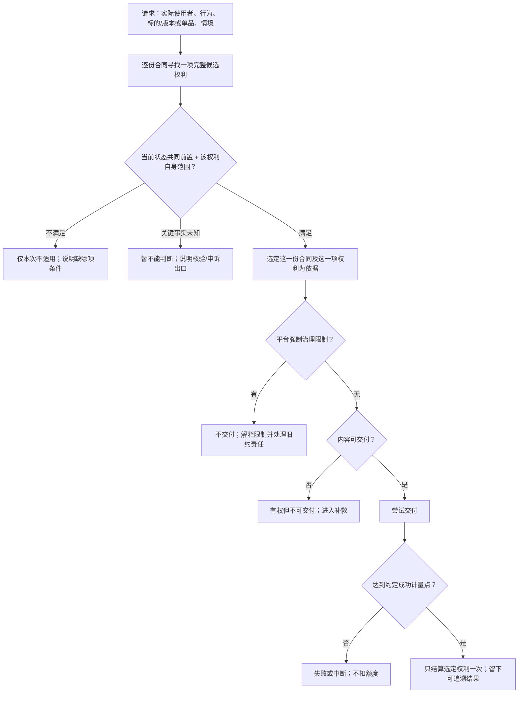

# 七角色视角的策略与合约完整产品设计

状态：**下一代平台产品设计评审稿；不是现行线上能力、策略语言语法或法律意见。**本文以策略编写者、产品经理、平台经营者、测试人员、运营人员、资源作者、消费用户七个视角，重新检验同一份授权承诺能否被理解、接受、履行和纠错。已确定的模型沿用[核心对象与流程](./12-策略合约核心抽象与场景覆盖.md)、[产品底线 R01—R16](./13-策略产品规则与能力边界.md)、[产品主模型](./18-策略合约产品模型与运行流程.md)及[多合同专题](./14-已有授权后的再次签约与多合同.md)；[语言设计](./20-策略语言设计-语义核心与表达轮廓.md)只负责表达本产品规则，不能反过来制定规则。

本文的「**底线**」是不应被作者选项绕过的目标产品规则；「**推荐**」是尚待产品确认的默认方案；「**待决**」表示尚无依据替平台、授权方和使用方作最终选择。完整性只针对本文拟支持的单资源、合集及已登记能力，不声称穷尽未来所有商业和法律情形。

## 一、先说清产品到底卖什么

平台不是出售一个叫“已授权”的状态，而是让有权授权的一方针对确定的线上内容提出**可理解、可兑现的许可承诺**。消费用户接受确定的条件后形成合约；满足约定条件后获得有范围的权利；每一次使用再判断该权利对当前人、行为、版本/单品及情境是否适用。平台还要对交付、成功计量、事实更正与无法履约给出可信的处理。作者修改资源或策略，不得倒改已接受的承诺。

六个结论不可合并：**能否新签约、合约是否成立、哪项权利已取得、本次请求是否适用、内容能否交付、使用是否达到成功计量点**。比如中国可下载、美国不可下载，通常只是两次请求的适用结论不同；合同并没有在两国之间来回“暂停”。

## 二、七个角色对同一承诺的不同要求

角色可能由同一人兼任，但产品不能因此混淆其权力。策略编写者可以替资源作者起草，发布权和履约责任却不能只因为“会写策略”就转移。

| 角色 | 他真正要完成的事 | 最怕发生什么 | 产品必须给予的控制与证据 |
|---|---|---|---|
| **策略编写者** | 在平台开放能力内组合资格、对价、取得路径、权利范围与补救。 | 写得出复杂流程，却有隐藏死路、歧义分支或引用了不可信事件。 | 查看能力含义与限制；对每个签约选项预览消费者承诺、模拟正常/失败路径、得到可定位的拒绝原因。不能自造付款成功或跨权操作。 |
| **产品经理** | 设计可复用、可比较、可治理的授权商品与规则。 | 为满足某个策略特例，把“合约、权利、请求、交付”混成一个开关，导致后续产品无法演化。 | 定义平台底线、能力准入和场景验收；对默认值、可选项和不可开放项留下版本化决策。不能以页面文案替代合约依据。 |
| **平台经营者／老板** | 获得可持续交易、作者供给和消费者信任，并看得见负债与风险。 | 收入增加但付款未发权、重复收费、旧约无法履行或退款责任失控。 | 同时看到成交、兑现、交付、补救和争议指标；决定风险预算与能力开放阶段。不能用短期成交率覆盖最低消费者保护。 |
| **测试人员** | 证明发布规则和真实生命周期在正常、边界、变化与故障下有一致结果。 | “编译通过”掩盖付费无权、事件重送双发权、地域未知误拒、合集移出偷改旧约。 | 拿到可追踪的条款、事实、状态、权利和决策结果；有正交场景与反例作为发布门。不能仅验一条成功演示路径。 |
| **运营人员** | 发布、停签、处置故障、解释申诉，并协调作者与使用者。 | 为止损直接下架后让存量合同失联，或只能手工修改合同掩盖事故。 | 分别管理发现、新签、旧约交付与治理限制；定位受影响合同、通知、补救和留痕。不能私自改价、清空权利或伪造事实。 |
| **资源作者／授权方** | 发行单资源或合集，获得授权收益，并履行其公开承诺。 | 新版本或合集编辑被误当作自动重写旧约；上游许可失效后仍持续售卖；承担未预见的无限责任。 | 在发布前看到授予范围、成本与履约责任；可以停止未来新签、修复供给和选择平台允许的补救，但不能无代价撤回旧约。 |
| **消费用户／受益人** | 在接受前知道付出什么、何时得到什么，之后能使用、查询和维权。 | 付费/看广告后无权；到了异地被称“合同无效”；已有授权却再次收费；下载失败仍扣次数。 | 看见最终条款和最大代价、已完成进度、权利来源、每次拒绝原因、剩余额度、退款/申诉出口；续费或替换须另行明确接受。 |

七个视角汇合成同一条约束：**任何可售选项都必须让作者知道自己承诺了什么，让用户知道自己接受了什么，让平台能证明如何履行和失败时怎样承担责任。**

## 三、对象、权力与不变边界

| 对象/关系 | 对用户与作者意味着什么 | 稳定性与权限边界 |
|---|---|---|
| **标的** | 一个线上单资源或合集；版本和合集—单品关系进一步定义内容范围。 | 用稳定身份，不用标题或当前页面。资源作者须有权授予所售行为；合集成员必须是平台识别的线上单资源。 |
| **策略发布与选项** | 对未来使用方公开的交易条件；同一发布可有多个独立选项。 | 可停售、发新版；每项选项独立检查，不能用一个好选项掩盖另一个无权死路。 |
| **合约** | 某使用方接受某一确定选项后的独立承诺。 | 固定双方、受益人、标的、条款版本、成交价、选择、范围规则、补救依据及签约取样；不能指向可变的“最新版”。 |
| **已确认事实** | 本合同指定订单到账、指定任务完成、资格变化或成功使用等。 | 平台核验来源、关联、发生/确认时间、唯一性和更正；点击或未经核实的回调不是完成事实。 |
| **履约状态与权利** | 前者是取得路径走到哪里，后者是已形成的具体许可。 | 每条路径可有当前过程状态；状态的事件监听推进履约。状态级共同前置和单项权利范围只判本次适用，不因地域变化改写状态。 |
| **义务** | 指定责任方须在约定时机履行的事项。 | 至少明确责任方、事项、受领方或对象、时机与期限、完成依据、未履行后果；不能只写一个义务名称。 |
| **使用请求** | 具体人在某时刻执行一个不可拆的业务行为。 | 必须找到**一份合约的一项完整权利**独自覆盖；批量独立使用逐项判断，不得从两约或两项半权利拼接一项许可。 |
| **交付/计量/补救** | 有权之后能否提供内容，成功后是否扣额，失败后如何处理。 | 治理与供给独立检查；仅约定的成功点消耗选定权利额度；补救不得低于平台最低保护。 |

平台的权力是登记能力、验证事实、保全合同、执行交付与最低保护；策略作者只能在开放范围内作出可兑现的选择；运营只能依据有权限且可审计的流程处置事件。合约当事人和平台的法律责任分配、强制下架与最低退款标准须另行正式批准，不能从状态机或策略文本里猜出。

## 四、从作者准备到用户使用：一条真正闭合的产品流程

### 1. 发行与设计选项：先证明“有权卖，卖得出”

资源作者先发行线上单资源或合集，并确认上游依赖、授权资格、内容可交付性。合集中的单品来自线上已发行单资源；作者可在本地组织素材，但本地目录本身不是合同标的。策略编写者随后选择平台已经开放的行为、事实能力、价格方式、取得路径、范围模式、期间、额度、义务及补救。

每项拟发布选项至少回答：

1. 谁能签、谁受益、哪一个稳定标的、可授予什么行为？
2. 使用方最多付多少钱、完成多少步骤、等待多久；什么算完成，证据由谁确认？
3. 正常完成后得到哪项**非空且实际可行使**的权利；版本/单品/时间/地域/用途/设备/额度怎样限制？
4. 任一步骤未完成、事实未知、付出代价后能力失效、内容不可交付或作者撤回时，用户有什么可执行出口？
5. 单资源发新版、合集加入/移出单品、作者停售时，旧约的范围与交付承诺怎样保持？

发布审查不仅检查语句是否能运行，还检查授权资格、资源类型能力、全部正常完成路径、有限对价/等待、确定分支、非空权利、可行使用窗口和补救。不能证明关键安全结论的选项不得作为可签选项。作者可以用模板或自写规则；两种来源的**产品审查标准相同**。上线后修改条件须成为新发布，不改已签约版本。

### 2. 展示、报价与签约：把“可能获得”变成确定承诺

消费用户在决定前看到的是**该次交易的最终条件**：标的与范围模式、权利及限制、成交价或任务成本、完成期限、有效期间和起算点、额外义务、已存在的相关合同与可能重叠、退出及不能兑现时的处理。签约资格、资源是否开放新签、平台能力及报价必须在接受时复核；变化则重新展示并要求接受，不悄悄换价。

签约后立即形成独立合约，但未必立即有目标权利。免费选项可立即取得；支付/任务选项进入等待或进度状态。同一交易重试恢复原合同/订单，不能再次收费或生成第二合同。可证明无增量的有偿新签默认不直接成交；无法证明是否重叠时要说明不确定性与新增负担，知情确认后才可继续；真正互斥的旧约义务不能靠“新约优先”解决。替换与续约分别需要明确结算和新的接受。

### 3. 签后履约：事实推进，当前条件不偷改状态

每条取得路径有一个当前过程状态。状态声明候选权利、可选的**共同有效前置条件**，以及只在本状态关注的可信事件；单项权利可另有自身范围条件。合约开始时处理立即条件；之后只有与合同绑定、已被平台确认且被当前状态关注的事件，才可能按已接受规则推进到确定的新状态。**状态前置条件不满足，不关闭该状态的事件监听。**本次地域、每日时段等变化通常只改变本次是否适用，不令合约来回迁移。

路径关系先区分**独立、同一目标的替代、共同完成**。同一事件可能影响多条路径，完整合约结果可以是“付费下载权已取得、独立赠品待核验”；不得悄悄漏掉未知事项，也不能因赠品未知拖延可独立兑现的下载权。只有签前明确共同完成、不可拆的承诺才整体兑现，不按事件把全部路径捆绑。

同一取得目标允许付款或看广告时，默认只兑现一次，不自动双发或延长；完成后停止索取新的取得代价。已付代价和迟到完成按签前获批的结算、补救规则处理。重复事实不重复发权或扣额；迟到事实区分发生时刻与确认时刻；撤销、更正不能“把历史倒放”。已付款/已完成任务但无法兑现时进入披露过的补救，不让用户无限停在“等待”或“看下一次广告”。

义务区分取得前、使用时、使用后和持续事项。使用后才应完成的署名或分成不能默认成为使用前已完成的门槛；未履行影响哪项后续权利、是否进入更正或补救，须在签前说明并符合平台底线。

### 4. 本次使用：有权、适用、可交付、成功是四道门

如果多份合同均完整适用，先确定本次依据，再交付和计量；默认选择必须事先公开。建议尊重用户显式选择，否则优先不消耗有限额度且不增加不利义务的合同，再考虑较早到期者；无法可靠比较时请用户选择，不能暗扣。交付失败、重试与并发不得双扣；额度已经被并发使用完，必须在交付前重新取得适用依据，不能事后改扣另一份合同。

这里的一次使用是一个不可拆的业务行为。批量下载多个可独立使用的单品，应逐项寻找完整依据、交付和计量；单品可分别依据不同合约。作为整体发行合集等独立的整体行为仍须整体许可，不能用多个单品许可拼成。

### 5. 后续变化：不让“停售”“下架”“撤回”成为一个含糊开关

| 变化 | 未来新用户 | 已有合约 | 运营与作者的责任 |
|---|---|---|---|
| 策略新版或停售 | 新用户看新版或不能再签旧版。 | 旧约继续按接受时的版本履行。 | 解释版本差异，保留旧约可查。 |
| 单资源发新版 | 新约可按当前方案售卖。 | 只有已接受范围规则包含新版时旧约才覆盖。 | 保障原范围的交付；无法交付另行补救。 |
| 合集新增/移出单品 | 新签展示当前真实范围。 | 分别按已接受的成员与版本规则解释；不能用当前目录倒改旧约。 | 识别受影响合同并履行通知/替代/补救。 |
| 作者停止供给或上游许可失效 | 停止不再可兑现的新售卖。 | 合约与已形成权利不凭“下架”消失；交付可能受限。 | 说明原因、范围与责任；执行原承诺和平台最低保护。 |
| 平台治理强制限制 | 可限制发现、新签和交付。 | 治理可阻止交付，不伪称合同从未存在。 | 通知、留证、处理受影响合同及申诉/补救。 |
| 续费、升级或替换 | 是新交易，不是对旧约静默改价。 | 旧约继续，除非显式替换条件及结算完成。 | 展示差异、重叠、费用和失败恢复路径。 |

发现、允许新签、已有合同继续可查、具体内容能否交付、平台是否强制限制，是**独立的产品轴**。停止新签可以先止损，但不能当作已付款合同的补救。需要永久停止交付时，必须处理相关存量合同；法务和结算应定最低保护，运营不能临场自造退款比例。

## 五、单资源与合集：同一合约模型，不同内容范围

针对单资源，合同要明确资源身份和版本范围；针对合集，合同还要区分“合集整体行为”和“单品行为”，并明确成员范围以及每个成员的版本规则。获得某单品的浏览权不等于获得整个合集的发行权；获得合集整体许可也不自动获得每个成员的下载/转授权。作者必须有权授予涉及的内容，成员与上游授权发生变化时不能只靠页面当前列表推断旧约。

[产品主模型的显式范围模式](./18-策略合约产品模型与运行流程.md)包括固定、按规则纳入未来新增、可轮换目录；合集须分别选择**成员纳入规则与各成员版本规则**。固定成员可包含其未来版本，纳入未来成员不等于纳入全部未来版本；两轴都固定才是完整固定快照。**推荐首批两轴都固定**；未来新增要明确纳入条件与时点，已纳入旧约的内容不能因编辑目录而静默失去保障；可轮换目录仅在最低供给、替代、通知及补救全部可执行时开放。模式必须签前展示并随合约固定，不能让“全部版本”“整个合集”成为没有时间含义的默认词。

固定快照不是“作者永远不能移出单品”：作者仍可编辑面向未来的新目录；只是对已有合同，移出不等于权利范围缩小。旧内容若实在无法交付，问题转为交付失败和补救，而不是伪称用户从未买到该单品。这同时保护作者日常运营和消费者已接受的承诺。

## 六、七角色之间最难的冲突，平台怎样裁决

| 表面冲突 | 不能采取的捷径 | 建议的产品裁决 |
|---|---|---|
| 作者想快速改合集，用户买的是确定范围。 | 把当前目录当所有旧约的唯一范围。 | 合约固定范围模式；普通编辑只改变新售卖，旧约按模式继续或补救。 |
| 编写者想任意监听事件，平台要防止作弊和隐私越权。 | 允许策略自造“支付成功”“会员”字符串。 | 能力先登记来源、对象关系、可用时点、未知/更正和权限，再开放引用。 |
| 平台想扩大交易，用户已有相同授权。 | 凭策略 ID 不同再次收费，或一律禁止可能重叠的合理增量。 | 先识别同一交易重试；可证明无增量默认不直接成交；未知重叠披露并确认；真实增量可并存。 |
| 运营想立即下架止损，已付款用户仍要求履约。 | 一个“下架”按钮同时抹掉发现、合同和交付责任。 | 分别控制新签、发现和交付；保护旧约证据，逐合同识别影响并补救。 |
| 老板想降低退款，作者不愿担无限风险，用户要求兑现。 | 由某条策略自行写“无论何时不退款”。 | 平台设不可放弃的最低保护、责任归属和风险上限；作者只选获准方案；高风险模式先不开放。 |
| 测试希望每条复杂规则可证明，产品希望快速增加能力。 | 编译通过即发布全部能力。 | 先开放有限且能证明的选项；条件、事件或补救无法验证时缩小能力范围，不靠生产事故学习底线。 |

这类冲突应沿“**平台底线 → 用户已接受的条款 → 经确认的事实 → 本次观察**”的顺序解释。平台强制治理可以阻止交付，但必须独立说明受影响合同的责任；作者、运营和新策略都不能用后来的决定抹掉旧约。

## 七、面向人的最小信息与处置能力

| 时点 | 消费用户应看见 | 作者/运营/平台应看见 |
|---|---|---|
| 签约前 | 最终价格/任务成本与上限、目标权利、内容与范围、起止、限制、失败补救、已有合同重叠。 | 为什么某选项可发行或被拒；资源/能力/补救的具体缺口。 |
| 签约后待条件 | 接受的条款版本、订单/任务与已确认进度、最晚何时有结果、取消/申诉入口。 | 哪些合约待付款、待任务、待核验；是否已有代价但无权利。 |
| 一次使用被拒 | 是无完整权利、状态前置不满足、权利范围不符、事实未知、治理限制，还是不可交付。 | 对应合约、权利、条款与可核验事实；不得只显示通用“授权失败”。 |
| 成功或扣额 | 本次依据哪份合同、消耗什么额度、剩余多少。 | 去重/并发与交付成功依据，可处理更正。 |
| 异常与退出 | 已支付/已完成步骤的处理、补救进度、退款/替代/争议结果和联系人。 | 受影响人群、预计义务、通知状态、裁决权限、审计轨迹。 |

产品经理和经营者至少要同时观察**签约转化、正常取得权利的比例、已付出代价但仍无权利的存量与时长、交付成功率、重复收费/扣额、补救完成时间、争议和作者流失**。高成交率若伴随付费无权或大量无法交付，不是健康增长。指标只能帮助治理，不能代替单个用户按约得到的权利。

## 八、内容变更、运营治理与争议：谁能操作，留下什么结果

### 1. 起草、批准与发布不可混为一个动作

策略编写者可以是授权方本人、团队成员、平台模板作者或受托专家；**会编写不等于有权代表资源作者发布授权承诺**。产品上至少区分起草、资源作者核对承诺、平台发布审查及正式发布。即使一人兼任，也保留其在每个角色下作出的决定。第三方代写时，授权方的批准范围、平台审核责任和误导文案/无法履约的责任分配须在允许其发布前正式确定；在此之前，第三方稿件只能由有权授权方审核后发布。

资源作者执行可能影响内容供给的操作前，应得到一张**旧约影响说明**，而不是仅收到“确定修改吗”：涉及哪些在约权利、哪些范围仍覆盖、是否继续可交付、哪些用户要通知、是否触发补救、作者是否有权限继续。标题修改通常不改变合同身份；发新版通常不缩小固定范围；移出合集成员对固定快照旧约不自动撤权；停止新签不影响交付；撤回内容或上游许可失效则可能影响交付和补救。若操作将导致已付费旧约无法兑现而补救尚无批准方案，产品不得让它作为普通的无提示编辑静默完成；紧急治理限制另走平台强制流程。

### 2. 运营治理要拆开轴，不能有一个万能“下架”

| 运营动作 | 可影响什么 | 旧约的最低处理 |
|---|---|---|
| 调整公开展示/搜索 | 未来发现与曝光。 | 合同和权利仍可查询，不能因此变为“未购买”。 |
| 停止新签 | 新交易，不再形成新的相关合约。 | 已签约者继续按旧约履行；另查交付是否正常。 |
| 临时限制交付 | 本次或一段期间的内容提供。 | 记录治理依据、范围与恢复条件；说明“有权但受限”，识别受影响合同并处理补救。 |
| 强制撤回或长期不可交付 | 停止不适当的新售卖及实际交付。 | 保留旧约、付款、事实和使用历史；按批准的通知、退款/替代/争议规则处理。 |
| 恢复供给或解除限制 | 恢复可交付性及必要的未来新签条件。 | 不凭恢复自动重写旧合约或重置已消耗额度；遗漏的补救继续可查。 |
| 争议裁决与补偿 | 特定合同的救济、账务或事实更正结果。 | 基于证据和权限作出有理由的决定，可被当事人查询与申诉；不直接改写原签约条款。 |

每次治理决定至少明确**对象、原因、适用范围、生效/恢复条件、对新签/展示/交付的不同影响、受影响旧约、用户可见说明和补救责任**。运营可按权限止损，但不能伪造支付结果、把平台限制伪装为用户失格，或手改合同历史替作者免除承诺。

### 3. 争议不是一个“联系客服”的死胡同

争议至少区分**签约或报价、事实是否完成、权利范围、交付与计量、内容变更、治理限制、退款/替代**。案件的最小证据包应能找到：合同与受益人、接受时展示的条款、策略发布与能力版本、订单/任务和更正记录、所请求的版本或单品、当次判断、交付与计量结果、作者和运营动作。裁决应说明影响未来使用、已成功使用、剩余额度和补救账务的哪一部分；已经发生的交付不能被改写为“从未发生”。处理时限、复核层级与资金承担仍需正式政策决定，未定前不能假装付费选项已有完整补救。

## 九、测试与发行门：从角色诉求反推场景

每个选项至少沿“**正常、不满足、未知、边界、迟到/重复/更正、并发、内容变化、多合同、退出**”检查；优先交叉会影响同一决定的维度，不机械穷举所有字段组合。下表是首批不可缺的验收样本：

| 场景 | 用户可见的正确结果 | 必守的跨角色底线 |
|---|---|---|
| 免费签约且立即可用 | 合约和完整权利一起形成。 | 不能只有叫“授权”的空状态。 |
| 代写者未获授权方批准、资源类型未开放该能力 | 选项不能进入可签状态，说明缺少哪一项批准或能力。 | 会写策略不等于有权出售；不能以语言可表达代替产品准入。 |
| 支付确认迟到、重复或被更正 | 待核验有期限；有效到账发权一次；逾期收款或无法兑现进入已披露补救。 | 不双收费、不静默吞款、不抹去已成功使用的历史。 |
| 两次广告任务完成一次、第二次不可用 | 保留已确认进度，按期限/替代/补救处理。 | 不能无限要求看广告或清零进度。 |
| 付款已确认，独立赠品资格待核验 | 付费权利按约取得，赠品明确待核验、期限和出口；不可拆承诺包则按整体规则处理。 | 依承诺关系决定是否共同兑现，不依事件捆绑所有路径。 |
| 同一目标可付款或看广告，另一路迟到完成 | 目标默认兑现一次，不自动双发或延长；已付代价按签前结算/补救处理。 | 完成后不再索取取得代价，不吞掉迟到付款或任务成果。 |
| 商用权要求使用后署名或分成 | 可先按完整权利使用，后续按明确义务履行和处理。 | 使用后义务不被默认当作使用前已经完成的门槛。 |
| 签约会员折扣后失去资格 | 合同成交价不变；其他后果看已接受条款。 | 当前资格变化不倒改旧价。 |
| 身份事实被撤销、来源暂不可用或与本合同无关 | 依已接受条款处理撤销；未知则解释并提供核验出口；无关事实不影响本约。 | 不把未知当失格，不跨合同复用无权限事实，不泄露无关身份资料。 |
| 中国／美国／地域无法核验三次请求 | 分别适用、不适用、暂不能判断。 | 不称合同“暂停”，状态监听继续。 |
| 白天可用与到指定日期授予 | 前者逐次判断，后者按状态内事件推进。 | 不为昼夜切换制造无意义状态迁移。 |
| 固定版本发新版、合集固定成员被移出 | 固定版本不覆盖新版，移出不缩小固定成员；成员版本另依旧约规则判断，供给另判。 | 作者可编辑未来售卖，但旧约需履行或补救。 |
| 合集未来新增模式加入单品 | 仅符合签约时明确规则的成员纳入。 | 不能因为当前目录变化就无条件授权或撤权。 |
| 合集固定成员允许其未来版本 | 分别判成员与版本范围，符合版本规则的新版可纳入。 | 固定成员不隐含固定版本。 |
| 用户批量下载多个独立单品 | 每项选择完整权利、交付和计量；整体发行行为仍须整体许可。 | 批量独立使用不要求一项权利覆盖全批，不拼接整体许可。 |
| 已有合同再次签约或两约部分重叠 | 重试原交易不再收费；新约须有独立依据，一次使用不拼接。 | 不向用户把重复包装成新增权益。 |
| 多合同都完整适用、额度并发耗尽 | 交付前确定选约；成功只扣一份、一次；冲突时先重判。 | 不事后暗扣另一合同。 |
| 权利适用但内容下架或治理限制 | 告知“有权但不可交付/被限制”，保留合同与补救入口。 | 不把平台或作者故障转嫁为“用户无权”。 |
| 策略停售、资源撤回、作者退出 | 停止不适合的新售卖；旧约按原规则履行或补救。 | 不凭停售批量删除旧约证据。 |
| 运营强制撤回后恢复，用户此前已申请退款 | 展示限制、恢复和补救各自的结果；已经启动的争议与资金处理有明确结案依据。 | 恢复供给不自动取消已承诺补救，也不重写旧合同或重置额度。 |

发布门不是“所有未来故障都能预测”，而是：结构上无已知无权死路、无无界代价、无含糊范围和隐藏门槛；当前资源与能力可以履行；异常有被批准的出口；测试能说明每个结果依据哪份承诺与事实。未来出现故障则进入运营处置和补救闭环。

## 十、还必须由平台正式决定的政策，不交给策略或语言猜

产品模型已经能清楚描述这些问题，但**模型能容纳不等于平台已批准某种答案**。下列决定须有产品负责人、相关运营/结算及必要的法务评审；在定稿前关闭对应高风险能力，而不是用随意默认值上线：

| 待决政策 | 推荐的安全起点 | 不定稿的后果 |
|---|---|---|
| 动态合集、未来版本和可轮换目录准入 | 首批成员与版本两轴都固定；未来新增分别显式纳入；可轮换目录待最低供给/替代/补救成立后再开放。 | 旧约范围可能被当前目录无声改变。 |
| 持续资格的失去、恢复与未知 | 先支持签约取样和逐次有效前置；要改变已取得权利必须单独批准并签前说明。 | 用户退会后被暗中撤权，或服务故障被误作失格。 |
| 相对期间、日历时段与任务进度 | 明确起算事实、时区、步骤有效期和跨合同复用规则，不接受空默认。 | 已付款时权利已过期，或任务无法完成但无出口。 |
| 有代价承诺的最低补救与责任归属 | 平台先批准退款/替代/通知/申诉的最低保护及谁承担成本；作者仅可选择更优或获准方案。 | “无法交付”有描述却没有可执行处置。 |
| 能力登记与更正权限 | 每种支付、资格、广告、地域、治理能力有可信来源、适用资源类型、未知/迟到/更正语义与隐私边界。 | 策略引用不可证实事实，争议无法裁决。 |
| 多合同与续期的商业政策 | 默认阻止可证明无增量的有偿直接成交；未知重叠要求披露；替换与自动续费另行明确同意。 | 双重收费、旧约被覆盖或续期吞掉剩余期间。 |

### 政策由谁决定，能力何时开放

建议把每一项待决政策作为有负责人的产品决定，而不是留在策略示例或开发任务里。产品负责人决定用户承诺、默认选项和开放范围；资源与运营负责人核对供给、治理与人工处置能否履行；结算及必要的法务评审核对有代价承诺的资金和责任边界；测试负责人用正常路径和反例验证；平台经营者批准风险上限及上线阶段。角色可以由同一团队兼任，但批准依据和责任不能因兼任而消失。

开放一种新能力前，至少具备一张可复核的**能力卡**：适用的资源类型与合约阶段、可采信事实及未知/更正方式、签前向用户展示的承诺、正常完成后可取得的具体权利、失败时的补救及责任、运营能执行的处置、测试能复现的边界反例。缺少其中关键项时，能力继续保持不可售；已经发布的旧约按原承诺处理，不能用关闭新能力替代存量处置。

对单项政策的批准记录应写明：适用哪些资源类型和选项、消费者接受前如何披露、对存量合同是否只作前瞻影响、失败补救、运营权限与验收反例。**真正的产品定稿是上述政策和主流程一起可执行、可解释、可审计；不是策略语言的关键字终于写完。**
