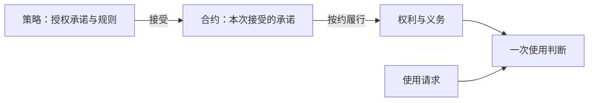
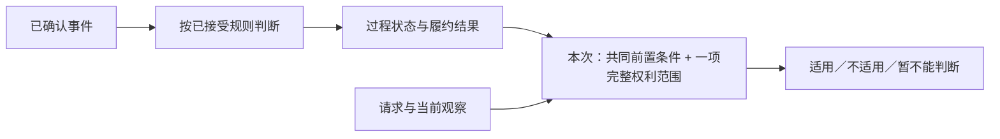

# 策略与合约：从顶层抽象逐层展开

状态：下一代产品模型简明讨论稿。纵向细化概念，横向组合能力；语言语法与能力实现另行设计。

| 抽象层 | 章节 | 向下细化什么 |
|---|---|---|
| 业务核心 | 1 | 授权业务的目的与共同底线 |
| 对象与关系 | 2—3 | 谁参与、承诺什么、合约与权利包含什么 |
| 输入与规则 | 4—7 | 判断依据、作用时机、履约过程与业务结果 |
| 结构组合 | 8—10 | 一项变多项、一条变多条、一约变多约 |
| 具体业务 | 11—12 | 具体对象与场景组合 |

## 第一章　业务核心：接受承诺，依据合约取得和使用权利

授权方针对标的提出策略；使用方接受确定承诺形成合约。合约按承诺确定权利和义务；每次使用判断当前请求是否适用。实际使用或异常的结果，继续按约反馈和处理。

所有下层设计遵守四条底线：**正常完成须得到非空、可行使的目标权利；代价、步骤和等待有界；变化不得倒改已接受承诺；异常须有可执行出口。**补救处理无法兑现的异常，不能替代正常路径的授权成果。

## 第二章　核心对象：把第一章的参与者和关系说清

| 对象 | 含义与关系 |
|---|---|
| 参与者 | 授权方作出承诺；使用方接受并承担对价；受益人享有权利，三者按约绑定。 |
| 标的 | 承诺针对的确定内容。 |
| 策略与选项 | 面向未来签约的规则；使用方接受其中一个确定选项。 |
| 合约 | 绑定参与者、标的和已接受选项的一次独立承诺。 |
| 权利 | 由合约确定，允许受益人实施具体行为。 |
| 义务 | 合约指定的责任方须在约定时机完成的事项。 |
| 使用请求 | 实际使用者对具体内容实施的一次业务上不可拆分的授权行为。 |

对象和关系须有稳定依据；标题或当前页面不能代替身份。策略编写者可以起草，发布承诺仍须取得有权授权方的批准。

一个操作含多项独立使用时，逐项判断；另有定义的整体行为须有完整整体许可，不能拼接单品许可代替。

## 第三章　内部结构：把合约、承诺和权利继续拆开

**合约 = 固定的已接受条款 + 可以变化的履约结果。**条款固定参与者、标的、规则、成交价和当次选择；结果记录进度、权利、义务及补救。固定规则和签约取样，不冻结实际情况。

一项承诺继续拆成：**签约条件 → 取得条件 → 目标权利 → 持续规则 → 退出与补救**。这些条件和后果须在接受前说清。

一项权利继续拆成：**受益人 → 允许行为 → 内容范围 → 使用限制**。范围与限制描述「哪一次使用被允许」，例如期间、地域、用途、设备、额度；不是每项权利都需要全部限制。

一项义务继续拆成：**责任方 → 应完成事项 → 受领方或对象 → 触发时机与期限 → 完成依据 → 未履行后果**，并保留来源合约。取得前、使用时、使用后、持续义务分别安排；使用后才产生的义务不能要求提前完成，新约也不自动免除旧约持续义务。

## 第四章　输入模型：把规则所关心的世界拆开

| 分解项 | 含义 |
|---|---|
| 对象与关系 | 谁或什么，以及谁与谁的关系。 |
| 属性与值 | 对象或关系具有什么特征，当前或约定时点的值是多少。 |
| 创建、变化、完成、结束 | 对象、关系或行为发生了什么业务事实。 |
| 观察与事件 | 平台提供可判断的值，或把已确认的变化、完成结果表达为事件。 |

**值用于判断，事件可供监听；变化是否影响合约，由规则决定。**时间、地域可作为观察输入，不必都建立独立对象。平台只开放可识别、可确认且获准使用的能力；事件来源和监听实现由平台负责。

## 第五章　规则模型：输入怎样产生业务后果

一条规则说清：**针对什么 → 读取什么 → 何时判断 → 满足什么条件 → 允许什么后果 → 未满足或未知怎么办**。多个条件可按且／或、顺序、次数、期限组合。

| 判断时机 | 可以产生的结果 |
|---|---|
| 签约前及接受时 | 可否签约、最终报价；接受后固定约定取样。 |
| 合约开始及签后约定事实出现时 | 记录进度，形成或按约改变权利、义务、补救。 |
| 每次使用时 | 本次适用、不适用或暂不能判断。 |
| 使用成功或异常确认后 | 计量、更正、恢复或补救。 |

同一输入可用于多个时机，必须分别指定。一次满足是否永久完成、以后是否持续符合，也须作为条款明确；未知不能按成功或失格猜测。

## 第六章　过程模型：把第五章的履约规则组织成状态机

过程状态记录履约位置：**候选权利 + 可选的共同有效前置条件 + 当前关注的事件及迁移规则**。合约开始时判断立即条件；之后按当前状态关注的已确认事件推进。

动态履约可能留下持久变化；静态判断只给出本次结论。前置条件暂不满足不迁移状态、不关闭监听；每项权利特有的条件归该权利范围。状态迁移结果须确定，重复事实不得重复产生效果，迟到或更正依旧约处理。

## 第七章　业务结果：把第一章的使用与后续处理继续拆开

一次使用继续拆成：**完整权利适用 → 治理允许 → 内容可交付 → 达到成功点 → 计量选定权利**。有权但不可交付要解释和补救；失败、重试和并发不得重复扣额。

对象后续变化依第五章的规则解释：策略停售通常影响新签；内容变化依已接受范围规则；资格变化依约影响指定结果。发现、新签、旧约查询、交付和治理分别判断。

退出、撤回、更正或争议须明确对权利、剩余额度、义务与补救的影响，保留历史。平台最低保护贯穿全程；关键政策未定时，相应选项不能作为可售承诺。

## 第八章　权利数量：一份合约可以有多项权利

把第三章的一项权利扩成多项，各自拥有完整的行为、范围和限制；可以由同一次取得条件共同授予。**多项权利不必然需要多条取得路径。**

一次请求须由其中一项完整权利独自覆盖；各项额度和义务按约区分，后续状态不默认清空先前已形成的权利。

## 第九章　过程数量：多条路径怎样组合

需要分别记录履约进度时，把第六章的一个过程扩成多条路径，各有当前状态。同一权利也可有替代取得方式；条件中的且／或不强制拆成多条路径。

| 路径关系 | 如何兑现 |
|---|---|
| 独立履行 | 各自满足就各自兑现；其他未知事项单独待核验，不阻塞已确认的独立权利。 |
| 同一目标替代 | 按接受的选择、切换或竞争规则满足同一目标，只兑现一次。 |
| 共同完成 | 分别保留进度，全部共同条件满足后才兑现指定权利或不可拆的承诺包。 |

关系随条款固定。替代目标完成后停止索取新代价；其他路径已有代价、迟到完成按签前获准规则结算或补救，不默认再发权或延长期间。无法处理这种竞争的组合不得发行。

完整结果须交代全部相关事项，可以同时包含「下载权已取得、赠品待核验」；共同兑现只适用于已接受的共同承诺，不能由同一事件临时把独立事项捆绑。

## 第十章　合约数量：同一受益人可以持有多约

把第二章的一份合约扩成多份，各自独立履行。再次签约区分重试、增量、重叠、冲突和续期；重试恢复原交易，续期重新报价与接受。

可证明无增量的有偿新签默认不直接成交；未知重叠须披露并取得知情确认；真实冲突或替换须明确旧约影响。一次使用选择**一份合约的一项完整权利**，不拼接局部范围，不事后暗换扣额依据。

第八至十章是沿不同关系扩展数量，可以分别使用；阅读顺序不表示必须同时开放。

## 第十一章　具体对象：把第二、四章放入平台业务

| 抽象分支 | 具体展开 |
|---|---|
| 标的 → 内容结构 | 单资源 → 版本；合集 → 线上单资源成员关系 → 每个成员的版本。 |
| 参与者 → 资格关系 | 用户 → 平台身份、会员或活动资格 → 当前是否具备、何时获得或失去。 |
| 行为 → 完成事实 | 支付 → 指定订单的确认结果；任务 → 指定广告或其他任务的完成结果。 |
| 运营规则 → 参与关系 | 活动 → 授权方是否参与、用户是否合格 → 报价时的优惠。 |
| 情境 → 观察或事件 | 时间 → 当前时段或约定时点到达；地域 → 本次所在范围或获准关注的变化。 |

合集单品范围分别确定**哪些成员纳入、每个成员的哪些版本纳入**，两个维度独立组合。例如固定十个视频，同时覆盖这十个的未来修订，而不包含新加入的第十一个。

成员和版本各自选择固定或按规则纳入未来内容；获准的可轮换目录不自动允许撤回已覆盖的旧版本。规则随合约固定；整体行为与单品行为分别授权，当前目录不能倒改旧约。具体能力与动态范围的开放仍需平台批准。

## 第十二章　场景组合：用具体输入填入前面的模型

| 场景 | 沿模型推导结果 |
|---|---|
| 免费立即授予 | 接受确定条款 → 开始时条件满足 → 形成具体权利。 |
| 支付或完成指定任务后授予 | 确认完成事件 → 推进取得路径 → 形成目标权利；代价与等待有界。 |
| 付费权利已确认、独立赠品资格未知 | 兑现付费权利，赠品单独待核验；只有已接受的不可拆承诺一起等待。 |
| 同一目标先完成广告、后确认付款 | 目标只兑现一次，额外付款按已披露规则结算或补救，不自动延长期间。 |
| 使用后署名或分成 | 使用后产生指定义务，再按期限确认履行；不设成无法满足的使用前门槛。 |
| 指定日期授予、仅白天可用 | 前者按时间事件推进；后者逐次读取当前时间，状态保持。 |
| 身份优惠与持续资格 | 报价时取样不倒改旧价；持续资格是否影响本次或后续权利，由条款分别约定。 |
| 地域改变 | 重新判断本次范围；不因换国家自动改变合同或履约状态。 |
| 合集移出单品或资源发新版 | 按旧约内容模式判范围，再独立判断交付及补救。 |
| 固定成员、包含其未来修订 | 新增成员不纳入；固定成员的未来版本仅按明确版本规则纳入。 |
| 多约适用且本次成功 | 先确定一份完整依据，只计量该项权利一次。 |
| 批量下载分别获许可的内容 | 每项独立下载分别判断和计量；若是另有定义的整体行为，则另查整体许可。 |

每个组合再检查：**不满足、未知、期限边界、重复／迟到／更正、并发、退出与异常**。先定位输入、时机与允许效果；无法解释时回到相应上层修正模型。

详细规则见[产品底线](./13-策略产品规则与能力边界.md)、[主模型](./18-策略合约产品模型与运行流程.md)和[七角色复核](./21-七角色视角的策略合约完整产品设计.md)。本篇简化表述不代替其中的待决政策。
