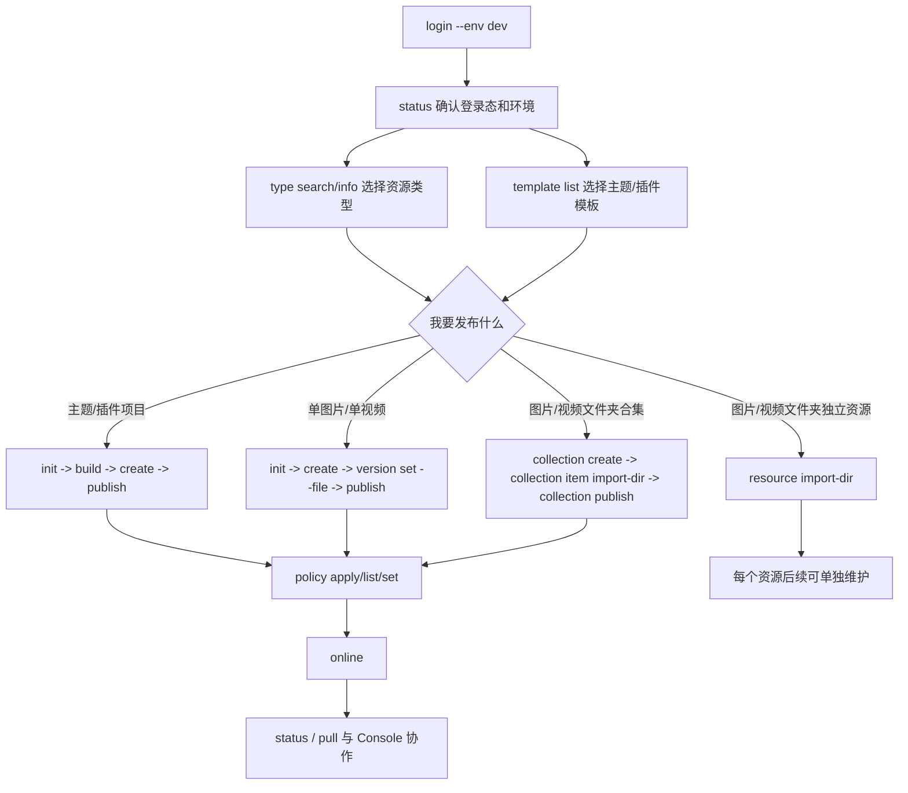

# CLI 使用说明与 Console 差异

最后更新：2026-08-05

本文面向 CLI 使用者和测试人员。核心心智：CLI 不复制 Console 页面，但要在没有 UI 的情况下完成同样的平台数据操作。

## 1. 基本流程

所有场景都从这条流程展开：

```text
login -> status -> type/template -> init -> create -> publish -> policy -> online -> status/pull
```



基础命令：

```bash
freelog-cli login --env dev
freelog-cli status --env dev
freelog-cli logout --env dev
```

非交互登录：

```bash
freelog-cli login --env dev --login-name freelog-test11 --password freelog-test1111 --yes
```

说明：

1. 测试和联调必须显式传 `--env dev`，避免默认走生产环境。
2. `login` 保存用户级凭据；凭据绑定环境。
3. `logout` 只清登录凭据，不删除项目 manifest/state。
4. `status` 是只读命令，用来确认当前环境、登录态、owner、平台状态、同步状态和草稿建议。
5. 写命令需要登录；登录环境和命令环境不一致会失败。
6. 脚本/CI 使用 `--yes --json`，失败时读取 JSON 里的 `code/message/hint`。

常用全局参数：

| 参数 | 用途 |
|---|---|
| `--env dev` | 指定环境 |
| `--cwd <dir>` | 指定项目目录 |
| `--yes` | 非交互确认 |
| `--json` | 机器可读输出 |
| `--debug` | 脱敏调试信息 |

## 2. 准备

查看类型：

```bash
freelog-cli type search 主题 --env dev
freelog-cli type search 图片 --env dev
freelog-cli type info <typeCode> --env dev
```

查看模板：

```bash
freelog-cli template list --env dev
freelog-cli template list --scaffold runtime --runtime 0.5 --env dev
```

显式同步：

```bash
freelog-cli pull --env dev
freelog-cli pull --apply-listing --env dev
```

`pull` 默认只刷新平台事实缓存；只有 `--apply-listing` 才把平台标题、简介、封面、标签写回 manifest。

最小免费策略文件 `policy.free.json`：

```json
{
  "policyName": "免费",
  "policyText": "for public\r\n\r\ninitial[active]:\r\nterminate\r\n",
  "status": 1
}
```

`policyText` 必须是平台策略解析器能接受的最终文本。`policy apply` 会在提交 `Resource.update.addPolicies` 前做编码；批量创建里的 `policies.policyText` 按 Console 批量创建口径直接传最终文本。

## 3. 和 Console 的差异

| Console | CLI | 原因 |
|---|---|---|
| 四步向导创建、发版、策略、上架 | 拆成 `create -> publish -> policy -> online` | CLI 要可脚本化、可重试 |
| 页面打开后自动加载远端状态 | `status` 查看，`pull` 显式同步 | 避免静默改本地文件 |
| 防抖保存发版草稿 | `draft push/pull/discard` | CLI 不做后台远端写入 |
| 策略 Builder | `policy apply --from-file` 接收最终策略文本 | CLI 不做复杂策略编辑器 |
| 授权微应用 | `dep auth --policy-map` 只做声明式免费策略签约 | 支付和复杂确认不适合纯 CLI |
| 可能软上架 | `online` 严格检查 latestVersion + 启用策略 | 防止状态不完整 |
| 合集页面混合目录和发版表单 | `collection item *` 管目录草稿，`draft * --collection` 管发版表单草稿 | 两类草稿不是同一对象 |

## 4. 本地文件

| 文件 | 作用 | 是否提交 |
|---|---|---|
| `freelog.manifest.json` | 用户意图：资源名、类型、标题、下一版文件、合集展示等 | 是 |
| `.freelog/state.json` | 平台事实缓存：resourceId、owner、status、latestVersion、policies、draftSync 等 | 否 |

manifest 不绑定环境；state 绑定环境。同一目录 dev state 下用 test/prod 执行会失败，避免串资源。

## 5. 主题或插件项目发布

已有项目：

```bash
cd my-react-theme
pnpm build
freelog-cli init . --scaffold none --resource-type <themeCode> --runtime 0.5 --yes --env dev
freelog-cli create --yes --env dev
freelog-cli version set --version 1.0.0 --file dist --runtime 0.5 --env dev
freelog-cli publish --yes --env dev
freelog-cli policy apply --from-file ./policy.free.json --yes --env dev
freelog-cli online --yes --env dev
```

通过模板新建：

```bash
freelog-cli init my-theme --scaffold runtime --template vite-react-ts --resource-type <themeCode> --runtime 0.5 --yes --env dev
cd my-theme
pnpm build
freelog-cli create --yes --env dev
freelog-cli publish --yes --env dev
freelog-cli policy apply --from-file ./policy.free.json --yes --env dev
freelog-cli online --yes --env dev
```

说明：

1. `publish` 不执行构建命令，构建由项目自己负责。
2. 主题、插件、软件库发布时，`filePath` 指向构建目录，CLI 会压缩为临时 zip。
3. 如果 Console 创建时需要自定义类型名，CLI 用 `init --resource-type-name` 或 `create --type-name` 承接。

## 6. 单图片或单视频发布

```bash
mkdir photo-resource
cd photo-resource
freelog-cli init . --scaffold none --resource-type <imageCode> --yes --env dev
freelog-cli create --yes --env dev
freelog-cli version set --version 1.0.0 --file ../photo.png --env dev
freelog-cli publish --yes --env dev
freelog-cli policy apply --from-file ./policy.free.json --yes --env dev
freelog-cli online --yes --env dev
```

视频版本封面：

```bash
freelog-cli version set --video-cover ./video-cover.png --env dev
```

说明：

1. 图片、视频上传原文件，不压缩。
2. 文件格式、大小、本地上传能力按平台资源类型配置校验。
3. listing 封面用 `update --cover`；视频版本封面用 `version set --video-cover`。
4. CLI 不做视频转码，也不做命令行内播放预览；预览通过资源详情页链接验证。

## 7. 文件夹发布为多个独立资源

零配置：

```bash
freelog-cli resource import-dir ./photos --resource-type <imageCode> --title-prefix "照片 " --yes --env dev
```

声明式配置 `photos/freelog.batch.json`：

```json
{
  "defaults": {
    "resourceTypeCode": "<imageCode>",
    "version": "1.0.0",
    "policyFile": "policy.free.json",
    "tags": ["album"]
  },
  "items": [
    {
      "filePath": "a.png",
      "name": "photo-a",
      "resourceTitle": "图片 A",
      "description": "首版说明",
      "coverImages": ["cover-a.png"]
    }
  ]
}
```

执行：

```bash
freelog-cli resource import-dir ./photos --config freelog.batch.json --yes --env dev
```

说明：

1. 每个文件创建一个独立资源并发布首版。
2. `--config` 可省略，CLI 会自动发现目录内 `freelog.batch.json` 或 `freelog.batch.yaml`。
3. 成功项会生成子目录 manifest/state，后续可单独维护。
4. 部分失败不回滚成功项，失败清单用于重试。

## 8. 文件夹作为合集

图片合集：

```bash
freelog-cli init photo-album --scaffold collection --resource-type <collectionCode> --yes --env dev
cd photo-album
freelog-cli collection create --yes --env dev
freelog-cli collection item import-dir ../photos --config ../photos/freelog.batch.json --yes --env dev
freelog-cli collection version set --description "首版合集" --env dev
freelog-cli collection publish --yes --env dev
freelog-cli collection policy apply --from-file ./policy.free.json --yes --env dev
freelog-cli online --yes --env dev
```

没有批量配置时：

```bash
freelog-cli collection item import-dir ../photos --resource-type <imageCode> --title-prefix "照片 " --item-policy-file ./policy.free.json --yes --env dev
```

说明：

1. 合集不是上传整个文件夹。
2. 文件夹合集 = 每个文件先变成独立子资源，再加入合集目录草稿。
3. 子资源策略可来自 `freelog.batch.json` 的 `policies/policyFile`，也可用 `--item-policy-file` 统一追加。
4. 子资源必须有正式版本、启用策略并能上架，才能加入合集。
5. `collection publish` 才把目录草稿合并成正式合集版本。
6. 合集自身也要策略才能 `online`。

## 9. 更新基础信息

单品：

```bash
freelog-cli update --title "新标题" --intro "介绍" --tags "tag1,tag2" --cover ./cover.png --env dev
```

合集：

```bash
freelog-cli collection update --title "新合集标题" --display-sort asc --display-view card --env dev
```

说明：

1. `update` 只改 listing，不改版本、策略、上下架状态。
2. `pull` 默认只刷新 state，不改 manifest。
3. 采用 Console listing 时执行：

```bash
freelog-cli pull --apply-listing --env dev
```

本地和平台相对上次同步都改过 listing 时会冲突；确认采用平台值再加 `--force`。

## 10. 发布新版本和草稿

单品新版本：

```bash
pnpm build
freelog-cli pull --env dev
freelog-cli version set --version 1.1.0 --description "新功能" --file dist --env dev
freelog-cli publish --yes --env dev
```

修改已发布版本说明：

```bash
freelog-cli version edit --version 1.1.0 --description "修正文案" --env dev
```

单品发版表单草稿：

```bash
freelog-cli draft push --env dev
freelog-cli draft pull --env dev
freelog-cli draft discard --yes --env dev
```

合集发版表单草稿：

```bash
freelog-cli draft push --collection --env dev
freelog-cli draft pull --collection --env dev
freelog-cli draft discard --collection --yes --env dev
```

合集发布说明：

```bash
freelog-cli collection version set --description "新增目录项" --env dev
freelog-cli collection publish --yes --env dev
```

草稿规则：

1. CLI 不自动保存远端草稿；只有 `draft push` 才写平台发版表单草稿。
2. `draft pull` 会把远端发版表单草稿合并回 manifest；单品场景会保留本地 `filePath`。
3. `draft discard` 只删除平台发版表单草稿，不删除正式版本、策略、资源基础信息。
4. `draft push/pull/discard --collection` 管合集发版表单草稿，不管合集目录。
5. `collection item *` 管合集目录草稿，`collection publish` 才把目录草稿合并成正式合集版本。
6. 本地和远端草稿都有改动时，`draft push` 会失败；先 `draft pull` 合并，或确认后 `draft push --force --yes`。
7. 合集固定版本号，CLI 不允许设置合集版本号，只允许设置发布说明。

典型协作场景：

1. 一个人只用 CLI：`version set -> draft push` 可保存远端草稿，确认后 `publish`。
2. Console 已打开并产生草稿：先 `draft pull`，再本地调整，最后 `draft push` 或 `publish`。
3. 合集只改目录：用 `collection item add/update/reorder/remove`，不需要 `draft push --collection`。
4. 合集只改发布说明或依赖：用 `collection version set` 后 `draft push --collection` 或直接 `collection publish`。

## 11. 策略和上下架

单品策略：

```bash
freelog-cli policy apply --from-file ./policy.free.json --yes --env dev
freelog-cli policy list --env dev
freelog-cli policy set <policyId> 1 --env dev
freelog-cli policy set <policyId> 0 --env dev
```

合集策略：

```bash
freelog-cli collection policy apply --from-file ./policy.free.json --yes --env dev
freelog-cli collection policy list --env dev
freelog-cli collection policy set <policyId> 1 --env dev
```

上下架：

```bash
freelog-cli online --yes --env dev
freelog-cli offline --yes --env dev
```

规则：

1. 可以没有策略就 `publish`。
2. 不能没有 latestVersion 或启用策略就 `online`。
3. 已上架资源不能停用最后一条启用策略。
4. `offline` 只下架，不删除版本和策略。

## 12. 依赖授权

声明依赖：

```bash
freelog-cli dep add <dependencyResourceId> --version-range "*" --env dev
```

声明式免费策略签约 `auth-map.yaml`：

```yaml
contracts:
  - resourceId: <dependencyResourceId>
    policyIds:
      - <policyId>
```

执行：

```bash
freelog-cli dep auth --policy-map ./auth-map.yaml --yes --env dev
```

付费策略、不可验证策略、需要复杂人机确认的授权不在 CLI 内完成。

## 13. 常见排错

| 现象 | 原因 | 处理 |
|---|---|---|
| `online` 失败 | 没有 latestVersion 或没有启用策略 | 先 `publish`，再添加或启用策略 |
| `publish` 版本冲突 | 版本号已存在或不大于 latestVersion | `version set --version <更高版本>` |
| `status` 看到 listing 差异 | Console 和本地 manifest 不一致 | `pull --apply-listing` 或保留本地后 `update` |
| `draft push` 冲突 | Console 或他人改过远端草稿 | `draft pull` 合并，或 `draft push --force --yes` |
| 跨环境失败 | state.env 与当前 `--env` 不一致 | 切回原环境，或确认后清理 state |
| 登录环境不一致 | auth.environment 与当前 `--env` 不一致 | 重新 `login --env <目标环境>` |
| 策略更新想传 policyId | CLI 不改已有策略正文/名称 | 新增策略后切换启用状态，或回 Console |
| 合集导入失败 | 子资源未发布、未上架或无启用策略 | 给子资源配置策略或传 `--item-policy-file` |

## 14. 最小验收清单

1. 基础能力：`login -> status -> logout -> login --yes --json`。
2. 查询和初始化：`type search/info -> template list -> init`。
3. 主题/插件模板：`template list -> init -> build -> create -> publish -> policy -> online`。
4. 已有主题/插件：`init . --scaffold none -> publish`，确认目录压缩为 zip。
5. 单图片/单视频：原文件上传、SHA1、版本、策略、上下架。
6. 文件夹独立资源：`resource import-dir` 零配置和 `freelog.batch.json` 两种模式。
7. 文件夹合集：`collection item import-dir -> collection publish -> collection policy -> online`。
8. 更新流程：基础信息、版本说明、草稿 push/pull/discard。
9. 负向流程：未登录、登录环境不一致、无版本 online、无策略 online、停用最后策略、跨环境 state、owner 不匹配。
