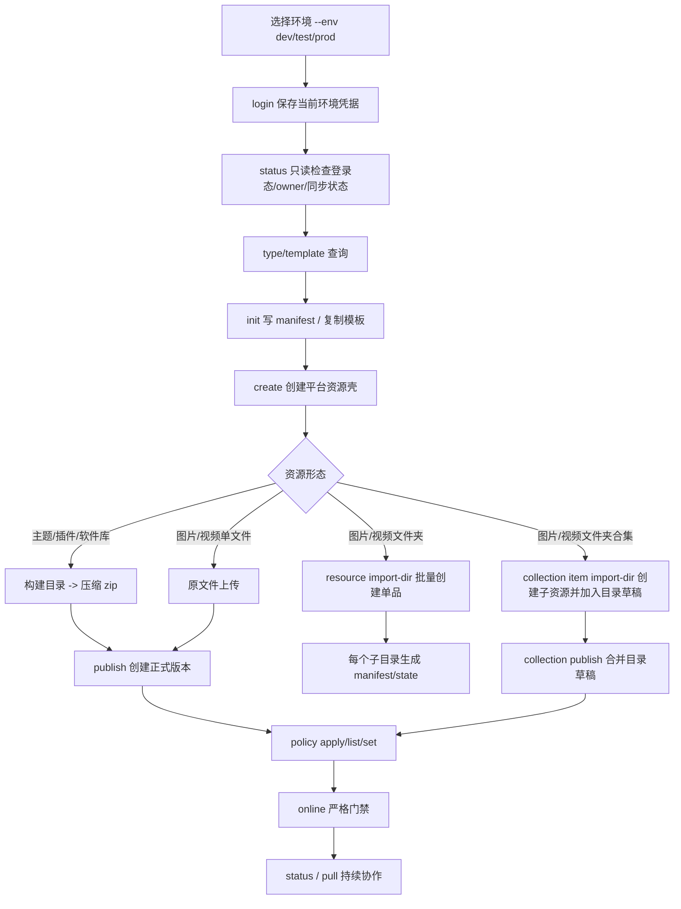
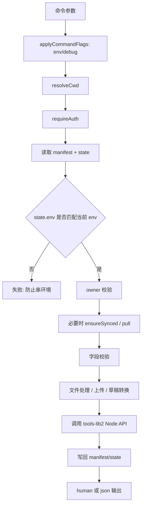
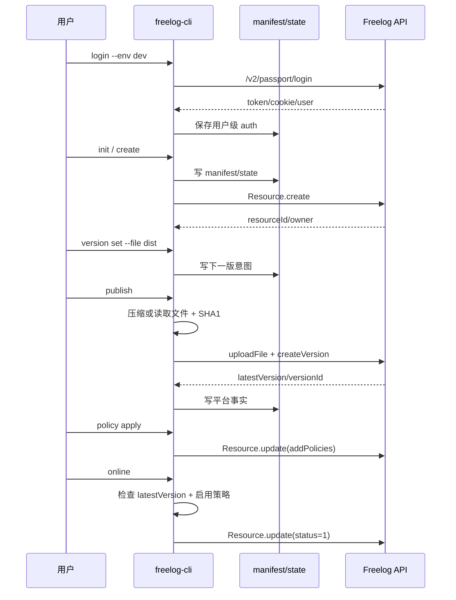
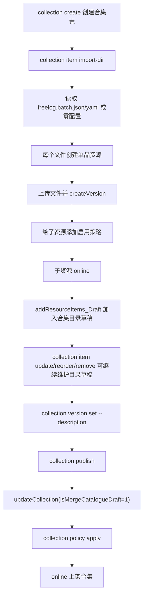
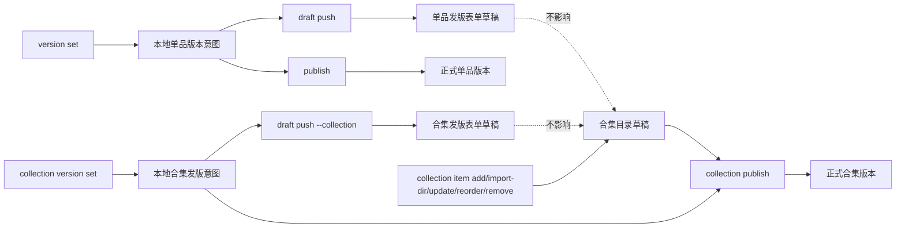

# CLI 脚手架设计

最后更新：2026-08-05

本文是 Freelog Runtime CLI 的工程设计文档，回答“代码应该如何组织和演进”。字段和业务契约看 [CLI字段账本](./CLI字段账本.md)，用户命令看 [CLI使用说明与Console差异](./CLI使用说明与Console差异.md)。

## 1. 设计目标

CLI 是无 UI 的资源发行脚手架。它必须让用户通过命令、manifest 和声明式文件完成 Console 中的资源生命周期操作。

核心目标：

1. 先提供可靠的 CLI 基础能力：环境选择、登录、登出、状态查看、显式同步、JSON 输出、错误码。
2. 支持主题/插件项目模板创建、已有项目接入、构建目录压缩和发布。
3. 支持图片/视频单文件发布。
4. 支持图片/视频文件夹批量发布为多个独立资源。
5. 支持图片/视频文件夹生成子资源后发布为合集。
6. 支持基础信息、版本、草稿、策略、依赖授权、上下架、合集目录维护。
7. 所有平台写入都有环境、owner、同步、门禁保护。
8. 命令可交互，也可用 `--yes --json` 在脚本/CI 中稳定执行。

非目标：

1. 不兼容旧 CLI 配置和旧命令。
2. 不执行用户 JS/TS 配置。
3. 不内置策略 Builder。
4. 不做付费授权和支付流程。
5. 不做视频转码。
6. 不改浏览器项目。

### 1.1 快速流程图

#### 业务总览



#### 写命令通用管线



#### 单品发布流程



#### 文件夹作为合集流程



#### 三类草稿边界



## 2. 分层架构

```text
bin/index.ts
  commands/*
    services/*
      config/project.ts
      platform/*
        @freelog/tools-lib2/node
```

| 层 | 职责 | 禁止 |
|---|---|---|
| `commands/*` | 参数定义、交互确认、JSON/人类输出、调用 service | 写业务编排、直接调平台接口 |
| `services/*` | 业务编排、校验、上传、接口调用、状态落盘 | 解析 CLI argv、打印大量 UI 文案 |
| `config/project.ts` | manifest/state 读写、环境校验、数据映射 | 调平台接口 |
| `platform/*` | 安装 tools-lib2 Node 环境、导出 FServiceAPI/FUtil | 自建平行 API 层 |
| `adapters/*` | Console 草稿 shape 与 manifest shape 转换 | 读写文件、调平台接口 |
| `core/*` | env/auth/error/command/tty 横切能力 | 写资源业务 |

命令层必须薄，复杂度留在 service。service 之间可以复用，但不能为了“看起来分层”制造空壳抽象。

## 3. CLI 基础能力设计

基础能力是所有资源业务的前置层。任何资源命令设计不清楚时，先回到这一层判断。

### 3.1 环境选择

支持三个环境：

| CLI 值 | API |
|---|---|
| `production` / `prod` | `https://api.freelog.cn` |
| `test` | `https://api.testfreelog.com` |
| `dev` / `development` | `https://api.devfreelog.com` |

规则：

1. 默认环境是 `production`。
2. 推荐所有测试命令显式传 `--env dev`。
3. `--test` 只作为测试环境快捷入口保留；新文档和新用例优先使用 `--env`。
4. `FREELOG_ENV` 可作为环境默认值，但命令行 `--env` 优先级更高。
5. `.freelog/state.json` 绑定环境；当前命令环境与 state 环境不一致时必须失败。

### 3.2 登录和登出

```text
login -> 保存用户级凭据
logout -> 清理用户级凭据；若启用 workspace 凭据，也清理 workspace 凭据
status -> 只读查看登录态、环境、owner、同步、草稿建议
```

登录设计：

1. 交互模式下询问登录名和密码。
2. 非交互模式必须传 `--login-name --password --yes`。
3. 登录接口走当前环境的 `/v2/passport/login`。
4. dev 环境后续资源接口依赖 Cookie，登录必须保存响应里的 `Set-Cookie`。
5. token、authorization、cookie 落到用户级 auth 文件时必须加密。
6. auth 文件记录登录环境；凭据环境与当前命令环境不一致时，写命令必须失败。
7. 密码不能写入 manifest、state、测试快照或普通 README。

凭据位置：

| 场景 | 位置 |
|---|---|
| 默认用户级凭据 | `%USERPROFILE%\.freelog-auth` |
| 全局凭据覆盖 | `FREELOG_AUTH_PATH_GLOBAL` |
| 测试/隔离凭据 | `FREELOG_AUTH_PATH_WORKSPACE` |

登出设计：

1. `logout` 删除用户级凭据。
2. 如果设置了 `FREELOG_AUTH_PATH_WORKSPACE`，同时删除 workspace 凭据。
3. `logout` 不删除任何项目 manifest/state。

### 3.3 全局参数和输出

所有命令应尽量统一支持：

| 参数 | 作用 |
|---|---|
| `--env` | 选择 production/test/dev |
| `--cwd` | 指定资源项目目录 |
| `--json` | 输出稳定 JSON，供脚本/CI 使用 |
| `--debug` | 输出脱敏调试信息 |
| `--yes` / `-y` | 非交互确认写入或危险操作 |
| `--no-auto-pull` | 写命令跳过自动同步检查，仅在用户明确承担风险时使用 |

错误输出：

1. human 模式输出 message 和 hint。
2. JSON 模式输出 `{ ok:false, code, message, hint, details? }`。
3. debug 输出必须脱敏 `token/password/cookie/authorization`。

错误码约定：

| code | 含义 |
|---|---|
| `1` | 未分类错误或平台异常 |
| `2` | 未登录、凭据过期、凭据环境不一致 |
| `3` | 本地/远端冲突 |
| `4` | 用户输入、参数、状态门禁不满足 |
| `5` | 发布前依赖授权未完成 |

### 3.4 状态和同步

`status` 是只读诊断命令，不能修改本地文件或平台数据。它负责回答：

1. 当前命令环境和 API 地址。
2. 是否已登录、登录账号、凭据环境。
3. 当前目录是否是 Freelog 项目。
4. 当前登录账号是否匹配资源 owner。
5. 平台 latestVersion、status、启用策略数量。
6. listing 同步状态。
7. 单品/合集发版表单草稿状态和建议。

`pull` 是显式同步命令：

1. 默认刷新 `.freelog/state.json`，不覆盖 manifest。
2. `pull --apply-listing` 才把平台 listing 写回 manifest。
3. 本地 listing 和平台 listing 都相对上次同步变更时，默认冲突。
4. `pull --apply-listing --force` 才允许采用平台值覆盖本地 listing 意图。
5. `pull --collection` 同步合集信息、目录草稿、collectRules。
6. `pull --all` 对当前目录下多个子资源目录逐个同步。

### 3.5 基本使用流程

所有主场景都从这条骨架展开：

```text
选择环境
login
status
type/template 查询
init 本地项目
create 平台资源壳
version set / collection version set
publish / collection publish
policy apply/list/set
online/offline
status / pull
```

这条流程的意义：

1. `login/status/type/template/init` 是脚手架基础能力，不属于资源细节。
2. `create/publish/policy/online` 是资源生命周期写入。
3. `status/pull` 是持续维护和 Console 协作入口。
4. 单文件、项目压缩、批量目录、合集目录都只是这条骨架的不同展开。

## 4. 数据模型

### 4.1 manifest

`freelog.manifest.json` 是用户意图，可提交 git。

包含：

1. `subject`: `resource` 或 `collection`。
2. `identity.name`: 短授权标识。
3. `resource`: 类型、标题、简介、封面、标签。
4. `version`: 单品下一版意图。
5. `collection`: 合集下一次 publish 意图。
6. `policies`: 可保留策略意图，但平台事实中的 `policyId` 不进 manifest。

### 4.2 state

`.freelog/state.json` 是平台事实，不提交 git。

包含：

1. `env`: 当前 state 所属环境。
2. resourceId、完整 resourceName、owner。
3. status、latestVersion、policies。
4. 已发布文件 SHA1、filename、versionId。
5. draftSync。
6. 合集目录草稿缓存、展示字段、collectRules、RSS 状态。

### 4.3 分离原则

| 数据 | 位置 |
|---|---|
| 用户希望资源叫什么、下一版发什么文件 | manifest |
| 平台实际创建了什么 resourceId、latestVersion 是多少 | state |
| token/cookie/password | 用户级 auth 文件，不进项目目录 |
| 批量资源逐项元数据 | `freelog.batch.json/yaml` |
| 策略最终文本 | `policy.json` 或批量配置 |
| 依赖签约选择 | `auth-map.yaml/json` |

## 5. 通用写入管线

所有写平台命令遵循同一条管线：

```text
applyCommandFlags
resolveCwd / env
requireAuth
load manifest + state
owner 校验
必要时 ensureSynced / pull
字段校验
文件处理 / 上传 / 草稿转换
调用 @freelog/tools-lib2/node
写回 manifest/state
输出 human 或 json
```

失败原则：

1. owner 不匹配必须失败。
2. state.env 与当前 env 不一致必须失败。
3. 本地和平台 listing 双边改动时必须冲突。
4. `online` 门禁不满足必须失败。
5. 依赖授权无法确认时不能假装成功。
6. 部分成功的批量操作必须报告成功项和失败项。

## 6. 命令拓扑

### 6.1 初始化和模板

```text
template list
init <dir> --scaffold runtime --template <id>
init <dir> --scaffold package --template <id>
init . --scaffold none
init <dir> --scaffold collection
```

设计：

1. `template list` 读取 `compat/template-compat.json`。
2. `init` 只创建本地项目和 manifest，不 create 平台资源。
3. runtime 模板需要 `runtimeVersion`，当前主推 `0.5`。
4. package 模板不强制 runtime。
5. 已有项目用 `--scaffold none`，不能复制模板覆盖代码。
6. `--resource-type-name` 承接 Console 的自定义类型名。

### 6.2 单品资源

```text
create
version set
publish
draft push/pull/discard
policy apply/list/set
online/offline
update
pull
```

设计：

1. `create` 只创建资源壳。
2. `version set` 只改下一版意图。
3. `publish` 处理文件、上传、调用 `createVersion`。
4. `draft *` 显式同步平台发版草稿。
5. `policy apply` 新增策略，`policy set` 启停策略。
6. `online` 严格检查 latestVersion + 启用策略。
7. `pull` 默认只刷新 state，`--apply-listing` 才写 manifest。

### 6.3 批量单品

```text
resource import-dir <dir>
```

设计：

1. 零配置模式按扁平文件夹生成资源。
2. 声明式模式读取 `freelog.batch.json/yaml`。
3. 每个 item 都会完成文件上传、资源创建、版本创建。
4. 优先 `createBatch`，按资源类型和类型名分组，20 个一批。
5. 批量接口不能承接的字段走逐个 `create + createVersion`。
6. 每个成功资源写出子目录 manifest/state。

### 6.4 合集

```text
collection create
collection item add/import-dir/update/reorder/remove
collection version set --description
collection publish
collection policy apply/list/set
collection update
collection rss *
collection collect-rules *
```

设计：

1. 合集壳通过 `Resource.create` + `subjectType: 4` 创建。
2. `collection item *` 操作目录草稿。
3. `collection publish` 调 `updateCollection` 并合并目录草稿。
4. 合集固定版本号，CLI 只允许设置 publish 描述。
5. `collection item import-dir` 复用 `resource import-dir`，先生成并上架子资源，再加入目录草稿。
6. 合集目录草稿项读取必须分页。
7. RSS 验证码由用户输入，CLI 不绕过人机确认。

## 7. 草稿设计

CLI 里必须区分三类草稿。它们名字相近，但接口、数据结构和用户预期都不同。

| 草稿类型 | 平台对象 | CLI 命令 | 作用 | 不做什么 |
|---|---|---|---|---|
| 单品发版表单草稿 | `saveVersionsDraft/lookDraft/deleteResourceDraft` | `draft push/pull/discard` | 同步 Console 单品发版页的版本号、文件信息、版本说明、依赖、属性、视频封面等表单字段 | 不发布正式版本，不添加策略，不上架 |
| 合集发版表单草稿 | `saveVersionsDraft/lookDraft/deleteResourceDraft` | `draft push/pull/discard --collection` | 同步 Console 合集发版页的发布说明、展示设置、依赖、属性等表单字段 | 不修改合集目录草稿，不发布正式合集版本 |
| 合集目录草稿 | `*_CollectionItems_Draft` 系列接口 | `collection item add/import-dir/update/reorder/remove` | 维护合集条目列表、标题、排序等目录草稿 | 不等同于 `draft * --collection`，不保存发版表单 |

设计原则：

1. CLI 不做 Console 的防抖后台保存；所有远端草稿写入都必须由用户显式执行。
2. `version set` 和 `collection version set` 只改本地 manifest，不写远端草稿。
3. `draft push` 只保存发版表单草稿，不发布正式版本。
4. `publish` / `collection publish` 创建正式版本，不依赖远端发版表单草稿。
5. `collection item *` 是目录草稿写命令；`collection publish` 才用 `isMergeCatalogueDraft: 1` 把目录草稿合并为正式合集版本。
6. 单品 `draft pull` 从远端草稿回填 manifest，但保留本地 `filePath`；远端草稿只有 `fileSha1/filename`，不能恢复用户电脑上的本地路径。
7. `draft discard` 删除平台发版表单草稿并清理本地 `draftSync`，不删除正式版本、不删除策略、不清合集目录草稿。

草稿冲突策略：

1. `.freelog/state.json` 保存 `draftSync.lastFingerprint` 和 `lastRemoteUpdateDate`。
2. `draft push` 会比较本地表单指纹、上次同步指纹和远端草稿指纹。
3. 远端不存在草稿时，直接保存。
4. 远端草稿与本地表单一致时，跳过提交，只刷新同步状态。
5. 本地有改动但远端未变时，允许覆盖保存。
6. 本地和远端都相对上次同步发生变化时，返回冲突；用户必须 `draft pull` 后合并，或确认后 `draft push --force --yes`。
7. 从未同步但远端已有草稿时，默认视为冲突，避免覆盖 Console 或他人的表单。

测试要求：

1. 单品草稿要覆盖 push、pull、discard、冲突、`--force`、本地路径保留。
2. 合集发版表单草稿要覆盖 `--collection` 的 push、pull、discard、冲突。
3. 合集目录草稿要覆盖 add、import-dir、update、reorder、remove、publish 合并。
4. 必须验证 `draft discard --collection` 不影响目录草稿，`collection item remove` 不影响发版表单草稿。

## 8. 文件处理设计

| 类型 | 输入 | 处理 |
|---|---|---|
| 主题/插件/软件库 | 构建目录 | 压缩 zip -> SHA1 -> 上传 -> createVersion |
| 图片/视频 | 文件 | SHA1 -> 上传 -> createVersion |
| listing 封面 | 本地图片或 URL | 本地图片 uploadImage 后得到 URL |
| 视频版本封面 | 本地图片或 URL | publish/draft push 时上传为 URL 后传 `videoCover` |

压缩判断：

1. 优先使用平台资源类型配置。
2. 平台配置缺失时按类型名/code 的主题、插件、软件库语义兜底。
3. 非压缩类型传目录且没有 filename 时失败。

## 9. 批量配置设计

`freelog.batch.json/yaml` 是批量资源的声明式输入，不是旧 CLI 配置复活。

设计原则：

1. `defaults` 提供公共字段。
2. `items` 提供逐项覆盖。
3. item 必须有 `filePath`。
4. `policyFile` 是最终策略 JSON，不执行 JS。
5. 配置路径相对配置文件所在目录解析。
6. 封面本地路径也相对配置文件所在目录解析。
7. 带 `skip: true` 的 item 不处理。

字段见 [CLI字段账本](./CLI字段账本.md)。

## 10. Console 对齐设计

| Console 能力 | CLI 承接 |
|---|---|
| Step1 创建资源 | `init` + `create` |
| Step2 发版文件/依赖/属性/草稿 | `version set`、manifest `version.*`、`draft *`、`publish` |
| Step3 策略 | `policy apply/list/set` |
| Step4 基础信息和上架 | `update` + `online` |
| 批量创建 | `resource import-dir` |
| 合集目录 | `collection item *` |
| 合集发版 | `collection version set` + `collection publish` |
| 依赖授权微应用 | `dep auth --policy-map` 的免费策略签约子集 |
| RSS 验证 | `collection rss send-code/bind/sync` |

有意分叉：

1. CLI 不做 Console 四步向导。
2. CLI 不后台保存草稿。
3. CLI 不软上架。
4. CLI 不内置策略 Builder。
5. CLI 不处理付费授权。

## 11. 模块清单

| 模块 | 责任 |
|---|---|
| `commands/init.ts` | 初始化入口 |
| `commands/template.ts` | 模板发现 |
| `commands/resource.ts` | 批量单品入口 |
| `commands/collection.ts` | 合集命令入口 |
| `services/scaffold.ts` | 模板复制、EJS 渲染、manifest 初始化 |
| `services/processFile.ts` | 压缩、文件路径解析、SHA1 |
| `services/fromDirService.ts` | 批量配置、批量创建、子目录落盘 |
| `services/publishService.ts` | 单品发布 |
| `services/collectionService.ts` | 合集 create/item/publish/rss/collectRules |
| `services/policyService.ts` | 策略新增/启停保护 |
| `services/depAuthService.ts` | 声明式免费签约 |
| `services/syncService.ts` | owner、pull、listing 冲突 |
| `services/onlineService.ts` | 严格上下架 |
| `config/project.ts` | manifest/state 统一读写 |
| `platform/*` | tools-lib2 Node 接入 |

## 12. 测试设计

测试分层：

1. 纯函数：名称规范、草稿指纹、批量配置解析、门禁判断。
2. service 单元测试：manifest/state 流、策略保护、资源类型能力、文件处理。
3. build 验证：typecheck、compat、build、pack dry-run。
4. dev 冒烟：主题/插件、单文件、批量资源、合集、Console 协作。

本地基线：

```bash
pnpm verify
```

每次新增命令或字段，至少补一条对应测试，证明字段能从 CLI/manifest 到 service payload 或本地状态。

## 13. 演进规则

1. 新能力先写字段账本，再写脚手架设计，再改代码。
2. 新命令必须有 JSON 输出和非交互路径。
3. 新平台字段必须说明来自 Console 证据或 tools-lib 类型。
4. 新批量字段必须说明是否支持 `createBatch`，不支持时如何 fallback。
5. 新合集能力必须说明影响目录草稿还是发版表单草稿。
6. 任何“临时回 Console”都必须写清楚是产品边界还是实现缺口。
