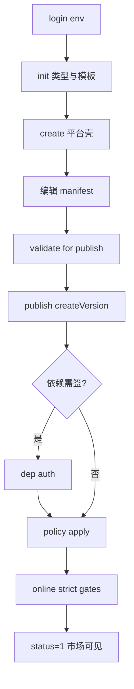
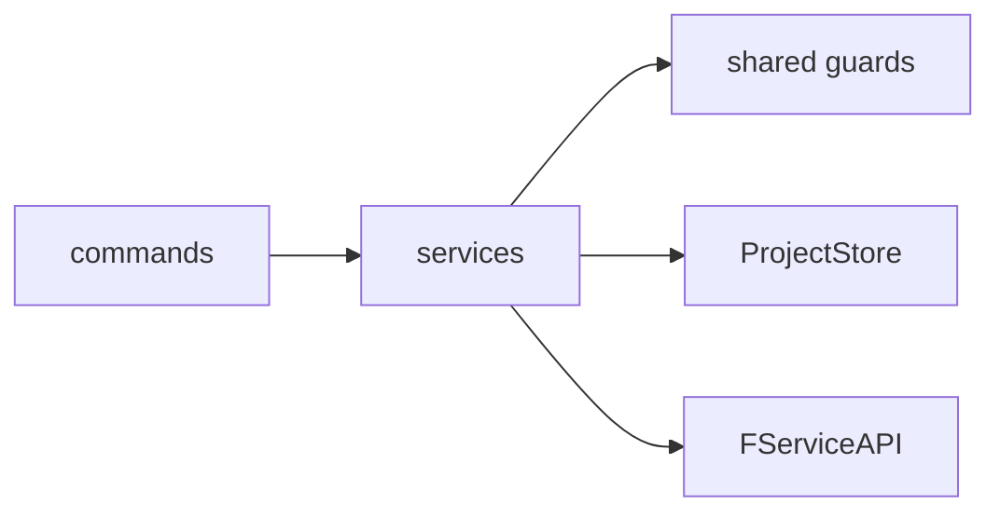
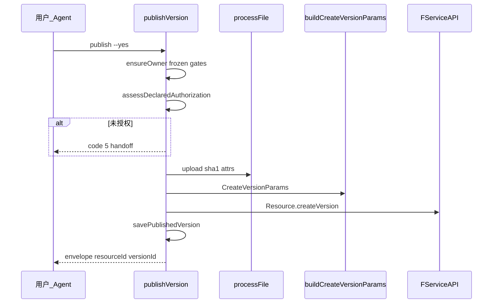

# 一期产品与实现规格

> **文档角色：** 一期（资源发行域）**唯一 consolidated 设计**——产品可在此改旅程与体验；研发可在此对命令、门禁、service、伪代码；测试可在此对能力 ID 与 exit code。  
> **不替代：** [DESIGN.md](../../../DESIGN.md)（产品边界）、[对齐/](../对齐/)（Console 证据）、[开发/CLI双模式实现设计.md](../开发/CLI双模式实现设计.md) §17–§24（API 字段级对照）。

最后更新：2026-08-21

---

## 0. 文档地图（改设计时先看）

```text
改用户体验 / 步骤顺序     → 本文 §2–§4
改命令或 flag              → 本文 §5 + packages/cli/src/core/cliArgs.ts
改门禁 / 错误码 / handoff  → 本文 §6–§7 + 对齐/CLI数据操作与Console对照.md
改 manifest/state 字段     → 开发/CLI字段账本.md
改 Console 对齐证据        → 对齐/CLI拓扑与Console对照.md + Console源码证据索引.md
改公开教程文案             → 使用/（须通过 publicDocumentationCommands.test.ts）
改产品 IN/OUT              → DESIGN.md
```

---

## 1. 产品范围（一期）

### 1.1 IN（已实现 · 设计真源）

| 域 | 能力前缀 | 用户价值 |
|---|---|---|
| 资源身份与 listing | R | 创建、维护、绑定、同步 |
| 版本与文件 | V | publish、draft、version edit |
| 依赖与签约 | D | dep、dep auth、发布前授权 |
| 策略与上下架 | P | policy apply/set、online/offline |
| 合集 | C | collection 全流程 |
| CLI 原生 | N | init 模板、import-dir、validate/diff/release、JSON |

### 1.2 OUT（一期不做）

| 能力 | CLI 行为 | 产品理由 |
|---|---|---|
| 支付收银台、验证码 | code **5** handoff | 无 headless 收银 |
| 云存储 picker | 仅本地文件 | 无浏览器 |
| 列表 batchUpdate / 多选维护 | 逐资源命令 | 避免半吊子批量 |
| 节点壳写、展品、收入 | 不注册命令 | Console；二期 exhibit 见 [二期/](../二期/) |
| package 预设公开验收 | 代码存在，**DESIGN 暂停** | 未 ENV 签字 |
| 已发版 videoCover 编辑（V-08） | 无命令 | Console 无入口 |

完整矩阵：[对齐/CLI数据操作与Console对照.md §7](../对齐/CLI数据操作与Console对照.md)。

### 1.3 三种发行模式（产品 IA）

| 模式 | 用户是谁 | 典型路径 | 本地产物 |
|---|---|---|---|
| **单资源** | 作者 | J-01：init → publish → online | 1× manifest + state |
| **批量独立** | 运营 | J-03：import-dir | N× 子工程 + batch report |
| **合集** | 策展 | J-04：collection * | 1× 合集 manifest + 条目 draft |

---

## 2. Persona 与用户旅程

### 2.1 Persona

| Persona | 首要目标 | 推荐模式 | 勿用 |
|---|---|---|---|
| 内容作者 | 发一张图/文并上架 | 工程 **00** | studio 做长期工程 |
| 前端开发者 | Git/CI 可重复发版 | 工程 **00** + `--json` | 跳过 validate |
| 批量运营 | 目录批量资源 | N-04 import-dir | 手建 N 个 init |
| 策展人 | 相册/合集 | C-* | 把合集当单资源 publish |
| 运维/Agent | 脚本化 | **00/01** + `--json` `--yes` | session 菜单（11） |
| 探索/一次性 | 无 manifest | **01** `--session` 或 **11** session | CI headless 用 11 |

### 2.2 旅程索引（一期）

| ID | 流程摘要 | 能力 | 公开文档 |
|---|---|---|---|
| **J-01** | init → create → validate → publish → dep? → policy → online | R/V/D/P | [使用/快速上手](../使用/快速上手.md) |
| **J-02** | CI：validate → release → publish → online | N-05 | [使用/工程化与预检](../使用/工程化与预检.md) |
| **J-03** | resource import-dir [--resume] | N-04 | [使用/批量发行](../使用/批量发行.md) |
| **J-04** | collection create → item * → publish → online | C-* | [使用/合集.md](../使用/合集.md) |
| **J-05** | J-01 + 二期 exhibit（跨期） | — | [二期/11 J-05](../二期/11-完整用户旅程.md) |

端到端步骤详表见 [二期/11 §2–§5](../二期/11-完整用户旅程.md)（一期段落）；**改旅程顺序或新增分支时改本文 §4 + 11 同步**。

---

## 3. 体验设计原则（改 UX 的约束）

### 3.1 双表面：人类 vs 机器

| 表面 | 触发 | 输出 | 写操作 |
|---|---|---|---|
| **TTY** | 缺 `--yes` / 缺必填 | 文本 + confirm | 可交互补全 |
| **CI / Agent** | `--json` + `--yes` + `--env` | envelope | **禁止** silent 默认 |

**产品规则：** 非 TTY 缺 `--env` 或写命令缺 `--yes` → code **4**，message + hint（P9）。

### 3.2 错误与恢复（用户可感知）

| code | 用户/Agent 应做什么 | UX 要求 |
|:---:|---|---|
| 0 | 继续；保存 JSON 里的 ID | 成功 envelope 含稳定 ID |
| 2 | 换账号或检查 owner | hint 指向 login/status |
| 3 | 对账：diff / pull / 人工 | 说明 manifest vs 平台冲突字段 |
| 4 | 读 hint；补参数或 preflight | **不得** silent 重试写 |
| 5 | Console URL + `nextCommand` | TTY 可展示 URL；JSON **不**自动开浏览器 |

公开排错：[使用/排错与验收.md](../使用/排错与验收.md)。

### 3.3 与 Console 的体验差异（有意）

| 场景 | Console | CLI 体验设计 |
|---|---|---|
| 首发 Step4 直接上架 | 可能无 latest/policy 检查 | **拆步** policy → online；online 走 **sidebar 严格门禁** |
| 依赖未签 | Sidebar 黄标可继续 | publish preflight 列全；未解决 → **5** handoff |
| 付费 dep/policy | 浏览器收银 | code **5** + contractsUrl |
| 草稿 badge | 云端 draft | 工程 `draft *`；会话 **跳过** V-04 |
| 列表批量维护 | 多选 | **OUT**；逐资源 CLI |

改 UX 时：**不得**把 OUT 能力做成「半 UI」；应 handoff 或拆步。

### 3.4 确认与 preflight 时机

| 命令类 | TTY 确认前必须展示 | `--dry-run` |
|---|---|---|
| publish / collection publish | 版本、文件、deps 摘要 | 零平台写 |
| online | latestVersion + ≥1 启用 policy | — |
| draft push --force | 漂移/覆盖警告 | — |
| import-dir | 扫描计数、strict 限制 | 可选 dry-run |

交互字段级规格：[开发/CLI交互与字段约束.md](../开发/CLI交互与字段约束.md)。

### 3.5 四模式（Auth × Store）对体验的影响

| 模式 | 编码 | 用户感知 |
|---|---|---|
| 工程 | **00** | 有 manifest/state；可 Git；validate/diff 有意义 |
| 命令会话 | **01** `--session` | 单条命令原子；无本地 manifest；可 `--export-project` |
| studio | **10** | 多账号 TTY；子工程落盘 |
| session 壳 | **11** | 全临时 TTY 菜单 |

**设计 invariant：** 同一业务门禁在四种模式下 **相同**（[CLI双模式设计.md §3.2](../开发/CLI双模式设计.md)）；仅 **数据从哪读写** 不同。

---

## 4. 端到端业务流程（产品 / 研发共用）

### 4.1 J-01 单资源发行（主路径）



| 步骤 | 用户意图 | 平台事实变化 | 失败常见 code |
|:---:|---|---|---|
| create | 我要一个资源壳 | resourceId | 4 |
| publish | 我要一个正式版本 | versionId, fileSha1 | 4 / **5** |
| dep auth | 依赖可发行 | 合同 | **5** |
| policy apply | 访客可授权 | policyId | 4 |
| online | 进市场 | status=1 | 4 |

### 4.2 维护路径（已发行资源）

```text
bind（可选）→ pull（对账）→ update listing
  → version edit（V-05，不改 deps）
  → publish 新版（V-01/V-06）
  → draft push/pull（V-04，工程）
  → offline / online
```

**UX 要点：** `pull` 默认 **不** 覆盖 manifest；`--apply-listing` 需用户明确意图（见 R-05）。

### 4.3 J-04 合集（与单资源差异）

```text
collection create → item add|import-dir → item reorder（即时 draft API）
  → collection publish（目录 merge 语义）→ policy → online
```

**产品规则：** 目录项变更（C-05）与 `collection publish`（C-07）**分离**——用户应先理解「改目录 ≠ 发版」。

### 4.4 J-03 批量 import-dir

```text
scan → prepare → per-item create/publish/online
  → batch-report.json（恢复事实源）
  → 失败项继续；unknown 停损对账
```

详见 §8.2 与 [开发/CLI双模式实现设计.md §批量](../开发/CLI双模式实现设计.md)。

---

## 5. 命令注册表（一期 · 摘要）

> 完整树：`packages/cli/src/bin/subCommands.ts`；flag 真源：`core/cliArgs.ts`。

### 5.1 全局与工程

| 命令 | 写 | 核心 service | 能力 ID |
|---|---|:---:|---|
| `login` / `logout` | logout | auth | — |
| `status` | | statusService | — |
| `validate` / `doctor` | | validateService | N-05 |
| `diff` / `release` | release 可写 | diffService, releaseService | N-05 |
| `init` / `template` | init 写本地 | init/scaffold | N-01 |
| `bind` / `pull` | pull 可写 state | bindService, sync/ | R-04/R-05 |
| `config` / `workspace` / `lang` | config 写 | — | N-05 |

### 5.2 资源与版本

| 命令 | 写 | 核心 service | 能力 ID |
|---|---|:---:|---|
| `create` / `update` | ✓ | resourceService | R-01/R-02 |
| `type list|search|info|pick` | | typeService | R-03 |
| `version set|bump|edit|show` | set/edit ✓ | version* | V-* |
| `publish` | ✓ | resource/publishVersion | V-01 |
| `draft push|pull|discard` | ✓ | draftService | V-04 |

### 5.3 依赖、策略、上下架

| 命令 | 写 | 核心 service | 能力 ID |
|---|---|:---:|---|
| `dep add|remove|update|list` | ✓ | depService | D-01 |
| `dep auth` | ✓ | depAuthService | D-05 |
| `policy apply|set|list|init` | ✓ | policyService | P-01/P-02 |
| `online` / `offline` | ✓ | onlineService | P-03/P-04 |

### 5.4 合集与批量

| 命令 | 写 | 核心 service | 能力 ID |
|---|---|:---:|---|
| `collection *` | 多数 ✓ | collection/ | C-* |
| `resource import-dir` | ✓ | batch/ | N-04 |

### 5.5 交互壳（非 Agent 路径）

| 命令 | 模式 | 说明 |
|---|---|---|
| `session` | 11 | TTY 菜单；凭据不落盘 |
| `studio` | 10 | 多账号工作区 |
| `* --session` | 01 | 单命令 EphemeralStore |

---

## 6. Service 分层与调用链



### 6.1 业务动作 → 代码入口

| 业务动作 | 命令 | 主要 service | 测试锚点 |
|---|---|---|---|
| 建立工程 | init, bind | init/, bindService | initCatalog, manifestStateFlow |
| 发版 | publish, release | publishVersion, processFile | publishDryRun, publishReuse |
| 维护版本 | version edit | editReleasedVersion | versionEditService |
| 草稿/同步 | draft, pull, diff | draftService, sync/ | draftSession, operationContext |
| 上下架 | online, offline | onlineService | onlineGates, onlineService.test |
| 依赖签约 | dep auth | depAuthService | depAuthSubject |
| 合集 | collection * | collection/ | collectionItems |
| 批量 | import-dir | batch/ | batchReport, batchImportRobustness |
| 会话 | --session | EphemeralStore | verify:session-smoke |

完整表：[ARCHITECTURE.md 业务动作索引](../../../packages/cli/src/ARCHITECTURE.md)。

### 6.2 发布主序列（工程模式）



**唯一 payload builder：** `buildCreateVersionParams`（禁止命令层拼 API body）。

---

## 7. Preflight 与门禁表（改设计 = 改这张表）

> 模式无关：工程 **00** 与会话 **01** 须 **同一门禁**（[双模式设计 §3.2](../开发/CLI双模式设计.md)）。

### 7.1 `publish` / `createThenPublish`

| 检查 | 条件 | code | Console 对照 |
|---|---|:---:|---|
| 显式 env（非 TTY 写） | `--env` | 4 | — |
| 登录 / owner | owner 匹配 | 2/4 | — |
| frozen | status 位 | 4 | R-06 |
| 叶子类型 | type 树 | 4 | R-03 |
| semver | 递增 / 合法 | 4 | V-01 |
| 文件 | 类型/大小/MIME | 4 | V-02 |
| 属性解析 | fileProperty | 4 | V-03 |
| 依赖授权 | authTree 全解 | **5** | D-04 |
| listing 漂移 | 仅工程 | **3** | — |

### 7.2 `online`

| 检查 | 条件 | code |
|---|---|:---:|
| latestVersion 存在 | 平台事实 | 4 |
| ≥1 启用 policy | status=1 | 4 |
| frozen | | 4 |
| owner / env | | 2/4 |

**产品裁决：** 不复制 creator Step4 **无门禁** 上架（P-03 PARITY sidebar）。

### 7.3 `dep auth`

| 检查 | 结果 |
|---|---|
| policy 不存在 / 未启用 | 5 + hint |
| policyText 不可判 / 含付费 | 5 + actionUrl + nextCommand |
| 免费可直签 | 0 |

### 7.4 `collection publish`

与单资源类似 + **目录项授权** + merge 语义（C-07）；详见 [对齐 §5](../对齐/CLI数据操作与Console对照.md)。

### 7.5 Console 操作落地表（摘录）

完整 **Console 页面 ↔ API ↔ CLI service** 见 [CLI双模式实现设计 §17](../开发/CLI双模式实现设计.md#17-console-业务操作落地表会话-mvp) 与 §19。**改门禁时先改 §17/§19，再改本文 §7，再改代码。**

---

## 8. 核心路径伪代码（研发）

### 8.1 `publishVersion`（工程 / 会话共用）

```typescript
async function publishVersion(store: ProjectStore, opts) {
  await assertExplicitEnvForWrite(opts);
  const ctx = await ensureOperationContext(store);  // 工程: ensureSynced
  assertOwner(ctx);
  assertNotFrozen(ctx);
  assertLeafType(ctx);
  assertPublishableVersion(ctx);

  const auth = await assessDeclaredAuthorization(ctx);
  if (!auth.ok) throw handoff(5, auth);

  const file = await processFileForPublish(ctx, opts);
  const props = await resolveCreateVersionPropertiesFromFile(file);
  const params = buildCreateVersionParams(ctx, file, props);  // 唯一 builder

  if (opts.dryRun) return envelope({ dryRun: true, params });

  const result = await FServiceAPI.Resource.createVersion(params);
  await store.savePublishedVersion(result);
  return envelope({ resourceId, versionId, version });
}
```

### 8.2 `import-dir` 恢复（N-04）

```typescript
for (const item of batch.items) {
  report.mark(item, 'remote_outcome_unknown');
  try {
    const remote = await createAndPublish(item);
    report.mark(item, 'completed', remote.ids);
    writeLocalManifest(remote);
  } catch (e) {
    if (isUnknownOutcome(e)) { report.mark(item, 'unknown'); STOP_AGENT; }
    report.mark(item, 'failed', e);
  }
}
// resume: 只处理 report 中 failed/unknown 且输入 fingerprint 未变项
```

### 8.3 `onlineResource`

```typescript
async function onlineResource(store) {
  const ctx = await ensureOperationContext(store);
  assertOwner(ctx);
  assertNotFrozen(ctx);
  evaluateOnlineGates(ctx);  // latestVersion + enabled policy
  await FServiceAPI.Resource.update({ resourceId, status: 1, ... });
}
```

---

## 9. JSON / Agent 契约（一期）

| 字段 | 规则 |
|---|---|
| `schemaVersion` | 1 |
| `command` | **应为完整命令路径**（已知债务：部分命令仅顶层名，见 [审计 F-001](../审计/CLI一期深度审计报告.md)） |
| 写成功 | `data` 含 resourceId / versionId 等稳定 ID |
| handoff | code 5；`error.details` 或顶层含 actionUrl、nextCommand |

schema：[`packages/cli/schemas/json-envelope.schema.json`](../../../packages/cli/schemas/json-envelope.schema.json)。

---

## 10. 如何修改设计（工作流）

### 10.1 变更类型 → 必改文档

| 变更类型 | 先改 | 再同步 |
|---|---|---|
| 用户步骤顺序 / 新旅程分支 | 本文 §2–§4 | 二期/11、使用/ 相关页 |
| 新 preflight / 改 code | 本文 §7 | 对齐矩阵、双模式 §19、排错文档 |
| 新命令或 flag | 本文 §5、cliArgs.ts | 使用/、publicDocumentationCommands.test |
| manifest/state 字段 | 字段账本 | manifest schema、迁移 |
| Console 新行为 | 对齐拓扑 + 证据索引 | 本文 §7、代码 |
| 产品 IN/OUT | DESIGN.md | 对齐 §7、使用/ 范围 |

### 10.2 评审检查单（改 UX 后）

- [ ] TTY 与 `--json` 是否 **同一门禁**？
- [ ] 非 TTY 是否 **无需交互** 即可失败并 hint？
- [ ] 付费/签约是否 **code 5** 而非 fake success？
- [ ] 能力 ID 在 [对齐矩阵](../对齐/CLI数据操作与Console对照.md) 是否仍准确？
- [ ] 公开 [使用/](../使用/) 示例是否仍合法（跑 doc 测试）？
- [ ] 是否需要 ENV 场景（场景目录 U-* / T-*）？

### 10.3 验收层次

| 层 | 做什么 |
|---|---|
| A | 单测 + 架构边界 |
| B | dev verify-scenarios / 相关 verify:* |
| C | Console 并排（探索测试清单 L3） |

---

## 11. 已知缺口（设计层诚实声明）

| 项 | 状态 | 见 |
|---|---|---|
| JSON `command` 字段不一致 | 待修 | 审计 F-001 |
| package preset 暂停但 CLI 暴露 | 待产品裁决 | 审计 F-005 |
| R-06 frozen ENV | 待 fixture | 审计 F-006 |
| C-10 RSS ENV | 待受控邮箱 | 审计 F-007 |
| 无二期式集中 ADR | 一期裁决在 DESIGN + 对齐 | 重大变更可增 [一期/01 §10](../一期/01-产品与实现规格.md#10-如何修改设计工作流) 附录 ADR |

**2026-08-21 更新：** 一期 consolidated 规格已发布 → [一期/01-产品与实现规格.md](../一期/01-产品与实现规格.md)。

---

## 12. 参考索引

| 主题 | 路径 |
|---|---|
| 产品真源 | [DESIGN.md](../../../DESIGN.md) |
| 能力矩阵 | [对齐/CLI数据操作与Console对照.md](../对齐/CLI数据操作与Console对照.md) |
| 调用拓扑 | [对齐/CLI拓扑与Console对照.md](../对齐/CLI拓扑与Console对照.md) |
| API 字段 | [开发/CLI双模式实现设计.md §18](../开发/CLI双模式实现设计.md) |
| 字段账本 | [开发/CLI字段账本.md](../开发/CLI字段账本.md) |
| 源码架构 | [ARCHITECTURE.md](../../../packages/cli/src/ARCHITECTURE.md) |
| 用户手册 | [使用/README.md](../使用/README.md) |
| 验证场景 | [验证/场景目录.md](../验证/场景目录.md) |
| 审计 | [审计/CLI一期深度审计报告.md](../审计/CLI一期深度审计报告.md) |
| 二期 | [二期/README.md](../二期/README.md) |
