# CLI 一期体验拓扑设计

> **文档角色：** 一期资源发行域的 **用户体验与场景拓扑真源**。本文在重构前定义完整用户路径、TTY/CI 双体验、Console 对齐边界、失败恢复和验收点；代码实现不得反向修改本文语义。
> **不替代：** [01-产品与实现规格](./01-产品与实现规格.md)（一期摘要、命令、门禁）、[DESIGN.md](../../../DESIGN.md)（总产品契约）、[Console 表单字段与交互规则](../对齐/Console表单字段与交互规则.md)（字段级事实）。

最后更新：2026-08-28

---

## 0. 设计目标

一期 CLI 不是“把 Console 页面搬到终端”，也不是“把 API 包一层命令”。它要同时满足两类体验：

1. **Console 业务语义对齐：** 资源类型、字段限制、创建/更新/发版/策略/上下架/合集/RSS 等流程，必须与 Console 的有效业务结果一致。
2. **CLI 原生体验完整：** 普通用户在 TTY 下应能输入一次入口命令，然后由 CLI 连续引导完成发行或维护；熟练用户、AI 和 CI 仍可用显式命令、manifest、JSON/NDJSON 完成同一业务流程。

重构前必须先用本文检查每条路径：用户从哪里进入、看到什么、做了什么选择、写了哪些本地/平台状态、失败后怎么继续。

### 0.1 用户目标（为什么用 CLI）

一句话目标：

> 让用户或 AI 在本地电脑上，用可审计、可恢复、可脚本化的方式，管理 Freelog 资源从本地文件到线上生命周期的全过程；浏览器专属动作仍由 Console 接力完成。

这里的“管理”不是只发布一次，而是覆盖用户真实会反复遇到的工作：

| 用户要完成的事 | 典型对象 | CLI 成功体验 | 必须设计到的能力 |
|---|---|---|---|
| 把本地电脑上的文件发布成 Freelog 资源 | 图片、视频、文档、音频、压缩目录 | 不需要先懂 API 字段；选类型、看限制、确认后发布 | 资源类型逐级选择、文件校验、上传、发版、策略、上架 |
| 把本地工程持续更新到线上资源 | 主题、插件、前端库、其它工程型资源 | 修改代码 → build → validate/dry-run → release，结果可重复 | 模板、构建命令、目录压缩、版本 bump、发布意图锁定 |
| 管理已有线上资源 | 已发布 resourceId / 授权标识 | search/bind/pull 后能改 listing、发新版、改已发版说明、上下架 | 绑定、diff、pull、update、version edit、online/offline |
| 让 AI 或 CI 安全代劳 | Agent、脚本、CI pipeline | 不需要读人类文案也能判断成功/失败/下一步 | `--json`、NDJSON、稳定 exit code、无隐式交互、幂等恢复 |
| 批量整理本地目录 | 一批文件、运营素材 | 先预览，失败可 retry/resume，不重复创建远端资源 | `.freelogignore`、批量 report、分批 create、恢复状态机 |
| 维护合集和策展内容 | 合集、目录项、自动收录、RSS | 清楚区分“改目录草稿”和“发布合集版本” | `collection item *`、`collection publish`、display、collect-rules、RSS |
| 临时或多账号处理资源 | 一次性维护、多账号运营电脑 | 不污染当前工程；账号/owner 不串；需要时可导出工程 | `--session`、`freelog-cli session`、`freelog-cli studio` |
| 处理 CLI 无法完成的浏览器动作 | 支付、验证码、解冻、可视化编辑器 | CLI 明确停在安全边界，给 Console 链接和重跑命令 | code 5 handoff、环境感知 URL、`nextCommand` |

这带来三个产品判断：

1. **CLI 的核心不是“少点几下 Console”，而是把本地文件、工程目录、脚本和 AI 操作变成可靠的 Freelog 发行工作流。**
2. **Console 对齐主要对齐业务语义：字段约束、API payload、状态门禁、创建/更新/发布流程；CLI 体验可以不同，但结果和限制不能乱。**
3. **用户每次写平台前都必须知道：我要写哪个环境、哪个账号、哪个资源、哪些字段、失败后怎么恢复。**

### 0.2 产品形态裁决：TTY 连续向导优先

没有旧代码负担时，CLI 的最佳体验不是把每个内部状态都暴露成用户必须记住的命令，而是：

```text
TTY 普通用户：输入一个入口命令 → 任务向导连续提问 → 每次写平台前 preflight → 成功后继续下一步或安全退出
专家 / AI / CI：显式子命令 + manifest + --json/NDJSON → 可复制、可审计、可自动恢复
```

因此一期产品形态按以下优先级设计：

| 优先级 | 表面 | 用户体验 | 典型入口 | 设计规则 |
|---|---|---|---|---|
| 1 | TTY 任务向导 | 不要求用户背命令链；按“我要发/更新什么”连续推进 | `freelog-cli` 或 `freelog-cli start`；也可从 `init` / `publish` 自动续接 | 主路径必须覆盖主题、插件、package、普通文件、批量、合集、已有资源 |
| 2 | TTY 快捷入口 | 用户知道自己在哪一步，可直接进入该步骤并继续向导 | `init theme`、`resource import-dir`、`collection create`、`publish` | 成功后必须给“继续下一步/退出/复制命令” |
| 3 | 工程声明式 | 长期维护和 Git/CI 复现 | manifest + `validate/diff/release` | 不隐藏写操作；状态可对账 |
| 4 | 非 TTY / AI / CI | 无交互、稳定机器输出 | `--json --yes --env` | 缺关键参数直接失败，不进入 prompt |

连续向导不是一个不可中断的大事务。它由多个可恢复 checkpoint 组成：

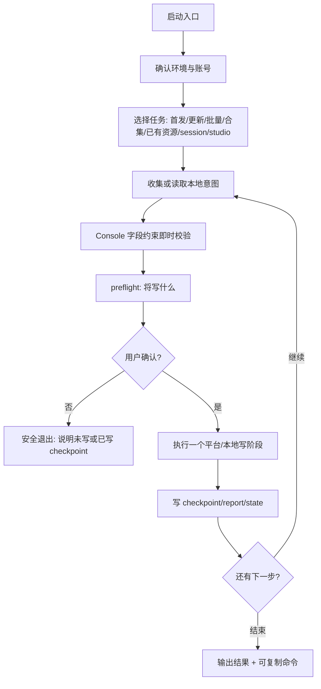

硬规则：

1. `freelog-cli` / `freelog-cli start` 是普通 TTY 用户的主入口；root help 不能只是命令字典，必须能引导进入任务。
2. `init`、`publish`、`policy`、`online` 等显式命令是向导 checkpoint 和专家快捷入口，不是普通用户必须背诵的完整流程。
3. 每个 checkpoint 都要告诉用户：已写本地什么、已写平台什么、下一步是什么、退出后如何继续。
4. 向导可以建议下一步，但不得自动跳过确认完成平台写入；`create/publish/policy/online` 仍是明确阶段。
5. 非 TTY 永远不进入向导；缺参数时输出 code 4 + hint，避免 AI/CI 卡死。
6. 若现有命令结构与这个体验冲突，重构时以本文体验为准，不为旧命令形态保留糟糕主路径。

#### 0.2.1 入口向导屏幕协议

入口向导不是“把所有命令藏起来”，而是把命令链组织成用户能理解的任务流。每个屏幕都必须同时给出人类选择和等价命令，方便用户退出后继续、复制给 AI 或放进 CI。

| 节点 | 用户看到的问题 | 选择 / 输入 | 立即副作用 | 等价 checkpoint | 退出后提示 |
|---|---|---|---|---|---|
| E0 启动检查 | 当前目录、环境、账号是什么？ | 选择环境；登录/切账号；查看当前工程 | 不写平台；登录才写 auth | `status` / `login` | 当前使用的 env、账号来源、是否已有 manifest/state |
| E1 任务选择 | 你要做什么？ | 首次发布、更新当前工程、维护线上资源、批量、合集、RSS、session/studio | 无 | 进入对应 checkpoint | 可复制入口命令 |
| E2 对象选择 | 你手里是什么对象？ | 主题、插件、前端库/软件库、普通文件、普通目录、已有 resourceId、合集 | 无 | `init <kind>` / `bind` / `resource import-dir` / `collection *` | 为什么推荐这个路径 |
| E3 资源类型 | 这个对象在 Freelog 平台是什么类型？ | 默认逐级浏览；可搜索；最终确认叶子类型 | 只在确认后写 manifest | `type pick` / `init --resource-type` | 完整类型路径、code、能力摘要 |
| E4 本地意图 | 资源标题、授权标识、文件、模板、版本、策略等是什么？ | 按 Console 字段约束逐项输入 | 可写 manifest；不写平台 | `create` / `version set` / `policy template select/render` | 已写入哪些本地字段 |
| E5 写前预检 | 将写哪个环境、账号、资源和字段？ | 确认 / 返回修改 / dry-run | 无平台写，除非确认 | `validate` / `diff` / `publish --dry-run` | 若取消，明确“未写平台” |
| E6 执行阶段 | 正在执行哪个写入阶段？ | 等待或中断 | 可能写平台和 state/report | `create` / `publish` / `collection item` / `online` | 中断后按 report/state 继续 |
| E7 成功续接 | 下一步做什么？ | 继续策略、上架、发新版、加入合集、退出 | 只有用户确认才继续写 | 下一条命令 | 复制命令 + 已完成摘要 |
| E8 浏览器接力 | CLI 不能完成的动作在哪里做？ | 打开 Console 链接或复制 URL | 不自动打开非 TTY 浏览器；TTY 仅展示/可选打开 | `dep auth` / `publish` 重跑 | `actionUrl`、`contractsUrl`、`nextCommand` |

屏幕文案原则：

- 每个问题都用用户语言，不说 `RT005001`、`subjectType=4`、`resourceVersionInfo1` 这种内部词；确认页可以展示内部 code 作为可审计信息。
- 每个写平台动作前都要说清楚“这一步会写平台”，不能靠命令名让用户猜。
- 每个成功页都要把“下一步”放在最前面，不让用户回文档里找。
- 每个失败页都要区分“可以改输入重试”“已经部分成功需 resume”“结果未知需人工对账”。
- 等价命令必须能复制执行；未作为公开能力交付的入口命令，不得提前写入面向用户的使用文档。

#### 0.2.2 中断与续接原则

CLI 向导必须允许用户随时退出，因为真实终端会被关闭、网络会断、AI/CI 会被取消。中断后按最后一个完成的 checkpoint 继续：

| 中断位置 | 已发生什么 | 续接方式 |
|---|---|---|
| E0/E1/E2 之前 | 未写任何本地或平台状态 | 重新进入向导 |
| E3/E4 已确认 | 只写 manifest / 本地配置 | `status` 展示草稿；继续 `create/validate/publish` |
| E5 取消 | 未写平台 | 输出 dry-run 摘要和继续命令 |
| E6 本地写后失败 | manifest/state/report 可能已有 checkpoint | `status` / `validate` / `--resume` |
| E6 远端写后本地失败 | 平台可能成功 | 进入 remote recovery，不允许盲目重试创建 |
| E8 handoff | 需要浏览器支付/签约/验证码 | 完成 Console 动作后重跑 `nextCommand` |

这也是为什么显式命令仍然存在：它们不是坏体验，而是向导可恢复的骨架。

### 0.3 Console 证据基线

本文的 Console 业务理解以当前本地 Console 源码和对齐文档为证据，而不是凭记忆：

| 证据 | 当前结论 |
|---|---|
| Console 源码 | `D:/appinside/freelogfe-web-repos/packages/console`，commit `d74121e647f0223203f1f0bb317354b4191266f1` |
| 字段契约 | `verify:console-forms` 已核 `FORM-*` 21/21：资源、版本、listing、策略、online、合集、RSS、批量 |
| 流程事实 | [Console完整业务梳理](../对齐/Console完整业务梳理.md) 记录 creator / collectionCreator / creatorBatch / versionCreator / sidebar / collectionSidebar |
| 字段事实 | [Console表单字段与交互规则](../对齐/Console表单字段与交互规则.md) 记录 HARD / CONDITIONAL / SUGGESTION / UI_ONLY |
| 调用拓扑 | [CLI拓扑与Console对照](../对齐/CLI拓扑与Console对照.md) 记录页面 → Effect → API → CLI |

关键源码锚点：

- 独立资源首版：`models/resourceCreatorPage/step1Effects.ts`、`pages/resource/creator/Step1`、`pages/resource/creator/Step2`、`pages/resource/creator/Step4`
- 独立资源维护：`models/resourceVersionCreatorPage.ts`、`pages/resource/sidebar/Sider`、`pages/resource/sidebar/info`、`pages/resource/sidebar/dependency`、`pages/resource/sidebar/versionInfo`
- 批量资源：`pages/resource/creatorBatch/Handle`、`pages/resource/creatorBatch/Handle/Task`
- 合集首版与维护：`models/collectionCreatorPage/step1Effects.ts`、`pages/resource/collectionCreator`、`components/FCollectionItems2`、`pages/resource/collectionSidebar`
- RSS 与收录规则：`components/FPodcastRssSubmit/Flow`、`pages/resource/collectionSidebar/info/$id`

`verify:console-forms` 只证明这些源码锚点上的字段/禁用/按钮契约仍可被识别；真实 dev/prod 行为仍以日期化 ENV 报告和人工手测为准。

设计时按以下顺序翻译 Console：

1. 先确认 **Console 有效业务约束**：字段是否必填、能否提交、API 字段如何省略、按钮何时禁用。
2. 再判断 **CLI 产品范围**：CORE / ADVANCED / NATIVE / OUT。
3. 再选择 **CLI 体验形态**：交互提示、命令拆步、preflight、`--yes`、JSON、report、或 code 5 handoff。
4. 最后补 **验收锚点**：FORM ID、能力 ID、单测/契约/ENV/人工路径。

如果 Console 源码与本文冲突，先更新 Console 证据文档，再改本文；不得绕过证据直接改代码。

---

## 1. 总拓扑

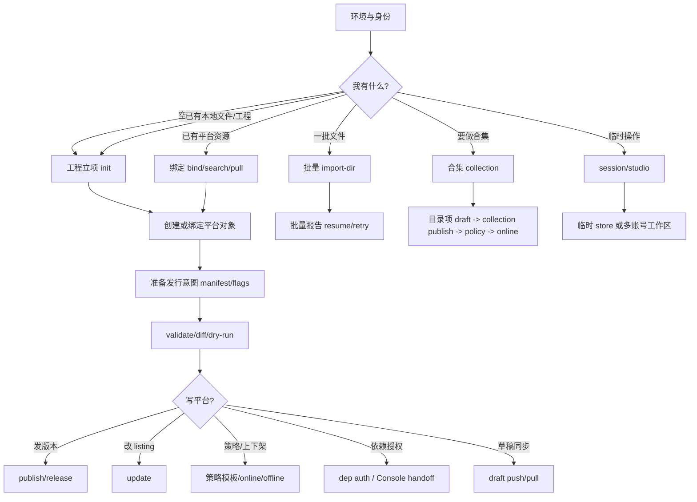

每个节点都必须回答四个问题：

| 问题 | 设计要求 |
|---|---|
| 用户怎么发现下一步？ | help、成功提示、status、validate 必须给出下一条可复制命令 |
| 现在会不会写东西？ | 明确标出本地写、临时产物、存储上传、平台写 |
| Console 靠 UI 限制了什么？ | CLI 转为字段校验、候选过滤、preflight、确认或 code 5 handoff |
| 失败后怎么继续？ | 给 exit code、原因、当前状态、下一步；部分成功必须有恢复入口 |

### 1.1 入口信息架构：先问“你要管理什么”

CLI 的第一屏不能把用户丢进命令树，也不能只给一个搜索框。真正的产品入口应该从用户手里的对象开始：

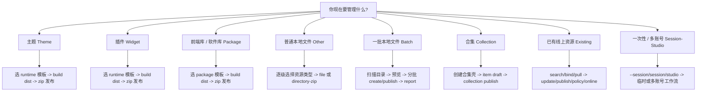

这张入口图是 help、init 向导、快速上手和手测脚本都要服从的产品顺序。命令可以拆开，但用户心智不能散。

### 1.2 主资源类型与发行路径矩阵

以下是一期必须覆盖的主对象。这里不写死 `RT*` 编码；所有标准类型都从平台类型树解析，并在用户确认页展示实际 code、完整路径和能力摘要。

| 主对象 | 用户说法 | 平台类型处理 | 本地产物 | 模板 / scaffold | 发行物模式 | 主命令路径 | Console 对齐点 |
|---|---|---|---|---|---|---|---|
| 主题 | “我要发一个主题工程” | TTY 显示「主题」入口；CLI 从平台类型树定稿「主题」叶子；若多候选则继续让用户选择具体叶子 | 前端工程目录 | runtime 模板：`vite-vue-ts`、`vite-vue`、`vite-react-ts`、`vite-react` | `directory-zip`，默认 `dist` | `init theme` → build → `publish/release` → `policy` → `online` | Step1 类型/标题/name；Step2 本地文件；runtimeVersion 必填 |
| 插件 | “我要发一个插件/组件运行时工程” | TTY 显示「插件」入口；CLI 从平台类型树定稿「插件」叶子；不得让用户误选普通文件类型 | 前端工程目录 | runtime 模板同主题 | `directory-zip`，默认 `dist` | `init widget` → build → `publish/release` → `policy` → `online` | 同主题；runtimeVersion 必填 |
| 前端库 / 软件库 | “我要发一个可复用包” | 入口为 package；模板决定候选叶子：`package-js` → JS 工具包，`package-react/vue` → 组件库；多候选必须确认，非 TTY 必须显式 type | 包工程目录 | `package-js`、`package-react`、`package-vue` | `directory-zip`，默认 `dist` | `init package` → build → `publish/release` | Step1 类型；Step2 本地上传；package 模板、namespace、目录打包是 CLI-native 一等能力 |
| 普通文件资源 | “我要发图片/视频/音频/文档等单个文件” | 默认旧式逐级选择到叶子类型；搜索只是快捷入口 | 一个本地文件 | `scaffold none` | `file` | 入口向导或 `init other` → `create` → `publish` → `policy` → `online` | 文件格式/MIME/大小/SHA1/属性解析 |
| 普通目录资源 | “我要把一个目录作为资源发布” | 逐级选择叶子类型后，必须确认类型能力或 manifest `artifactMode=directory-zip` | 本地目录 | `scaffold none` | `directory-zip` | `init other --artifact-mode directory-zip` → `publish` | 类型能力、ignore、确定性 zip、大小限制 |
| 批量独立资源 | “我有一整个文件夹素材要批量上架” | 每项使用统一默认类型，或在 batch config 中逐项声明类型；混类型必须显式 | N 个本地文件 | 不走 init 模板 | 通常 `file`，按项能力决定 | `resource import-dir` → report → `resume/retry` | creatorBatch 20 上限、标题/name 生成、策略确认 |
| 合集 | “我要做相册/专辑/资源集合” | subjectType 固定为合集；类型树使用合集可用类型，不能混入单资源类型 | 合集 manifest + 目录草稿 | `collection` | 合集版本，不上传一个压缩包 | `init collection` → `collection create` → `item *` → `collection publish` → `online` | collectionCreator、目录草稿、display、merge |
| RSS 合集 | “合集内容来自 RSS/feed” | 先有合集壳，再绑定 RSS；绑定后由 feed 管理内容字段 | 合集 + RSS 平台状态 | `collection` | 平台导入，不是本地文件发行 | `collection rss inspect/send-code/bind/status/sync` | RSS 地址、验证码、同步、锁定字段 |
| 已有线上资源 | “我已经在 Console 有资源，现在要用 CLI 管理” | 通过 resourceId / 授权标识搜索和绑定；不猜本地目录身份 | 绑定后的 manifest/state | 不复制模板，除非用户新建工程 | 原资源能力决定 | `search` → `bind` → `pull` → `update/publish/version/策略模板/online` | sidebar info/version/policy/online |

### 1.3 场景分册索引（详情不在本文展开）

场景细节拆到 [场景/](./场景/README.md)。本文只保留总拓扑和跨场景约束；每个场景文件负责写清用户目标、资源类型、TTY 屏幕、AI/CI 等价命令、失败恢复和回归到总设计的要求。

| ID | 场景 | 必须覆盖的体验重点 |
|---|---|---|
| S01 | [主题工程首次发布](./场景/S01-主题工程首次发布.md) | 「主题」独立入口；平台主题 leaf 定稿；runtime 模板；dist zip；策略模板/online |
| S02 | [插件工程首次发布](./场景/S02-插件工程首次发布.md) | 「插件」独立入口；不得复用主题文案；插件 leaf；runtime 模板；dist zip |
| S03 | [前端库/软件库发布](./场景/S03-前端库软件库发布.md) | package 模板到 JS工具包/组件库 leaf；namespace；目录打包 |
| S04 | [普通单文件资源发布](./场景/S04-普通单文件资源发布.md) | 旧式逐级类型选择；文件能力限制；SHA/属性解析；策略模板/online |
| S05 | [普通目录资源发布](./场景/S05-普通目录资源发布.md) | 区分“目录整体 zip / 批量 / 合集”；artifactMode；ignore；确定性 zip |
| S06 | [已有线上资源维护](./场景/S06-已有线上资源维护.md) | search/bind/pull；listing 不默认覆盖；version edit 与 publish 分叉 |
| S07 | [批量本地目录发布](./场景/S07-批量本地目录发布.md) | 预览、分批、report、resume/retry、remote_unknown 停损 |
| S08 | [合集从本地目录创建](./场景/S08-合集从本地目录创建.md) | 合集壳、子资源、目录草稿、合集版本四层模型 |
| S09 | [RSS 合集维护](./场景/S09-RSS合集维护.md) | RSS bind/status/sync；验证码 handoff；Console 锁定字段 |
| S10 | [AI/CI 代用户执行](./场景/S10-AI-CI代执行.md) | `--json --yes --env`；NDJSON；稳定 exit code；不交互 |
| S11 | [session/studio 临时与多账号](./场景/S11-session-studio临时多账号.md) | 单命令 session、交互 session、studio 多账号与不落盘凭据 |
| S12 | [已有本地工程更新版本](./场景/S12-已有本地工程更新版本.md) | `status/start` 作为继续入口；bump/build/publish；version edit 分叉 |
| S13 | [只管理线上策略与上下架](./场景/S13-只管理线上策略与上下架.md) | 不发文件也能进入 policy/online/offline；严格 online 门禁 |
| S14 | [策略模板选择与应用](./场景/S14-策略模板选择与应用.md) | 策略新增先看可选模板；选择模板后填参数、预览、确认；文件入口仅 advanced/AI/CI |

场景和总设计必须来回校验：

```text
场景发现重复问题 → 抽象回 02 总规则
02 总规则变化 → 回扫每个 Sxx 场景
场景涉及字段限制 → 回查 Console FORM 文档
场景涉及命令/flag → 回写 01 摘要和使用文档
```

---

## 2. Console 业务节点 → CLI 体验翻译

这一节是重构前的“业务覆盖表”。每个 Console 节点都必须在 CLI 中有明确处理：对齐、等价拆步、CLI 增强，或声明 OUT/handoff。

### 2.1 独立资源 creator / sidebar

| Console 节点 | 有效业务细节 | CLI 体验翻译 | 验收锚点 |
|---|---|---|---|
| creatorEntry | 用户先选单资源、批量或合集 | root help / 快速上手必须先把三种发行模式讲清；不能让用户先背命令树 | UX-HELP-01 |
| creator Step1 · 类型 | 类型必选；只能提交有效叶子类型 | TTY 默认逐级浏览，搜索只是快捷入口；非 TTY 必须给 `--resource-type` | FORM-RES-TYPE、UX-TYPE-* |
| creator Step1 · 标题 | trim 后非空，最多 100 字 | `init/create/update` 输入前提示限制，写平台前同源校验 | FORM-RES-TITLE |
| creator Step1 · 授权标识 | 1–60 字，规范化空格/emoji/禁用字符，300ms 查重 | CLI 显示规范化后的最终值；创建前查重；重复时给可改字段和下一步 | FORM-RES-NAME |
| creator Step2 · 本地文件 | 类型决定是否可本地上传；格式/MIME/大小来自 type capability；视频 1GB，其它 200MB | `version set/publish` 按类型能力 fail-closed；preflight 展示最终文件、大小、SHA1、artifactMode | FORM-VER-FILE/SIZE |
| creator Step2 · SHA1 | 同一文件已发行会阻止发行 | publish/import-dir 前查 SHA1；同版本恢复必须核完整发布意图，不只看 SHA | FORM-VER-SHA1 |
| creator Step2 · 属性解析 | PropertyParser 返回 inputAttrs / customPropertyDescriptors | CLI 上传后解析并合并 manifest 显式值；dry-run 不伪造 unresolved 字段 | FORM-VER-INPUT/CUSTOM |
| creator Step2 · 依赖授权 | 未完整授权阻止提交 | publish preflight 硬拦；免费可直签，付费/不可判 code 5 handoff | FORM-VER-DEPS、FORM-PAID |
| creator Step2 · 草稿 | Console 300ms 防抖自动保存 | CLI 不自动草稿；工程模式显式 `draft push/pull/discard`；session 不支持 draft | FORM-VER-DRAFT |
| creator Step3 · 策略 | 先展示可选策略模板，选模板后编辑参数和标题，再预览代码/译文并创建；向导内不可启停；零策略也可下一步 | CLI TTY 主路径必须是 `policy template` 选择/填写/预览/确认后 apply；`--from-file` 仅是专家/AI/CI 入口；online 前严格检查策略 | FORM-POL-* |
| creator Step4 · listing + 软上架 | tags/cover/intro 后直接 `status:1`，该路径不走 sidebar resourceOnline 三分支 | CLI 故意拆成 `update` + `online`；`online` 只采 sidebar 严格门禁 | FORM-LIST-*、FORM-ONLINE |
| sidebar info | title/intro/cover/tags 维护；封面/标签在 UI 中可即时更新；RSS 锁字段 | CLI `update` 显式一次写；RSS 关联资源必须拒绝手改锁定字段 | FORM-LIST-IMMEDIATE、FORM-LIST-RSS-LOCK |
| sidebar policy | 新增策略仍进入 fPolicyBuilder3 模板列表；启停已有策略；上架资源最后一条启用策略不可关 | TTY 新增策略仍从模板选择开始；`policy set` 只做启停；禁用最后一条启用策略 code 4 | FORM-POL-LAST-ENABLED |
| sidebar dependency/contract | batchAuth 只给 Tab 警告，不阻止其它操作；签约可能进入浏览器 | CLI 无 Tab，publish/dep auth 变成明确 preflight；需浏览器时 code 5 | FORM-SIDER-AUTH-WARN |
| sidebar versionInfo | 已发版只维护 description/属性；依赖列表不可在已发版 edit 中改 | `version edit` 只改 Console 允许字段；改依赖必须 publish 新版 | V-05 |
| versionCreator | 发新版；默认 patch；草稿优先于 latest 继承；冻结用位掩码 gate | `publish --bump` / `--reuse-version` 必须尊重草稿/继承边界；frozen 统一 gate | FORM-VER-NUMBER、R-06 |
| result success | 成功页是 UI 引导，部分按钮调用 online | CLI 不做假进度页；成功后给下一步命令 | UX-PUBLISH-01 |

### 2.2 批量 creatorBatch

| Console 节点 | 有效业务细节 | CLI 体验翻译 | 验收锚点 |
|---|---|---|---|
| 选择文件 | Console 单批最多 20 文件 | CLI 可接收更大目录，但写平台时按 20 分批；strict 模式可复刻 Console 上限 | FORM-BATCH-COUNT |
| 上传 Task | 单项 pending/error 会阻止发行 | import-dir 先本地扫描和上传/能力预检；失败项进入 report，不让长任务静默跳过 | UX-BATCH-01 |
| 资源标题 | 默认文件名去扩展名，最多 100 字 | prepare 阶段生成并校验；预览展示最终标题 | FORM-BATCH-TITLE |
| 授权标识 | 文件名截 50 字后生成，最终 1–60 字且批内去重/平台查重 | CLI 同链路生成；展示规范化后的 name；重复时不进入远端写 | FORM-BATCH-NAME |
| 批量策略 | 无策略也可发行，但 Console 弹窗确认 | TTY preflight + confirm；非 TTY 必须显式 `--yes`，不能隐式接受无策略 | FORM-BATCH-POLICY |
| batchSignContracts | 可由授权微应用生成 | CLI 通过 batch config/manifest 显式声明；`authExcludedItems` 非空时省略非法 batchSign | FORM-BATCH-CONTRACT |
| Finish 后置 | 可添加到节点/合集，但依赖 online 结果 | 一期 CLI 不复制 Finish 页；给后续命令或二期 handoff | OUT |

### 2.3 合集 collectionCreator / collectionSidebar

| Console 节点 | 有效业务细节 | CLI 体验翻译 | 验收锚点 |
|---|---|---|---|
| collection Step1 | 与资源 Step1 同字段；创建时固定 `subjectType:4` | `collection create` 内部固定 subject，不暴露给用户 | FORM-RES-SUBJECT |
| collection Step2 · 添加条目 | 单次最多 100；资源库、本地上传、RSS 三入口 | `collection item add/import-dir/rss` 分命令；本地导入先静态检查再写平台 | FORM-COL-ADD |
| collection Step2 · 条目 CRUD | 目录项标题/删除/排序写 draft API | `collection item *` 是即时目录草稿，不等于合集正式版本 | FORM-COL-ITEM-IMMEDIATE |
| catalogueProperty | 六项展示设置：序号/图片/简介、标题来源、list/card、asc/desc；card 6/页，list 10/页 | manifest `collection.display` 显式字段；publish preflight 展示 display 摘要 | FORM-COL-DISPLAY |
| collection publish | 只有目录变化时 `isMergeCatalogueDraft=1`；属性/展示变化 alone 为 0 | CLI 用目录指纹决定 merge；用户必须看到“目录草稿会不会合并” | FORM-COL-MERGE |
| collect-rules | creator Step4 和 sidebar info 都可维护；`STARTS_WITH` 有 `username/value` 存取规则 | `collection collect-rules set/get` 属 ADVANCED+PARITY；不是本地文件发行意图 | FORM-COL-RULES |
| RSS bind/sync | 地址预检、验证码、重复占用、换源 GUID、同步进度/失败项 | `collection rss inspect/send-code/bind/status/sync`；危险换源 `--force --yes`；ENV 需受控邮箱 | FORM-COL-RSS |
| RSS 锁定 | 标题、封面、简介、标签、展示、目录项、更新状态禁用；versionInfo 草稿跳过 | CLI 必须同样拒绝锁定字段维护，并提示 `collection rss status/sync` | FORM-COL-RSS-LOCK |
| collection online/offline | 与资源 sidebar 同款上/下架门禁，status 1/4 | `collection online/offline` 或通用 online/offline 必须同 gate | FORM-ONLINE/OFFLINE |

### 2.4 Console 有但 CLI 不复制的交互

| Console 行为 | 为什么不复制 | CLI 处理 |
|---|---|---|
| 云存储 picker | 依赖浏览器空间选择和对象上下文 | OUT；只支持本地文件；必要时提示去 Console |
| Markdown / Cartoon 微应用 | 是浏览器内容生产工具，不是发行管线 | OUT；用户先在本地生成文件再发布 |
| 支付收银台、验证码 | 不能 headless 完成真实支付/验证码 | code 5 handoff，输出 URL 和 nextCommand |
| creator Step4 软上架 | Console 向导便利路径，门禁弱于 sidebar | CLI 拆成 `policy` + `online`，采用 sidebar 严格门禁 |
| 策略页新增后“立即上架” | 直接 `status:1`，不走 resourceOnline | CLI 不自动 online；用户显式执行 |
| 列表多选 batchUpdate | UI 多选运营，和本地工程可恢复目标冲突 | OUT；逐资源命令或 import-dir report |
| 裁剪弹窗/拖拽排序 UI | 交互形态不同 | CLI 用本地预裁文件、显式 reorder/order file |

### 2.5 FORM 完整性索引

这张表只回答一个问题：Console 的每个字段/按钮约束，在 CLI 体验里有没有落点。它不是测试结果；测试结果只能写到 `验证/reports/`。

| FORM | Console 约束域 | CLI 体验落点 |
|---|---|---|
| `FORM-RES-TYPE` | 资源类型必选、叶子类型、类型树 | `type pick/list/search/info`；TTY 逐级选择；非 TTY 显式 `--resource-type` |
| `FORM-RES-TITLE` | 资源/合集标题 trim、非空、≤100 | `init/create/update/collection create/update` 输入提示和写前校验 |
| `FORM-RES-NAME` | 授权标识 1–60、规范化、查重 | 创建前展示规范化结果；平台查重；重名给下一步 |
| `FORM-RES-SUBJECT` | 独立资源/合集 subjectType | 用户不直接填；命令入口决定 subject |
| `FORM-VER-FILE` | 本地文件/目录、类型能力 | `version set/publish/import-dir` 展示 filePath、artifactMode、最终产物 |
| `FORM-VER-SIZE` | 类型大小上限、视频硬上限 | 上传前 fail-closed；错误说明实际大小和限制 |
| `FORM-VER-SHA1` | 重复文件/已发行判断 | publish/import-dir 查 SHA；恢复必须核完整发布意图 |
| `FORM-VER-NUMBER` | 版本号、递增、默认 patch | `version bump/publish --bump`；冲突时提示 bump 或对账 |
| `FORM-VER-DESC` | 版本说明 | `version set/edit/publish`；已发版只改 Console 允许字段 |
| `FORM-VER-INPUT` | inputAttrs | 属性解析后显式入 manifest；dry-run 标 unresolved，不伪造成功 |
| `FORM-VER-CUSTOM` | customPropertyDescriptors | 同属性解析链；失败说明 parser/API |
| `FORM-VER-DEPS` | 依赖与授权状态 | `dep auth` / publish preflight / code 5 handoff |
| `FORM-DEP-RANGE` | 依赖 versionRange | 本地上传不自动填；`dep add` 可按 latest 推导 `^version`，显式 version 优先 |
| `FORM-VER-COVER` | 视频版本封面 | Console 创建提交缺该字段；CLI 允许新版本显式设置，作为 CLI 增强标注 |
| `FORM-LIST-COVER` | 封面上传/展示 | `update` 与 publish cover preflight；RSS 锁定时拒绝 |
| `FORM-LIST-INTRO` | 简介 ≤200 | `update/create/collection update` 输入提示和校验 |
| `FORM-LIST-TAGS` | 标签编辑 | `update`；RSS 锁定时拒绝 |
| `FORM-LIST-IMMEDIATE` | Console 某些 listing 即时写 | CLI 改为显式 `update`，不隐藏写平台 |
| `FORM-LIST-RSS-LOCK` | RSS 关联后 listing 锁定 | `collection rss status/sync` 引导；锁字段 code 4 |
| `FORM-LIST-BATCH-FROZEN` | 列表页批量冻结禁选 | 一期 OUT；不进入本地资源发行命令面 |
| `FORM-LIST-BATCH-OFFLINE-CONFIRM` | 列表页批量下架确认 | 一期 OUT；单资源/合集 `offline` 仍必须确认 |
| `FORM-LIST-BATCH-PARTIAL` | 列表页批量部分失败弹窗 | 一期 OUT；CLI 批量使用 report/resume/retry |
| `FORM-LIST-ADD-TO-COLLECTION` | 资源列表加入合集，>100 警告 | 一期 OUT；合集条目通过 `collection item add/import-dir` |
| `FORM-RC-S3-SKIP` | creator Step3 稍后/零策略 | CLI 不复制向导跳页；成功后给 `policy`/`online` 下一步 |
| `FORM-POL-TEMPLATE` | 可用策略模板列表、模板标题、译文、代码预览、参数控件 | TTY 先列模板再填参数；非 TTY 用 `policy template list/render --json` 或专家 `--from-file` |
| `FORM-POL-NAME` | 策略名 2–20、不可重复 | 模板选中后默认填模板名，编辑时同源校验；`policy set` 不改正文 |
| `FORM-POL-TEXT` | 策略文本由模板 recompile 得到；代码不可重复 | 提交前展示译文和代码摘要；付费/不可判 handoff；专家文件入口也必须走同一校验 |
| `FORM-POL-WIZARD-TOGGLE` | 向导内策略只能新增不可启停 | CLI 拆成独立 `policy set`，不做隐藏开关 |
| `FORM-POL-LAST-ENABLED` | 上架时不能停最后一条启用策略 | `policy set --disable` 前 gate |
| `FORM-POL-APPEND` | 已有策略追加 | CLI 追加策略比 Console 更严，必须通过本地语法门禁 |
| `FORM-POL-POST-ONLINE` | 策略页新增后立即上架 | CLI 不自动 online；用户显式执行 sidebar 严格 `online` |
| `FORM-ONLINE` | latestVersion、启用策略、冻结状态 | `online` 采用 sidebar 严格门禁 |
| `FORM-OFFLINE` | 下架状态流转 | `offline` 只写状态并刷新事实 |
| `FORM-PAID` | 付费/验证码/浏览器签约 | code 5 URL + nextCommand，不假装完成 |
| `FORM-SIDER-AUTH-WARN` | Console Tab 警告 | CLI 变成 publish/dep auth 前置检查 |
| `FORM-COL-ADD` | 合集添加来源和数量上限 | `collection item add/import-dir/rss`，写前预览 |
| `FORM-COL-TITLE` | 目录项标题 | `collection item update` 校验；add 幂等需核标题/授权排除 |
| `FORM-COL-ORDER` | 目录项排序 | `collection item reorder` / order file；展示旧顺序和新顺序 |
| `FORM-COL-ITEM-IMMEDIATE` | 目录项即时草稿 | `collection item *` 明确写目录草稿，不等于发布版本 |
| `FORM-COL-DISPLAY` | catalogueProperty 展示设置 | manifest `collection.display`，publish preflight 展示 |
| `FORM-COL-MERGE` | 目录草稿是否 merge | CLI 用目录指纹决定，并展示 `isMergeCatalogueDraft` |
| `FORM-COL-RULES` | collect-rules | `collection collect-rules get/set`，属于 ADVANCED+PARITY |
| `FORM-COL-RSS` | RSS inspect/code/bind/sync | `collection rss *`；验证码/邮箱不自动完成 |
| `FORM-COL-RSS-LOCK` | RSS 合集字段锁定 | 拒绝标题/封面/简介/标签/display/items/status 手改 |
| `FORM-BATCH-COUNT` | 单批最多 20 | CLI 可自动分批；strict 模式复刻上限 |
| `FORM-BATCH-TITLE` | 批量标题生成/限制 | prepare 预览最终 title |
| `FORM-BATCH-NAME` | 批量授权标识生成/查重 | prepare 预览最终 name，批内/平台去重 |
| `FORM-BATCH-POLICY` | 批量无策略确认 | TTY confirm；非 TTY 必须 `--yes` |
| `FORM-BATCH-CONTRACT` | batchSignContracts | `authExcludedItems` 非空时按平台格式省略非法 batchSign |

---

## 3. 角色入口与推荐路径

| 用户 | 入口 | 推荐路径 | 最容易踩坑 | CLI 必须怎么帮 |
|---|---|---|---|---|
| 新内容作者 | `init` | 分级选类型 → scaffold none → create → publish → 策略模板 → online | 不知道资源类型/策略 | 默认走逐级选择；成功后给下一步 |
| 前端开发者 | `init theme/widget` | 选模板 → build → release/publish | 不知道构建目录和压缩 | 模板写清 `artifactMode`；publish 展示 zip/SHA |
| 已有资源作者 | `bind` / `search` | 绑定 → pull → update/publish | 平台与本地漂移 | diff/pull 默认保守，不覆盖 manifest |
| 批量运营 | `resource import-dir` | 扫描 → 预览 → 创建 → report | 中途失败、重复创建 | report/resume/retry，unknown 停损 |
| 策展人 | `init collection` | create → item add/import → publish → 策略模板 → online | 混淆“目录草稿”和“合集版本” | 明确“item 改目录草稿，publish 才发版” |
| CI/Agent | 全参数 + `--json` | validate → dry-run → publish/release → online | 非交互等待输入 | 缺 `--env` / `--yes` 直接失败并 hint |
| 临时操作者 | `--session` / `session` / `studio` | 选资源、选文件、一次性写入 | 以为会保存工程状态 | 输出是否导出工程；不跨进程保留 ephemeral store |

---

## 4. 资源类型选择拓扑（必须保留旧式逐级选择）

资源类型选择是一期体验的第一道门。搜索是加速器，不是唯一入口。

### 4.1 TTY 主路径：逐级浏览

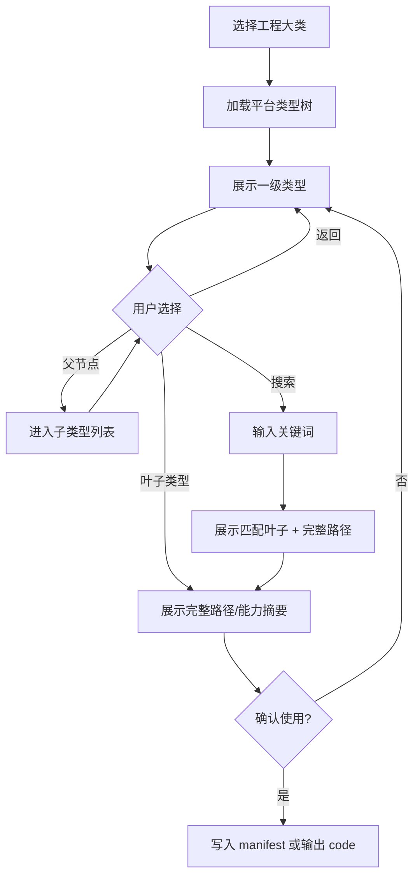

**硬性体验规则：**

1. `init` / `create` / `type pick` 在 TTY 下的默认路径必须是 **一级级浏览到叶子类型**，与旧版选择体验一致。
2. 每一级列表都必须包含“搜索资源类型”快捷入口；搜索结果只列可提交叶子类型，并展示完整路径。
3. 父节点不能被提交。用户选到父节点时必须进入下一层或提示“还有 N 个子类型”，不得把父类型写入 manifest。
4. 叶子确认页必须展示：类型名、完整路径、type code、是否本地上传、文件模式（file / directory-zip）、格式/大小限制、推荐 scaffold。
5. 用户取消时不写本地文件、不写平台，并返回 code 4。
6. 合集入口只允许合集可用类型；前端库 package 入口必须结合模板上下文定稿叶子类型，不能任选父节点。

### 4.2 搜索快捷路径

搜索支持：

- 按中文名、英文名、code 模糊匹配；
- 从任意层级触发；
- 展示“完整路径 + 能力摘要”，避免用户只看到一个名字；
- 多结果时必须让用户确认，不得自动选第一个。

搜索不支持：

- 非 TTY 下模糊搜索后自动选择；
- 把父类型当结果提交；
- 网络失败时使用过期本地常量静默兜底。

### 4.3 非 TTY / CI 路径

```text
freelog-cli type list --env <env> --json
freelog-cli type search <keyword> --env <env> --json
freelog-cli type info <typeCode> --env <env> --json
freelog-cli init <dir> --resource-type <typeCode> --artifact-mode file|directory-zip --yes --env <env>
```

非 TTY 不进入选择器。缺类型时 code 4，并提示：

- 想人工选：运行 `freelog-cli type pick --env <env>`；
- 想脚本化：先用 `type list/search/info --json` 定稿叶子 code，再传 `--resource-type`。

### 4.4 验收点

| ID | 场景 | 预期 |
|---|---|---|
| UX-TYPE-01 | TTY init 从一级进入子级再选叶子 | 可完成；写入叶子 code 和完整 labels |
| UX-TYPE-02 | TTY 在任一级搜索 | 搜索结果带完整路径，确认后完成 |
| UX-TYPE-03 | 用户选择父节点 | 不提交；进入下一层或提示非叶子 |
| UX-TYPE-04 | 非 TTY 缺 `--resource-type` | code 4；hint 给 `type pick/list/search/info` |
| UX-TYPE-05 | 类型树查询失败 | code 4/5；不使用硬编码旧 code |
| UX-S1-THEME | 主题工程首发 | `init theme` 有独立入口；模板列表正确；最终类型为平台「主题」叶子；dist zip preflight 可见 |
| UX-S2-WIDGET | 插件工程首发 | `init widget` 有独立入口；不要求搜索插件；文案是插件；最终类型为平台「插件」叶子 |
| UX-S3-PACKAGE | 前端库/软件库首发 | package 模板到平台叶子类型映射可见；namespace 与资源字段错误分开提示 |
| UX-S4-FILE | 普通单文件首发 | 逐级选择叶子类型；展示格式/MIME/大小/SHA；发版后可 policy/online |
| UX-S5-DIR | 普通目录资源首发 | `artifactMode=directory-zip` 明确；ignore 和 zip/SHA preflight 可见 |
| UX-S6-EXISTING | 已有线上资源维护 | search/bind/pull/update/publish/version/策略模板/online 顺序清楚；pull 默认不覆盖 manifest |
| UX-S7-BATCH | 批量目录发布 | 预览、分批、report、resume/retry/unknown 状态都能手测 |
| UX-S8-COLLECTION | 合集本地目录创建 | 子资源创建与目录草稿、合集版本发布明确分层 |
| UX-S9-RSS | RSS 合集维护 | bind/status/sync 与锁定字段行为可验证；ENV 缺口单独记录 |
| UX-S10-AI-CI | AI/CI 代执行 | 全参数、`--json`、`--yes`、`--env`、exit code、nextCommand 稳定 |
| UX-S11-SESSION-STUDIO | session/studio | 单命令 session 不跨进程；studio 多账号不串 owner，敏感文件不入候选 |
| UX-S12-LOCAL-UPDATE | 已有本地工程更新版本 | `status/start` 能展示 latest 与本地意图；TTY 建议 bump/build/publish；不混淆 version edit 与发新版 |
| UX-S13-ONLINE-ONLY | 只管理线上状态 | 可从已有工程或 search/bind 进入 policy/online/offline；冻结/无版本/无策略在确认前提示 |
| UX-S14-POLICY-TEMPLATE | 策略模板选择与应用 | Console 的 fPolicyBuilder3 模板列表、参数编辑、译文/代码预览在 CLI 有等价 TTY；`--from-file` 不作为普通用户主路径 |

---

## 5. 工程立项拓扑

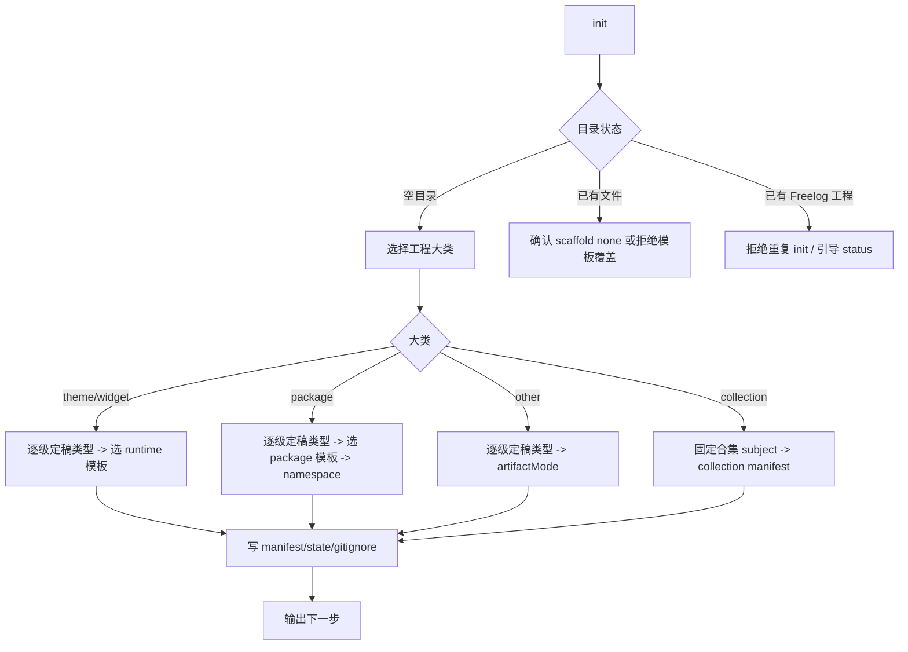

### 5.1 目录状态处理

| 状态 | 行为 |
|---|---|
| 空目录 | 可复制模板或 scaffold none |
| 非空且无 manifest | 模板会写代码时必须确认；runtime/package 模板默认拒绝，除非设计明确支持 merge |
| 已有 `freelog.manifest.json` | 不重复 init；提示 `status` / `validate` |
| 已有平台绑定 state | 即使 `--yes` 也不得覆盖绑定；提示新目录或 bind/pull |

### 5.2 模板与 scaffold

| 大类 | 用户选择 | CLI 结果 |
|---|---|---|
| theme/widget | runtime 模板 | 写构建工程；版本 filePath 默认 dist；artifactMode=directory-zip |
| package | package 模板 + namespace | 写包工程；必须定稿平台叶子类型 |
| other | scaffold none | 只写 manifest；用户提供 filePath；artifactMode 必须显式 |
| collection | collection manifest | 不生成前端工程；进入 collection create |

### 5.3 成功提示

成功提示必须是环境感知的，不得硬编码 dev：

```text
已创建本地工程: <path>
资源类型: <完整路径> (<typeCode>)
发行物模式: file|directory-zip
下一步:
  1. freelog-cli create --env <env>
  2. 编辑 freelog.manifest.json 的 version.filePath
  3. freelog-cli validate --for publish --env <env>
```

如果是模板工程，还要提示依赖安装/构建命令；如果是 collection，下一步改为 `collection create`。

---

## 6. 单资源首次发行拓扑

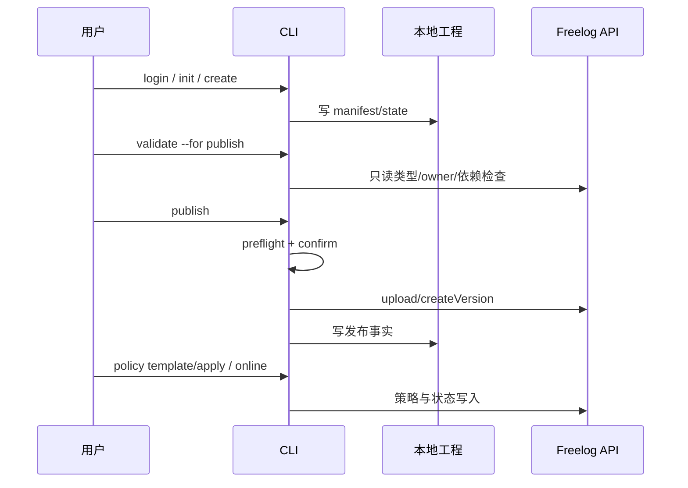

### 6.1 用户必须看到的 preflight

`publish` 写平台前，TTY 必须展示：

- 环境、登录账号、owner；
- 资源名、标题、类型路径；
- 版本号、文件路径、最终文件名、大小、SHA1；
- artifactMode：单文件还是将被压缩；
- 依赖授权状态；未签约时是否会 code 5 handoff；
- 将写入的平台对象和本地文件。

非 TTY 必须要求 `--yes`，否则 code 4。

### 6.2 典型失败与提示

| 失败 | 用户看到 | 下一步 |
|---|---|---|
| 未登录 | 当前未找到有效凭据 | `login --env <env>` |
| 环境不明确 | 非交互写需要显式环境 | 加 `--env <env>` 或项目 config |
| 类型无效/非叶子 | 不是可提交叶子类型 | `type pick` 或 `type info` |
| 文件不存在/格式/大小失败 | 明确字段和限制 | 修改 `version.filePath` 或文件 |
| 依赖未签/付费 | code 5 + Console URL | 去 Console 支付/签约后重跑 `dep auth` / `publish` |
| 版本冲突 | 远端已有同版本但意图不同 | bump 版本或人工对账 |
| 本地与远端 listing 漂移 | code 3，列差异 | `diff` / `pull` / `--apply-listing` |

---

## 7. 已有资源维护拓扑

```text
搜索资源 → bind → pull → status
  → update listing
  → version edit（只改 Console 允许维护字段）
  → publish 新版
  → draft push/pull/discard（工程模式）
  → policy / online / offline
```

### 7.1 bind 与 pull

| 操作 | 默认行为 | 用户风险控制 |
|---|---|---|
| `bind` | 只绑定资源身份与平台事实 | 不覆盖 manifest 发行意图 |
| `pull` | 只刷新 state | 不覆盖 title/intro/tags/cover |
| `pull --apply-listing` | 把平台 listing 写回 manifest | 有冲突时必须停止或 `--force` |

### 7.2 update 与 version edit

`update` 只改资源 listing；`version edit` 只改已发版维护页允许修改的字段。不能为了方便把 createVersion 的不可变字段塞进 edit。

---

## 8. 依赖、签约与 Console handoff

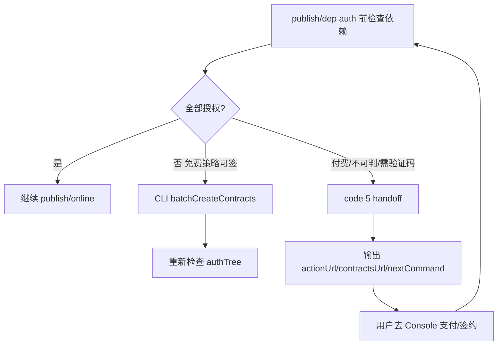

CLI 可以提醒并给链接，但不能假装完成浏览器里的动作：

| Console 动作 | CLI 行为 |
|---|---|
| 付费收银台 | code 5；输出 actionUrl |
| 手动签约 | code 5；输出 contractsUrl / nextCommand |
| 验证码 | code 5；说明必须去 Console |
| 免费且可判定策略 | CLI 可直接签约 |

---

## 9. 策略与上下架拓扑

```text
policy template list
  → policy template select
  → 填模板参数与策略名
  → policy preview（译文 + policyText 摘要 + 支付风险）
  → confirm apply
  → policy list
  → online

offline → update/publish → policy template/apply → online
```

### 9.1 策略

策略不是“让普通用户写一段 policyText”。Console 的真实流程是 `fPolicyBuilder3`：

```text
模板列表
  → 选择模板
  → 编辑参数和策略名
  → policyReCompile
  → policyTranslation
  → 预览
  → Resource.update.addPolicies
```

因此 CLI 的新设计必须把模板当作普通用户主路径：

- **TTY：** 先按当前资源/合集类型拉取可用模板，展示模板名、授权含义、是否涉及支付、需要填写的参数；用户选择后再填参数、改策略名、预览译文和代码摘要，最后确认应用。
- **AI/CI：** 先 `policy template list --json` / `policy template render <templateId> --json` 固定模板和参数，再 `policy apply --template <templateId> --param ... --yes --json`。只有专家、迁移或 AI 生成策略时才允许 `--from-file`。
- **Console 对齐：** 策略名非空、2–20、不可重复；策略代码不可重复；付费模板需要结算能力或 Console handoff；提交到平台前统一 URI 编码。
- **CLI 特殊性：** 不自动 online；策略新增成功后只给下一步 `online` 建议。启停已有策略由 `policy set` 独立完成，且最后一条启用策略保护必须在确认前拦截。

内置或平台返回的模板至少要覆盖 Console 模板族：`永久免费`、`限时免费`、`等待免费`、`永久解锁`、`限时特价永久解锁`、`免费试用后订阅`、`借阅解锁`、`付费订阅`。CLI 不应把“生成 policy.free.json”当成普通用户体验的终点；那只是专家/CI fallback。

### 9.2 online

online 使用 sidebar 严格门禁，不复制 Console 创建向导中可能更宽松的 Step4：

| 门禁 | 缺失时 |
|---|---|
| latestVersion | code 4，提示先 publish |
| 至少一条启用策略 | code 4，提示进入策略模板新增策略，或启用已有策略 |
| 非 frozen | code 4，提示 Console/平台处理 |
| owner/env 一致 | code 2/4 |

---

## 10. 批量独立资源拓扑

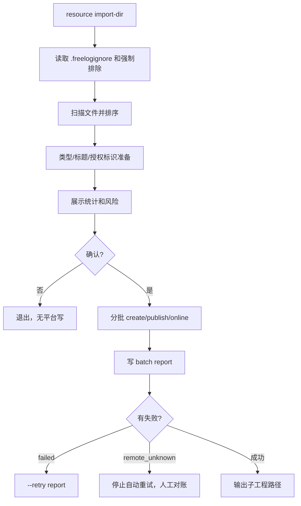

### 10.1 批量预览必须包含

- 输入目录；
- 将处理数量、跳过数量、拒绝数量；
- 资源类型与 artifactMode；
- 是否 strict 20/100 上限，是否自动分批；
- 将生成的子工程目录；
- report 路径；
- `--resume` / `--retry` 使用条件。

### 10.2 恢复语义

| 状态 | 可自动做什么 |
|---|---|
| `failed` | `--retry` 只重试失败项 |
| `remote_succeeded_local_pending` | `--resume` 补本地 manifest/state |
| `remote_outcome_unknown` | 自动停止；用户按授权名、owner、version、SHA 去 Console/API 对账 |
| `skipped` | 不计入 passed |

---

## 11. 合集拓扑

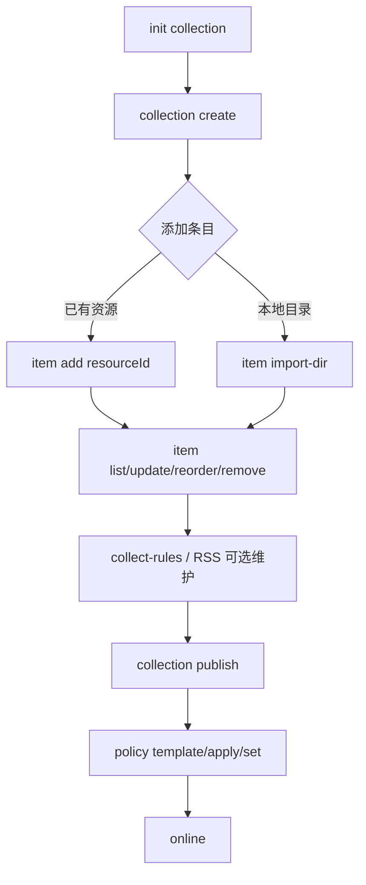

### 11.1 用户需要理解的分层

| 层 | 用户动作 | 平台含义 |
|---|---|---|
| 合集身份 | `collection create/update` | 合集 listing / 展示信息 |
| 目录草稿 | `collection item *` | 目录项增删改排，不等于发布版本 |
| 合集版本 | `collection publish` | 把目录草稿和版本属性发布为正式合集版本 |
| 上架 | `policy` + `online` | 市场可见 |

### 11.2 条目体验

| 场景 | CLI 行为 |
|---|---|
| 添加已有资源 | 必须校验 resourceId 存在、owner/授权/状态可用 |
| 添加本地目录 | 复用批量扫描和上传规则；先静态检查再写平台 |
| reorder | 展示旧顺序和新顺序；重复执行幂等 |
| RSS 合集 | 被 RSS 锁定的字段不可手改，提示 `collection rss status/sync` |

### 11.3 collection publish preflight

发布前必须展示：

- 合集标题、类型、display；
- 条目数、新增/删除/排序变化摘要；
- merge 语义；
- 每个条目的授权风险；
- 将写入的版本号和属性。

---

## 12. RSS 与 collect-rules 拓扑

RSS / collect-rules 属于 `ADVANCED + PARITY`：不在“本地文件首发核心链路”，但既然 CLI 实现，就必须对齐 Console sidebar 业务。

```text
collection rss inspect
  → send-code（验证码在 Console/邮箱侧完成）
  → bind
  → status
  → sync
  → locked fields: tags/display/items 等按 Console 当前规则禁止手改
```

设计规则：

1. RSS 绑定后，Console 锁定的字段 CLI 也必须锁定；不能因为 CLI 没 UI 就放开。
2. `collect-rules` 是平台维护规则，不是本地文件发行意图；必须记录在 state/平台事实边界内。
3. 需要邮箱验证码或第三方 feed 状态时，CLI 可以触发和查询，但不能伪造完成。
4. 真实环境验收需要受控邮箱/feed；没有 ENV 证据时只能称 SPEC+CODE，不称目标环境完成。

---

## 13. 会话与多账号工作区拓扑

这部分继承 [DESIGN.md §双维持久化](../../../DESIGN.md#双维持久化四模式) 和 [CLI双模式实现设计 §25](../开发/CLI双模式实现设计.md#25-交互壳sessionstudio)。它不是“另一个 CLI”，而是同一套 Console 业务规则在不同本地持久化形态下暴露。

### 13.0 四模式体验地图

| 模式 | 入口 | Auth | Store | 用户心智 | 禁止误导 |
|---|---|---|---|---|---|
| 00 工程模式 | 默认工程命令 | 工作区/全局落盘凭据 | `freelog.manifest.json` + `.freelog/state.json` | 长期维护、Git/CI 可复现 | 不把平台事实写进 manifest |
| 01 命令会话 | `xxx --session --resource-id ...` | 可读工作区/全局凭据 | 单命令内存 Store | 不建工程、一次性维护已有资源 | 不允许跨两条命令共享内存意图 |
| 10 多账号工作区 | `freelog-cli studio` | 进程内临时凭据 | 子工程落盘 | 一个目录里按账号/文件分发资源 | 不读取/复用磁盘凭据；不能串账号 owner |
| 11 交互会话 | `freelog-cli session` | 进程内临时凭据 | 进程内内存 Store | 像 Console 一样选资源、选文件、多步完成 | 退出后不得暗示还能继续用内存状态 |

共同硬规则：

1. 四种模式只改变 **本地意图和凭据如何保存**，不改变 Console 业务门禁：owner、env、semver、依赖授权、frozen、策略、online 都不能放宽。
2. 所有平台写入前都要展示当前账号来源：工作区凭据 / 全局凭据 / 临时会话不落盘。
3. 会话模式没有长期 manifest，因此不能执行需要长期本地草稿的流程；`draft push/pull/discard` 必须拒绝 session。
4. 需要把临时操作转成长期工程时，只能通过显式 `--export-project` 或 studio 子工程导出，不得自动写当前目录。

### 13.1 `--session` 单命令

```text
resource publish --session --resource-id <id> --file <path> ...
  → 读取平台事实
  → 用 flags 组装一次性意图
  → 写平台
  → 可选 --export-project
```

适合一次性维护已有资源；不适合多步积累意图。

用户体验必须明确：

| 场景 | 行为 |
|---|---|
| 发新版 / 复用旧文件升版 | 从平台读取 resource/latest/version 快照，用 flags 拼一次性 `VersionProject`，成功后不写当前目录 |
| `resource update --session` | 从平台读取 listing，提交显式字段 patch，不做 manifest 漂移合并 |
| `version edit --session` | 只允许 Console 已发版维护页允许字段；不得改依赖 |
| `dep auth --session` | 依赖来源是平台已发版详情，不读取当前 cwd manifest |
| `dep add/remove/update --session` | 只能与 `--export-project` 搭配，导出后进入工程模式发布；不能期待下一条 `publish --session` 继承 |
| `policy/online/offline --session` | 必须 `--resource-id --env --yes`；同工程模式门禁 |

失败文案必须避免误导：

- 不说“已保存到项目”，只说“本次会话已完成平台写入 / 未写本地工程”；
- 需要继续维护时提示 `--export-project <dir>` 或 `bind`；
- 缺 `--resource-id` 时直接 code 4，不扫描当前目录猜资源。

### 13.2 `freelog-cli session`

TTY 菜单式临时壳；适合探索、人工并排 Console。退出后不保留 manifest/state。

菜单拓扑：

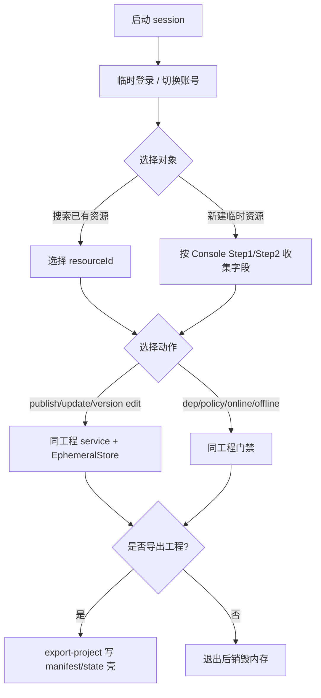

必须给用户看到：

- 当前临时账号、环境、目标资源；
- 当前内存意图摘要；
- 每一步是否会写平台；
- 退出前若存在未导出的本地意图，必须提示“退出后丢失”，但不能替用户自动落盘。

### 13.3 `freelog-cli studio`

多账号工作区；适合运营人员在一个目录下用不同账号发布多个文件。必须：

- 登录信息只在内存；
- 子工程写 owner userId；
- 同一工作区首发持锁，避免重复远端创建；
- 报告与 import-dir 分开。

Studio 是给“同一批本地文件由多个账号处理”的，不是普通工程模式的花哨外壳。

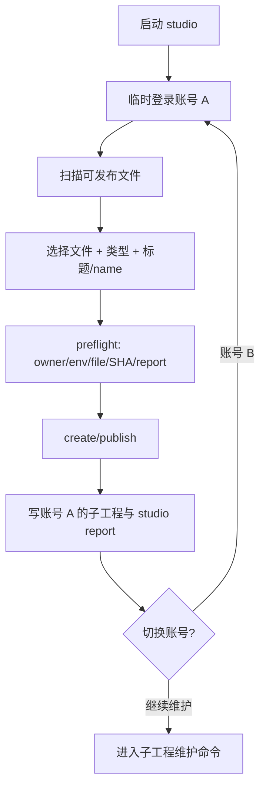

Studio 特有体验规则：

| 问题 | 规则 |
|---|---|
| 文件扫描 | 复用 `.freelogignore` 与强制敏感文件排除；不得把 `.freelog-auth`、`.freelog/`、VCS 文件作为候选资源 |
| 多账号 | 每次写前展示临时账号；子工程 state 必须记录 owner userId；不同 owner 维护必须拒绝 |
| 并发 | 同一 workspace/file 首发持锁；重复启动不能创建两个远端资源 |
| 恢复 | 使用 `studio-latest.json` 与日期化报告，不覆盖 import-dir 的 `latest.json` |
| 导出心智 | 子工程是长期工程，可以退出 studio 后用普通工程命令维护 |

### 13.4 会话 / 多账号 UX 验收点

| ID | 场景 | 通过标准 |
|---|---|---|
| UX-SESSION-01 | `publish --session` 成功 | 输出明确“不写当前工程”；无 manifest/state 副作用 |
| UX-SESSION-02 | 两条独立 `--session` 命令 | 第二条不能读取第一条的内存意图；提示 export/session 壳 |
| UX-SESSION-03 | `draft --session` | code 4；提示工程模式或不要使用 session |
| UX-SESSION-04 | `freelog-cli session` 退出 | 未导出意图提示会丢失；退出后无凭据/状态落盘 |
| UX-STUDIO-01 | studio 多账号切换 | 每次平台写前展示账号；owner 不一致时拒绝 |
| UX-STUDIO-02 | studio 扫描目录 | 不显示 `.freelog-auth`、`.freelog/`、VCS/配置和 ignore 排除文件 |
| UX-STUDIO-03 | studio 首发中断 | 能通过 studio report 恢复；unknown 状态不自动重试 |
| UX-STUDIO-04 | studio 子工程维护 | 退出 studio 后普通工程命令能读取子工程 manifest/state |

---

## 14. Help、命令面与文案拓扑

### 14.1 Root help 应按任务分组

```text
开始：login, init, bind, status
发现：type, search, template
发行：create, validate, publish, release, resource import-dir
维护：update, version, draft, dep, policy, online, offline, pull, diff
合集：collection
交互：session, studio
诊断：doctor, logs, completion
```

### 14.2 每个命令只展示相关 flag

硬规则：

1. `init` 不应展示 `--session` / `--resource-id` / `--reuse-version` 等发版会话内部 flag。
2. `create` 不应展示只属于 `publish` 的版本复用 flag。
3. `collection rss` / `collection item` 的 JSON `command` 必须是完整路径，不得只写父命令。
4. `--help` 描述必须给用户语言，不暴露 `00/01/10/11` 这种研发编码；编码只在开发文档出现。
5. 示例里的 `<env>` 必须来自当前环境上下文或用户显式输入，不硬编码 dev。

### 14.3 输出语气

顺序固定为：

```text
结果
原因 / 当前状态
下一步命令
```

禁止：

- 乱码、`????`；
- “操作失败”但不说字段；
- 成功但不说明是否写平台；
- JSON stdout 混入 spinner、彩色日志或人类文案。

---

## 15. 手测前体验验收矩阵

重构前后都必须用这张矩阵做 UX 回归。它补充功能测试，不替代 Console payload/ENV 验收。

| ID | 场景 | 通过标准 |
|---|---|---|
| UX-HELP-01 | root help | 按任务分组；无内部编码；列出所有公开入口 |
| UX-HELP-02 | `init --help` | 不出现 session/resource-id/reuse-version 等无关 flag |
| UX-HELP-03 | `publish --help` | 只展示发版相关 flag；副作用说明清楚 |
| UX-TYPE-01 | 逐级选择类型 | 可从一级进入子级直到叶子 |
| UX-TYPE-02 | 搜索类型 | 结果显示完整路径；不自动选第一个 |
| UX-INIT-01 | 空目录模板 | 输出模板版本、artifactMode、下一步 |
| UX-INIT-02 | 非空目录 scaffold none | 不覆盖用户文件；缺 artifactMode 时提示 |
| UX-CREATE-01 | 工程已有 title/type/name | `create --yes` 不再要求重复输入 |
| UX-PUBLISH-01 | TTY publish | 先展示 preflight，再确认 |
| UX-PUBLISH-02 | 非 TTY publish 缺 `--yes` | code 4；无平台写 |
| UX-PUBLISH-03 | dry-run | 不写 manifest/state、不上传、不压缩 |
| UX-BATCH-01 | import-dir 预览 | 展示处理/跳过/拒绝数量和 report 路径 |
| UX-BATCH-02 | 中断恢复 | resume/retry 行为与 report 状态一致 |
| UX-COL-01 | collection item add/reorder | 用户能区分目录草稿与合集版本 |
| UX-COL-02 | collection publish | 展示条目变化、merge、授权风险 |
| UX-RSS-01 | RSS 锁定字段 | CLI 拒绝手改 Console 锁定字段 |
| UX-HANDOFF-01 | 付费/签约 | code 5 + URL + nextCommand；不自动打开浏览器 |
| UX-JSON-01 | `--json` | stdout 单一 envelope；`command` 是完整命令路径 |
| UX-LOG-01 | Windows 输出 | 无 mojibake；失败摘要可读 |

---

## 16. 重构必须对照本文处理的体验债务

这些不是产品开放问题，而是重构必须消除的实现/文档偏差：

| 债务 | 影响 | 目标 |
|---|---|---|
| help flag 泄漏 | 新用户被内部模式干扰 | flag 按命令分组/裁剪 |
| root help 未按任务组织 | 用户不知道从哪开始 | root help 分组 + 常用路径 |
| `publish` preflight/confirm 不完整 | 平台写副作用不够显眼 | 单资源与合集 publish 同级确认 |
| `--yes` 语义不一致 | CI 可能误写平台 | 所有平台写统一确认规则 |
| JSON `command` 不完整 | Agent 难以分流 | 全命令路径稳定 |
| init next steps 硬编码环境 | 手测/非 dev 用户被误导 | 使用当前解析环境或 `<env>` |
| `verify-out.txt` 乱码/旧失败 | 手测人员被杂音干扰 | 统一 UTF-8 和最新可复现报告 |
| 类型选择实现可能偏离拓扑 | 搜索或自动定稿可能替代旧式逐级体验 | 本文 §1.2、§1.3、§4 作为硬约束；主题/插件/package 也必须有独立场景验收 |
| 主题/插件/package 场景容易被当成“模板细节” | 资源发行主链会漏掉工程型资源 | UX-S1/S2/S3 必须进手测矩阵和公开快速路径 |

---

## 17. 改代码前检查单

- [ ] 本次改动属于哪个拓扑节点？
- [ ] 该节点是否同时覆盖 TTY 与非 TTY？
- [ ] Console 字段/按钮/禁用条件是否在 `FORM-*` 中有证据？
- [ ] 搜索是否只是快捷路径，主路径是否仍可逐级浏览？
- [ ] 写操作是否展示环境、账号、owner、目标 ID 和副作用？
- [ ] `--yes`、`--force`、`--dry-run` 的副作用边界是否明确？
- [ ] 失败后是否有下一条命令或 Console handoff？
- [ ] JSON/NDJSON 是否仍可被 Agent 稳定解析？
- [ ] 文档、help、使用手册、测试矩阵是否同步？

只有这张检查单全部可回答，才进入重构实现。
