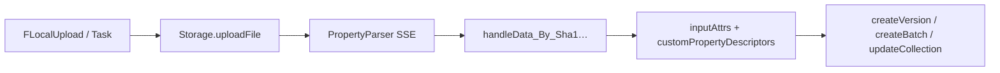

# Console 完整业务梳理（本地文件发版域）

最后更新：2026-08-13（Console 全量源码复核第三轮）

> 文档角色：Console 源码事实快照，不定义 CLI 产品范围或完成状态。CLI 产品真源是仓库根目录 [DESIGN.md](../../../../DESIGN.md)。
> 当前入口：资源域流程、字段约束、接口调用的最新事实入口是 [Console业务流程字段接口总账](./Console业务流程字段接口总账.md)；本文保留为页面级旧梳理和补充证据。

**用途：** 从 Console 源码 + OSS i18n 整理**本地文件发版与维护**相关的业务流程、校验规则与用户提示词，作为 parity 与 CLI 文案对齐的证据输入。

**术语映射：** Console 源码中的 `creator/sidebar` “单品”在产品文档统一称为**独立资源**；合集内的一行统一称为**目录项**。本文引用源码文案时可能保留原词，但不改变 CLI 的对外术语。

**配套文档：**

| 文档 | 关系 |
|---|---|
| [CLI数据操作与Console对照.md](./CLI数据操作与Console对照.md) | 稳定业务 ID 的产品契约矩阵 |
| [Console表单字段与交互规则.md](./Console表单字段与交互规则.md) | FORM-* 字段级限制、提示、禁用条件与 CLI 映射 |
| [CLI拓扑与Console对照.md](./CLI拓扑与Console对照.md) | 页面 → Effect → API → CLI 拓扑 |
| [CLI字段账本.md](../开发/CLI字段账本.md) | manifest / API 字段 |
| [CLI 使用文档](../使用/README.md) | CLI 命令用法（分册） |

**Console 源码根：** `D:\appinside\freelogfe-web-repos\packages\console`  
**API 契约：** `packages/@freelog/tools-lib/src/service-API/resources.ts`  
**i18n：** OSS `configs-test/i18n.json`（无本地 zh 包；key → zh_CN 见本文 §8）

**范围说明：**

- **在范围内：** creator / collectionCreator / creatorBatch / versionCreator / sidebar / collectionSidebar 的全部**写入 API** 与门禁。
- **不在本地文件发行主链路（Console 有、CLI 不做或须 Console）：** 云存储选文件、Markdown/Cartoon 微应用、付费收银台、列表收藏/收入/交易、节点展品等。**RSS / collect-rules** 属 `ADVANCED + PARITY` sidebar 维护：不计入核心链路分母，但属于完整产品 mandatory 验收；CLI 必须具备同级契约和专项目标环境证据。

---

## 1. 路由与页面地图

| 路径 | 组件 | 业务 |
|---|---|---|
| `/resource/creatorEntry` | creatorEntry | 发行入口（单品 / 批量 / 合集） |
| `/resource/creator` | creator Step1–4 | 单品四步向导 |
| `/resource/collectionCreator` | collectionCreator Step1–4 | 合集四步向导 |
| `/resource/creatorBatch` | creatorBatch Handle/Finish | 批量创建（≤20 文件） |
| `/resource/versionCreator/:id` | versionCreator | 维护期发新版 |
| `/resource/sidebar/*/:id` | sidebar | 单品维护（info/policy/contract/dependency/versionInfo） |
| `/resource/collectionSidebar/*/:id` | collectionSidebar | 合集维护（同上 + 单品目录） |
| `/result/resource/create/success/:id` | 创建成功 | 可调 `resourceOnline` |
| `/result/resource/version/create/*` | 版本成功/发布 | — |
| `/resource/list` | Resources | 我的资源（批量上下架/加策略） |
| `/resource/collection` | Collections | 我的合集列表 |
| `/resource/collect` | Collects | 收藏（只读） |
| `/resource/income` · `/transaction` | 收入/交易 | 消费侧 |
| `/resource/details/:id` | 市场详情 | 只读 |

**Sidebar 子页（资源与合集对称）：**

| Tab | 页面 | 主要写入 |
|---|---|---|
| info | sidebar/info | `Resource.update`（title/intro/cover/tags；合集另有 collectRules） |
| policy | sidebar/policy | `Resource.update` addPolicies / updatePolicies |
| contract | sidebar/contract | 只读 `Contract.batchContracts` |
| dependency | sidebar/dependency | `batchSetContracts`、依赖树 |
| versionInfo | sidebar/versionInfo | 草稿 CRUD、`updateResourceVersionInfo`、跳转 versionCreator |

---

## 2. 平台状态语义

| status | 含义 | Console 展示 |
|---:|---|---|
| 0 | 待发行 | unreleased |
| 1 | 上架（开放授权） | online |
| 2 | 冻结 | freeze |
| 4 | 下架 | offline |

**冻结检测差异：** sidebar `resourceSider.fetchInfo` 用 **`status === 2`** 精确匹配；`versionCreator.onMountPage` 用 **`(status & 2) === 2`** 位掩码。CLI **`isFrozenStatus`** 对齐 versionCreator 位掩码（P6-4）；`onlineService` + `publishVersion` 共用。

**注意：** `status: 0` = **待发行**（unreleased），**不是**下架。下架 API 写 **`status: 4`**（sidebar `Sider/index.tsx` L111；CLI `offlineResource` 同左）。勿与实现设计旧稿「P-04 status:0」混淆。

**上架门禁（`resourceOnline`，sidebar/Sider/index.tsx）：**

1. 无 `latestVersion` → 错误：`msg_release_version_first`（资源上架之前，需要先发行一个版本）
2. 无策略 → 弹窗引导 `fPolicyBuilder3`，一次 `update` 带 `status:1` + `addPolicies`
3. 策略全部下线 → `fPolicyOperator` 选启用策略 → `update` `updatePolicies`
4. 否则 → `update({ status: 1 })`

CLI 等价：`online` 命令用 `evaluateOnlineGates` 硬拦（须 latestVersion + ≥1 启用策略），**不**内嵌策略 Builder UI（用户先 `policy apply` 再 `online`）→ ↷。

---

## 3. 公共链路（凡本地上传必走）



| 步骤 | Console | API / 工具 | CLI |
|---|---|---|---|
| 上传 | FLocalUpload、creatorBatch Task | `Storage.uploadFile` | `uploadFileIfNeeded` |
| 解析 meta | PropertyParser | SSE `listSSE/info` 或 `filesListInfo` | `pollFilesSha1Info`（REST 轮询） |
| 组装属性 | service.ts handleData | 内部 + `getAttrsInfoByKey` | `handleFilePropertiesBySha1` |
| SHA1/格式 | 类型配置 + Task 大小 | `getResourceTypeInfoByCode` | `processFile` + `assertLocalFileAllowedByType` |
| 主题 zip | 构建产物 | 本地 zip | `processFileForPublish` |
| 封面 | FUploadCover → FCropperModal | `Storage.uploadImage` | `resolveCoverImageUrl` + `assertLocalCoverFile` |
| 自动封面 | CoverGenerator | `generateCoverImageSSE` | `coverGenerateService` |

---

## 4. 单品创建向导 `resourceCreator`

**Model：** `models/resourceCreatorPage/`  
**脏数据拦截：** Step1/2/4 变更计数 → `FPrompt` 离开确认

### Step 1 — 创建壳

**页面：** `creator/Step1/index.tsx` · **Effect：** `step1Effects.ts`

| 字段 | 规则 | 提示（zh_CN） |
|---|---|---|
| 资源类型 | 必选 | `naming_convention_resource_type_required` → 请选择资源类型 |
| 资源标题 | 非空；≤100 字 | `naming_convention_resource_title_required`；硬编码 **不超过100个字符** |
| 授权标识 | 非空；1–60；禁空格/emoji/`\ / : * ? " < > \| @ # $` | `naming_convention_resource_authid_required`；`naming_convention_resource_name`；placeholder `rqr_input_resourceauthid_hint` |
| 授权标识规范化 | 标题前 60 字同步 → `FRegExpMgr.resourceNameOptimized` | 自动转换提示 `input_resourceauthid_automodified_msg` |
| 唯一性 | debounce 300ms → `Resource.info` | `resource_name_exist` → 资源授权标识 {authID} 已被使用，请重新输入。 |

**uploadEntry 位标志（Step1 后）：** localUpload(1) · storageSpace(2) · markdownEditor(4) · cartoonEditor(8)

**API：** `Resource.create` — `{ name, resourceTypeCode, resourceTypeName?, resourceTitle }`

**CLI：** `init` + `create`；`normalizeCreateName` 对齐规范化规则。

---

### Step 2 — 文件、属性、首版发行

**页面：** `creator/Step2/index.tsx` · **Effect：** `step2Effects.ts`

**文件来源（uploadEntry）：**

| 入口 | 组件 | 脚手架 |
|---|---|---|
| 本地上传 | FLocalUpload | ✅ |
| 云存储 | FStorageSpace | — |
| Markdown | FMicroApp_MarkdownEditorDrawer | — |
| 漫画 | FMicroApp_CartoonEditorDrawer | — |

**本地上传校验（FLocalUpload + Task）：**

| 规则 | 提示 |
|---|---|
| 超过类型 limitFileSize | 硬编码 `文件大小不能超过 {size}` |
| 视频 Task | `文件大小不能超过1GB` |
| 非视频 Task | `文件大小不能超过200MB` |
| SHA1 被他人占用 | `submitresource_err_resourceexist_otheruser` |
| SHA1 被自己占用 | `submitresource_err_resourceexist_sameuser` |
| 帮助 | `rqr_input_object_fromlocal_help` → 选择本地文件上传 |

**视频封面 UI（类型名含「视频」）：**

- 组件 `FUploadCover`；草稿字段 `step2_videoCover`
- **Console TODO：** `createVersion` **尚未传** `videoCover`（`step2Effects.ts:533`）
- **CLI 已支持：** `version set --video-cover` → `publish`

**属性：** 系统/附加属性编辑器、`FMicroAPP_Authorization`（依赖）、`authExcludedItems`

**提交前校验：**

| 条件 | 提示 |
|---|---|
| 依赖未完整授权 | 硬编码 **依赖中存在未获取授权的资源** |
| createVersion 失败 | API `msg` |
| 草稿保存失败 | 硬编码 **草稿保存失败** |

**自动草稿：** `dataIsDirty_count` debounce **300ms** → `saveVersionsDraft`（CLI ↷ 显式 `draft push`）

**API（提交）：**

```text
Resource.createVersion {
  resourceId, version: '1.0.0',
  fileSha1, filename, description: '',
  inputAttrs, customPropertyDescriptors,
  dependencies, baseUpcastResources, authExcludedItems
}
```

**不传：** `batchSignContracts`（单品路径）

**CLI：** `version set --file` + `publish`

---

### Step 3 — 授权策略

**页面：** `creator/Step3/index.tsx` · **Effect：** `step3Effects.ts`

| UI | 说明 |
|---|---|
| 空态 | `versionreleased_desc`（资源需添加授权策略才能上架…） |
| 添加策略 | `fPolicyBuilder3` 抽屉 → **即时** `Resource.update` addPolicies |
| 策略列表 | `FPolicyList` **`activeBtnShow={false}`** — 向导内**不可**启停策略，仅添加 |
| 「下一步」 | `disabled={false}` — **零策略也可**进入 Step4 |
| 「稍后」 | 直接跳转 `resourceVersionInfo` @ `1.0.0`，**跳过 Step4** listing/软上架 |

**添加策略 API（逐步写入，非 Step3 提交时批量写）：**

```text
Resource.update {
  resourceId,
  addPolicies: [{ policyName, policyText: encodeURIComponent(text) }]
  // 无 status 字段 — 平台默认启用
}
```

**Step3 提交（下一步）：** 仅 `step: 4` + `fetchResourceInfo` 预填 Step4 封面 — **不写**策略、不上架。

**CLI ↷：** 无向导跳过；`policy apply` + `update` + `online` 分步；策略启停用 `policy set`（sidebar 才暴露开关）。

---

### Step 4 — Listing + 软上架

**页面：** `creator/Step4/index.tsx` · **Effect：** `step4Effects.ts`

| 字段 | 组件 | API 字段 |
|---|---|---|
| 封面 | FUploadCover | coverImages（URL 数组） |
| 标签 | 当前 `fEditLabelsDrawer` / `FLabelEditor`；最多 20 个、单项最多 20 字、拒绝空值和重复值 | tags |
| 简介 | `FMultiLine lengthLimit={200}` | intro |

**API（一次提交）：**

```text
Resource.update { tags, coverImages?, intro, status: 1 }
```

**与 CLI 差异：** Console Step4 **软上架**（无 sidebar 门禁 UI）；CLI 分 `update` + 严格 `online` → ↷ 功能等价。

**Console 三条「软上架」路径汇总（CLI 均不复制，统一走 `evaluateOnlineGates`）：**

| 路径 | 源码 | 行为 |
|---|---|---|
| creator Step4 | `step4Effects.ts` L68–77 | listing + 直接 `status:1` |
| 策略页新增后 | `resourceAuthPage` `online_afterSuccessCreatePolicy` | 弹窗后直接 `status:1`（**无** resourceOnline） |
| 发版成功页按钮 | `result/.../success` L84 | 调 sidebar **同款** `resourceOnline`（**有**门禁） |

第三条与 sidebar Sider 开关同逻辑；前两条无 latestVersion/策略检查或 bypass 门禁。

---

## 5. 合集创建向导 `collectionCreator`

**Model：** `models/collectionCreatorPage/`

### Step 1

与单品 Step1 相同校验；**额外：** `Resource.create` 传 **`subjectType: 4`**。

**uploadEntry 额外：** collectionLibrary(16) · podcastRss(32)

Step1 完成后：`handleData_By_Sha1…(sha1: '')` 预载合集类型属性模板。

### Step 2 — 单品目录 + 合集属性

**单品来源：**

| 方式 | 组件/API | 脚手架 |
|---|---|---|
| 资源库添加 | FAddResourcesHandleAuth → `addResourceItems_Draft` | ✅ item add/import-dir |
| 本地上传新建 | 同单品 create 链 | ✅ item import-dir |
| RSS 播客 | FPodcastRssSubmit · Rss.* · bindRssFeed | — |

**单品操作 API：**

| 操作 | API |
|---|---|
| 列表 | `getCollectionItems_Draft` + `batchInfo` + `getCollectionItemsAuth_Draft` |
| 添加 | `addResourceItems_Draft`（含 authExcludedItems） |
| 删 | `deleteCollectionItems_Draft` |
| 改标题 | `updateCollectionItemsInfo_Draft` / `setItemsTitle` |
| 排序 | `reorderCollectionItems_Draft` / `setCollectionItemsSortID_Draft` |

**提示：**

| 场景 | 文案 |
|---|---|
| 搜索 placeholder | `cqr_itemmgmt_search_hint` → 搜索单品 |
| 空态 | 硬编码 **暂无搜索结果** |
| 合集壳未创建 | 硬编码 **合集资源未创建，请返回上一步重试** |
| 添加数量 | `additem_alert_qtylimit` → 一次最多可添加 100 个单品 |
| RSS 验证码失败 | 硬编码 **验证码发送失败** |
| RSS 导入中 | 禁用草稿保存 |

**属性 debounce 同步：** `onSync_Step2_properties` effect 存在（`step2Effects.ts` L269–334），但 **源码内无 dispatch** — 实际 Step2 提交走 `updateCollection` + 目录草稿 API；该 effect 疑似死代码（§14 TODO）。

**Step2 → Step3 提交：**

```text
Resource.updateCollection {
  inputAttrs, customPropertyDescriptors, description: '',
  catalogueProperty, dependencies, authExcludedItems,
  isMergeCatalogueDraft: collectionItemsChanged ? 1 : 0
}
```

**CLI：** `collection publish`（目录指纹条件 merge）

### Step 3 — 策略

同单品 Step3。

### Step 4 — Listing + 自动收录 + 上架

**三次 API 顺序（step4Effects）：**

1. `Resource.update` — tags, coverImages, intro  
2. `Resource.setCollectRules` — status, conditionType, filterConditions, serializeStatus  
3. `Resource.update` — `{ status: 1 }`

**collectRules 字段：**

| 字段 | 值 |
|---|---|
| conditionType | every(1) / some(2) |
| filterConditions[].key | resourceTitle / resourceTypeCode / authIdentity |
| operator | INCLUDES / NOT_INCLUDES / STARTS_WITH / ENDS_WITH / EQUAL / NOT_EQUAL |

**CLI：** listing 用 `collection update`；collect-rules 用 `collection collect-rules set`（#46 ✅，维护分支）。

---

## 6. 批量创建 `creatorBatch`

**页面：** `creatorBatch/Handle` + `Card` + `Task` + `Finish`

| 规则 | 提示 |
|---|---|
| 文件数 ≤20 | `brr_submitresource_alert_limitation` → 一次最多上传20个文件 |
| 无策略仍发行 | Modal：`brr_resourcelisting_complete_confirm_msg`（还有{qty}个资源尚未添加授权策略…） |
| 批量应用策略 | 硬编码 **是否将策略应用于此处发行的所有资源？** |
| 授权标识空 | 硬编码 **请输入资源授权标识** |
| 授权标识 >60 | 硬编码 **不多于60个字符** |
| Card 标题 placeholder | `cqr_input_title_hint` → 输入标题 |

**发行按钮复合门禁（`onClickRelease` · Handle L786+）：** 须同时满足：

- 至少 1 张 `list` 状态 Card；
- **无** pending `localUpload` / `error` Card；
- 每张 Card：`name`/`title` 校验通过 + `isCompleteAuthorization`；
- 无策略时仍可发行（Modal 确认后）。

**默认授权标识：** 本地上传成功时 `removeExtension(filename).substring(0, **50**)`，再调 `Resource.generateResourceNames` 去重（最终仍受 60 字 HARD 限制）。

**自动封面（Handle 路径 · 非注释）：** 类型 `resourceConfig.autoGenerateCover === 2` 时，对 **空封面** Card 调 `CoverGenerator.generateCover`（sha1 → URL）；Card 显示 loading 直至封面就绪。

**SHA1 占用恢复（ErrorCard）：** 同用户占用 → Modal `canOk: true` 可修正继续；他人占用 → 只读 `canOk: false`。

**createBatch 响应映射（L943–1002）：** 按 `name` 索引；`data === null` → 合成失败 Card；status：`2→freeze`，`1→online`，`0→unreleased`，其余 → `offline`；`failReason = message`。

**Finish 页后置（OUT · CLI 不做）：** 「添加至节点」须 ≥1 `online` 结果，否则硬编码 **不存在上线资源不能签约到节点**；「添加至合集」Drawer 在无 online 时禁用。

**提交 API：**

```text
Resource.createBatch {
  createResourceObjects: [{
    name, resourceTitle, policies?, coverImages?, tags?,
    version: '1.0.0', fileSha1, filename,
    inputAttrs, customPropertyDescriptors,
    dependencies, baseUpcastResources,
    batchSignContracts: [{ resourceId, policyIds, subjectType }]
  }, ...]
}
```

**与单品差异：** 可内嵌 `policies` + **batchSignContracts**（CLI manifest / `freelog.batch.json` + `dep auth`）

**CLI：** `resource import-dir` — 封面：`autoGenerateCover===2` 时 `generateCoverUrlFromSha1`（**已对齐** Handle）；name：文件名推导 **50 字** → `generateResourceNames`（**已对齐**）。

---

## 7. 维护 — 新版本发行 `versionCreator`

**Model：** `resourceVersionCreatorPage.ts`

| 规则 | 提示 |
|---|---|
| 合集进入 | `create_new_version_error_unknowsubject` → 当前标的物不支持此操作 |
| 版本号空 | `naming_convention_version_required` |
| semver 非法 | `freelog_versioning` |
| 版本须 > latestVersion | 同上 key（带 version 参数） |
| 依赖未授权 | **依赖中存在未获取授权的资源** |
| 移除文件确认 | `createversion_remove_file_confirmation` → 确认移除吗？ |
| 草稿成功 | 硬编码 **暂存草稿成功** |
| 打开编辑器前草稿失败 | **保存草稿失败，无法打开编辑器** |

**默认版本：** `semver.inc(latestVersion, 'patch')`

**平台草稿优先（onMountPage L531–687）：** 若 `lookDraft` 有数据 → 走 `_FetchDraft`，**跳过**从 `latestVersion` 的 fileSha1/deps/attrs 自动 seed。仅当 `latestVersion !== '' && !data_draft` 才 inherit。

**继承范围（非全量快照 · L617–655）：**

- 系统附加属性：仅 `insertMode === 2` 的项；
- custom：readonlyText → customProperties；`supportOptionalConfig === 2` 时其余类型 → customConfigurations，否则 `[]`；
- 再经 `handleData_By_Sha1…InheritData2` 与文件解析结果 merge。

**依赖 versionRange 自动填充（仅云存储导入）：** `onSucceed_ImportObject`（L1033–1120）读 `Storage.objectDetails.dependencies` → `batchInfo` → `versionRange: '^' + latestVersion`。**本地上传**（`onSucceed_UploadFile`）**不**自动加 deps。

**CLI 差异：** `dep add` 未传 range 时默认 `^latestVersion`（`batchInfo`；无 latest 回退 `*`）；`--reuse-version` 继承 attrs 须对照 `insertMode`/`supportOptionalConfig`（↷ P6-3）；draft vs reuse 优先级见实现设计 §23.11。

**冻结 gate：** `(status & 2) === 2`（位掩码，见 §2）。

**发行成功链：** `createVersion` → `/result/.../release`（2s 假进度）→ `/result/.../success` — 见 §12。

**API：** `createVersion`（version 非固定 1.0.0；字段同 Step2）

**Console TODO：** videoCover 仍未传 API（`:759`）；**CLI 已支持 `--video-cover`**

---

## 8. 维护 — Sidebar

### 8.1 信息页 info

| 字段 | 校验 | 提示 |
|---|---|---|
| 标题 | 同 Step1 | 同 naming 文案 |
| 封面 | FUploadCover | 见 §9 |
| intro | `FIntroductionInput`，默认最多 200 字；RSS 相关资源禁用 | 长度提示由组件计数器显示 |
| tags | 标签编辑器，最多 20 个、单项最多 20 字；RSS 相关资源按页面状态限制 | `form_input_tag_error_length` 等 |
| RSS 相关单品 | `isRssRelated` | 部分字段锁定 |

**写入模式差异：**

| 字段 | Console | CLI |
|---|---|---|
| 封面 | `onChange_Cover` **即时** `Resource.update` | `update --cover` 显式一次 |
| 标签 | `onChange_Labels` **即时** update | `update --tags` 显式一次 |
| 标题 / 简介 | 编辑态 → Save 按钮提交 | `update --title/--intro` |

**API：** `Resource.update` 分字段

### 8.2 策略页 policy

`fPolicyBuilder3` + `Resource.update` addPolicies / updatePolicies

**sidebar 策略启停（`FPolicyList` · policy 页 L136–137）：** 当资源 **`status === 1`（已上架）** 时 `atLeastOneUsing=true` — **最后一条启用策略**的开关锁定（`onlineDisable`），不可全部停用。

**CLI：** `policyService.assertPolicyStatusChangeAllowed` — **已对齐**（上架时禁停最后启用策略，code 4 + `cannot_disable_last_policy`）。

**新增策略后引导上架（resourceAuthPage · `online_afterSuccessCreatePolicy` L712–737）：**

| 硬编码 | 文案 |
|---|---|
| title | 资源待上架 |
| description | 将资源上架到资源市场开放授权，为你带来更多收益 |
| 按钮 | 立即上架 / 暂不上架 |

**触发条件：** 新增策略成功后；`status !== 1` 且 `latestVersion !== ''` 时弹窗。

**API 行为（第三条「软上架」路径）：** 用户点「立即上架」后 **直接** `Resource.update { status: 1 }` — **不**走 `resourceOnline` 三分支门禁（不查启用策略数）。前提：用户刚创建策略，通常已有启用策略。

**CLI ↷：** `policy apply` 后不自动 `online`；用户显式 `online`（走 `evaluateOnlineGates`）。

**对比：** creator Step4（§Step 4）、version 发行成功页（`result/resource/version/create/success`）按钮调用 **sidebar 同款** `resourceOnline`（有门禁）；策略页这条是 **例外**。

### 8.2.1 Sidebar 全局 · Sider 上下架（P-03 / P-04）

**页面：** `sidebar/Sider/index.tsx` · **Model：** `resourceSider.ts`

**`fetchInfo` 加载时（L150–243，维护页全局事实）：**

| 条件 | Console 行为 | CLI |
|---|---|---|
| `userId !== cookie` | 403 跳转 | auth 层拒绝 |
| `status === 2`（冻结） | 跳转 freeze 页 | publish/update/online **preflight 失败**（R-06） |
| `subjectType === 4` | 重定向 collectionSidebar | 合集走 `collection *`，非资源 sidebar |
| `latestVersion !== ''` | 调 `Resource.batchAuth` → `hasAuthProblem` | **无等价命令**；publish 前 `assessDeclaredAuthorization`（D-04） |
| `generateCoverStatus === 1` | Sider 封面区显示「封面解析中」 | cover 生成服务；无 Sider UI |
| `operationType === 5` | 「编辑精选」角标 | **OUT**（运营侧） |

**状态展示（L227–232）：** `status === 0` → unreleased；`status === 4` → offline；**其余** → online（含 status:1 及 creator Step4 写入后的中间态）。

**上下架开关（`resourceOnline` / `operateResource`）：**

| 分支 | Console 行为 | CLI |
|---|---|---|
| 无 latestVersion | 错误 `msg_release_version_first` | `online` code 4（门禁） |
| 零策略 | 弹 `fPolicyBuilder3` → **一次** `update { status:1, addPolicies:[…] }` | 须先 `policy apply`，再 `online`（↷） |
| 策略全禁用 | 弹 `fPolicyOperator` 选启用 → `updatePolicies` → `status:1` | `online` 失败；用户 `policy set` 启用后再 `online` |
| 门禁满足 | `update { status:1 }` | `online` 同左 |
| 下架 | 确认 → `update { status:4 }` | `offline` 同左 |

creator Step4（`step4Effects.ts` L68–77）仅写 `status:1`，**无**上述门禁 — CLI **不复制**（见能力矩阵 P-03 裁决）。

### 8.3 依赖页 dependency

`batchSetContracts`、`authTree`、版本列表；依赖状态文案：unreleased / freeze / offline

**Sidebar 授权告警（`resourceSider.hasAuthProblem` · L196–203）：** 当 `latestVersion !== ''` 时调 `Resource.batchAuth({ resourceIds })`；若 `!isAuth` 则在 **依赖 Tab** 显示警告图标（`alert_resource_no_auth`）。**不阻止**上架、发版或 Sider 开关 — 仅 UI 提示。CLI 无 Tab；发布前 D-04 预检会 **硬失败**（code 5），比 Console 告警更严。

**依赖页数据加载（`resourceDependencyPage` · L194–283）：** `Resource.getVersionListByResourceID` + 可选 `version` 过滤（`#all` 时不传 version）；合并各版本 `applyVersions`；300ms tick 刷新授权树 UI。`resolveResources` 写入路径在 Console **已注释** — CLI 无等价 per-version 维护 UI。

### 8.4 版本管理 versionInfo

| 能力 | API |
|---|---|
| 读版本 | `resourceVersionInfo1` |
| 改 description / 属性 | `updateResourceVersionInfo` |
| 草稿 | look/save/deleteVersionsDraft |
| 新建版本 | 跳转 versionCreator |
| **已发版 videoCover** | Console 维护页**不改**（#60） |

**CLI：** `version edit --description` / `--sync-properties`；videoCover 仅发新版路径

**发行成功页（`result/resource/version/create/success`）：** 可选按钮调 **sidebar 同款** `resourceOnline`（有门禁）；「稍后」跳转 versionInfo — CLI 无成功页，用户自行 `online`。

### 8.5 合集 Sidebar 增量

| 能力 | API | CLI |
|---|---|---|
| 单品目录 CRUD | item draft APIs | `collection item *` |
| 发布合集 | `updateCollection` + isMergeCatalogueDraft | `collection publish` |
| 属性 sync（不含目录 merge） | updateCollection custom+authExcluded | `collection properties sync` |
| 变更日志 | getCollectionUpdateLogs | `collection logs`（只读） |
| 自动收录维护 | `setCollectRules`（info 页 `UpdateStates` 组件 L701–716） | `collection collect-rules set` |
| RSS sync | Rss.syncBinding | `collection rss *` |
| Sider 上下架 | **同款** `resourceOnline` / status:4（`collectionSidebar/Sider/index.tsx` L277+） | `collection online/offline` 或 resource `online` |

**合集 collect-rules 维护（sidebar info · 非 creator Step4）：** 编辑态 Save 调 `setCollectRules`，字段与 creator Step4 同构；`STARTS_WITH` 操作符值自动前缀 `username/`（L711–713）；Save 禁用条件：任一 condition `value===''` 或 `valueError` 非空。

**catalogueProperty（展示样式 · 含第 6 字段）：**

```typescript
{
  collection_item_no_display: 'show' | 'hide',
  collection_item_image_display: 'show' | 'hide',
  collection_item_descr_display: 'show' | 'hide',
  collection_item_title: 'collection_item_title_rtitle' | '_sn' | '_custom' | '_empty', // FCollectionSetting
  collection_view: 'list' | 'card',          // card 视图分页 6/页，list 10/页
  collection_sort_list: 'ascending' | 'descending'
}
```

CLI：`collection update --display-*`（`collection.display` → `catalogueProperty`）

**合集 Sider 生命周期（`siderEffects.ts` L26–30）：** 若 `sider_resourceID` 已非空且 incoming ID 不同，`sider_onMount_Page` **直接 return** — SPA 内可能仍绑定首个合集（Console UI 边界，CLI N/A）。

**两条维护发布路径（`versionEffects.ts`）：**

| 动作 | API 字段 |
|---|---|
| `version_syncAllProperties` | `authExcludedItems` + `customPropertyDescriptors` only |
| `version_SaveDate`（发布） | 上列 + `inputAttrs`、`description`、`catalogueProperty`、`dependencies`、`isMergeCatalogueDraft` |

CLI：`collection properties sync` ↔ 前者；`collection publish` ↔ 后者。

**RSS 合集：** `isRssRelatedResource` 时 **跳过** `lookDraft` / `version_SaveDraft` — 平台快照优先（`versionEffects.ts` L134–153）。RSS sync 轮询：`collectionSidebar/index.tsx` 每 60s `getSyncProgress`；完成时刷新 versionInfo + Sider。

### 8.5.1 单品目录：即时草稿 vs 发布合并

**页面：** `collectionSidebar/versionInfo/$id`

| 操作 | API | 时机 |
|---|---|---|
| 改条目标题 | `updateCollectionItemsInfo_Draft` | **即时** |
| 删除条目 | `deleteCollectionItems_Draft` | **即时** |
| 排序 | `setCollectionItemsSortID_Draft` / `reorderCollectionItems_Draft` | **即时**；`targetSortId` **页偏移感知**，且受 `collection_sort_descending` 影响（L804–821） |
| 发布目录/属性 | `updateCollection` + `isMergeCatalogueDraft` | 用户点发布栏 |

**双 dirty 标志（`versionEffects.ts`）：** `collectionItemsChanged`（目录）与 `otherChanged`（属性/展示等）分开跟踪。发布栏任一 true 即显示；**仅** `collectionItemsChanged` 决定 `isMergeCatalogueDraft=1`。

**CLI：** `collection item *` = 即时写目录草稿 API；`collection publish` = 条件 merge — **边界对齐**（C-05/C-07）。

---

## 9. 封面上传（FUploadCover / FCropperModal）

**源码：** `components/FUploadCover/index.tsx`、`FCropperModal/index.tsx`

### 9.1 硬约束（beforeUpload + CLI assertLocalCoverFile）

| 规则 | Console 提示 | CLI |
|---|---|---|
| 格式 JPG/PNG/GIF | 硬编码 `图片格式仅支持JPEG、PNG、GIF`（动态拼接） | ✅ 同规则 |
| ≤ 5MB | `limit_resource_image_size` → **图片不能超过5M** | ✅ |
| GIF 动画 | i18n 说明中含「不能动画化」；Console **beforeUpload 未单独拦动画** | CLI ✅ 显式 `isAnimatedGif` |

### 9.2 建议（裁剪弹窗说明，非硬拦）

**i18n key：** `upload_image_info_resource_image`

> 图片是作品对外展示的窗口，清晰美观的封面更容易被打开；  
> 只支持JPG/PNG/GIF，GIF文件不能动画化，大小不超过5M，**建议宽高不小于800px**。

（展品场景用 `upload_image_info_exhibit_image`，措辞为「展品」）

**Console 注释中的等价硬编码（已弃用，现走 i18n）：** FCropperModal/index.tsx:188

### 9.3 裁剪 UI（CLI ↷）

| 元素 | i18n / 文案 |
|---|---|
| 弹窗标题 | `upload_image_title` → 上传图片 |
| 裁切区 | `upload_image_crop` → 裁切 |
| 重选 | `upload_image_btn_replace_image` → 重新上传 |
| 尺寸选择 | `upload_image_cropsize` → 尺寸选择 |
| 自由/原图/比例 | `upload_image_cropsize_freedom` / `_original`；比例 2:3 … 16:9（硬编码） |
| 确认 | `btn_done` → 完成；上传中硬编码 **更换中** |
| 输出 | 裁切后 **JPEG blob** → `Storage.uploadImage` |

**CLI：** 无裁剪 UI；用户本地裁好再 `--cover` / `--video-cover`。

### 9.4 使用场景

creator Step4 · collection Step4 · sidebar info · Step2 视频封面 · creatorBatch Card · CoverGenerator 自动生成（sidebar Sider，sha1 → 封面 URL）

---

## 10. 策略构建器 fPolicyBuilder3

| 校验 | 提示 |
|---|---|
| 策略名空 | 硬编码 **请输入策略名称** |
| 策略名 <2 字 | **不少于2个字符** |
| 策略名重复 | **策略名称已存在** |
| 策略代码重复 | **策略代码已存在** |
| 付费模板无结算方式 | `createauthplan_alert_addpayoutmethod_msg` |

**Drawer 标题：** `createauthplan_title` → 添加授权策略  
**Tooltip：** `addauth_info` → 授权策略是资源作者…

**提交约定：** Builder 产出 `{ title, text }` 后，业务侧提交 `policyText: encodeURIComponent(text)`。

**关键流程：**

```text
Policy.policyTemplates
  → 选模板
  → 编辑 reportUiTemplate 生成的 number/select/datetime 参数
  → Policy.policyReCompile
  → Policy.policyTranslation
  → 预览确认
  → Resource.update.addPolicies
```

**CLI：** 新设计应把该 Builder 翻译为 TTY `policy template` 选择/填写/预览/应用流程；`policy apply --from-file` 只保留为 advanced/AI/CI fallback，不能再作为普通用户主路径。

---

## 11. 草稿系统

| 场景 | 读 | 写 | 删 |
|---|---|---|---|
| 单品 Step2 | lookDraft | saveVersionsDraft（300ms 防抖） | — |
| 合集 Step2 | lookDraft | saveVersionsDraft + catalogue 设置 | — |
| versionCreator | lookDraft | saveVersionsDraft | — |
| Sidebar versionInfo | lookDraft | saveVersionsDraft | deleteResourceDraft |
| **合集 maintenance versionInfo** | lookDraft（**RSS 合集跳过**） | saveVersionsDraft（RSS 跳过） | — |
| **合集 item 目录** | getCollectionItems_Draft | **rename/delete/reorder 即时写 draft API** | — |

**失败：** 硬编码 **草稿保存失败** / **保存草稿失败，无法打开编辑器**  
**成功（手动）：** **暂存草稿成功**

**RSS 合集 / RSS 导入中：** 禁用表单草稿；**RSS 关联合集**另禁 versionInfo 的 look/save draft（平台快照优先）

**合集目录 dirty：** `collectionItemsChanged` vs `otherChanged` — 见 §8.5.1

**CLI：** 显式 `draft push|pull|discard`（含 `--collection` 表单草稿）；目录草稿走 `collection item *`

---

## 12. 上下架与列表批量

### 12.1 下架

| key | zh_CN |
|---|---|
| `remove_resource_from_auth_confirmation_title` | 下架资源 |
| `confirm_msg_remove_resource_from_auth` | 下架后，其他用户将无法签约该资源，确认要下架吗？ |
| `remove_resource_from_auth_msg_processing` | 处理中... |
| `remove_resource_from_auth_msg_done` | 已下架 |

**API：** `Resource.update({ status: 4 })`  
**CLI：** `offline`

### 12.2 列表 batchUpdate

批量上架/下架/加策略 → `Resource.batchUpdate`  
成功 toast：硬编码 **上架成功** / **下架成功** / **策略添加成功**

### 12.3 发行结果页（create / version 成功链）

Console 发行后的 **UI 引导**；CLI 无成功页，用户自行决定后续命令。

**单品创建成功：** `/result/resource/create/success/:id` — owner 校验（403）；后置节点签约/加合集（**OUT**）。

**版本发行链：** submit → `/result/.../release`（2s 假进度）→ `/result/.../success`

| success 页 `status` | UI |
|---:|---|
| 1 | 3s 倒计时 → `resourceVersionInfo` |
| 4 | CTA 调 **sidebar 同款** `resourceOnline`；成功 → myResources + **上线成功** |
| 其他 | 「稍后」→ versionInfo |

**批量 Finish：** 见 §6（节点须 online、合集 Drawer 门禁 — OUT）。

### 12.4 我的资源 / 合集列表 · 批量维护（OUT UI）

**Models：** `resourceListPage.ts` · 页面 `list/Resources` · `list/Collections`

| 能力 | 行为 | CLI |
|---|---|---|
| 列表 batchAuth | 有 `latestVersion` 的资源批量查授权 → `authProblem` | OUT |
| batchUpdate | 勾选 `checkedResourceIDs` → `Resource.batchUpdate` | OUT — 逐资源命令 |
| 冻结行 | `status===2` **不可勾选** | OUT |
| 批量下架 | 同 Sider 确认文案 | OUT |
| 批量上架/加策略 | **无**确认弹窗 | OUT |
| 部分失败 | `status:1|2` per id；`fBatchHandleResource_ResultModal` | OUT |

**列表工具栏不对称（OUT）：**

| 仅 Resources | 仅 Collections |
|---|---|
| 批量「添加至合集」（>100 警告不硬拦） | — |
| add-policy 传 deduped `resourceTypeCode[]` 给 Builder | add-policy **无** type filter |

**↷：** CLI 不提供多选批量写；单资源 `online`/`offline`/`policy apply` 语义等价单条 batchUpdate。

---

## 13. 提示词全集（i18n key → zh_CN 速查）

### 13.1 命名与版本

| Key | zh_CN |
|---|---|
| `naming_convention_resource_type_required` | 请选择资源类型 |
| `naming_convention_resource_title_required` | 请输入资源标题 |
| `naming_convention_resource_authid_required` | 请输入资源授权标识 |
| `naming_convention_resource_name` | 资源授权标识长度必须在 1–60 字符之间，不能包含空格、emoji 及 `\ / : * ? " < > \| @ # $` |
| `naming_convention_version_required` | 请输入版本号 |
| `freelog_versioning` | 版本号必须采用 X.Y.Z…且必须按升序增加 |
| `resource_name_exist` | 资源授权标识 {authID} 已被使用，请重新输入。 |
| `rqr_input_resourceauthid_hint` | 1-60个字符，不能包含空格、emoji… |
| `input_resourceauthid_automodified_msg` | 您的资源授权标识将自动转换为{authid} |
| `cqr_input_title_hint` | 输入标题 |

### 13.2 封面与上传

| Key | zh_CN |
|---|---|
| `upload_image_info_resource_image` | （见 §9.2 全文） |
| `limit_resource_image_size` | 图片不能超过5M |
| `upload_image_title` | 上传图片 |
| `upload_image_crop` | 裁切 |
| `upload_image_cropsize` | 尺寸选择 |

### 13.3 上架 / 策略 / 批量

| Key | zh_CN |
|---|---|
| `msg_release_version_first` | 资源上架之前，需要先发行一个版本 |
| `set_resource_available_for_auth_activate_auth_plan_title` | 上架资源 |
| `msg_set_resource_avaliable_for_auth01` | 请先为资源添加一个授权策略，再进行此操作 |
| `msg_set_resource_avaliable_for_auth02` | 资源上架需要启用至少一个授权策略… |
| `versionreleased_desc` | 资源需添加授权策略才能上架到资源市场… |
| `brr_submitresource_alert_limitation` | 一次最多上传20个文件 |
| `brr_resourcelisting_complete_confirm_msg` | 还有{qty}个资源尚未添加授权策略，确认要发行吗？ |
| `submitresource_err_resourceexist_otheruser` | 此文件/对象已由其他用户发行 |
| `submitresource_err_resourceexist_sameuser` | 您曾经发行过此文件/对象 |

### 13.4 硬编码中文（Console 未走 i18n，CLI 可选对齐）

| 文案 | 场景 |
|---|---|
| 不超过100个字符 | 标题长度 |
| 不多于60个字符 | 批量授权标识 |
| 依赖中存在未获取授权的资源 | 发行前依赖校验 |
| 草稿保存失败 / 暂存草稿成功 | 草稿 |
| 图片格式仅支持JPEG、PNG、GIF | FUploadCover |
| 文件大小不能超过1GB / 200MB | Task 上传 |
| 更换中 | FCropperModal 上传中 |
| 添加策略 | Step3 按钮 |
| 资源待上架 / 立即上架 / 暂不上架 | 策略页引导 |
| 合集资源未创建，请返回上一步重试 | 合集 Step2 |
| 验证码发送失败 | RSS |
| 暂无搜索结果 | 合集单品列表 |

---

## 14. Console TODO 与 CLI 领先项

| 位置 | Console 状态 | CLI |
|---|---|---|
| step2Effects / versionCreator **videoCover** | TODO 未传 createVersion | ✅ `--video-cover` |
| creatorBatch Finish addResourceItems_Draft | 注释掉 | — |
| creatorBatch Handle **generateCover** | ✅ **活跃**（`autoGenerateCover===2`） | ✅ `isAutoGenerateCoverEnabled` |
| import-dir name 链 | 50→generateResourceNames | ✅ `resolveInitialBatchResourceName` |
| resolveResources（versionCreator） | 注释掉 | dep list --tree |
| collection Step2 `onSync_Step2_properties` | effect 存在、**无 dispatch**（疑似死代码） | collection publish 走 submit 一次 update |

---

## 15. CLI 文案对齐（2026-08-07）

CLI 用户可见校验/错误文案通过 `packages/cli/src/i18n/` 与 Console **同源**：

| 机制 | 说明 |
|---|---|
| **OSS i18n** | 与 Console 相同 `FI18n.i18nNext` + OSS JSON |
| **富文本** | Console `tAuto()` → React；CLI `t()` → `plainTextFromRichI18n`（去 HTML，保留可读文字） |
| **bundled 回退** | 离线/测试；Console key + `cli.*` 硬编码对齐 |
| **切换语言** | `--lang` / `FREELOG_LANG` / `freelog-cli lang set` → `~/.freelog-cli/settings.json` |

CLI 的主要校验模块通过 `cliError` + OSS/bundled key 输出用户可见错误；字段是否完整对齐不能仅凭共用 i18n 判断，须同时满足 `FORM-*` 规则、CLI 负测和必要的环境证据。相关模块包括 `validation`、`coverUpload`、`resourceName`、`resource/publishVersion`、`onlineService`、`bootstrap`、`batch/`、`collection/`、`policyService` 等。

**校验对齐（2026-08-07）：** `resource_name_exist` · `freelog_versioning` · SHA1 占用 · 批量 20 warn/`--strict-batch-limit` · 无策略发行确认 · 合集添加 ≤100 · 策略名/码重复预检 · 合集禁止单品 publish · offline 下架确认 · `version set --clear-file` 确认。

维护：新增 Console 校验文案时，优先复用 OSS key；无 key 则增 `cli.*` bundled 条目。运行 `pnpm i18n:audit` 确保零中文硬编码。

---

## 16. 证据文件索引

| 域 | 路径 |
|---|---|
| 路由 | `console/config/routes.ts` |
| 单品向导 | `pages/resource/creator/**`, `models/resourceCreatorPage/**` |
| 合集向导 | `pages/resource/collectionCreator/**`, `models/collectionCreatorPage/**` |
| 批量 | `pages/resource/creatorBatch/**` |
| 版本发行 | `pages/resource/versionCreator/**`, `models/resourceVersionCreatorPage.ts` |
| Sidebar | `pages/resource/sidebar/**`, `collectionSidebar/**` |
| 上架门禁 | `pages/resource/sidebar/Sider/index.tsx` → `resourceOnline` |
| 封面 | `components/FUploadCover/**` |
| 策略 | `components/fPolicyBuilder3/**` |
| 属性解析 | `utils/PropertyParser.ts`, `utils/service.ts` |
| i18n | OSS `configs-test/i18n.json` |
| CLI 契约脚本 | `packages/cli/scripts/lib/console-source-contract.mjs` |

---

维护约定：Console 新增用户可见校验或提示 → 先更新**本文 §4–§13**，再更新 [对照 §2](./CLI数据操作与Console对照.md#2-业务操作-parity-总表) 与 CLI 实现。
