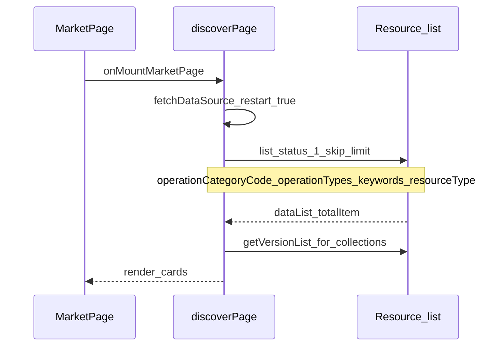
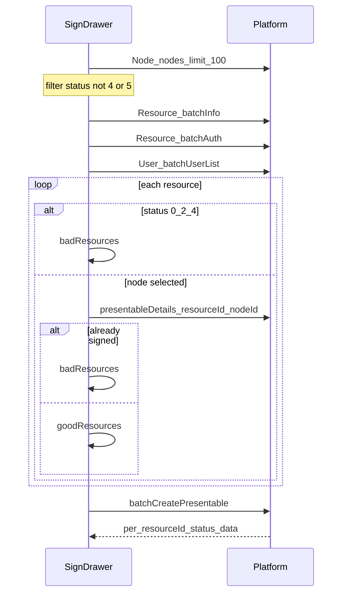
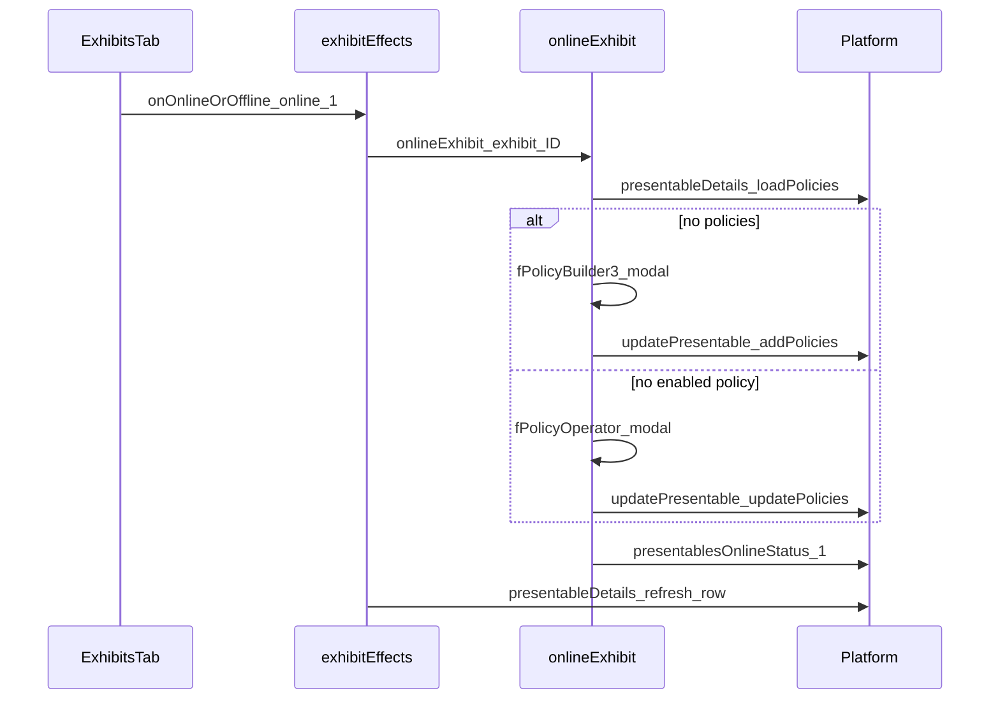

# Console 源码证据与调用链（完整）

> 文档角色：Console 侧 API 与调用链证据。**§A 资源域**（一期）+ **§B 节点域**（二期）+ **§C 测试对照**（QA 并排）自洽摘要；细粒度 resource 拓扑在仓库 `docs/新方案/对齐/`（本目录不修改）。

最后更新：2026-08-20

---

## A. 资源域（一期 · 已实现）

### A.1 页面与 Model

| 场景 | Console 路径 | 主要 API |
|---|---|---|
| 首发 Step1–4 | `pages/resource/creator/` | `Resource.create`, `createVersion` |
| 维护侧栏 | `pages/resource/sidebar/` | `Resource.update`, `createVersion`, online |
| 新发版 | `pages/resource/versionCreator/` | `createVersion` |
| 合集 | `pages/resource/collectionSidebar/` | catalogue draft, `collection publish` |
| API | `@freelog/tools-lib/.../resources.ts` | |

### A.2 关键调用链（发行）

```text
Step2/versionCreator → upload → SHA1 → createVersion
sidebar Sider → resourceOnline（严格门禁）→ status:1
sidebar → dep 签约 → batchSetContracts / dep auth 等价
```

能力 ID：R/V/D/P/C，见 [04 §3–§6](./04-能力矩阵与验收.md)。

**测试：** 一期资源 CORE 的 Console 并排见仓库 `docs/新方案/对齐/`（本目录不修改）。二期 NM 并排见 [05 §C](./05-Console源码证据与调用链.md#c-测试人员-console-对照nm-core)。

### A.3 与二期交界的三条链

| 链 | 一期 CLI | Console | 二期衔接 |
|---|---|---|---|
| **资源进市场** | `online --yes` → `Resource.status=1` | `resourceSidebar` Sider → `resourceOnline` | `market search/show` 仅见 status=1 |
| **两条签约** | `dep auth`（作者签依赖） | sidebar dep 微应用 | **≠** `node exhibit sign`（节点主签市场资源） |
| **policy → 展品上架** | `policy apply/set` → 资源侧启用策略 | sidebar policy | 展品 `onlineExhibit` 亦须 presentable 至少一条 **status=1** policy；CLI 无 TTY 弹窗 → code 4 |

```text
J-05 完整路径：
  publish → policy apply → online（一期，A.2）
  → market show 确认 status=1（可选，同账号自有资源）
  → node exhibit sign → exhibit online（二期，B.5）
```

---

## B. 节点 · 市场 · 展品域（二期 · 规划）

### B.1 工作区约定

| 项 | 路径 |
|---|---|
| **Console 包** | `D:/appinside/freelogfe-web-repos/packages/console` |
| **tools-lib** | `D:/appinside/freelogfe-web-repos/packages/@freelog/tools-lib` |
| **环境变量** | `FREELOG_CONSOLE_ROOT` → 指向 `packages/console` |
| **相对路径** | 下文「Console 相对路径」= `packages/console/src/` 下路径 |

---

### B.2 tools-lib API（L5 真源）

| API | 文件 | HTTP | CLI 用途 |
|---|---|---|---|
| `Resource.list` | `service-API/resources.ts` | GET `/v2/resources` | `market search` |
| `Resource.info` | 同上 | GET `/v2/resources/:id` | `market show` |
| `Resource.batchInfo` | 同上 | GET `/v2/resources/list` | sign preflight |
| `Resource.batchAuth` | 同上 | GET `/v2/auths/resources/batchAuth/results` | sign preflight |
| `Operation.operationCategories` | `service-API/operation.ts` | GET | market 分类 |
| `Node.nodes` | `service-API/nodes.ts` | GET `/v2/nodes` | `node list`、签约选节点 |
| `Node.details` | 同上 | GET `/v2/nodes/:id` | `node show`、owner 门禁 |
| `User.batchUserList` | `service-API/users.ts` | GET `/v2/users/list` | owner 冻结检查 |
| `Exhibit.batchCreatePresentable` | `service-API/presentables.ts` L349 | POST `/v2/presentables/createPresentableBatchEasy` | `exhibit sign` |
| `Exhibit.presentableDetails` | 同上 | GET `/v2/presentables/detail` 等 | 去重、反查 presentableId |
| `Exhibit.presentables` | 同上 | GET `/v2/presentables` | `exhibit list` |
| `Exhibit.presentablesOnlineStatus` | 同上 | PUT `/v2/presentables/:id/onlineStatus` | online/offline |
| `Exhibit.batchUpdatePresentableStatus` | 同上 L385 | PUT `/v2/presentables/updatePresentableOnlineStatusBatch` | Console 批量（CLI 2.1） |
| `Exhibit.updatePresentable` | 同上 | PUT `/v2/presentables/:id` | Console policy 补全（CLI OUT 可视化） |
| `Contract.contracts` | `service-API/contracts.ts` | GET | `node contract list`（可选） |

**通用响应：** `{ ret, errCode, msg, data? }`；成功 = `ret === 0 && errCode === 0`。

---

### B.3 Console 页面与 Model 目录

#### B.3.1 发现 / 市场

| 路由 | 页面 | Model |
|---|---|---|
| `/discover` → market tab | `pages/discover/market/index.tsx` | `models/discoverPage.ts` |
| 运营分类筛选 | `components/FOperationCategoryFilter/` | discoverPage |
| 资源卡片 | `components/FResourceCard/` | — |

#### B.3.2 签约至节点

| 组件 | 路径 | 说明 |
|---|---|---|
| Drawer 入口 | `components/fSignResourceToNode/index.tsx` | imperative API |
| Drawer 实现 | `components/fSignResourceToNode/FSignResourceToNodeDrawer/index.tsx` | preflight + batchCreate |
| MicroApp 签约 | `components/FMicroApp_SignResourceToNode_3/` | **不对齐** CLI |

#### B.3.3 正式节点管理

| Tab | 页面 | Effect |
|---|---|---|
| exhibit | `pages/node/formal/$id/Exhibits/index.tsx` | `models/nodeManagerPage/exhibitEffects.ts` |
| theme | `pages/node/formal/$id/Themes/index.tsx` | `models/nodeManagerPage/themeEffects.ts` |
| contract | Contracts 页 | `models/nodeManager_Contract_Page.ts` |
| setting | Setting 页 | settingEffects（**OUT** CLI 写） |
| 门禁 / 详情 | `pages/node/formal/$id/index.tsx` | `models/nodeManagerPage/pageEffects.ts` |

#### B.3.4 全局节点列表

| 用途 | Model | API |
|---|---|---|
| 顶栏 / dashboard 节点 | `models/nodes.ts` | `Node.nodes({ limit: 100 })` |
| Dashboard 聚合 | `models/dashboardPage.ts` | 同上 |

#### B.3.5 测试节点（OUT）

| 路径 | API 域 |
|---|---|
| `pages/node/informal/` | `InformalNode.*` |

---

### B.4 NM 能力 → 证据快速查表

| ID | Console 业务 | Console 相对路径 | Model / 函数（行号） | API |
|---|---|---|---|---|
| NM-01 | 市场列表 | `pages/discover/market/index.tsx` | `models/discoverPage.ts` · `fetchDataSource` L222–280 | `Resource.list` |
| NM-02 | 市场详情 | `pages/resource/details/` | — | `Resource.info` |
| NM-03 | 节点列表 | Drawer / dashboard | `models/nodes.ts` · `fetchNodes` | `Node.nodes` |
| NM-04 | 节点详情门禁 | `pages/node/formal/$id/index.tsx` | `pageEffects.ts` · `onMount_Page` L14–60 | `Node.details` |
| NM-05~07 | 节点 CRUD | `pages/node/creator/`, Setting | — | **OUT** |
| NM-08 | 签约至节点 | `components/fSignResourceToNode/FSignResourceToNodeDrawer/index.tsx` | `handleResource` L143–240；confirm L318–341 | `batchCreatePresentable` |
| NM-09 | 展品列表 | `pages/node/formal/$id/Exhibits/index.tsx` | `exhibitEffects.ts` · `fetchExhibits` L158–212 | `presentables` |
| NM-10 | 展品详情 | `pages/node/exhibit/formal/$id/` | — | `presentableDetails`（2.1） |
| NM-11 | 展品上架 | Exhibits FSwitch | `exhibitEffects.onOnlineOrOffline` L95–111 → `utils/nodeTools.tsx` · `onlineExhibit` L20–157 | `presentablesOnlineStatus(1)` |
| NM-12 | 展品下架 | 同上 | `onOnlineOrOffline` offline L112–117 | `presentablesOnlineStatus(0)` |
| NM-13 | 换版 | Exhibits 版本 UI | — | `presentablesVersion`（2.1） |
| NM-14~15 | 主题 | `pages/node/formal/$id/Themes/` | `themeEffects.ts` | **OUT** activate |
| NM-16 | 合约列表 | Contracts tab | `nodeManager_Contract_Page.ts` | `Contract.contracts` |
| NM-23 | MicroApp 签约 | `components/FMicroApp_SignResourceToNode_3/` | — | **OUT** |

---

### B.5 调用链

#### B.5.1 市场列表（NM-01）



**关键参数（`discoverPage.ts` L244–254）：**

```typescript
{
  skip, limit: pageSize,
  keywords: discoverPage.inputText,
  resourceType: discoverPage.resourceType === '-1' ? undefined : discoverPage.resourceType,
  status: 1,
  operationCategoryCode: deepestSelectedCategory,
  operationTypes: discoverPage.filterSelected,  // '4,5' | '5' | '3,4,5'
}
```

#### B.5.2 签约至节点（NM-08）



**batchCreate 请求（Drawer L318–326）：**

```typescript
{
  nodeId: number,
  resources: [{ resourceId, policyId?: string }]  // 无 policyId → 平台默认永久免费
}
```

**CLI 差异（见 [07-Q1](./07-开放问题与设计裁决.md#21-q1--sign-成功后如何得到-presentableid)）：** 成功后 `presentableDetails` 反查 `presentableId`。

**`handleResource` 关键逻辑（L143–221）：**

- `Resource.batchInfo` → `batchAuth` → `User.batchUserList`
- `ownerFreeze`：`batchUserList.status === 1`（L181–184）→ warning `ownerFreeze`（L197）
- `authException`：`!isAuth`（L177–180）→ warning `authException`（L197）
- `status` 0/2/4 → `badResources`（未发行/封禁/未上架）
- 已选 node 时 `presentableDetails({ resourceId, nodeId })` 查重复（L223+）

**`onOk` / batch 响应（L26–35 props；L318–341 confirm）：**

```typescript
resultData: { [resourceID: string]: { status: 1 | 2; data: string } }
```

UI 跳转节点页，**未稳定**将 `data` 当作 CLI 所需 `presentableId` → CLI 必须反查（Q1）。

#### B.5.3 展品上架（NM-11）



**CLI 差异：** 无 TTY 弹窗；preflight 无启用 policy → **code 4** + hint（见 [07-Q3](./07-开放问题与设计裁决.md#23-q3--批量上架与-policy)）。

**下架（NM-12）：** `exhibitEffects.onOnlineOrOffline` offline 分支直接 `presentablesOnlineStatus({ onlineStatus: 0 })`，无 policy 链。

#### B.5.4 展品列表（NM-09）

**`exhibitEffects.fetchExhibits`（L199–212）核心参数：**

```typescript
{
  nodeId,
  skip, limit: pageSize,
  keywords?: string,
  onlineStatus: Number(exhibit_SelectedStatus),  // 0 | 1 | 2(全部)
  resourceType?, resourceTypeCode?,
  omitResourceType: '主题',
  isLoadPolicyInfo: 1,
  isLoadResourceDetailInfo: 1,
  isLoadVersionProperty: 1,
  isLoadVersionUpdateTip: 1,
}
```

#### B.5.5 节点门禁（NM-04）

**`pageEffects.onMount_Page` 检查顺序（摘要）：**

1. `Node.details({ nodeId })`
2. `ownerUserId !== currentUser` → 403
3. `status === -1` → 已删除
4. `(status & 4) === 4` → 冻结

---

### B.6 刻意不对齐

| 路径 | 理由 |
|---|---|
| `FMicroApp_SignResourceToNode_3` | qiankun 嵌入；非 Drawer API 链 |
| `InformalNode.*` / `informalNodeManagerPage` | 测试节点独立 API |
| `Payment.*` / Income tab | 合规 + 强 UI |
| `fPolicyBuilder3` / `fPolicyOperator` | 可视化策略；CLI handoff 或一期 `policy apply` |
| `themeEffects.onActive` | 整站 `nodeThemeId`；Console 确认流 |
| `Node.create` / `setNodeInfo` / `deleteNode` | 节点壳重量级配置 |

**已知 EQUIVALENT / 刻意差异登记册：** 见 [12 §5 PARITY 债务](./12-多视角设计说明.md#5-parity-债务登记册)（避免与本表重复维护）。

---

### B.7 与外部文档关系（评审后合并）

| 外部文档 | 二期对应 | 当前状态 |
|---|---|---|
| [Console源码证据索引](../对齐/Console源码证据索引.md) | 本文 §A–§B | **未修改**；合并时增节点域章节 |
| [CLI数据操作与Console对照](../对齐/CLI数据操作与Console对照.md) | [04-能力矩阵](./04-能力矩阵与验收.md) NM 表 | **未修改**；合并时增 §9 |
| [CLI拓扑与Console对照](../对齐/CLI拓扑与Console对照.md) | 本文 B.5 mermaid | **未修改** |
| [02-平台业务分析](./02-平台业务分析.md) | 业务语义 |
| [03-CLI命令与架构设计](./03-CLI命令与架构设计.md) | CLI 命令映射 |

---

### B.8 参考 commit

| 项 | 值 |
|---|---|
| 证据快照日期 | 2026-08-20 |
| Console commit | `d74121e647f0223203f1f0bb317354b4191266f1` |
| 仓库路径 | `D:/appinside/freelogfe-web-repos/packages/console` |
| 复核命令 | `git -C packages/console rev-parse HEAD` |

实现与 L4 报告须记录 **当时** Console commit；与对齐文档一期快照 commit 一致。

---

## C. 测试人员 Console 对照（NM CORE）

> 用途：QA **并排验证**（[12 §4](./12-多视角设计说明.md#4-测试视角) 层 C）。实现前用 A 层评审；dev smoke 用 B 层；**宣称 PARITY 必须完成 C 层**。

### C.1 CORE 追溯矩阵

| 测试 ID | 能力 | Console 相对路径 | Console 操作步骤 | Console 可观察结果 | Network / API | CLI 命令 | CLI 断言 | 备注 |
|---|---|---|---|---|---|---|---|---|
| T-NM-S1 | NM-01 | `models/discoverPage.ts` | 发现页 → 市场 Tab | 列表仅已上架资源 | `Resource.list` `status:1` | `market search --limit 5 --json` | `ok:true`；`items[].resourceId` | L244–254 |
| T-NM-S2 | NM-02 | `pages/resource/details/` | 点击资源卡片 | 可点「签约至节点」 | `Resource.info` | `market show <rid> --json` | `status===1`；blockers 空 | |
| T-NM-S3 | NM-04 | `models/nodeManagerPage/pageEffects.ts` | 进入节点管理 | owner/冻结拦截 | `Node.details` | `node show <nodeId> --json` | owner；`frozen===false` | L48–60 |
| T-NM-S4 | NM-08 | `FSignResourceToNodeDrawer/index.tsx` | Drawer 预检，不提交 | 黄标 warning 或 pass | 未 POST create | `exhibit sign --dry-run ...` | checks pass/warn | L143–221 |
| T-NM-S5 | NM-08 | 同上 | 确认签约 | 展品 Tab 新行 | `batchCreatePresentable` | `exhibit sign --yes ...` | `presentableId` 非空 | L318–341；反查 Q1 |
| T-NM-S6 | NM-11 | `utils/nodeTools.tsx` | 展品 Tab 上架 | 行在线 | `presentablesOnlineStatus` `1` | `exhibit online <pid> --yes` | `onlineStatus===1` | L44–157 |
| T-NM-S7 | NM-09 | `exhibitEffects.ts` | 展品 Tab 筛在线 | 含 S5 presentable | `presentables` | `exhibit list --node ...` | 含 pid；在线 | L199–212 |
| T-NM-S8 | NM-12 | `exhibitEffects.ts` | 展品 Tab 下架 | 行离线 | `presentablesOnlineStatus` `0` | `exhibit offline <pid> --yes` | `onlineStatus===0` | L112–117 |
| T-NM-N1 | NM-04 | `pageEffects.ts` | 账号 B 打开节点 | 403 | — | 账号 B sign/show | **code 2** | optional |
| T-NM-N2 | NM-04 | Setting | 冻结节点 | 管理页拦截 | `status & 4` | sign/show | **code 2** | optional fixture |
| T-NM-N3 | NM-08 | Drawer | 重复 sign | 已存在提示 | 业务码 | 重复 sign | **code 4** | |
| T-NM-N4 | NM-11 | `nodeTools.tsx` | 无 policy 点上架 | policy 弹窗 | 未 online | `exhibit online` | **code 4** + hint | smoke 建议纳入 |
| T-H5 | NM-08 | 合约/收银 | 付费 policy sign | 跳转 Console | Payment | sign | **code 5** + nextCommand | 人工 |

### C.2 并排验证记录模板（单能力）

| 字段 | 填写 |
|---|---|
| 能力 ID | NM-__ |
| 测试 ID | T-NM-__ |
| Console 路径 | `packages/console/src/...` |
| Console commit | `git rev-parse HEAD` |
| CLI 版本 | `freelog-cli --version` |
| 输入 | nodeId / resourceId / presentableId |
| Console 结果 | （截图或 API 响应摘要） |
| CLI JSON | （`--json` 输出路径） |
| 结论 | □一致 □可接受差异 □缺陷 |

### C.3 与 smoke / 旅程映射

| 来源 | 映射 |
|---|---|
| [04 §9](./04-能力矩阵与验收.md#9-二期-mvp-验收链verifyexhibit-smoke--规划) S1–S8 | T-NM-S1~S8 |
| [10-L4验收模板](./10-L4验收模板.md) | 每步增「Console 并排」列 |
| [11 J-05/J-06](./11-完整用户旅程.md) | 用户路径 ↔ T-NM-S* |
| [12 §4](./12-多视角设计说明.md#4-测试视角) | 验收三层 A/B/C |

### C.4 刻意不要求 Console 等价

| 项 | CLI 行为 | 测试期望 |
|---|---|---|
| authException / ownerFreeze warning | 默认 warn；`--strict` → code 4 | 记录 warn 文案即可，不要求 UI 黄标 |
| 批量 exhibit online | 2.0 不做 | 不测 bulk parity |
| MicroApp 签约 | OUT | 不测 FMicroApp 路径 |
