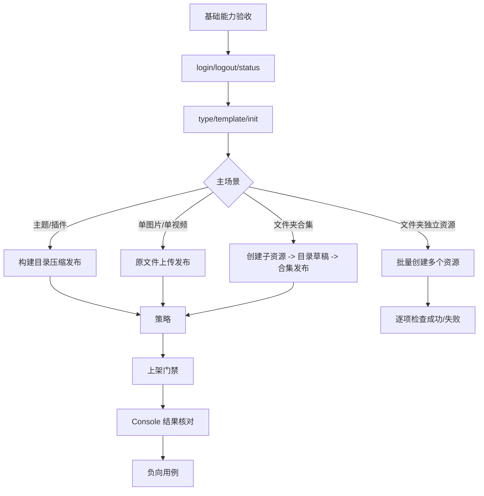

# 产品与测试简明说明

最后更新：2026-08-05

本文面向产品经理和测试人员，只描述用户目标、业务边界和验收重点。具体字段以 [CLI字段账本](./CLI字段账本.md) 为准，具体命令以 [CLI使用说明与Console差异](./CLI使用说明与Console差异.md) 为准。

## 1. 产品目标

Freelog Runtime CLI 要解决的问题：用户不打开 Console UI，也能完成资源创建、发版、策略、上下架、合集目录管理和批量资源发行。

目标用户：

1. 主题 React 项目开发者。
2. 插件 Vue 项目开发者。
3. 图片资源作者。
4. 视频资源作者。
5. 图片/视频合集作者。
6. 需要脚本化发行资源的测试或运营人员。

非目标：

1. 不替代 Console 的可视化编辑体验。
2. 不做策略 Builder。
3. 不做支付流程。
4. 不做视频转码。
5. 不改浏览器端项目。

## 2. 核心规则

| 规则 | 说明 |
|---|---|
| login | 建立当前环境的用户凭据，是所有写命令前提 |
| logout | 清理登录凭据，不删除任何项目文件 |
| status | 只读诊断环境、登录态、owner、平台状态、同步和草稿建议 |
| pull | 显式同步平台事实；只有 `--apply-listing` 才写 manifest |
| create | 只创建资源壳，不发布版本、不添加策略、不上架 |
| publish | 创建正式版本；可以没有策略 |
| policy | 新增策略或启停策略；不修改已有策略正文/名称 |
| online | 必须有 latestVersion 和至少一条启用策略 |
| manifest | 用户意图，可提交 git |
| state | 平台事实，不提交 git，绑定环境 |
| Console 对齐 | 对齐平台最终状态，不复制页面交互 |

## 3. 基础流程验收

流程：

```text
login -> status -> type/template -> init -> create -> publish -> policy -> online -> status/pull
```



验收：

1. `login --env dev` 能登录 dev 环境并保存凭据。
2. `logout --env dev` 能清理凭据，且不删除 manifest/state。
3. `status` 未登录也能显示当前环境；登录后能显示账号。
4. 登录环境与当前命令环境不一致时，写命令失败。
5. `--json` 输出结构稳定，失败包含 `code/message/hint`。
6. `--debug` 输出必须脱敏 token、password、cookie、authorization。
7. `type search/info` 能作为选择资源类型前置步骤。
8. `template list` 能作为创建主题/插件项目前置步骤。
9. `pull` 默认不覆盖 manifest；`pull --apply-listing` 才采用平台 listing。

## 4. 主流程验收

### 4.1 主题/插件项目

流程：

```text
template list -> init -> build -> create -> version set -> publish -> policy apply -> online
```

验收：

1. 模板列表能显示 runtime 0.5 模板。
2. `init` 能创建新模板项目，也能接入已有项目。
3. 主题/插件发布时构建目录被压缩为 zip。
4. Console 能看到资源、版本、策略、上架状态。
5. 无策略时 `publish` 可成功，但 `online` 必须失败。

### 4.2 单图片/单视频

流程：

```text
init -> create -> version set --file <file> -> publish -> policy apply -> online
```

验收：

1. 图片/视频按原文件上传，不压缩。
2. 格式和大小遵循平台资源类型限制。
3. 视频封面通过 `version set --video-cover` 传入版本字段。
4. CLI 不做转码；预览通过资源详情页链接确认。

### 4.3 文件夹批量独立资源

流程：

```text
resource import-dir <dir> --resource-type <typeCode>
resource import-dir <dir> --config freelog.batch.json
```

验收：

1. 每个文件成为一个独立资源。
2. 零配置模式可按文件名生成资源名和标题。
3. 声明式配置能逐项覆盖标题、简介、封面、标签、策略、版本说明等。
4. 部分失败时成功项可追踪，不出现“全局成功但数据丢失”。

### 4.4 文件夹合集

流程：

```text
collection create
collection item import-dir <dir>
collection publish
collection policy apply
online
```

验收：

1. 合集不是上传整个文件夹。
2. 每个文件先成为独立子资源。
3. 子资源必须发布、添加启用策略并上架后才能加入合集。
4. `collection item *` 修改目录草稿。
5. `collection publish` 合并目录草稿为正式合集版本。
6. 合集自身也必须添加启用策略后才能上架。

## 5. 更新流程验收

| 场景 | 命令 | 预期 |
|---|---|---|
| 更新标题/简介/封面/标签 | `update` / `collection update` | Console listing 可见一致 |
| 发布新版本 | `version set` + `publish` | latestVersion 推进 |
| 修改已发布版本说明 | `version edit` | 版本文件不变，说明更新 |
| 单品发版表单草稿 | `draft push/pull/discard` | 显式同步版本号、文件信息、版本说明、依赖、属性、视频封面，不后台保存 |
| 合集发版表单草稿 | `draft push/pull/discard --collection` | 显式同步合集发布说明、展示设置、依赖、属性，不修改目录草稿 |
| 合集目录草稿 | `collection item *` | 维护目录项，`collection publish` 才合并为正式合集版本 |
| 合集发布说明 | `collection version set --description` | 只改下一次合集 publish 描述 |
| 策略启停 | `policy set <policyId> <0|1>` | 平台策略状态变化 |
| 上下架 | `online/offline` | 门禁和状态正确 |
| Console listing 协作 | `status` + `pull --apply-listing` | 能发现差异和处理冲突 |

草稿验收重点：

1. `version set` 不应自动写平台草稿。
2. `draft push` 后 Console 发版页能看到草稿字段。
3. `draft pull` 后 manifest 能得到远端草稿字段；单品本地 `filePath` 不应被远端 `filename` 覆盖丢失。
4. `draft discard` 后 Console 发版页不再有对应发版表单草稿。
5. `draft discard --collection` 不应删除合集目录草稿。
6. `collection item remove/reorder/update` 不应影响合集发版表单草稿。
7. 本地和 Console 同时改草稿时，CLI 必须提示冲突，不能静默覆盖。

## 6. 必测负向用例

| 用例 | 预期 |
|---|---|
| 未登录执行写命令 | 失败，提示登录 |
| 登录 dev 后用 prod/test 执行写命令 | 失败，提示凭据环境不一致 |
| 当前账号不是资源 owner | 失败 |
| 没有正式版本直接 online | 失败 |
| 没有启用策略直接 online | 失败 |
| 已上架且只有一条启用策略时停用该策略 | 失败 |
| 同一目录 dev state 下用 test/prod 命令 | 失败，提示环境不一致 |
| 主题/插件 filePath 指向普通文件 | 失败，要求构建目录 |
| 图片/视频 filePath 指向目录且无 filename | 失败 |
| `policy apply` 用 policyId 试图修改已有策略 | 不支持 |
| 批量配置缺 `filePath` | 失败，指出具体 item |
| 合集子资源无策略或未上架 | 阻断加入或发布 |
| 远端已有草稿且本地从未同步时 `draft push` | 失败，提示先 pull 或 force |
| 合集只改目录后执行 `draft push --collection` | 不应把目录草稿当成发版表单草稿保存 |

## 7. Console 差异是否合理

| 差异 | 是否合理 | 原因 |
|---|---|---|
| CLI 拆命令，不做四步向导 | 合理 | 命令行需要可重试、可脚本化 |
| CLI 不防抖保存草稿 | 合理 | 后台写远端会让 CI 和脚本不可预测 |
| CLI 不内置策略 Builder | 合理 | 当前稳定接口接收最终策略文本 |
| CLI 不做付费授权 | 合理 | 支付需要明确人机确认 |
| CLI 严格 online | 合理 | 防止缺版本或缺策略的资源被上架 |
| CLI 支持本地封面上传 | 必须 | 没有 UI 也应能完成封面字段 |
| CLI 支持批量配置 | 必须 | 图片/视频作者需要逐项元数据 |

## 8. 验收通过标准

1. 基础能力跑通：login、logout、status、type、template、init、pull。
2. 四类主场景跑通：主题/插件、单文件、文件夹独立资源、文件夹合集。
3. Console 中看到的资源基础信息、版本、策略、状态、合集目录与 CLI 操作结果一致。
4. 关键负向用例都有明确失败信息。
5. 非交互命令支持 `--yes --json`。
6. 跨环境、凭据环境和 owner 保护有效。
7. `pnpm verify` 通过。
