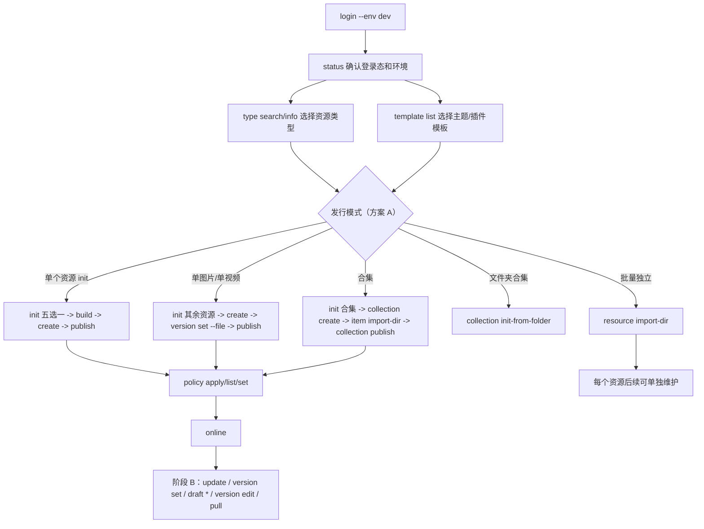

# CLI 使用说明与 Console 差异

> 文档角色：当前版本的派生使用说明；不定义产品范围、字段或完成状态。发生冲突时以仓库根目录 [DESIGN.md](../../../DESIGN.md) 和当前 `--help` 为准。

最后更新：2026-08-11

本文面向 CLI 使用者和测试人员。

**核心原则：** CLI 以本地工程为工作面，对齐产品范围内的平台业务语义，不复制 Console UI；模板、构建、压缩、Git/CI 和批量恢复属于 CLI 原生能力。产品定义见根目录 [DESIGN.md](../../../DESIGN.md)，Console 证据见 [CLI数据操作与Console对照](../对齐/CLI数据操作与Console对照.md)。

**方案 A — 发行模式由命令区分，init 仅五选一：**

```text
发行单个资源  →  init <dir>（五选一）→ create → …
批量发行      →  resource import-dir
发行合集      →  init 选「合集」→ collection create → …
文件夹→合集   →  collection init-from-folder（不经过 init）
```

## 1. 基本流程

### 国际化

CLI 与 Console 共用 OSS i18n（`FI18n`），但**展示方式不同**：

| | Console | CLI |
|---|---|---|
| API | `FI18n.i18nNext.tAuto()` | `t()`（`packages/cli/src/i18n`） |
| 富文本 | `html-react-parser` → **React 节点**（链接、换行、样式） | **纯文本**（strip HTML，链接保留可见文字） |
| 语言 | 浏览器 Cookie `locale` | 见下表 |

**切换语言（优先级从高到低）：**

1. 命令行 `--lang en_US`（仅当次会话，任意位置：`freelog-cli --lang en_US publish` 或 `freelog-cli publish --lang en_US`）
2. 环境变量 `FREELOG_LANG=en_US`
3. 持久化：`freelog-cli lang set en_US` → 写入 `~/.freelog-cli/settings.json`
4. 默认 `zh_CN`

```bash
freelog-cli lang show              # 当前 / 持久化 / 环境变量
freelog-cli lang set en_US         # 持久化英文
freelog-cli --lang en_US publish --yes --env dev   # 仅本次英文
```

所有场景都从这条流程展开：

```text
# 阶段 A · 创建/首版
login -> status -> init -> create -> version set -> publish -> policy -> online

# 阶段 B · sidebar 维护（已有 resourceId）
update（info）/ version set + draft * + publish（发新版）/ version edit（改说明）/ pull / online|offline
```



基础命令：

```bash
# 工作区登录（在当前目录写入 .freelog-auth，子目录继承）
freelog-cli login --env dev

# 全局登录（写入 ~/.freelog-auth，无工作区凭据时使用）
freelog-cli login --global --env dev

freelog-cli status --env dev
freelog-cli logout --env dev          # 清除当前上下文命中的凭据
freelog-cli logout --global --env dev # 仅清除全局凭据
```

非交互登录：

```bash
freelog-cli login --env dev --login-name "$env:FREELOG_TEST_LOGIN_NAME" --password "$env:FREELOG_TEST_PASSWORD" --yes
freelog-cli login --global --env dev --login-name "..." --password "..." --yes
```

### 登录与多账号

CLI 有两层身份凭据（详见 [DESIGN.md](../../../DESIGN.md)「身份与凭据」）：

| 层级 | 文件 | 何时使用 |
|---|---|---|
| **工作区** | 目录树中的 `.freelog-auth` | 自当前 `--cwd` **向上**查找，**就近第一份**生效 |
| **全局** | `~/.freelog-auth` | 向上找遍仍未命中时使用 |

典型场景：

```text
monorepo/.freelog-auth              ← 团队账号
monorepo/packages/theme-a/        ← 在此操作 → 团队账号
monorepo/packages/theme-b/.freelog-auth  ← 个人账号（覆盖祖先）
monorepo/packages/theme-b/          ← 在此操作 → 个人账号
任意无祖先凭据的目录                 ← 回退 ~/.freelog-auth
```

说明：

1. 测试和联调必须显式传 `--env dev`，避免默认走生产环境。
2. **`login`（默认）** 在当前目录写入 `.freelog-auth`；**`login --global` / `-g`** 写入用户主目录。
3. 凭据绑定环境；写操作时 `auth.environment` 与 `--env` 不一致会失败。
4. **`logout`（默认）** 删除当前上下文解析到的那份凭据；**`logout -g`** 只删全局，不动目录树里的工作区凭据。
5. **`status`** 展示：已登录账号、凭据来源（工作区/全局）、资源 owner、二者是否一致（✅/❌）。
6. **交互式写命令** 执行前会一行提示 `当前登录: …（…，工作区凭据|全局凭据）`；`--json` 模式不打印该行，但 JSON 含 `auth.scope`。
7. `logout` 不删除 manifest/state。
8. 写命令需要登录；owner 不匹配时报错并给出 owner 与 current。
9. 脚本/CI 使用 `--yes --json`；失败时读取 JSON 里的 `code/message/hint`。
10. `.freelog-auth` 必须 gitignore，不得提交仓库。

常用全局参数：

| 参数 | 用途 |
|---|---|
| `--env dev` | 指定环境 |
| `--cwd <dir>` | 指定项目目录（**凭据解析也以此为起点**） |
| `--yes` | 非交互确认 |
| `--json` | 机器可读输出 |
| `--debug` | 脱敏调试信息 |

## 2. 准备

查看类型：

```bash
freelog-cli type search 主题 --env dev
freelog-cli type search 图片 --env dev
freelog-cli type info <typeCode> --env dev
```

查看模板：

```bash
freelog-cli template list --env dev
freelog-cli template list --scaffold runtime --runtime 0.5 --env dev
```

显式同步：

```bash
freelog-cli pull --env dev
freelog-cli pull --apply-listing --env dev
```

`pull` 默认只刷新平台事实缓存；只有 `--apply-listing` 才把平台标题、简介、封面、标签写回 manifest。

最小免费策略文件 `policy.free.json`：

```json
{
  "policyName": "免费",
  "policyText": "for public\r\n\r\ninitial[active]:\r\nterminate\r\n",
  "status": 1
}
```

`policyText` 必须是平台策略解析器能接受的最终文本。`policy apply` 会在提交 `Resource.update.addPolicies` 前做编码；批量创建里的 `policies.policyText` 按 Console 批量创建口径直接传最终文本。

## 3. Console 对齐状态

**逐项契约见 [Console–CLI 业务能力契约](../对齐/CLI数据操作与Console对照.md)**。该矩阵使用稳定业务 ID，并将范围、对齐方式和证据分开记录。

**结论：** 本地文件发行主链已经具备字段级 Console 契约和 PropertyParser 属性解析；每项是否完成以能力矩阵中的 `SPEC / CODE / CONTRACT / ENV` 证据为准。CLI 原生的模板、压缩和批量恢复不计入 Console parity 分母，但必须满足相同的资源类型、owner、授权和平台状态门禁。

不在范围：云存储浏览器、付费收银台和消费侧 UI。RSS、collect-rules 已纳入 `ADVANCED + PARITY`，对齐标准与核心能力相同。

## 4. 本地文件

| 文件 | 作用 | 是否提交 |
|---|---|---|
| `freelog.manifest.json` | 用户意图：资源名、类型、标题、下一版文件、合集展示等 | 是 |
| `.freelog/state.json` | 平台事实缓存：resourceId、owner、status、latestVersion、policies、draftSync 等 | 否 |

manifest 不绑定环境；state 绑定环境。同一目录 dev state 下用 test/prod 执行会失败，避免串资源。

## 5. 主题或插件项目发布

已有项目：

```bash
cd my-react-theme
pnpm build
freelog-cli init . --scaffold none --resource-type <themeCode> --artifact-mode directory-zip --runtime 0.5 --yes --env dev
freelog-cli create --yes --env dev
freelog-cli version set --version 1.0.0 --file dist --runtime 0.5 --env dev
freelog-cli publish --yes --env dev
freelog-cli policy apply --from-file ./policy.free.json --yes --env dev
freelog-cli online --yes --env dev
```

通过模板新建（交互 init 五选一「主题」，或脚本传 API 查到的 code）：

```bash
freelog-cli init my-project --env dev             # 交互：主题 → 模板
# 或脚本：
freelog-cli init my-project --scaffold runtime --template vite-react-ts \
  --resource-type <themeCode> --runtime 0.5 --yes --env dev
cd my-project
pnpm build
freelog-cli create --yes --env dev
freelog-cli publish --yes --env dev
freelog-cli policy apply --from-file ./policy.free.json --yes --env dev
freelog-cli online --yes --env dev
```

说明：

1. `publish` 不执行构建命令，构建由项目自己负责。
2. 主题、插件、软件库发布时，`filePath` 指向构建目录，CLI 会压缩为临时 zip。
3. 如果 Console 创建时需要自定义类型名，CLI 用 `init --resource-type-name` 或 `create --type-name` 承接。

## 6. 单图片或单视频发布

```bash
mkdir photo-resource
cd photo-resource
freelog-cli init . --scaffold none --resource-type <imageCode> --artifact-mode file --yes --env dev
freelog-cli create --yes --env dev
freelog-cli version set --version 1.0.0 --file ../photo.png --env dev
freelog-cli publish --yes --env dev
freelog-cli policy apply --from-file ./policy.free.json --yes --env dev
freelog-cli online --yes --env dev
```

视频版本封面：

```bash
freelog-cli version set --video-cover ./video-cover.png --env dev
```

说明：

1. 图片、视频上传原文件，不压缩。
2. 文件格式、大小、本地上传能力按平台资源类型配置校验。
3. listing 封面用 `update --cover`；视频版本封面用 `version set --video-cover`。
4. **封面本地文件约束**（与 Console `FUploadCover` 一致；Console 另有裁剪 UI，CLI 须本地裁好再传）：
   - 格式：JPG / PNG / GIF（GIF 不能动画）
   - 大小：≤ 5MB
   - 尺寸：建议宽高 ≥ 800px（**仅建议，不作 CLI 校验**）
   - 校验失败时会输出与 Console 相同的提示文案（含 800px 建议）
5. CLI 不做视频转码，也不做命令行内播放预览；预览通过资源详情页链接验证。

## 7. 文件夹发布为多个独立资源

零配置（**方案 A：不经过 init 五选一**）：

```bash
freelog-cli resource import-dir ./photos --resource-type <imageCode> --title-prefix "照片 " --yes --env dev
```

声明式配置 `photos/freelog.batch.json`：

```json
{
  "defaults": {
    "resourceTypeCode": "<imageCode>",
    "version": "1.0.0",
    "policyFile": "policy.free.json",
    "tags": ["album"]
  },
  "items": [
    {
      "filePath": "a.png",
      "name": "photo-a",
      "resourceTitle": "图片 A",
      "description": "首版说明",
      "coverImages": ["cover-a.png"]
    }
  ]
}
```

执行：

```bash
freelog-cli resource import-dir ./photos --config freelog.batch.json --yes --env dev
```

说明：

1. 每个文件创建一个独立资源并发布首版。
2. `--config` 可省略，CLI 会自动发现目录内 `freelog.batch.json` 或 `freelog.batch.yaml`。
3. 成功项会生成子目录 manifest/state，后续可单独维护。
4. 每次运行写入 `.freelog/reports/<runId>.json`，并更新 `.freelog/reports/latest.json` 指针；部分失败不回滚成功项。
5. **批量 20 文件（与 Console creatorBatch 对齐）：** 默认超过 20 个文件时打印 Console 同源 warn 并**自动分多批** `createBatch`；若需与 Console UI 一样硬限，加 `--strict-batch-limit`。
6. **无策略仍发行：** 若部分资源未配置 `policies`，交互模式会弹出与 Console 相同的确认（`brr_resourcelisting_complete_confirm_msg`）；非交互须 `--yes`。

恢复命令：

```bash
# 从中断点或“远端成功、本地尚未写完”阶段继续
freelog-cli resource import-dir --resume .freelog/reports/<runId>.json --yes --env dev

# 只重新执行失败项
freelog-cli resource import-dir --retry .freelog/reports/<runId>.json --yes --env dev
```

恢复会核对环境、配置 fingerprint 和已登记输入文件 SHA1。`skipped` 单独统计，不计入 `passed`；若报告包含 `remote_outcome_unknown`，CLI 会停止自动恢复，要求先按授权名、版本和 owner 到 Console 对账。恢复只接受 `.freelog/reports/<runId>.json` 正式报告。

## 8. 文件夹作为合集

**快捷入口（方案 A，不经过 init 五选一）：**

```bash
freelog-cli collection init-from-folder --project-dir photo-album --media-dir ./photos --yes --env dev
```

交互时会依次：选合集类型 → 输入项目目录与媒体文件夹 → 创建合集 manifest → `collection create` → 导入子资源到目录草稿。

**分步命令链（与 Console collectionCreator 等价）：**

```bash
freelog-cli init photo-album --scaffold collection --resource-type <collectionCode> --yes --env dev
cd photo-album
freelog-cli collection create --yes --env dev
freelog-cli collection item import-dir ../photos --config ../photos/freelog.batch.json --yes --env dev
freelog-cli collection version set --description "首版合集" --env dev
freelog-cli collection publish --yes --env dev
freelog-cli collection policy apply --from-file ./policy.free.json --yes --env dev
freelog-cli online --yes --env dev
```

没有批量配置时：

```bash
freelog-cli collection item import-dir ../photos --resource-type <imageCode> --title-prefix "照片 " --item-policy-file ./policy.free.json --yes --env dev
```

说明：

1. 合集不是上传整个文件夹。
2. 文件夹合集 = 每个文件先变成独立子资源，再加入合集目录草稿。
3. 子资源策略可来自 `freelog.batch.json` 的 `policies/policyFile`，也可用 `--item-policy-file` 统一追加。
4. 子资源必须有正式版本、启用策略并能上架，才能加入合集。
5. `collection publish` 才把目录草稿合并成正式合集版本。
6. 合集自身也要策略才能 `online`。

## 9. 更新基础信息

独立资源：

```bash
freelog-cli update --title "新标题" --intro "介绍" --tags "tag1,tag2" --cover ./cover.png --env dev
```

合集：

```bash
freelog-cli collection update --title "新合集标题" --display-sort asc --display-view card --env dev
```

说明：

1. `update` 只改 listing，不改版本、策略、上下架状态。
2. `pull` 默认只刷新 state，不改 manifest。
3. 采用 Console listing 时执行：

```bash
freelog-cli pull --apply-listing --env dev
```

本地和平台相对上次同步都改过 listing 时会冲突；确认采用平台值再加 `--force`。

## 10. 发布新版本和草稿

独立资源新版本：

```bash
pnpm build
freelog-cli pull --env dev
freelog-cli version set --version 1.1.0 --description "新功能" --file dist --env dev
freelog-cli version set --clear-file --yes --env dev   # 清除文件意图（交互模式会确认）
freelog-cli publish --yes --env dev
```

修改已发布版本说明：

```bash
freelog-cli version edit --version 1.1.0 --description "修正文案" --env dev
```

独立资源发版表单草稿：

```bash
freelog-cli draft push --env dev
freelog-cli draft pull --env dev
freelog-cli draft discard --yes --env dev
```

合集发版表单草稿：

```bash
freelog-cli draft push --collection --env dev
freelog-cli draft pull --collection --env dev
freelog-cli draft discard --collection --yes --env dev
```

合集发布说明：

```bash
freelog-cli collection version set --description "新增目录项" --env dev
freelog-cli collection publish --yes --env dev
```

草稿规则：

1. CLI 不自动保存远端草稿；只有 `draft push` 才写平台发版表单草稿。
2. `draft pull` 会把远端发版表单草稿合并回 manifest；独立资源场景会保留本地 `filePath`。
3. `draft discard` 只删除平台发版表单草稿，不删除正式版本、策略、资源基础信息。
4. `draft push/pull/discard --collection` 管合集发版表单草稿，不管合集目录。
5. `collection item *` 管合集目录草稿，`collection publish` 才把目录草稿合并成正式合集版本。
6. 本地和远端草稿都有改动时，`draft push` 会失败；先 `draft pull` 合并，或确认后 `draft push --force --yes`。
7. 合集固定版本号，CLI 不允许设置合集版本号，只允许设置发布说明。

典型协作场景：

1. 一个人只用 CLI：`version set -> draft push` 可保存远端草稿，确认后 `publish`。
2. Console 已打开并产生草稿：先 `draft pull`，再本地调整，最后 `draft push` 或 `publish`。
3. 合集只改目录：用 `collection item add/update/reorder/remove`，不需要 `draft push --collection`。
4. 合集只改发布说明或依赖：用 `collection version set` 后 `draft push --collection` 或直接 `collection publish`。

## 11. 策略和上下架

独立资源策略：

```bash
freelog-cli policy apply --from-file ./policy.free.json --yes --env dev
freelog-cli policy list --env dev
freelog-cli policy set <policyId> --status 1 --env dev
freelog-cli policy set <policyId> --status 0 --env dev
```

合集策略：

```bash
freelog-cli collection policy apply --from-file ./policy.free.json --yes --env dev
freelog-cli collection policy list --env dev
freelog-cli collection policy set <policyId> --status 1 --env dev
```

上下架：

```bash
freelog-cli online --yes --env dev
freelog-cli offline --yes --env dev
```

规则：

1. 可以没有策略就 `publish`。
2. 不能没有 latestVersion 或启用策略就 `online`。
3. 已上架资源不能停用最后一条启用策略。
4. `offline` 只下架，不删除版本和策略。
5. **下架确认（与 Console 对齐）：** 交互模式 `offline` 会显示 `confirm_msg_remove_resource_from_auth` 原文；非交互须 `--yes`。
6. 策略全部下线时 `online` 报错，hint 会列出 `policy set <id> 1` 建议（≅ Console `fPolicyOperator`）。

## 12. 依赖授权

声明依赖：

```bash
freelog-cli dep add <dependencyResourceId> --version-range "*" --env dev
```

声明式免费策略签约 `auth-map.yaml`：

```yaml
contracts:
  - resourceId: <dependencyResourceId>
    policyIds:
      - <policyId>
```

执行：

```bash
freelog-cli dep auth --policy-map ./auth-map.yaml --yes --env dev
```

`dep auth` 会根据 manifest `subject` 自动选择独立资源或合集：独立资源读取 `version.dependencies`，合集读取 `collection.dependencies`，并在签约前执行对应的 owner/sync 门禁。

**自有资源作依赖也要签约**：即使依赖资源与当前工程同属一个登录账号，`dep auth` 仍须走与 Console dependency 页一致的 `batchSetContracts` 流程；不能因 owner 相同而跳过。

付费策略、不可验证策略、需要复杂人机确认的授权不在 CLI 内完成。CLI 会按当前 `--env` 和 subject 返回资源 sidebar 或 collectionSidebar 的依赖页、合约页链接，以及操作完成后应重新执行的 `nextCommand`；免费策略仍由 CLI 直接签约。自动化模式只输出 URL，不会自行打开浏览器。

## 13. 工程化与发版辅助（2026-08-10）

### 13.1 项目配置

```bash
freelog-cli config init --default-env dev   # 创建 .freelog/config.json + .freelogignore
freelog-cli config set --default-env dev     # 写入 defaultEnv
freelog-cli config show                     # 查看配置与当前生效 env
```

非交互 CI 可在项目根配置 `defaultEnv`，配合 `applyWriteCommandFlags` 自动加载，减少漏传 `--env`。

### 13.2 批量 import 忽略规则

在项目或 import 目录放置 `.freelogignore`（glob 风格，默认已忽略 `.DS_Store`、`Thumbs.db` 等）：

```gitignore
draft.*
*.tmp
```

### 13.3 策略与依赖模板

```bash
freelog-cli policy init              # 生成 policy.free.json（FOR PUBLIC）
freelog-cli policy init --collection # 合集语法
freelog-cli dep init-auth-map        # 生成 auth-map.yaml
```

### 13.4 monorepo

```bash
freelog-cli workspace list [--cwd 根目录] [--depth 5]
```

### 13.5 release 扩展

```bash
freelog-cli release --changelog-from-git --yes --env dev   # git log -1 → description
freelog-cli release --yes --env dev                        # 合集 cwd 时走 collection publish
```

合集 **不支持** `--bump`（平台固定版本）；可用 `collection version set --description`。

---

## 15. 特殊流程（与 Console 写法不同）

### 半路接入

Console 已建资源壳 → CLI **不能** `create` → 用 `bind`：

```bash
freelog-cli init . --scaffold none --resource-type <code> --artifact-mode <file|directory-zip> --resource-name <shortname> --yes --env dev
freelog-cli bind <resourceId> --env dev
freelog-cli status --env dev
```

### 换环境

```bash
freelog-cli login --env test --yes ...
del .freelog\state.json
freelog-cli bind <test环境 resourceId> --env test
```

### 批量 import 失败

查看错误里的 `details.reportFile`，使用 `resource import-dir --retry <reportFile>` 只重试失败项；进程中断或存在 `remote_succeeded_local_pending` 时使用 `--resume <reportFile>`。**勿整目录重跑。**

### 合集 RSS

`collection rss inspect <feedUrl>` → `send-code` → `bind --code --yes` → `status` → `sync`。超过 15 条单集必须同时提供 `--pub-start/--pub-end`；换源 GUID 大面积不匹配须显式 `--force --yes`。验证码来自 RSS owner 邮箱，不落盘。

RSS 合集的标题、封面、简介、更新状态、目录条目、展示设置、草稿和手工发布由 feed 管理，CLI 会拒绝对应写操作；标签仍可通过 `collection update --tags` 维护。

### 自动收录规则

`collection collect-rules get` 读取平台规则；`set --from-file rules.json` 提交完整规则。规则必须包含 `status`、`conditionType` 和至少一条 `filterConditions`，可包含 `serializeStatus`。`resourceTypeCode` 只支持 `EQUAL`；标题/授权标识支持四种文本运算符；匹配值分别最多 100/60 字。

## 16. 常见排错

| 现象 | 原因 | 处理 |
|---|---|---|
| `online` 失败 | 没有 latestVersion 或没有启用策略 | 先 `publish`，再添加或启用策略 |
| `publish` 版本冲突 | 版本号已存在或不大于 latestVersion | `version set --version <更高版本>` |
| `status` 看到 listing 差异 | Console 和本地 manifest 不一致 | `pull --apply-listing` 或保留本地后 `update` |
| `draft push` 冲突 | Console 或他人改过远端草稿 | `draft pull` 合并，或 `draft push --force --yes` |
| 跨环境失败 | state.env 与当前 `--env` 不一致 | 切回原环境，或确认后清理 state |
| 登录环境不一致 | auth.environment 与当前 `--env` 不一致 | 重新 `login --env <目标环境>`（工作区或 `-g` 全局，与上次写入位置一致） |
| owner 不匹配 | 当前登录账号不是资源 owner | `status` 查看 ✅/❌；在正确目录 `login` 或 `bind` 到本人资源 |
| 误用他人工作区凭据 | 祖先目录存在 `.freelog-auth` | 子目录可单独 `login` 覆盖；或 `logout` 后重新登录 |
| 策略更新想传 policyId | CLI 不改已有策略正文/名称 | 新增策略后切换启用状态，或回 Console |
| 合集导入失败 | 子资源未发布、未上架或无启用策略 | 给子资源配置策略或传 `--item-policy-file` |
| Console 已有资源 | 不能 create | `bind <resourceId>` |
| import-dir 部分失败或中断 | 成功项已在子目录，正式报告保留逐项阶段 | `--retry <report>` 只失败项；`--resume <report>` 从安全阶段继续 |
| 切环境失败 | state/auth 环境不一致 | 在对应 scope 重新 `login` → 删 state → `bind` |
| 文件夹有子目录 | import 只扫顶层 | 文件移到顶层 |

## 17. 最小验收清单

1. 基础能力：`login -> status -> logout -> login --yes --json`。
2. 查询和初始化：`type search/info -> template list -> init`。
3. 主题/插件模板：`template list -> init -> build -> create -> publish -> policy -> online`。
4. 已有主题/插件：`init . --scaffold none --artifact-mode directory-zip -> publish`，确认目录压缩为确定性 zip。
5. 单图片/单视频：原文件上传、SHA1、版本、策略、上下架。
6. 文件夹独立资源：`resource import-dir` 零配置和 `freelog.batch.json` 两种模式。
7. 文件夹合集：`collection item import-dir -> collection publish -> collection policy -> online`。
8. 更新流程：基础信息、版本说明、草稿 push/pull/discard。
9. 负向流程：未登录、登录环境不一致、无版本 online、无策略 online、停用最后策略、跨环境 state、owner 不匹配。
10. 半路接入：`init` + `bind` + `status` 与 Console 一致。

## 18. 验收

自动化、主路径、负向用例、Console 并排和签字条件统一维护在 [CLI 手动测试](../验证/手动测试.md)。本说明不再复制第二套测试流程。
