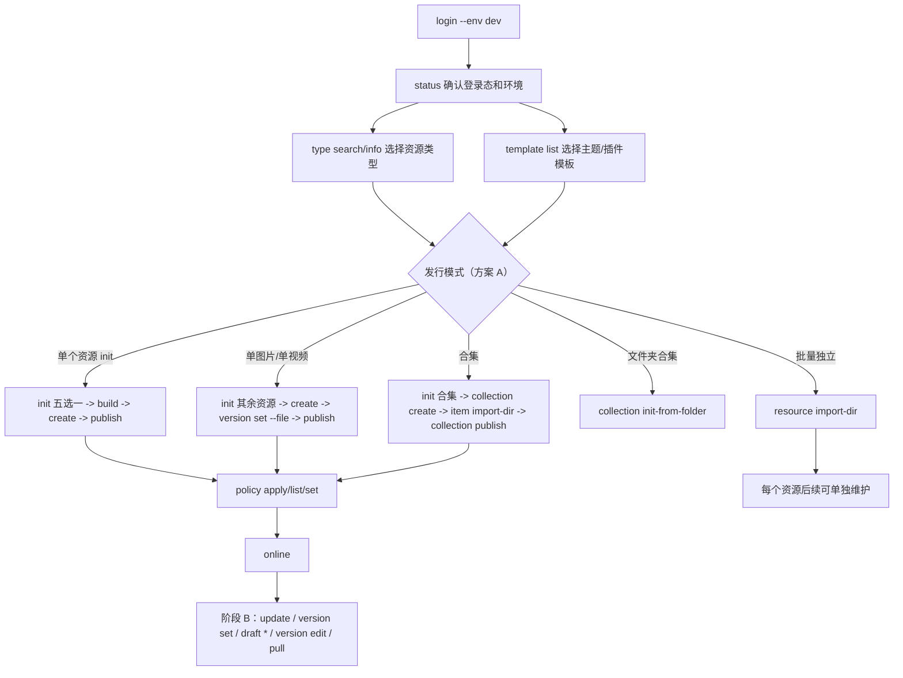

# 全局参数与登录

> 文档角色：当前版本的派生使用说明；不定义产品范围、字段或完成状态。发生冲突时以仓库根目录 [DESIGN.md](../../../DESIGN.md) 和当前 `--help` 为准。

最后更新：2026-08-12

[← CLI 使用文档目录](./README.md)
## 基本流程

### 国际化

CLI 与 Console 共用 OSS i18n（`FI18n`），但**展示方式不同**：

| | Console | CLI |
|---|---|---|
| API | `FI18n.i18nNext.tAuto()` | `t()`（`packages/cli/src/i18n`） |
| 富文本 | `html-react-parser` → **React 节点**（链接、换行、样式） | **纯文本**（strip HTML，链接保留可见文字） |
| 语言 | 浏览器 Cookie `locale` | 见下表 |

**切换语言（优先级从高到低）：**

1. 命令行 `--lang en_US`（仅当次会话，任意位置：`freelog-cli --lang en_US publish` 或 `freelog-cli publish --lang en_US`）
2. 环境变量 `FREELOG_LANG=en_US`
3. 持久化：`freelog-cli lang set en_US` → 写入 `~/.freelog-cli/settings.json`
4. 默认 `zh_CN`

```bash
freelog-cli lang show              # 当前 / 持久化 / 环境变量
freelog-cli lang set en_US         # 持久化英文
freelog-cli --lang en_US publish --yes --env dev   # 仅本次英文
```

所有场景都从这条流程展开：

```text
# 阶段 A · 创建/首版
login -> status -> init -> create -> version set -> publish -> policy -> online

# 阶段 B · sidebar 维护（已有 resourceId）
update（info）/ version set + draft * + publish（发新版）/ version edit（改说明）/ pull / online|offline
```



基础命令：

```bash
# 工作区登录（在当前目录写入 .freelog-auth，子目录继承）
freelog-cli login --env dev

# 全局登录（写入 ~/.freelog-auth，无工作区凭据时使用）
freelog-cli login --global --env dev

freelog-cli status --env dev
freelog-cli logout --env dev          # 清除当前上下文命中的凭据
freelog-cli logout --global --env dev # 仅清除全局凭据
```

非交互登录：

```bash
freelog-cli login --env dev --login-name "$env:FREELOG_TEST_LOGIN_NAME" --password "$env:FREELOG_TEST_PASSWORD" --yes
freelog-cli login --global --env dev --login-name "..." --password "..." --yes
```

### 登录与多账号

CLI 有两层身份凭据（详见 [DESIGN.md](../../../DESIGN.md)「身份与凭据」）：

| 层级 | 文件 | 何时使用 |
|---|---|---|
| **工作区** | 目录树中的 `.freelog-auth` | 自当前 `--cwd` **向上**查找，**就近第一份**生效 |
| **全局** | `~/.freelog-auth` | 向上找遍仍未命中时使用 |

典型场景：

```text
monorepo/.freelog-auth              ← 团队账号
monorepo/packages/theme-a/        ← 在此操作 → 团队账号
monorepo/packages/theme-b/.freelog-auth  ← 个人账号（覆盖祖先）
monorepo/packages/theme-b/          ← 在此操作 → 个人账号
任意无祖先凭据的目录                 ← 回退 ~/.freelog-auth
```

说明：

1. 测试和联调必须显式传 `--env dev`，避免默认走生产环境。
2. **`login`（默认）** 在当前目录写入 `.freelog-auth`；**`login --global` / `-g`** 写入用户主目录。
3. 凭据绑定环境；写操作时 `auth.environment` 与 `--env` 不一致会失败。
4. **`logout`（默认）** 删除当前上下文解析到的那份凭据；**`logout -g`** 只删全局，不动目录树里的工作区凭据。
5. **`status`** 展示：已登录账号、凭据来源（工作区/全局）、资源 owner、二者是否一致（✅/❌）。
6. **交互式写命令** 执行前会一行提示 `当前登录: …（…，工作区凭据|全局凭据）`；`--json` 模式不打印该行，但 JSON 含 `auth.scope`。
7. `logout` 不删除 manifest/state。
8. 写命令需要登录；owner 不匹配时报错并给出 owner 与 current。
9. 脚本/CI 使用 `--yes --json`；失败时读取 JSON 里的 `code/message/hint`。
10. `.freelog-auth` 必须 gitignore，不得提交仓库。

常用全局参数：

| 参数 | 用途 |
|---|---|
| `--env dev\|test\|prod\|production` | 指定 API/Console 环境（见下表） |
| `--test` | `--env test` 的简写 |
| `--cwd <dir>` | 指定项目目录（**凭据解析也以此为起点**） |
| `--yes` / `-y` | 非交互确认（下架、清除文件、无策略批量发行等） |
| `--json` | 机器可读输出（见「自动化与 JSON」） |
| `--debug` | 脱敏调试信息；等价环境变量 `FREELOG_DEBUG=1` |
| `--lang zh_CN\|en_US` | 仅当次命令语言 |
| `--no-auto-pull` | 写命令前**不**自动 pull；listing 漂移时直接失败（code 3），hint 建议 `pull` |

> **实现真源：** 上表与 [`cliArgs.ts`](../../../packages/cli/src/core/cliArgs.ts) / [`CLI脚手架设计 §4.1`](../开发/CLI脚手架设计.md#41-命令参数与--helpcliargsts) 一致；子命令专有参数以 `freelog-cli <cmd> --help` 为准。

**环境解析优先级（高 → 低）：**

1. 命令行 `--env` 或 `--test`
2. 环境变量 `FREELOG_ENV`
3. 项目 `.freelog/config.json` 的 `defaultEnv`（`freelog-cli config init/set`）
4. 默认 **`production`**（API：`https://api.freelog.cn`）

| CLI 环境 | Console 基址 | API 基址 |
|---|---|---|
| `dev` | `https://console.devfreelog.com` | `https://api.devfreelog.com` |
| `test` | `https://console.testfreelog.com` | `https://api.testfreelog.com` |
| `production` / `prod` | `https://console.freelog.cn` | `https://api.freelog.cn` |

**CI / 非交互写操作：** 当 stdin 不是 TTY 且未显式指定环境时，写命令会失败（code 4）：*「非交互环境未指定 API 环境（当前默认 production…）」*。脚本须传 `--env dev|test|prod`、`--test`，或设置 `FREELOG_ENV`，或配置项目 `defaultEnv`。

**`--no-auto-pull`：** 多数写命令（`publish`、`online`、`update`、`policy *`、`version *`、`dep *`、合集写命令等）在检测到 listing 与平台不一致时会**先自动 `pull` 刷新 state** 再继续。加此 flag 则跳过自动 pull，直接报 `resource info mismatch`（code 3），适合 CI 中希望显式控制同步顺序的场景。

### 自动化与 JSON

**成功 envelope（`--json`）：** `{ schemaVersion, ok: true, command, data, warnings?, meta: { env, … } }`

**失败：** 读 `code`（exit code）、`message`、`hint`、`details`。常见 exit code：

| code | 含义 | 典型场景 |
|---|---|---|
| 0 | 成功 | — |
| 1 | 一般错误 | API 失败、未知异常 |
| 2 | 认证/账号 | 未登录、owner 不符、缺少 username |
| 3 | 同步/绑定冲突 | listing 漂移、已绑定目录、`bind` 无 force |
| 4 | 参数/预检/业务规则 | manifest 缺字段、validate 失败、frozen、CI 未指定 env |
| 5 | 授权未完成 | `publish` / `collection publish` / `dep auth` / 批量 batchSign 预检 |

`publish --json` 在授权失败（code 5）时额外输出 `unresolvedDependencies`、`consoleHint`（含 Console URL 与 `nextCommand`）。

**进度输出：** `resource import-dir --json-lines` 与 `collection item import-dir --json-lines` 按 NDJSON 逐行输出进度事件（`start` / `ok` / `fail` / `skip` / `done`），适合 CI 日志。

**Shell 补全：** `eval "$(freelog-cli completion bash)"` 或 `eval "$(freelog-cli completion zsh)"`。

### 命令索引（速查）

| 命令 | 作用 |
|---|---|
| `login` / `logout` | 登录/登出（工作区或 `--global`） |
| `status` | 登录态、owner、平台状态、草稿建议 |
| `validate` / `doctor` | 发版前预检（`--for project\|publish\|online`） |
| `diff` | 本地 manifest/state 与平台差异（漂移时 exit 3） |
| `release` | validate → 可选 build → bump → publish → 可选 online |
| `type list\|search\|info\|pick` | 资源类型查询与交互选型 |
| `template list` | 本地主题/插件模板 |
| `init` | 初始化 manifest（五选一或 `init theme\|widget\|package <dir>`） |
| `bind` | 绑定已有平台资源 |
| `create` | 创建资源壳 |
| `resource import-dir\|search` | 批量发行 / 搜索资源 |
| `version set\|bump\|edit\|show` | 版本意图与维护 |
| `publish` | 正式发行 |
| `draft push\|pull\|discard` | 发版表单草稿（`--collection` 合集） |
| `dep add\|remove\|update\|list\|auth` | 依赖声明与签约 |
| `policy init\|apply\|list\|set` | 策略 |
| `online` / `offline` | 上下架 |
| `update` / `pull` | listing 更新 / 平台 → 本地 |
| `collection *` | 合集全流程（见 [合集](./合集.md)、[工程化与预检](./工程化与预检.md)） |
| `config` / `workspace` / `completion` / `lang` | 工程辅助 |

各命令完整参数以 `freelog-cli <cmd> --help` 为准；其余场景见 [使用文档目录](./README.md)。
