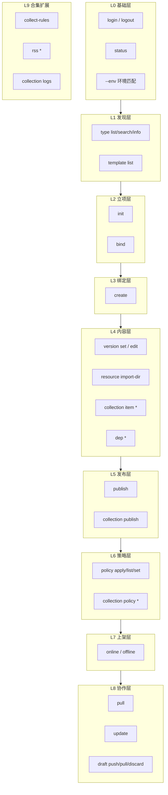
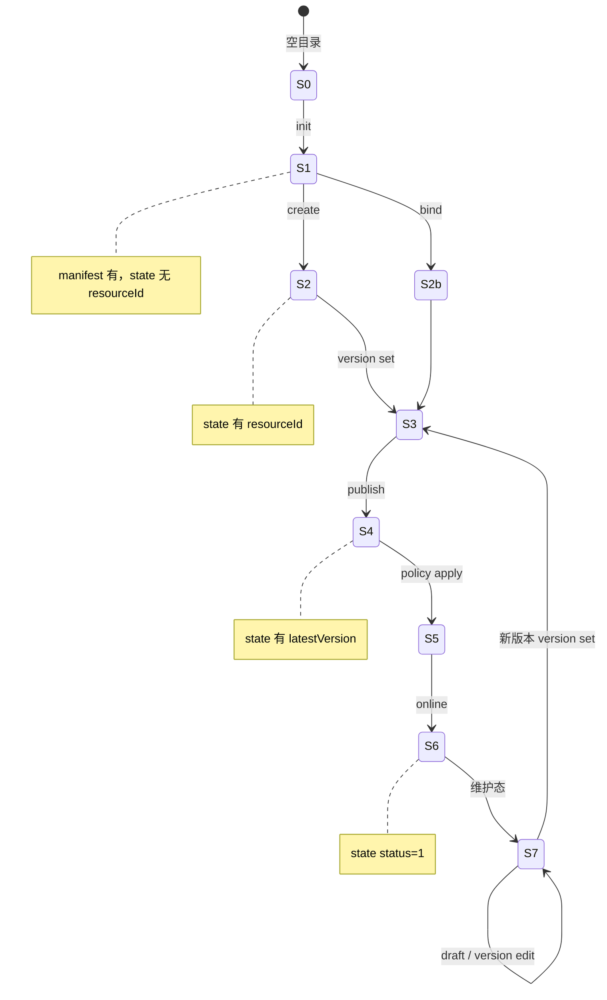

# 01 · 生命周期与拓扑

最后更新：2026-08-07

关联：[场景 README](./README.md) · [02-主路径](./02-主路径.md) · [03-命令节点](./03-命令节点.md)

---

## 1. Console 两阶段与 CLI 全生命周期

Console 对资源的数据操作**不只是创建**，还包括 **sidebar 维护**。CLI 须 parity，见 [CLI脚手架设计 §1.8–§1.9](../开发/CLI脚手架设计.md#18-console-两阶段创建creator与维护sidebar)。

```text
阶段 A · 创建/首版     creator / creatorBatch / collectionCreator
阶段 B · 长期维护       resourceSidebar / collectionSidebar / versionCreator
         ├─ info              → update / pull --apply-listing
         ├─ versionInfo       → version set / edit / draft * / publish
         ├─ policy            → policy *
         ├─ dependency          → dep *
         └─ 上下架              → online / offline
```

脚手架始终围绕**本地文件**：`version set --file <本地路径>` → `publish` 上传；listing 封面 `--cover ./本地图`；策略 `--from-file`。

### 1.1 方案 A：用命令选发行模式

```bash
freelog-cli login --env dev
# 发行模式由选的命令决定（不在 init 内三选一）：
#   ① 发行单个资源  →  freelog-cli init <dir>     → init 五选一
#   ② 批量发行资源  →  freelog-cli resource import-dir <文件夹>
#   ③ 发行合集      →  init 选「合集」→ collection create → …
```

**init 五选一**（工程立项）：主题 | 插件 | 软件库 | 其余资源 | 合集。  
只有「其余资源」和「合集」才弹资源类型树；前三项 API 定稿展示名 + 选工程模板。

### 1.2 create 为什么必须要有 resourceTypeCode

平台 `Resource.create` 必填 `resourceTypeCode`。manifest 里没有 code → `create` 失败。  
脚本/CI：**必须 `--resource-type <code> --yes`**，不会从目录名猜类型。

### 1.3 产品原则

脚手架面向**本地文件**发版；Console creator/sidebar 能**写入平台 API** 的数据操作，CLI 必须 parity。  
Console 列表、收藏、节点运营、消费详情**不在**脚手架 parity 范围。

---

## 2. 五个正交维度

任何用户操作 = 以下维度的**交叉点**：

| 维度 | 取值 | 决定什么 |
|---|---|---|
| **D1 环境** | dev / test / prod | API 地址、auth/state 绑定 |
| **D2 资源形态** | 压缩类 / 单文件 / 批量独立 / 合集 / 半路接入 | 文件处理、命令分支 |
| **D3 立项方式** | runtime / package / none / collection / 无 init（批量） | init 参数 |
| **D4 生命周期** | 发现 → 立项 → 绑定 → 首版 → 策略 → 上架 → **维护** | 当前可用命令 |
| **D5 协作模式** | 纯 CLI / Console 混合 / CI | 是否 draft/pull/bind |

---

## 3. 三层拓扑栈（L0–L9）



详表见 [03-命令节点](./03-命令节点.md)。

---

## 4. 本地状态机（manifest + state）



**合集额外：** init collection → create → item *（目录草稿）→ collection version set → collection publish → policy → online。

---

## 5. Console 页面 ↔ CLI（创建 + 维护）

| Console 区域 | 页面/Tab | CLI | parity |
|---|---|---|---|
| creatorEntry | 三卡片 | **方案 A：选命令** | 流程不同 |
| resourceCreator Step1 | 创建壳 | `init` → `create` | **必须有** |
| resourceCreator Step2 | 首版 + 草稿 | `version set` → `draft push` → `publish` | **必须有** |
| resourceCreator Step3–4 | 策略、listing、上架 | `policy apply` → `update` → `online` | **必须有** |
| resourceSidebar **info** | listing | `update`；`pull --apply-listing` | **必须有** |
| resourceSidebar **versionInfo** | 发新版、草稿 | `version set` / `draft *` / `publish` | **必须有** |
| resourceSidebar policy | 策略 | `policy *` | **必须有** |
| resourceSidebar dependency | 依赖 | `dep *` | **必须有** |
| collectionSidebar | 目录 + 合集草稿 | `collection item *` + `draft --collection` | **必须有** |

**不在 parity：** 列表搜索、收藏、加节点、云存储选文件、付费收银台。

---

## 6. 资源类型拓扑

**权威来源：** [CLI脚手架设计 §0.5](../开发/CLI脚手架设计.md#05-可验证事实不靠猜)

### 6.1 API 类型树

接口：`GET /v2/resources/types/listSimpleByGroup`（CLI：`type list`）

| 字段 | 含义 |
|---|---|
| `code` | resourceTypeCode（create/init 必填） |
| `name` | 显示名（主题、插件、前端库…） |
| `children[]` | 「其余资源」须选到**叶子** |
| `status` | 1=启用；2=停用 |

**subjectType：** 1=独立资源（含合集子项）；4=合集。

### 6.2 init 五选一与类型来源

| init 选项 | 走类型树？ | code 来源 | 模板 |
|---|---|---|---|
| 主题 | 否 | API 展示名「主题」→ dev **RT001** | runtime 8 选 1 |
| 插件 | 否 | 「插件」→ **RT002** | runtime |
| 软件库 | 否 | 「前端库」→ **RT029** | package + namespace |
| 其余资源 | **是，到叶子** | 用户选的叶子 code | none |
| 合集 | **是** | 合集叶子 code | collection |

复验：`freelog-cli type list --env dev --json` · `type info RT001 --env dev`

### 6.3 压缩类 vs 单文件

| 类型 | publish 时 filePath |
|---|---|
| 主题/插件/软件库 | **目录** → zip |
| 图片/视频等叶子 | **单文件** 原样上传 |

主题/插件还需 `--runtime 0.4|0.5`。

### 6.4 类型选型常见问题

| 问题 | 处理 |
|---|---|
| 主题 init 用了图片 code | 须走五选一「主题」，不能用手选 image 叶子 |
| 选了有 children 的父节点 | 继续选到叶子 |
| type search 多个同名 | `type info` 看 parentCode |
| 脚本缺 `--resource-type` | 直接失败 code 4 |

更多见 [04-问题矩阵 §4.2](./04-问题矩阵.md#42-l1l2-发现--init--类型树)。
